# 🐧 PenguinMails Documentation

**The complete guide to understanding, implementing, and mastering PenguinMails - your enterprise email management platform**

[](https://penguinmails.github.io)
[](https://pmarsceill.github.io/just-the-docs/)

---

## 🎯 Quick Start Guide

**New to PenguinMails?** Start with our **[What is PenguinMails](./docs/what-is-penguinmails/)** section to understand the fundamentals.

**Ready to dive deeper?** Jump directly to specific areas using the sidebar navigation or explore our **Quick Access** documents below.

---

## 📊 Documentation Structure Overview

Our documentation follows a progressive disclosure approach, allowing you to find exactly what you need:

```mermaid
flowchart TD
    A[📚 Documentation Hub<br/>This README/Homepage] --> B[🔍 What is PenguinMails?]
    A --> C[⚡ Features & Capabilities]
    A --> D[🎯 Goals & Competitive Edge]
    A --> E[🚀 Implementation & Getting Started]
    A --> F[📖 Resources & Support]
    A --> G[⚡ Quick Access Documents]
    
    B --> B1[Value Proposition]
    B --> B2[Problem/Solution Framework]
    B --> B3[Target Use Cases]
    
    C --> C1[Core Features]
    C --> C2[Advanced Capabilities]
    C --> C3[Integration Options]
    C --> C4[Performance Metrics]
    
    D --> D1[Strategic Goals]
    D --> D2[Competitive Advantages]
    D --> D3[Market Positioning]
    
    E --> E1[Onboarding Guide]
    E --> E2[Setup Instructions]
    E --> E3[Integration Help]
    E --> E4[Migration Tools]
    
    F --> F1[Support Resources]
    F --> F2[Training Materials]
    F --> F3[Community & Help]
    F --> F4[Technical Reference]
    
    G --> G1[High-Level Architecture]
    G --> G2[Key Performance Indicators]
    G --> G3[Roadmap & Development]
    G --> G4[Team Workflow]
    G --> G5[Compliance Standards]
```



---

## 🚀 Quick Access Documents

**Start here for immediate value:**

- **[🏗️ High-Level Architecture](./docs/quick-access/high-level-architecture.md)** → System overview and technical foundation
- **[📈 Key Performance Indicators](./docs/quick-access/key-performance-indicators.md)** → Metrics that matter
- **[🗺️ Roadmap & Development Priorities](./docs/quick-access/roadmap-development-priorities.md)** → Future vision and current focus
- **[👥 Team Workflow](./docs/quick-access/team-workflow.md)** → How our teams collaborate
- **[🛡️ Compliance & Regulatory Standards](./docs/quick-access/compliance-regulatory-standards.md)** → Security and compliance essentials

---

## 📖 Documentation Sections

### 🔍 [What is PenguinMails](./docs/what-is-penguinmails/)
**Understand the fundamentals**
- Platform overview and value proposition
- Problem/solution framework
- Target use cases and benefits
- Business model and strategy

### ⚡ [Features & Capabilities](./docs/features-capabilities/)
**Discover what we can do**
- Core feature showcase
- Advanced capabilities
- Integration possibilities
- Performance and scalability

### 🎯 [Goals & Competitive Edge](./docs/goals-competitive-edge/)
**Why choose PenguinMails**
- Strategic objectives and vision
- Competitive advantages
- Market positioning
- Growth metrics and targets

### 🚀 [Implementation & Getting Started](./docs/implementation-getting-started/)
**Begin your journey**
- Step-by-step onboarding
- Setup and configuration
- Integration guidance
- Migration tools and procedures

### 📖 [Resources & Support](./docs/resources-support/)
**Get help and succeed**
- Support resources and contact information
- Training materials and guides
- Community and documentation help
- Technical reference materials

---

## 💡 Navigation & Features

### 🎯 **Smart Navigation**
✅ **Sidebar Navigation** - Complete structured overview with expand/collapse folders  
✅ **Quick Access** - Popular documents accessible from homepage  
✅ **Progressive Disclosure** - Information organized from basic to advanced  
✅ **Mobile Responsive** - Works perfectly on all devices  
✅ **Search Ready** - Full-text search capabilities coming soon  

### 📁 **Repository Structure**
```
penguinmails.github.io/
├── README.md                    # This file - Documentation Hub
├── index.md                     # Jekyll/GitHub Pages homepage  
├── _config.yaml                 # Site configuration
├── docs/                        # Main documentation
│   ├── quick-access/           # Popular documents
│   ├── what-is-penguinmails/   # Fundamentals
│   ├── features-capabilities/  # Feature details
│   ├── goals-competitive-edge/ # Strategy & positioning
│   ├── implementation-getting-started/ # Setup guides
│   └── resources-support/      # Help & resources
├── operations_runbooks/         # Operational procedures
├── technical_implementation/    # Technical details
└── temp_old_docs/              # Archived materials
```

---

## 🤝 Contributing to Documentation

We welcome contributions to improve our documentation! Here's how:

### **Quick Fixes**
- **Found a typo?** Edit the file directly and submit a pull request
- **Something unclear?** Add an explanation or example
- **Missing information?** Research and add relevant details

### **Larger Contributions**
- **New sections** - Coordinate with the team first
- **Major restructuring** - Discuss in our issues first
- **Visual improvements** - Screenshots, diagrams, or animations

### **Content Guidelines**
- Keep explanations clear and accessible
- Include practical examples when possible
- Update related documentation when making changes
- Test navigation and links

---

## 📞 Get Help & Support

### **Technical Issues**
- Check our **[Implementation Guide](./docs/implementation-getting-started/)**
- Review **[Resources & Support](./docs/resources-support/)**
- Search existing documentation first

### **Documentation Improvements**
- Open an issue for discussion
- Submit pull requests for fixes
- Join our documentation review process

### **General Questions**
- Start with the **[What is PenguinMails](./docs/what-is-penguinmails/)** section
- Check **[Quick Access](./docs/quick-access/)** documents
- Review **[Resources & Support](./docs/resources-support/)**

---

## 📈 Documentation Metrics & Goals

**Current Status:** Active development and improvement  
**Last Major Update:** December 2024  
**Next Review:** Quarterly  

### **Quality Metrics**
- ✅ Clear navigation structure
- ✅ Progressive disclosure approach  
- ✅ Mobile-responsive design
- ✅ Comprehensive content coverage
- ✅ Regular updates and maintenance

---

## 🏆 Acknowledgments

Built with [Just the Docs](https://pmarsceill.github.io/just-the-docs/) - a modern documentation theme for Jekyll  
Documentation hosted on [GitHub Pages](https://pages.github.com/)  
Maintained by the PenguinMails Documentation Team  

---

*For the latest updates and detailed technical information, visit our [full documentation site](https://penguinmails.github.io).*

**Happy documenting! 🎉**