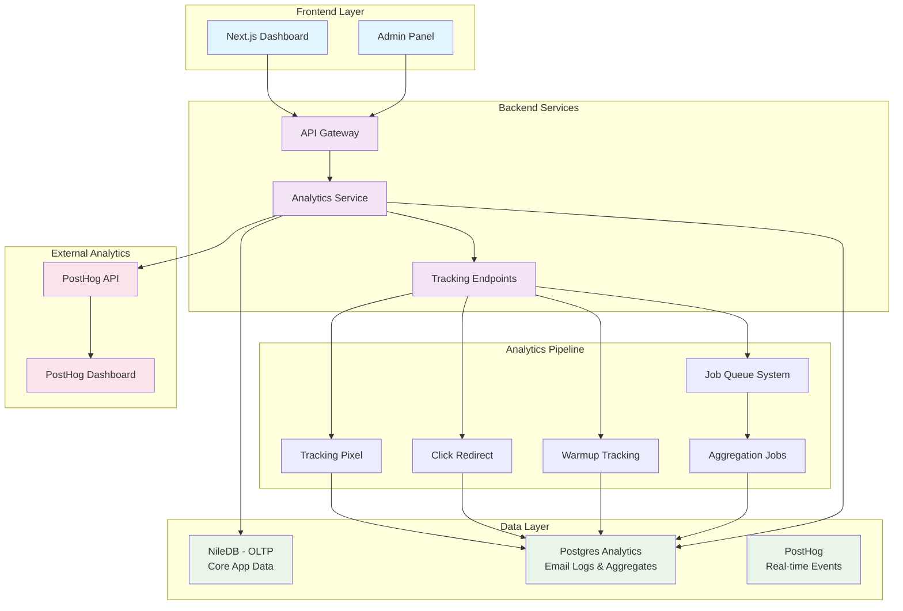

# Analytics Architecture Documentation

---

## Quick Navigation
- [🏠 **Main Overview**](README.md) | [Setup **Infrastructure**](infrastructure_documentation.md) | [🔒 **Security**](security_documentation.md)

---

## Overview

This document outlines the updated analytics architecture for PenguinMails, reflecting our decision to use **Postgres + PostHog** instead of the originally proposed Convex OLAP approach. This hybrid architecture provides the perfect balance of cost-effectiveness, developer experience, and real-time analytics capabilities.

### Updated Architecture Summary
- **Primary Database**: Postgres (NileDB for OLTP, OLAP for historical analytics)
- **Queue System**: Hybrid Redis + PostgreSQL for job processing and state management
- **Local Development**: Docker containers with Drizzle ORM
- **Production**: Managed Postgres with PostHog integration
- **Real-time Events**: PostHog for live analytics and behavioral tracking
- **Historical Data**: Enhanced OLAP schema for comprehensive business intelligence
- **Queue-Driven Analytics**: Redis-orchestrated analytics pipeline for reliable data flow

---

## Architecture Evolution

### Original vs Updated Approach

| Component | Original Plan | Updated Plan |
|-----------|---------------|--------------|
| **Analytics DB** | Convex (OLAP) | Postgres (Drizzle ORM) |
| **Real-time Events** | Not specified | PostHog |
| **Local Development** | Not specified | Docker + Drizzle |
| **Production Costs** | $25-65/month | Variable (PostHog pricing) |
| **Developer Experience** | Good | Excellent (familiar stack) |
| **Data Retention** | Permanent | Permanent |
| **Query Complexity** | Simple | Complex aggregations supported |

### Why We Changed the Architecture

#### Reasons for Switching from Convex:
1. **Developer Familiarity**: Team has strong Postgres expertise
2. **Cost Predictability**: Better cost control for long-term growth
3. **Feature Flexibility**: Postgres supports complex queries and data relationships
4. **Local Development**: Docker setup improves development experience
5. **Ecosystem**: Larger Postgres ecosystem and tooling support

#### Benefits of Postgres + PostHog:
1. **Real-time Analytics**: PostHog provides excellent real-time dashboards
2. **Historical Tracking**: Postgres handles permanent data storage and complex queries
3. **Familiar Stack**: Reduces learning curve and development time
4. **Scalability**: Both solutions can handle enterprise-level usage
5. **Integration**: Easy to integrate with existing NileDB infrastructure

---

## System Architecture Diagram



---

## Database Schema

### Analytics Tables (Postgres)

Based on the provided schema, here are the analytics-specific tables:

#### 1. Email Interaction Logs

```sql
-- Open tracking logs
CREATE TABLE email_opens (
    id UUID PRIMARY KEY DEFAULT gen_random_uuid(),
    email_id VARCHAR(255) NOT NULL,
    campaign_id VARCHAR(255),
    mailbox_id VARCHAR(255),
    user_id UUID NOT NULL,
    tenant_id UUID NOT NULL,
    opened TIMESTAMP WITH TIME ZONE DEFAULT NOW(),
    ip_address INET,
    user_agent TEXT,
    created TIMESTAMP WITH TIME ZONE DEFAULT NOW()
);

-- Click tracking logs
CREATE TABLE email_clicks (
    id UUID PRIMARY KEY DEFAULT gen_random_uuid(),
    email_id VARCHAR(255) NOT NULL,
    campaign_id VARCHAR(255),
    mailbox_id VARCHAR(255),
    user_id UUID NOT NULL,
    tenant_id UUID NOT NULL,
    clicked_url TEXT NOT NULL,
    clicked TIMESTAMP WITH TIME ZONE DEFAULT NOW(),
    ip_address INET,
    user_agent TEXT,
    created TIMESTAMP WITH TIME ZONE DEFAULT NOW()
);

-- Bounce tracking logs
CREATE TABLE email_bounces (
    id UUID PRIMARY KEY DEFAULT gen_random_uuid(),
    email_id VARCHAR(255) NOT NULL,
    campaign_id VARCHAR(255),
    mailbox_id VARCHAR(255),
    user_id UUID NOT NULL,
    tenant_id UUID NOT NULL,
    bounce_type VARCHAR(50) NOT NULL, -- 'hard', 'soft'
    bounce_reason TEXT,
    bounced TIMESTAMP WITH TIME ZONE DEFAULT NOW(),
    created TIMESTAMP WITH TIME ZONE DEFAULT NOW()
);

-- Reply tracking
CREATE TABLE email_replies (
    id UUID PRIMARY KEY DEFAULT gen_random_uuid(),
    email_id VARCHAR(255) NOT NULL,
    campaign_id VARCHAR(255),
    mailbox_id VARCHAR(255),
    user_id UUID NOT NULL,
    tenant_id UUID NOT NULL,
    replied TIMESTAMP WITH TIME ZONE DEFAULT NOW(),
    message_id VARCHAR(255),
    created TIMESTAMP WITH TIME ZONE DEFAULT NOW()
);
```

#### 2. Daily Aggregates

```sql
-- Daily aggregated metrics
CREATE TABLE daily_analytics (
    id UUID PRIMARY KEY DEFAULT gen_random_uuid(),
    user_id UUID NOT NULL,
    tenant_id UUID NOT NULL,
    campaign_id VARCHAR(255),
    mailbox_id VARCHAR(255),
    date DATE NOT NULL,
    emails_sent INTEGER DEFAULT 0,
    emails_opened INTEGER DEFAULT 0,
    emails_clicked INTEGER DEFAULT 0,
    emails_bounced INTEGER DEFAULT 0,
    emails_replied INTEGER DEFAULT 0,
    warmup_opens INTEGER DEFAULT 0,
    warmup_replies INTEGER DEFAULT 0,
    open_rate DECIMAL(5,2) GENERATED ALWAYS AS (
        CASE WHEN emails_sent > 0 
             THEN ROUND((emails_opened::DECIMAL / emails_sent) * 100, 2)
             ELSE 0 END
    ) STORED,
    click_rate DECIMAL(5,2) GENERATED ALWAYS AS (
        CASE WHEN emails_sent > 0 
             THEN ROUND((emails_clicked::DECIMAL / emails_sent) * 100, 2)
             ELSE 0 END
    ) STORED,
    bounce_rate DECIMAL(5,2) GENERATED ALWAYS AS (
        CASE WHEN emails_sent > 0 
             THEN ROUND((emails_bounced::DECIMAL / emails_sent) * 100, 2)
             ELSE 0 END
    ) STORED,
    reply_rate DECIMAL(5,2) GENERATED ALWAYS AS (
        CASE WHEN emails_sent > 0 
             THEN ROUND((emails_replied::DECIMAL / emails_sent) * 100, 2)
             ELSE 0 END
    ) STORED,
    created TIMESTAMP WITH TIME ZONE DEFAULT NOW(),
    updated TIMESTAMP WITH TIME ZONE DEFAULT NOW(),
    
    UNIQUE(user_id, tenant_id, campaign_id, mailbox_id, date)
);
```

#### 3. Warmup Tracking

```sql
-- Mailbox warmup interactions
CREATE TABLE warmup_interactions (
    id UUID PRIMARY KEY DEFAULT gen_random_uuid(),
    mailbox_id VARCHAR(255) NOT NULL,
    user_id UUID NOT NULL,
    tenant_id UUID NOT NULL,
    interaction_type VARCHAR(50) NOT NULL, -- 'open', 'reply'
    partner_mailbox VARCHAR(255),
    interaction TIMESTAMP WITH TIME ZONE DEFAULT NOW(),
    created TIMESTAMP WITH TIME ZONE DEFAULT NOW()
);

-- Warmup daily stats
CREATE TABLE warmup_daily_stats (
    id UUID PRIMARY KEY DEFAULT gen_random_uuid(),
    mailbox_id VARCHAR(255) NOT NULL,
    user_id UUID NOT NULL,
    tenant_id UUID NOT NULL,
    date DATE NOT NULL,
    emails_sent INTEGER DEFAULT 0,
    opens_received INTEGER DEFAULT 0,
    replies_received INTEGER DEFAULT 0,
    reputation_score INTEGER DEFAULT 0, -- 0-100
    created TIMESTAMP WITH TIME ZONE DEFAULT NOW(),
    updated TIMESTAMP WITH TIME ZONE DEFAULT NOW(),
    
    UNIQUE(mailbox_id, date)
);
```

### Indexes for Performance

```sql
-- Performance indexes
CREATE INDEX idx_email_opens_email_id ON email_opens(email_id);
CREATE INDEX idx_email_opens_user_tenant ON email_opens(user_id, tenant_id);
CREATE INDEX idx_email_opens_date ON email_opens(opened_at::DATE);

CREATE INDEX idx_email_clicks_email_id ON email_clicks(email_id);
CREATE INDEX idx_email_clicks_user_tenant ON email_clicks(user_id, tenant_id);
CREATE INDEX idx_email_clicks_date ON email_clicks(clicked_at::DATE);

CREATE INDEX idx_daily_analytics_user_tenant ON daily_analytics(user_id, tenant_id);
CREATE INDEX idx_daily_analytics_date ON daily_analytics(date);
CREATE INDEX idx_daily_analytics_campaign ON daily_analytics(campaign_id);

CREATE INDEX idx_warmup_interactions_mailbox ON warmup_interactions(mailbox_id);
CREATE INDEX idx_warmup_interactions_date ON warmup_interactions(interaction_at::DATE);
```

### Enhanced OLAP Analytics Schema

#### Business Intelligence Tables

```sql
-- Billing Analytics - Usage tracking per billing period
CREATE TABLE billing_analytics (
id BIGINT PRIMARY KEY GENERATED ALWAYS AS IDENTITY,
tenant_id TEXT NOT NULL,
subscription_id TEXT,
emails_sent INTEGER DEFAULT 0,
mailboxes_used INTEGER DEFAULT 0,
domains_used INTEGER DEFAULT 0,
campaigns_used INTEGER DEFAULT 0,
leads_used INTEGER DEFAULT 0,
warmups_active INTEGER DEFAULT 0,
period_start TIMESTAMP WITH TIME ZONE NOT NULL,
period_end TIMESTAMP WITH TIME ZONE NOT NULL,
updated TIMESTAMP WITH TIME ZONE DEFAULT NOW()
);

-- Campaign Analytics - Campaign performance metrics
CREATE TABLE campaign_analytics (
id BIGINT PRIMARY KEY GENERATED ALWAYS AS IDENTITY,
campaign_id TEXT NOT NULL,
company_id TEXT NOT NULL,
sent INTEGER DEFAULT 0,                    -- Sum of all steps
delivered INTEGER DEFAULT 0,               -- Sum of all steps
opened_tracked INTEGER DEFAULT 0,          -- Sum of all steps
clicked_tracked INTEGER DEFAULT 0,         -- Sum of all steps
replied INTEGER DEFAULT 0,                 -- Sum of all steps
bounced INTEGER DEFAULT 0,                 -- Sum of all steps
unsubscribed INTEGER DEFAULT 0,            -- Sum of all steps
spam_complaints INTEGER DEFAULT 0,         -- Sum of all steps
status TEXT,
completed_leads INTEGER DEFAULT 0,
billing_id BIGINT REFERENCES billing_analytics(id),
updated TIMESTAMP WITH TIME ZONE DEFAULT NOW()
);

-- Mailbox Analytics - Individual mailbox performance
CREATE TABLE mailbox_analytics (
id BIGINT PRIMARY KEY GENERATED ALWAYS AS IDENTITY,
mailbox_id TEXT NOT NULL,
company_id TEXT NOT NULL,
sent INTEGER DEFAULT 0,
delivered INTEGER DEFAULT 0,
opened_tracked INTEGER DEFAULT 0,
clicked_tracked INTEGER DEFAULT 0,
replied INTEGER DEFAULT 0,
bounced INTEGER DEFAULT 0,
unsubscribed INTEGER DEFAULT 0,
spam_complaints INTEGER DEFAULT 0,
warmup_status TEXT,
health_score INTEGER DEFAULT 0,
current_volume INTEGER DEFAULT 0,
billing_id BIGINT REFERENCES billing_analytics(id),
campaign_status TEXT,
updated TIMESTAMP WITH TIME ZONE DEFAULT NOW()
);

-- Lead Analytics - Individual lead engagement
CREATE TABLE lead_analytics (
id BIGINT PRIMARY KEY GENERATED ALWAYS AS IDENTITY,
lead_id TEXT NOT NULL,
campaign_id TEXT NOT NULL,
sent INTEGER DEFAULT 0,                    -- Per campaign
delivered INTEGER DEFAULT 0,
opened_tracked INTEGER DEFAULT 0,
clicked_tracked INTEGER DEFAULT 0,
replied INTEGER DEFAULT 0,
bounced INTEGER DEFAULT 0,
unsubscribed INTEGER DEFAULT 0,
spam_complaints INTEGER DEFAULT 0,
status TEXT,
billing_id BIGINT REFERENCES billing_analytics(id),
updated TIMESTAMP WITH TIME ZONE DEFAULT NOW()
);

-- Warmup Analytics - Email warmup progression
CREATE TABLE warmup_analytics (
id BIGINT PRIMARY KEY GENERATED ALWAYS AS IDENTITY,
mailbox_id TEXT NOT NULL,
company_id TEXT NOT NULL,
sent INTEGER DEFAULT 0,
delivered INTEGER DEFAULT 0,
opened_tracked INTEGER DEFAULT 0,
clicked_tracked INTEGER DEFAULT 0,
replied INTEGER DEFAULT 0,
bounced INTEGER DEFAULT 0,
unsubscribed INTEGER DEFAULT 0,
spam_complaints INTEGER DEFAULT 0,
health_score INTEGER DEFAULT 0,
progress_percentage INTEGER DEFAULT 0,
billing_id BIGINT REFERENCES billing_analytics(id),
updated TIMESTAMP WITH TIME ZONE DEFAULT NOW()
);

-- Sequence Step Analytics - Campaign step performance
CREATE TABLE sequence_step_analytics (
id BIGINT PRIMARY KEY GENERATED ALWAYS AS IDENTITY,
step_id TEXT NOT NULL,
campaign_id TEXT NOT NULL,
company_id TEXT NOT NULL,
sent INTEGER DEFAULT 0,
delivered INTEGER DEFAULT 0,
opened_tracked INTEGER DEFAULT 0,
clicked_tracked INTEGER DEFAULT 0,
replied INTEGER DEFAULT 0,
bounced INTEGER DEFAULT 0,
unsubscribed INTEGER DEFAULT 0,
spam_complaints INTEGER DEFAULT 0,
billing_id BIGINT REFERENCES billing_analytics(id),
updated TIMESTAMP WITH TIME ZONE DEFAULT NOW()
);
```

#### Queue-Driven ETL Analytics Pipeline

**ETL Scheduling Strategy:**
- **Hourly Events**: Critical metrics, email processing events from SMTP/MailU
- **Daily Batch**: Comprehensive analytics aggregation and OLAP updates
- **Weekly/Monthly**: Billing calculations and historical reporting

```typescript
// ETL Analytics Pipeline with Queue Orchestration
export class AnalyticsPipeline {
private redis: Redis;
private db: Database;

constructor(redis: Redis, db: Database) {
this.redis = redis;
this.db = db;
}

// Schedule ETL jobs for regular analytics updates
async scheduleETLJobs() {
  // Hourly job for critical metrics
  await this.enqueueAnalyticsJob('hourly_metrics', {
    timestamp: new Date().toISOString(),
    priority: 25  // High priority for real-time data
  });

  // Daily comprehensive aggregation
  await this.enqueueAnalyticsJob('daily_aggregate', {
    date: new Date().toISOString().split('T')[0],
    priority: 50
  });

  // Weekly billing calculations
  await this.enqueueAnalyticsJob('billing_calculate', {
    period_start: this.getWeekStart(),
    period_end: new Date(),
    priority: 100
  });
}

// Enqueue analytics job to Redis queue
async enqueueAnalyticsJob(type: 'hourly_metrics' | 'daily_aggregate' | 'campaign_aggregate' | 'billing_calculate', data: any) {
const job = {
  type,
  data,
  timestamp: new Date().toISOString(),
  priority: this.getJobPriority(type)
};

// Add to Redis queue for processing
await this.redis.lpush(`queue:analytics:${type}`, JSON.stringify(job));

// Update PostgreSQL job status for durability
await this.db.analytics_jobs.create({
  data: {
    job_type: type,
    status: 'queued',
    payload: data,
    priority: job.priority,
    queued_at: new Date()
  }
});
}

private getJobPriority(type: string): number {
const priorities = {
  'hourly_metrics': 25,        // Highest priority - real-time data
  'daily_aggregate': 50,       // High priority - daily updates
  'campaign_aggregate': 75,    // Medium priority
  'billing_calculate': 100     // Low priority - batch processing
};
return priorities[type] || 100;
}

// SMTP/MailU Integration - Process email events for analytics
async processSMTPEvent(eventType: 'email_sent' | 'email_delivered' | 'email_bounced', emailData: any) {
  // Immediate queue job for real-time processing
  await this.enqueueAnalyticsJob('hourly_metrics', {
    event_type: eventType,
    email_data: emailData,
    processed_at: new Date().toISOString()
  });

  // Send to PostHog for real-time dashboards
  await this.sendToPostHog(eventType, emailData);
}

async processAnalyticsJob(job: any) {
const { type, data } = job;

try {
  switch (type) {
    case 'hourly_metrics':
      await this.processHourlyMetrics(data);
      break;
    case 'daily_aggregate':
      await this.processDailyAggregate(data);
      break;
    case 'campaign_aggregate':
      await this.processCampaignAggregate(data);
      break;
    case 'billing_calculate':
      await this.processBillingCalculate(data);
      break;
  }

  // Update job status in PostgreSQL
  await this.db.analytics_jobs.update({
    where: { id: data.job_id },
    data: {
      status: 'completed',
      processed_at: new Date()
    }
  });

} catch (error) {
  // Handle failure with retry logic
  await this.db.analytics_jobs.update({
    where: { id: data.job_id },
    data: {
      status: 'failed',
      error_message: error.message,
      processed_at: new Date(),
      attempt_count: (data.attempt_count || 0) + 1
    }
  });
  
  throw error;
}
}

// Process hourly metrics from SMTP events
private async processHourlyMetrics(data: any) {
const { event_type, email_data } = data;

await this.db.transaction(async (tx) => {
  // Update real-time metrics based on SMTP events
  switch (event_type) {
    case 'email_sent':
      await tx.execute(sql`
        UPDATE daily_analytics
        SET emails_sent = emails_sent + 1,
            updated = NOW()
        WHERE tenant_id = ${email_data.tenant_id}
          AND campaign_id = ${email_data.campaign_id}
          AND date = CURRENT_DATE
      `);
      break;
      
    case 'email_delivered':
      await tx.execute(sql`
        UPDATE daily_analytics
        SET emails_delivered = COALESCE(emails_delivered, 0) + 1,
            updated = NOW()
        WHERE tenant_id = ${email_data.tenant_id}
          AND campaign_id = ${email_data.campaign_id}
          AND date = CURRENT_DATE
      `);
      break;
  }
});
}

// Send events to PostHog for real-time dashboards
private async sendToPostHog(eventType: string, emailData: any) {
  // PostHog integration for immediate dashboards
  await posthog.capture({
    distinctId: emailData.userId,
    event: eventType,
    properties: {
      campaign_id: emailData.campaignId,
      mailbox_id: emailData.mailboxId,
      tenant_id: emailData.tenantId,
      timestamp: new Date().toISOString()
    }
  });
}

private async processDailyAggregate(data: any) {
  // Comprehensive daily aggregation from OLTP to OLAP
  const { date, tenant_id } = data;

  await this.db.transaction(async (tx) => {
    // Get raw email data for the date
    const emailMetrics = await tx.execute(sql`
      SELECT
        campaign_id,
        mailbox_id,
        COUNT(*) as sent,
        COUNT(CASE WHEN status = 'delivered' THEN 1 END) as delivered,
        COUNT(CASE WHEN opened IS NOT NULL THEN 1 END) as opened_tracked,
        COUNT(CASE WHEN clicked IS NOT NULL THEN 1 END) as clicked_tracked,
        COUNT(CASE WHEN replied IS NOT NULL THEN 1 END) as replied,
        COUNT(CASE WHEN bounce_type IS NOT NULL THEN 1 END) as bounced
      FROM emails
      WHERE DATE(sent_at) = ${date} AND tenant_id = ${tenant_id}
      GROUP BY campaign_id, mailbox_id
    `);

    // Insert into campaign_analytics
    for (const metric of emailMetrics) {
      await tx.insert(campaignAnalytics).values({
        campaign_id: metric.campaign_id,
        company_id: metric.company_id,
        sent: metric.sent,
        delivered: metric.delivered,
        opened_tracked: metric.opened_tracked,
        clicked_tracked: metric.clicked_tracked,
        replied: metric.replied,
        bounced: metric.bounced,
        updated_at: new Date()
      });
    }
  });
}
}
```

---

## Tracking Infrastructure

### 1. Open Tracking (Pixel)

#### Tracking URL Format
```
https://track.penguinmails.com/open?email_id=abc123&token=xyz789
```

#### Implementation
```typescript
// Backend endpoint: /api/track/open
export async function trackOpen(req: Request) {
  const { email_id, token } = req.query;
  
  // Validate token and email_id
  const email = await db.query.emails.findFirst({
    where: eq(emails.id, email_id)
  });
  
  if (!email || !validateTrackingToken(email, token)) {
    return new Response('Invalid tracking', { status: 400 });
  }
  
  // Log first open only
  await db.insert(emailOpens).values({
    emailId: email_id,
    campaignId: email.campaignId,
    mailboxId: email.mailboxId,
    userId: email.userId,
    tenantId: email.tenantId,
    ipAddress: getClientIP(req),
    userAgent: req.headers.get('user-agent')
  }).onConflictDoNothing();
  
  // Also send to PostHog for real-time analytics
  await posthog.capture({
    distinctId: email.userId,
    event: 'email_opened',
    properties: {
      email_id,
      campaign_id: email.campaignId,
      mailbox_id: email.mailboxId,
      tenant_id: email.tenantId,
      timestamp: new Date().toISOString()
    }
  });
  
  // Return 1x1 transparent PNG
  return new Response(pixelBuffer, {
    headers: {
      'Content-Type': 'image/png',
      'Cache-Control': 'no-cache, no-store',
      'Content-Length': pixelBuffer.length.toString()
    }
  });
}
```

### 2. Click Tracking (Redirect)

#### URL Format
```
https://track.penguinmails.com/click?email_id=abc123&url=https%3A%2F%2Fclient.com&token=xyz789
```

#### Implementation
```typescript
// Backend endpoint: /api/track/click
export async function trackClick(req: Request) {
  const { email_id, url, token } = req.query;
  
  // Validate and decode URL
  const decodedUrl = decodeURIComponent(url);
  if (!isValidUrl(decodedUrl)) {
    return new Response('Invalid URL', { status: 400 });
  }
  
  const email = await db.query.emails.findFirst({
    where: eq(emails.id, email_id)
  });
  
  if (!email || !validateTrackingToken(email, token)) {
    return new Response('Invalid tracking', { status: 400 });
  }
  
  // Log first click only
  await db.insert(emailClicks).values({
    emailId: email_id,
    campaignId: email.campaignId,
    mailboxId: email.mailboxId,
    userId: email.userId,
    tenantId: email.tenantId,
    clickedUrl: decodedUrl,
    ipAddress: getClientIP(req),
    userAgent: req.headers.get('user-agent')
  }).onConflictDoNothing();
  
  // Send to PostHog for real-time analytics
  await posthog.capture({
    distinctId: email.userId,
    event: 'email_clicked',
    properties: {
      email_id,
      campaign_id: email.campaignId,
      mailbox_id: email.mailboxId,
      tenant_id: email.tenantId,
      clicked_url: decodedUrl,
      timestamp: new Date().toISOString()
    }
  });
  
  // Redirect to destination
  return new Response(null, {
    status: 302,
    headers: {
      'Location': decodedUrl
    }
  });
}
```

### 3. Warmup Tracking

```typescript
// Internal warmup tracking
export async function trackWarmupInteraction(
  mailboxId: string,
  userId: string,
  tenantId: string,
  type: 'open' | 'reply',
  partnerMailbox?: string
) {
  // Log to Postgres
  await db.insert(warmupInteractions).values({
    mailboxId,
    userId,
    tenantId,
    interactionType: type,
    partnerMailbox
  });
  
  // Send to PostHog
  await posthog.capture({
    distinctId: userId,
    event: 'warmup_interaction',
    properties: {
      mailbox_id: mailboxId,
      interaction_type: type,
      partner_mailbox: partnerMailbox,
      tenant_id: tenantId,
      timestamp: new Date().toISOString()
    }
  });
}
```

---

## Job Queue System

### Aggregation Jobs

```typescript
// Daily aggregation job
export async function aggregateDailyAnalytics(date: string) {
  const analytics = await db.transaction(async (tx) => {
    // Get all users with activity on this date
    const users = await tx.query.users.findMany({
      where: eq(users.id, userId) // This will be dynamic
    });
    
    for (const user of users) {
      // Aggregate opens
      const { count: openCount } = await tx
        .select({ count: count() })
        .from(emailOpens)
        .where(and(
          eq(emailOpens.userId, user.id),
          eq(emailOpens.tenantId, user.tenantId),
          sql`DATE(${emailOpens.openedAt}) = ${date}`
        ));
      
      // Aggregate clicks
      const { count: clickCount } = await tx
        .select({ count: count() })
        .from(emailClicks)
        .where(and(
          eq(emailClicks.userId, user.id),
          eq(emailClicks.tenantId, user.tenantId),
          sql`DATE(${emailClicks.clickedAt}) = ${date}`
        ));
      
      // Similar for bounces, replies, etc.
      
      // Insert or update daily aggregate
      await tx.insert(dailyAnalytics).values({
        userId: user.id,
        tenantId: user.tenantId,
        date: date,
        emailsSent: sentCount,
        emailsOpened: openCount,
        emailsClicked: clickCount,
        // ... other metrics
      }).onConflictDoUpdate({
        target: [dailyAnalytics.userId, dailyAnalytics.tenantId, dailyAnalytics.date],
        set: {
          emailsSent: sentCount,
          emailsOpened: openCount,
          emailsClicked: clickCount,
          updatedAt: new Date()
        }
      });
    }
  });
  
  return analytics;
}
```

---

## PostHog Integration

### Real-time Events

```typescript
// PostHog configuration
import { PostHog } from 'posthog-node';

const posthog = new PostHog(process.env.POSTHOG_API_KEY!, {
  host: process.env.POSTHOG_HOST || 'https://app.posthog.com'
});

// Email tracking events
export const trackEmailEvent = {
  sent: async (data: EmailSentData) => {
    await posthog.capture({
      distinctId: data.userId,
      event: 'email_sent',
      properties: {
        campaign_id: data.campaignId,
        mailbox_id: data.mailboxId,
        tenant_id: data.tenantId,
        recipient_email: data.recipientEmail,
        timestamp: data.timestamp
      }
    });
  },
  
  opened: async (data: EmailOpenedData) => {
    await posthog.capture({
      distinctId: data.userId,
      event: 'email_opened',
      properties: {
        email_id: data.emailId,
        campaign_id: data.campaignId,
        mailbox_id: data.mailboxId,
        tenant_id: data.tenantId,
        timestamp: data.timestamp
      }
    });
  },
  
  clicked: async (data: EmailClickedData) => {
    await posthog.capture({
      distinctId: data.userId,
      event: 'email_clicked',
      properties: {
        email_id: data.emailId,
        campaign_id: data.campaignId,
        mailbox_id: data.mailboxId,
        tenant_id: data.tenantId,
        clicked_url: data.url,
        timestamp: data.timestamp
      }
    });
  }
};
```

### PostHog Dashboard Configuration

#### Key Metrics to Track in PostHog:
1. **Email Performance**
   - `email_sent` - Campaign sends
   - `email_opened` - Open tracking
   - `email_clicked` - Click tracking
   - `email_bounced` - Bounce events
   - `email_replied` - Reply tracking

2. **Warmup Performance**
   - `warmup_interaction` - Open/reply during warmup
   - `warmup_progress` - Daily progress metrics

3. **User Behavior**
   - `campaign_created` - New campaigns
   - `template_used` - Template selection
   - `dashboard_viewed` - Usage analytics

---

## Frontend Dashboard

### Data Sources

| Dashboard Component | Primary Source | Secondary Source |
|---------------------|----------------|------------------|
| Summary Metrics | Postgres (daily_analytics) | PostHog (real-time) |
| Time Series Charts | Postgres (aggregates) | PostHog (live updates) |
| Campaign Tables | Postgres (daily_analytics) | - |
| Mailbox Performance | Postgres (daily_analytics) | PostHog (behavioral) |
| Real-time Updates | PostHog | - |
| Drill-down Logs | Postgres (raw logs) | - |

### React Query Integration

```typescript
// Custom hooks for analytics data
export const useAnalyticsSummary = (filters: AnalyticsFilters) => {
  return useQuery({
    queryKey: ['analytics', 'summary', filters],
    queryFn: () => analyticsApi.getSummary(filters),
    refetchInterval: 30000, // Refresh every 30 seconds for real-time feel
  });
};

export const useCampaignAnalytics = (campaignId: string) => {
  return useQuery({
    queryKey: ['analytics', 'campaign', campaignId],
    queryFn: () => analyticsApi.getCampaignAnalytics(campaignId),
    enabled: !!campaignId,
  });
};
```

---

## Local Development Setup

### Docker Compose Configuration

```yaml
# docker-compose.yml
version: '3.8'
services:
  postgres:
    image: postgres:15
    environment:
      POSTGRES_DB: penguinmails_analytics
      POSTGRES_USER: analytics_user
      POSTGRES_PASSWORD: analytics_password
    ports:
      - "5433:5432"
    volumes:
      - postgres_data:/var/lib/postgresql/data
      - ./database/init:/docker-entrypoint-initdb.d
    healthcheck:
      test: ["CMD-SHELL", "pg_isready -U analytics_user"]
      interval: 10s
      timeout: 5s
      retries: 5

  redis:
    image: redis:7-alpine
    ports:
      - "6379:6379"

  posthog:
    image: posthog/posthog:latest
    ports:
      - "8000:8000"
    environment:
      SECRET_KEY: sk_test_123456789
      POSTGRES_DB: posthog
      POSTGRES_USER: posthog
      POSTGRES_PASSWORD: posthog
    depends_on:
      - postgres

volumes:
  postgres_data:
```

### Drizzle ORM Setup

```typescript
// drizzle.config.ts
import type { Config } from 'drizzle-kit';

export default {
  schema: './src/database/schema.ts',
  out: './drizzle',
  driver: 'pg',
  dbCredentials: {
    connectionString: process.env.DATABASE_URL!,
  },
} satisfies Config;

// database/schema.ts
import { pgTable, uuid, varchar, timestamp, text, integer, decimal, boolean } from 'drizzle-orm/pg-core';
import { relations } from 'drizzle-orm';

export const emailOpens = pgTable('email_opens', {
  id: uuid('id').primaryKey().defaultRandom(),
  emailId: varchar('email_id', { length: 255 }).notNull(),
  campaignId: varchar('campaign_id', { length: 255 }),
  mailboxId: varchar('mailbox_id', { length: 255 }),
  userId: uuid('user_id').notNull(),
  tenantId: uuid('tenant_id').notNull(),
  openedAt: timestamp('opened_at', { withTimezone: true }).defaultNow(),
  ipAddress: text('ip_address'),
  userAgent: text('user_agent'),
  createdAt: timestamp('created_at', { withTimezone: true }).defaultNow(),
});
```

---

## Migration Strategy

### Phase 1: Basic Tracking (Weeks 1-2)
- [ ] Set up Postgres analytics tables
- [ ] Implement basic tracking endpoints
- [ ] Configure PostHog integration
- [ ] Create simple dashboard with raw data

### Phase 2: Aggregation (Weeks 2-3)
- [ ] Build daily aggregation jobs
- [ ] Implement job queue system
- [ ] Create aggregated dashboard views
- [ ] Performance optimization

### Phase 3: Advanced Features (Weeks 3-4)
- [ ] Warmup tracking implementation
- [ ] Custom domains for tracking
- [ ] Advanced filtering and drill-downs
- [ ] Real-time updates via PostHog

### Phase 4: Production Deployment (Week 4-5)
- [ ] Production database setup
- [ ] PostHog production configuration
- [ ] Monitoring and alerting
- [ ] Performance testing and optimization

---

## Cost Analysis

### Postgres Hosting
- **Development**: Local Docker (Free)
- **Staging**: Managed Postgres ($15-25/month for moderate usage)
- **Production**: Auto-scaling Postgres ($25-100/month based on usage)

### PostHog Pricing
- **Free Tier**: 1M events/month
- **Growth**: $95/month for 5M events/month
- **Scale**: $399/month for 25M events/month

### Total Estimated Costs
- **Small Scale** (<100 users): ~$40-60/month
- **Medium Scale** (1,000 users): ~$100-200/month
- **Large Scale** (10,000+ users): ~$500-1,000/month

---

## Monitoring and Maintenance

### Key Metrics to Monitor
1. **Database Performance**
   - Query response times
   - Index usage
   - Storage growth rate

2. **PostHog Performance**
   - Event ingestion rate
   - Dashboard load times
   - API usage

3. **Tracking Accuracy**
   - Open/click rate validation
   - Bounce rate monitoring
   - Data consistency checks

### Automated Maintenance
- Daily aggregation jobs
- Weekly data cleanup
- Monthly performance reviews
- Quarterly cost optimization

---

## Security Considerations

### Data Protection
- IP address anonymization options
- User consent for analytics tracking
- GDPR compliance for EU users
- Secure token generation for tracking links

### Access Control
- Row-level security for multi-tenant data
- API rate limiting on tracking endpoints
- Bot detection and filtering
- Secure environment variable management

---

*This updated architecture provides a robust, scalable analytics foundation that leverages familiar technologies while delivering powerful real-time insights through PostHog integration.*
