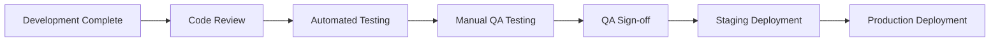

# Business Documentation Proposal
*Last Updated: 2025-10-27 | Version: 1.0*

---

## Quick Navigation
- [🏠 **Main Overview**](PENGUINMAILS_OVERVIEW.md) | [💰 **Business Strategy**](product_strategy.md) | [📊 **Market Analysis**](system_analysis.md)

---

## Executive Summary

This proposal outlines the business documentation structure needed to support PenguinMails' growth and operations. These documents bridge the gap between technical implementation and business objectives, ensuring all stakeholders understand their roles, processes, and metrics.

### Current Business Documentation Status
✅ **Completed**: Product strategy, value proposition, roadmap, system analysis  
🔄 **In Progress**: Infrastructure, security, operational procedures  
⚠️ **Missing**: Business process documentation, compliance, customer operations

---

## Priority 1: Customer Operations Documentation

### 1. Customer Onboarding Process (`customer_onboarding_process.md`)

**Purpose**: Standardize the customer journey from signup to first campaign success

**Content Structure**:
```markdown
# Customer Onboarding Process

## Phase 1: Account Setup (Day 1)
- Account verification and email confirmation
- Initial configuration and domain setup guidance
- Payment method verification

## Phase 2: Email Infrastructure Setup (Days 1-2)
- Domain verification process (SPF, DKIM, DMARC)
- SMTP configuration walkthrough
- Email warm-up initiation

## Phase 3: First Campaign Preparation (Days 3-7)
- Template creation guidance
- Lead list import and verification
- Compliance checklist

## Phase 4: Campaign Launch (Days 7-10)
- Test email sending
- Performance monitoring setup
- Optimization recommendations
```

**Key Metrics**:
- Time to first successful email sent
- Domain verification completion rate
- First campaign launch rate
- Customer satisfaction scores

### 2. Billing and Subscription Guide (`billing_and_subscription_guide.md`)

**Purpose**: Transparent billing processes for customers and internal teams

**Content Structure**:
```markdown
# Billing and Subscription Management

## Subscription Tiers
- **Freemium**: 100 emails/month, basic features
- **Starter ($29/month)**: 1,000 emails/month, basic analytics
- **Professional ($99/month)**: 5,000 emails/month, advanced features
- **Enterprise ($299/month)**: 25,000 emails/month, custom solutions

## Billing Cycle and Policies
- Monthly billing cycle
- Annual discount (2 months free)
- Prorated upgrades/downgrades
- 30-day money-back guarantee

## Payment Processing
- Stripe integration
- Automatic payment retries
- Failed payment handling
- Payment method updates
```

**Internal Processes**:
- Customer support billing escalation
- Subscription modification workflows
- Revenue recognition procedures
- Churn reduction strategies

---

## Priority 2: Quality Assurance Documentation

### 3. QA Testing Protocols (`qa_testing_protocols.md`)

**Current State**: Mustafa handles QA processes  
**Future State**: Expand QA to include additional team members

**Content Structure**:
```markdown
# QA Testing Protocols

## QA Team Structure
- **Primary QA Lead**: Mustafa (current)
- **Secondary QA Members**: Training path for additional team members
- **Role Transitions**: Cross-training plan for knowledge sharing

## Testing Categories

### 1. Functional Testing
- User interface testing
- Feature workflow testing
- Cross-browser compatibility
- Mobile responsiveness

### 2. Integration Testing
- API endpoint testing
- Third-party service integration
- Database operation testing
- Email delivery verification

### 3. Performance Testing
- Load testing scenarios
- Database performance
- Email sending capacity
- System response times

### 4. Security Testing
- Authentication bypass attempts
- Data isolation verification
- SQL injection testing
- XSS vulnerability checks

## QA Process Flow


## QA Tools and Environment
- **Test Management**: Jira integration with test cases
- **Test Data**: Synthetic data generation
- **Test Automation**: Cypress for UI tests, Jest for API tests
- **Performance Testing**: Artillery for load testing
```

---

## Priority 3: Compliance and Legal Documentation

### 4. Compliance Procedures (`compliance_procedures.md`)

**Purpose**: Ensure regulatory compliance across email marketing operations

**Content Structure**:
```markdown
# Compliance Procedures

## Email Marketing Regulations
- CAN-SPAM Act compliance
- GDPR compliance for EU customers
- CASL compliance for Canadian customers
- TCPA compliance for SMS (future)

## Data Protection Requirements
- Customer data handling procedures
- Data retention and deletion
- Cross-border data transfer protocols
- Privacy policy updates

## Audit and Documentation
- Compliance audit schedule
- Documentation requirements
- Incident response procedures
- Regular compliance reviews

## Customer Compliance Support
- Unsubscribe management
- Data portability requests
- Right to be forgotten procedures
- Compliance documentation for customers
```

---

## Priority 4: Business Process Documentation

### 5. Sales and Marketing Operations (`sales_marketing_operations.md`)

**Purpose**: Document sales processes and marketing strategies

**Content Structure**:
```markdown
# Sales and Marketing Operations

## Target Market Segments
- **Agencies**: Multi-client email management
- **Startups**: Scalable outbound sales
- **Freelancers**: Cost-effective email marketing
- **Enterprise**: Advanced features and custom solutions

## Sales Process
1. **Lead Generation**: Inbound and outbound strategies
2. **Qualification**: BANT criteria (Budget, Authority, Need, Timeline)
3. **Demo Process**: Product demonstration workflows
4. **Proposal**: Pricing and feature customization
5. **Closing**: Contract and onboarding handoff

## Marketing Strategies
- **Content Marketing**: SEO, blog, case studies
- **Paid Advertising**: Google Ads, LinkedIn, industry publications
- **Partnerships**: Agency partnerships, integration partners
- **Community Building**: User groups, webinars, conferences

## Key Performance Indicators
- Lead generation metrics
- Conversion rates by channel
- Customer acquisition cost (CAC)
- Lifetime value (LTV)
```

### 6. Partnership Management (`partnership_management.md`)

**Purpose**: Manage strategic partnerships and integration relationships

**Content Structure**:
```markdown
# Partnership Management

## Partnership Types

### Technology Partnerships
- **CRM Integrations**: Salesforce, HubSpot, Pipedrive
- **Email Platforms**: Mailchimp, SendGrid integration
- **Analytics Tools**: Google Analytics, Mixpanel integration
- **Payment Processors**: Stripe, PayPal, local payment methods

### Channel Partnerships
- **Agency Partners**: Revenue sharing and co-marketing
- **Reseller Programs**: White-label opportunities
- **Affiliate Programs**: Performance-based partnerships
- **Integration Partners**: Technical collaboration

## Partnership Lifecycle
1. **Identification**: Target partner selection criteria
2. **Evaluation**: Technical and business fit assessment
3. **Negotiation**: Terms and integration timeline
4. **Integration**: Technical implementation
5. **Launch**: Joint marketing and support
6. **Management**: Ongoing relationship and performance review

## Partnership Metrics
- Revenue from partner channels
- Customer acquisition through partners
- Integration usage statistics
- Partner satisfaction scores
```

---

## Priority 5: Financial and Business Operations

### 7. Financial Operations Manual (`financial_operations_manual.md`)

**Purpose**: Document financial processes and business metrics

**Content Structure**:
```markdown
# Financial Operations Manual

## Revenue Streams
- **Subscription Revenue**: Monthly recurring revenue (MRR)
- **Annual Subscriptions**: Upfront payments and deferred revenue
- **Professional Services**: Setup and consulting fees
- **Usage Overages**: Overage charges for email limits

## Financial Reporting
- **Monthly Reports**: Revenue, churn, customer metrics
- **Quarterly Reviews**: Financial performance and forecasts
- **Annual Planning**: Budget and growth targets
- **Investor Reporting**: Key metrics for stakeholders

## Cost Management
- **Infrastructure Costs**: VPS, SMTP, email service costs
- **Software Licenses**: Development and operational tools
- **Personnel Costs**: Team salaries and contractor fees
- **Marketing Spend**: Customer acquisition costs

## Key Financial Metrics
- Monthly Recurring Revenue (MRR)
- Annual Recurring Revenue (ARR)
- Customer Acquisition Cost (CAC)
- Customer Lifetime Value (LTV)
- Churn Rate
- Net Revenue Retention (NRR)
```

### 8. Business Continuity Plan (`business_continuity_plan.md`)

**Purpose**: Ensure business operations continue during disruptions

**Content Structure**:
```markdown
# Business Continuity Plan

## Risk Assessment

### Technology Risks
- **Infrastructure Failure**: VPS outages, database corruption
- **Security Breaches**: Data breaches, DDoS attacks
- **Service Dependencies**: Third-party service failures
- **Data Loss**: Backup failures, ransomware attacks

### Business Risks
- **Key Personnel Loss**: Founder or critical team member departure
- **Market Changes**: Competitive threats, regulatory changes
- **Financial Risks**: Cash flow issues, customer concentration
- **Legal Risks**: Regulatory compliance, intellectual property

## Continuity Procedures

### Immediate Response (0-4 hours)
- Incident assessment and severity classification
- Emergency team activation
- Customer communication procedures
- Media response protocols

### Short-term Response (4-48 hours)
- Service restoration procedures
- Alternative provider activation
- Customer compensation processes
- Regulatory notification requirements

### Long-term Recovery (2+ weeks)
- Full system restoration
- Data recovery and validation
- Process improvement implementation
- Insurance claim procedures
```

---

## Implementation Timeline

### Phase 1: Customer Operations (Weeks 1-2)
- Customer onboarding process documentation
- Billing and subscription guide
- QA testing protocols

### Phase 2: Compliance and Legal (Weeks 3-4)
- Compliance procedures documentation
- Financial operations manual
- Business continuity plan

### Phase 3: Sales and Marketing (Weeks 5-6)
- Sales and marketing operations
- Partnership management procedures
- Customer success metrics

### Phase 4: Integration and Testing (Weeks 7-8)
- Document cross-referencing and integration
- Process testing and validation
- Team training and adoption

---

## Resource Requirements

### Documentation Creation
- **Primary Author**: Product Owner with business stakeholder input
- **Technical Review**: Infrastructure team for accuracy
- **Legal Review**: Legal counsel for compliance sections
- **Marketing Input**: Sales and marketing teams for process details

### Ongoing Maintenance
- **Quarterly Reviews**: Update processes based on business changes
- **Annual Audits**: Comprehensive documentation review
- **Team Feedback**: Regular input from document users
- **Process Improvements**: Continuous documentation enhancement

### Training and Adoption
- **Team Training**: Document usage and process training
- **Customer Communication**: Share relevant customer-facing documents
- **Performance Tracking**: Monitor document usage and effectiveness
- **Feedback Collection**: Regular stakeholder input and improvements

---

## Success Metrics

### Documentation Quality
- **Completeness**: All critical processes documented
- **Accuracy**: Regular validation against actual processes
- **Usability**: Easy to find and understand information
- **Timeliness**: Regular updates for business changes

### Business Impact
- **Efficiency Gains**: Reduced time for routine processes
- **Error Reduction**: Fewer process-related mistakes
- **Compliance**: 100% regulatory compliance maintained
- **Customer Satisfaction**: Improved customer experience

### Team Adoption
- **Document Usage**: Regular reference and citation
- **Process Adherence**: Improved process compliance
- **Training Effectiveness**: Faster onboarding of new team members
- **Knowledge Sharing**: Better cross-team communication

---

## Next Steps

### Immediate Actions (This Week)
1. **Prioritize Document List**: Confirm priority order based on business needs
2. **Assign Owners**: Designate primary authors for each document
3. **Create Templates**: Standardize document format and structure
4. **Schedule Reviews**: Set up regular review and update cycles

### Short-term Goals (Next Month)
1. **Complete Phase 1**: Customer operations documentation
2. **Team Training**: Begin adoption and usage training
3. **Process Integration**: Integrate documentation into daily workflows
4. **Feedback Collection**: Gather initial user feedback and improvements

### Long-term Vision (Next Quarter)
1. **Full Documentation Suite**: Complete all priority documents
2. **Automated Processes**: Integrate documentation with business systems
3. **Continuous Improvement**: Establish ongoing maintenance and update processes
4. **Knowledge Base**: Create searchable, user-friendly documentation portal

---

*This proposal can be adjusted based on business priorities and team capacity. Regular review and updates will ensure the documentation remains current and valuable.*