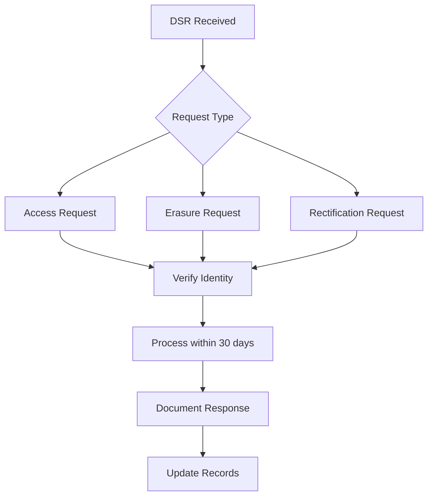
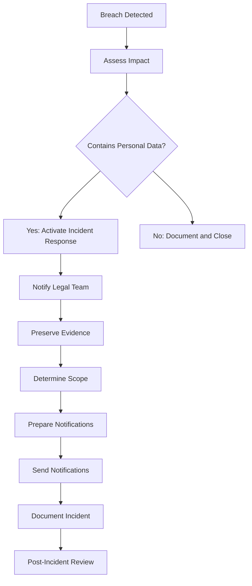

# **PenguinMails Compliance Procedures**

> **Status**: Current | **Last Updated**: October 28, 2025

---

## 1. **Purpose**

This document outlines regulatory compliance procedures for PenguinMails, ensuring adherence to international data protection laws, email marketing regulations, and industry standards to protect user privacy and maintain legal compliance.

## 2. **Regulatory Framework**

### **Primary Regulations**
- **GDPR**: European General Data Protection Regulation
- **CAN-SPAM**: US Controlling the Assault of Non-Solicited Pornography and Marketing Act
- **CCPA**: California Consumer Privacy Act
- **CASL**: Canadian Anti-Spam Legislation
- **PIPEDA**: Personal Information Protection and Electronic Documents Act

### **Email-Specific Regulations**
- **TCPA**: Telephone Consumer Protection Act (SMS compliance)
- **CTIA**: Cellular Telecommunications Industry Association guidelines
- **Email Sender & Provider Coalition**: Industry best practices
- **Google & Yahoo Sender Requirements**: Major ISP policies

### **Data Protection Standards**
- **ISO 27001**: Information security management systems
- **SOC 2**: Service Organization Control standards
- **PCI DSS**: Payment Card Industry Data Security Standard
- **HIPAA**: Health Insurance Portability and Accountability Act (if applicable)

## 3. **Data Protection Compliance**

### **GDPR Compliance Procedures**

#### **Data Subject Rights**
- **Right to Access**: Provide data copies within 30 days
- **Right to Rectification**: Correct inaccurate personal data
- **Right to Erasure**: Delete personal data ("right to be forgotten")
- **Right to Restrict Processing**: Limit data processing temporarily
- **Right to Data Portability**: Provide data in machine-readable format
- **Right to Object**: Object to processing based on legitimate interests

#### **GDPR Workflow**


### **CCPA Compliance Procedures**

#### **Consumer Rights**
- **Right to Know**: Categories and specific pieces of personal information collected
- **Right to Delete**: Delete personal information (with exceptions)
- **Right to Opt-out**: Opt-out of sale of personal information
- **Right to Non-discrimination**: No retaliation for exercising rights

#### **Data Inventory Requirements**
- **Categories Collected**: Email addresses, IP addresses, device information
- **Sources**: Direct from users, third-party integrations
- **Business Purposes**: Service provision, analytics, marketing
- **Third Parties**: Stripe, email service providers, analytics platforms

## 4. **Email Marketing Compliance**

### **CAN-SPAM Act Requirements**

#### **Message Requirements**
- **Clear Identification**: Sender name and address must be accurate
- **Subject Line**: Must not be deceptive
- **Physical Address**: Valid physical postal address
- **Opt-out Mechanism**: Clear unsubscribe link in every email
- **Honor Opt-outs**: Process unsubscribes within 10 business days

#### **CAN-SPAM Compliance Checklist**
- [ ] Accurate sender information
- [ ] Non-deceptive subject lines
- [ ] Physical mailing address included
- [ ] Clear opt-out instructions
- [ ] Opt-out processing within 10 days
- [ ] No harvested email addresses
- [ ] Commercial content clearly identified

### **CASL Compliance Procedures**

#### **Consent Requirements**
- **Express Consent**: Clear, active consent for commercial emails
- **Implied Consent**: For existing business relationships (limited)
- **Unsubscribe**: Must include unsubscribe mechanism
- **Identification**: Sender must be clearly identifiable

#### **CASL Enforcement**
- **Penalties**: Up to $10 million for violations
- **Private Right of Action**: Individuals can sue for violations
- **Record Keeping**: Maintain consent records for 2 years

## 5. **Privacy Program Management**

### **Data Protection Officer Responsibilities**
- **Compliance Oversight**: Monitor regulatory changes and requirements
- **Risk Assessment**: Regular privacy impact assessments
- **Training Coordination**: Staff privacy training and awareness
- **Incident Response**: Lead breach notification procedures
- **Audit Preparation**: Coordinate privacy audits and assessments

### **Privacy Impact Assessment Process**
1. **Project Identification**: New features or changes requiring assessment
2. **Data Mapping**: Identify personal data collection and processing
3. **Risk Evaluation**: Assess privacy risks and mitigation measures
4. **Mitigation Planning**: Implement privacy controls and safeguards
5. **Documentation**: Record assessment and approval decisions

## 6. **Data Security Measures**

### **Data Encryption**
- **In Transit**: TLS 1.3 encryption for all data transmission
- **At Rest**: AES-256 encryption for stored personal data
- **Key Management**: Secure key rotation and storage procedures
- **Database Encryption**: Transparent data encryption for sensitive fields

### **Access Controls**
- **Role-Based Access**: Least privilege access to personal data
- **Multi-Factor Authentication**: Required for administrative access
- **Audit Logging**: Comprehensive logging of data access and changes
- **Regular Reviews**: Quarterly access permission reviews

### **Data Retention**
- **Retention Schedule**: Defined retention periods by data type
- **Automated Deletion**: Scheduled data purging procedures
- **Legal Holds**: Suspension of deletion during legal proceedings
- **Archival Procedures**: Secure long-term data storage when required

## 7. **Incident Response Procedures**

### **Breach Notification Requirements**
- **GDPR**: Notify supervisory authority within 72 hours, affected individuals without undue delay
- **CCPA**: Notify affected California residents without unreasonable delay
- **CAN-SPAM**: No specific breach notification, but FTC may investigate
- **CASL**: Notify Privacy Commissioner and affected individuals

### **Incident Response Workflow**


### **Breach Response Team**
- **Incident Commander**: Overall coordination and decision making
- **Legal Counsel**: Regulatory compliance and notification requirements
- **Technical Lead**: Technical assessment and remediation
- **Communications Lead**: Internal and external communications
- **Customer Success**: Customer notification and support

## 8. **Vendor Compliance Management**

### **Third-Party Risk Assessment**
- **Vendor Evaluation**: Privacy and security capability assessment
- **Contract Requirements**: Data protection clauses and audit rights
- **Ongoing Monitoring**: Regular vendor compliance reviews
- **Incident Reporting**: Vendor breach notification procedures

### **Key Vendors and Compliance Status**
| Vendor | Purpose | Compliance Status | Last Review |
|--------|---------|-------------------|-------------|
| Stripe | Payment Processing | PCI DSS, SOC 2 | Monthly |
| NileDB | Database Services | SOC 2, GDPR | Quarterly |
| Mailgun/SendGrid | Email Delivery | GDPR, CAN-SPAM | Annual |
| PostHog | Analytics | GDPR, CCPA | Quarterly |

## 9. **Compliance Monitoring and Reporting**

### **Regular Compliance Activities**
- **Monthly**: Compliance metric review and reporting
- **Quarterly**: Privacy impact assessments and vendor reviews
- **Annually**: Full compliance audit and certification renewal
- **Continuous**: Regulatory change monitoring and policy updates

### **Compliance Metrics**
- **DSR Response Time**: Average time to respond to data subject requests
- **Opt-out Processing**: Percentage of opt-outs processed within 10 days
- **Training Completion**: Percentage of staff completing privacy training
- **Audit Findings**: Number and severity of compliance issues identified

### **Reporting Requirements**
- **Internal Reports**: Monthly compliance dashboard for management
- **External Reports**: SOC 2 reports for customers and auditors
- **Regulatory Filings**: Required submissions to supervisory authorities
- **Customer Inquiries**: Responses to privacy and compliance questions

## 10. **Training and Awareness**

### **Staff Training Requirements**
- **New Employee Training**: Privacy and compliance orientation
- **Annual Refresher**: Updated training on regulatory changes
- **Role-Specific Training**: Specialized training for high-risk roles
- **Incident Response Training**: Regular drills and simulations

### **Training Topics**
- **Data Protection Laws**: GDPR, CCPA, and other regulations
- **Email Marketing Rules**: CAN-SPAM, CASL compliance
- **Security Best Practices**: Data handling and incident prevention
- **Privacy by Design**: Incorporating privacy into product development

## 11. **Audit and Certification**

### **External Audits**
- **SOC 2 Type II**: Annual audit of security controls
- **GDPR Audit**: Biennial assessment of GDPR compliance
- **ISO 27001**: Triennial certification renewal
- **Penetration Testing**: Annual security assessment

### **Internal Audits**
- **Quarterly Self-Assessments**: Internal compliance reviews
- **Process Audits**: Workflow and procedure effectiveness
- **Technical Audits**: System configuration and security settings
- **Training Audits**: Staff knowledge and training completion

## 12. **Decision Trees**

### **Data Processing Decision Tree**
```
Processing personal data?
├── Yes → Privacy impact assessment required
│   ├── High risk? → DPIA mandatory
│   └── Low risk? → Basic assessment
└── No → Standard data handling procedures
```

### **Breach Notification Decision Tree**
```
Personal data breach?
├── Yes → Assess severity and impact
│   ├── High risk to individuals? → Notify within 72 hours
│   └── Low risk? → Document for 72-hour assessment
└── No → Document incident without notification
```

---

## Related Documents
- [Security Documentation](security_documentation.md) - Security procedures and protocols
- [SOP Guidelines](sop_guidelines.md) - Standard operating procedures
- [Data Privacy Policy](data_privacy_policy.md) - Customer-facing privacy information
- [Incident Response Plan](incident_response_plan.md) - Detailed breach response procedures
- [Vendor Management Policy](vendor_management_policy.md) - Third-party vendor compliance

**Keywords**: GDPR compliance, CAN-SPAM, CCPA, data protection, privacy regulations, email compliance, regulatory compliance, data subject rights