# Database Schema Guide
*Last Updated: 2025-10-27 | Version: 2.0*

---

## Quick Navigation
- [🏠 **Main Overview**](PENGUINMAILS_OVERVIEW.md) | [🛠️ **Infrastructure**](infrastructure_documentation.md) | [📊 **Analytics Architecture**](analytics_architecture.md)

---

## Overview

This document provides a comprehensive guide to the PenguinMails database schema, including the updated analytics architecture using **Postgres + PostHog**. It covers multi-tenant data structures, analytics tables, job queue system, and operational procedures.

### Database Architecture
- **Primary**: NileDB (PostgreSQL-based) for core application data
- **Analytics**: Postgres with Drizzle ORM for tracking and aggregates
- **Real-time**: PostHog for live analytics and behavioral tracking
- **Development**: Docker containers for local development

---

## Multi-Tenant Database Structure

### Core Tenant Management

```sql
-- Main tenant table (NileDB)
CREATE TABLE tenants (
    id BIGSERIAL PRIMARY KEY,
    tenant_id UUID UNIQUE NOT NULL DEFAULT gen_random_uuid(),
    name VARCHAR(255) NOT NULL,
    domain VARCHAR(255) UNIQUE,
    settings JSONB DEFAULT '{}',
    status VARCHAR(50) DEFAULT 'active',
    created_at TIMESTAMP WITH TIME ZONE DEFAULT NOW(),
    updated_at TIMESTAMP WITH TIME ZONE DEFAULT NOW()
);

-- User management (NileDB)
CREATE TABLE users (
    id BIGSERIAL PRIMARY KEY,
    user_id UUID UNIQUE NOT NULL DEFAULT gen_random_uuid(),
    tenant_id BIGINT REFERENCES tenants(id) ON DELETE CASCADE,
    email VARCHAR(255) UNIQUE NOT NULL,
    password_hash VARCHAR(255) NOT NULL,
    role VARCHAR(50) NOT NULL DEFAULT 'employee',
    first_name VARCHAR(100),
    last_name VARCHAR(100),
    is_active BOOLEAN DEFAULT TRUE,
    last_login_at TIMESTAMP WITH TIME ZONE,
    created_at TIMESTAMP WITH TIME ZONE DEFAULT NOW(),
    updated_at TIMESTAMP WITH TIME ZONE DEFAULT NOW()
);

-- Tenant user associations
CREATE TABLE tenant_users (
    id BIGSERIAL PRIMARY KEY,
    tenant_id BIGINT REFERENCES tenants(id) ON DELETE CASCADE,
    user_id BIGINT REFERENCES users(id) ON DELETE CASCADE,
    permission_level VARCHAR(50) DEFAULT 'basic',
    joined_at TIMESTAMP WITH TIME ZONE DEFAULT NOW(),
    UNIQUE(tenant_id, user_id)
);
```

### Staff Management System

```sql
-- Staff members within tenants
CREATE TABLE staff_members (
    id BIGSERIAL PRIMARY KEY,
    tenant_id BIGINT REFERENCES tenants(id) ON DELETE CASCADE,
    name VARCHAR(255) NOT NULL,
    email VARCHAR(255) NOT NULL,
    position VARCHAR(100),
    is_active BOOLEAN DEFAULT TRUE,
    created_at TIMESTAMP WITH TIME ZONE DEFAULT NOW()
);

-- Staff roles with permissions
CREATE TABLE staff_roles (
    id BIGSERIAL PRIMARY KEY,
    tenant_id BIGINT REFERENCES tenants(id) ON DELETE CASCADE,
    role_name VARCHAR(100) NOT NULL,
    permissions JSONB DEFAULT '{}',
    created_at TIMESTAMP WITH TIME ZONE DEFAULT NOW(),
    UNIQUE(tenant_id, role_name)
);

-- Role assignments
CREATE TABLE staff_role_assignments (
    id BIGSERIAL PRIMARY KEY,
    staff_member_id BIGINT REFERENCES staff_members(id) ON DELETE CASCADE,
    role_id BIGINT REFERENCES staff_roles(id) ON DELETE CASCADE,
    assigned_at TIMESTAMP WITH TIME ZONE DEFAULT NOW(),
    UNIQUE(staff_member_id, role_id)
);
```

---

## Business Logic Tables

### Subscription and Billing

```sql
-- Subscription plans
CREATE TABLE plans (
    id BIGSERIAL PRIMARY KEY,
    plan_name VARCHAR(100) NOT NULL UNIQUE,
    price DECIMAL(10,2) NOT NULL,
    billing_cycle VARCHAR(20) DEFAULT 'monthly',
    features JSONB DEFAULT '{}',
    limits JSONB DEFAULT '{}',
    is_active BOOLEAN DEFAULT TRUE,
    created_at TIMESTAMP WITH TIME ZONE DEFAULT NOW()
);

-- Tenant subscriptions
CREATE TABLE subscriptions (
    id BIGSERIAL PRIMARY KEY,
    tenant_id BIGINT REFERENCES tenants(id) ON DELETE CASCADE,
    plan_id BIGINT REFERENCES plans(id),
    status VARCHAR(50) DEFAULT 'active',
    started_at TIMESTAMP WITH TIME ZONE DEFAULT NOW(),
    expires_at TIMESTAMP WITH TIME ZONE,
    auto_renew BOOLEAN DEFAULT TRUE,
    created_at TIMESTAMP WITH TIME ZONE DEFAULT NOW()
);

-- Payment records
CREATE TABLE payments (
    id BIGSERIAL PRIMARY KEY,
    tenant_id BIGINT REFERENCES tenants(id) ON DELETE CASCADE,
    subscription_id BIGINT REFERENCES subscriptions(id),
    stripe_payment_id VARCHAR(255) UNIQUE,
    amount DECIMAL(10,2) NOT NULL,
    currency VARCHAR(3) DEFAULT 'USD',
    status VARCHAR(50) NOT NULL,
    paid_at TIMESTAMP WITH TIME ZONE,
    created_at TIMESTAMP WITH TIME ZONE DEFAULT NOW()
);
```

### Email Infrastructure

```sql
-- VPS instances for tenants
CREATE TABLE vps_instances (
    id BIGSERIAL PRIMARY KEY,
    tenant_id BIGINT REFERENCES tenants(id) ON DELETE CASCADE,
    instance_id VARCHAR(255) UNIQUE NOT NULL,
    ip_address INET NOT NULL,
    status VARCHAR(50) DEFAULT 'provisioning',
    configuration JSONB DEFAULT '{}',
    hostwind_id VARCHAR(255),
    created_at TIMESTAMP WITH TIME ZONE DEFAULT NOW(),
    updated_at TIMESTAMP WITH TIME ZONE DEFAULT NOW()
);

-- SMTP IP addresses
CREATE TABLE smtp_ip_addresses (
    id BIGSERIAL PRIMARY KEY,
    tenant_id BIGINT REFERENCES tenants(id) ON DELETE CASCADE,
    ip_address INET NOT NULL,
    status VARCHAR(50) DEFAULT 'active',
    reputation_score INTEGER DEFAULT 0,
    last_used_at TIMESTAMP WITH TIME ZONE,
    created_at TIMESTAMP WITH TIME ZONE DEFAULT NOW(),
    UNIQUE(tenant_id, ip_address)
);

-- Domain management
CREATE TABLE domains (
    id BIGSERIAL PRIMARY KEY,
    tenant_id BIGINT REFERENCES tenants(id) ON DELETE CASCADE,
    domain_name VARCHAR(255) NOT NULL,
    verification_status VARCHAR(50) DEFAULT 'pending',
    dns_records JSONB DEFAULT '{}',
    is_primary BOOLEAN DEFAULT FALSE,
    created_at TIMESTAMP WITH TIME ZONE DEFAULT NOW(),
    UNIQUE(tenant_id, domain_name)
);

-- Email accounts (mailboxes)
CREATE TABLE email_accounts (
    id BIGSERIAL PRIMARY KEY,
    tenant_id BIGINT REFERENCES tenants(id) ON DELETE CASCADE,
    email_address VARCHAR(255) NOT NULL,
    password_hash VARCHAR(255),
    status VARCHAR(50) DEFAULT 'active',
    mailbox_type VARCHAR(50) DEFAULT 'personal',
    daily_limit INTEGER DEFAULT 500,
    warmup_status VARCHAR(50) DEFAULT 'none',
    warmup_started_at TIMESTAMP WITH TIME ZONE,
    created_at TIMESTAMP WITH TIME ZONE DEFAULT NOW(),
    UNIQUE(tenant_id, email_address)
);
```

### Campaign Management

```sql
-- Email templates
CREATE TABLE templates (
    id BIGSERIAL PRIMARY KEY,
    tenant_id BIGINT REFERENCES tenants(id) ON DELETE CASCADE,
    template_name VARCHAR(255) NOT NULL,
    subject VARCHAR(255),
    content TEXT NOT NULL,
    variables JSONB DEFAULT '{}',
    is_active BOOLEAN DEFAULT TRUE,
    created_at TIMESTAMP WITH TIME ZONE DEFAULT NOW(),
    updated_at TIMESTAMP WITH TIME ZONE DEFAULT NOW()
);

-- Campaigns
CREATE TABLE campaigns (
    id BIGSERIAL PRIMARY KEY,
    tenant_id BIGINT REFERENCES tenants(id) ON DELETE CASCADE,
    campaign_name VARCHAR(255) NOT NULL,
    status VARCHAR(50) DEFAULT 'draft',
    template_id BIGINT REFERENCES templates(id),
    configuration JSONB DEFAULT '{}',
    scheduled_at TIMESTAMP WITH TIME ZONE,
    started_at TIMESTAMP WITH TIME ZONE,
    completed_at TIMESTAMP WITH TIME ZONE,
    created_at TIMESTAMP WITH TIME ZONE DEFAULT NOW(),
    updated_at TIMESTAMP WITH TIME ZONE DEFAULT NOW()
);

-- Leads database
CREATE TABLE leads (
    id BIGSERIAL PRIMARY KEY,
    tenant_id BIGINT REFERENCES tenants(id) ON DELETE CASCADE,
    email VARCHAR(255) NOT NULL,
    first_name VARCHAR(100),
    last_name VARCHAR(100),
    company VARCHAR(255),
    position VARCHAR(100),
    metadata JSONB DEFAULT '{}',
    imported_at TIMESTAMP WITH TIME ZONE DEFAULT NOW(),
    updated_at TIMESTAMP WITH TIME ZONE DEFAULT NOW(),
    UNIQUE(tenant_id, email)
);

-- Email sending records (main transactional table)
CREATE TABLE emails (
    id BIGSERIAL PRIMARY KEY,
    tenant_id BIGINT REFERENCES tenants(id) ON DELETE CASCADE,
    campaign_id BIGINT REFERENCES campaigns(id),
    email_account_id BIGINT REFERENCES email_accounts(id),
    lead_id BIGINT REFERENCES leads(id),
    message_id VARCHAR(255) UNIQUE,
    subject VARCHAR(255),
    content TEXT,
    status VARCHAR(50) DEFAULT 'queued',
    sent_at TIMESTAMP WITH TIME ZONE,
    opened_at TIMESTAMP WITH TIME ZONE,
    clicked_at TIMESTAMP WITH TIME ZONE,
    replied_at TIMESTAMP WITH TIME ZONE,
    bounced_at TIMESTAMP WITH TIME ZONE,
    bounce_type VARCHAR(50),
    bounce_reason TEXT,
    error_message TEXT,
    created_at TIMESTAMP WITH TIME ZONE DEFAULT NOW(),
    updated_at TIMESTAMP WITH TIME ZONE DEFAULT NOW()
);
```

---

## Analytics Tables (Postgres)

### Raw Interaction Logs

```sql
-- Email open tracking
CREATE TABLE email_opens (
    id UUID PRIMARY KEY DEFAULT gen_random_uuid(),
    email_id VARCHAR(255) NOT NULL,
    campaign_id VARCHAR(255),
    mailbox_id VARCHAR(255),
    user_id UUID NOT NULL,
    tenant_id UUID NOT NULL,
    opened_at TIMESTAMP WITH TIME ZONE DEFAULT NOW(),
    ip_address INET,
    user_agent TEXT,
    created_at TIMESTAMP WITH TIME ZONE DEFAULT NOW()
);

-- Email click tracking
CREATE TABLE email_clicks (
    id UUID PRIMARY KEY DEFAULT gen_random_uuid(),
    email_id VARCHAR(255) NOT NULL,
    campaign_id VARCHAR(255),
    mailbox_id VARCHAR(255),
    user_id UUID NOT NULL,
    tenant_id UUID NOT NULL,
    clicked_url TEXT NOT NULL,
    clicked_at TIMESTAMP WITH TIME ZONE DEFAULT NOW(),
    ip_address INET,
    user_agent TEXT,
    created_at TIMESTAMP WITH TIME ZONE DEFAULT NOW()
);

-- Bounce tracking
CREATE TABLE email_bounces (
    id UUID PRIMARY KEY DEFAULT gen_random_uuid(),
    email_id VARCHAR(255) NOT NULL,
    campaign_id VARCHAR(255),
    mailbox_id VARCHAR(255),
    user_id UUID NOT NULL,
    tenant_id UUID NOT NULL,
    bounce_type VARCHAR(50) NOT NULL,
    bounce_reason TEXT,
    bounced_at TIMESTAMP WITH TIME ZONE DEFAULT NOW(),
    created_at TIMESTAMP WITH TIME ZONE DEFAULT NOW()
);

-- Reply tracking
CREATE TABLE email_replies (
    id UUID PRIMARY KEY DEFAULT gen_random_uuid(),
    email_id VARCHAR(255) NOT NULL,
    campaign_id VARCHAR(255),
    mailbox_id VARCHAR(255),
    user_id UUID NOT NULL,
    tenant_id UUID NOT NULL,
    replied_at TIMESTAMP WITH TIME ZONE DEFAULT NOW(),
    message_id VARCHAR(255),
    created_at TIMESTAMP WITH TIME ZONE DEFAULT NOW()
);
```

### Aggregated Analytics

```sql
-- Daily aggregated metrics
CREATE TABLE daily_analytics (
    id UUID PRIMARY KEY DEFAULT gen_random_uuid(),
    user_id UUID NOT NULL,
    tenant_id UUID NOT NULL,
    campaign_id VARCHAR(255),
    mailbox_id VARCHAR(255),
    date DATE NOT NULL,
    emails_sent INTEGER DEFAULT 0,
    emails_opened INTEGER DEFAULT 0,
    emails_clicked INTEGER DEFAULT 0,
    emails_bounced INTEGER DEFAULT 0,
    emails_replied INTEGER DEFAULT 0,
    warmup_opens INTEGER DEFAULT 0,
    warmup_replies INTEGER DEFAULT 0,
    open_rate DECIMAL(5,2) GENERATED ALWAYS AS (
        CASE WHEN emails_sent > 0 
             THEN ROUND((emails_opened::DECIMAL / emails_sent) * 100, 2)
             ELSE 0 END
    ) STORED,
    click_rate DECIMAL(5,2) GENERATED ALWAYS AS (
        CASE WHEN emails_sent > 0 
             THEN ROUND((emails_clicked::DECIMAL / emails_sent) * 100, 2)
             ELSE 0 END
    ) STORED,
    bounce_rate DECIMAL(5,2) GENERATED ALWAYS AS (
        CASE WHEN emails_sent > 0 
             THEN ROUND((emails_bounced::DECIMAL / emails_sent) * 100, 2)
             ELSE 0 END
    ) STORED,
    reply_rate DECIMAL(5,2) GENERATED ALWAYS AS (
        CASE WHEN emails_sent > 0 
             THEN ROUND((emails_replied::DECIMAL / emails_sent) * 100, 2)
             ELSE 0 END
    ) STORED,
    created_at TIMESTAMP WITH TIME ZONE DEFAULT NOW(),
    updated_at TIMESTAMP WITH TIME ZONE DEFAULT NOW(),
    
    UNIQUE(user_id, tenant_id, campaign_id, mailbox_id, date)
);
```

### Warmup Tracking

```sql
-- Mailbox warmup interactions
CREATE TABLE warmup_interactions (
    id UUID PRIMARY KEY DEFAULT gen_random_uuid(),
    mailbox_id VARCHAR(255) NOT NULL,
    user_id UUID NOT NULL,
    tenant_id UUID NOT NULL,
    interaction_type VARCHAR(50) NOT NULL,
    partner_mailbox VARCHAR(255),
    interaction_at TIMESTAMP WITH TIME ZONE DEFAULT NOW(),
    created_at TIMESTAMP WITH TIME ZONE DEFAULT NOW()
);

-- Warmup daily stats
CREATE TABLE warmup_daily_stats (
    id UUID PRIMARY KEY DEFAULT gen_random_uuid(),
    mailbox_id VARCHAR(255) NOT NULL,
    user_id UUID NOT NULL,
    tenant_id UUID NOT NULL,
    date DATE NOT NULL,
    emails_sent INTEGER DEFAULT 0,
    opens_received INTEGER DEFAULT 0,
    replies_received INTEGER DEFAULT 0,
    reputation_score INTEGER DEFAULT 0,
    created_at TIMESTAMP WITH TIME ZONE DEFAULT NOW(),
    updated_at TIMESTAMP WITH TIME ZONE DEFAULT NOW(),
    
    UNIQUE(mailbox_id, date)
);
```

---

## Job Queue System

### Queue Management

```sql
-- Job queues configuration
CREATE TABLE job_queues (
    name VARCHAR(100) PRIMARY KEY,
    default_priority INTEGER DEFAULT 100,
    is_active BOOLEAN DEFAULT TRUE,
    created_at TIMESTAMP WITH TIME ZONE DEFAULT NOW()
);

-- Jobs table
CREATE TABLE jobs (
    id UUID PRIMARY KEY DEFAULT gen_random_uuid(),
    queue_name VARCHAR(100) REFERENCES job_queues(name) ON DELETE CASCADE,
    status VARCHAR(50) DEFAULT 'queued',
    priority INTEGER DEFAULT 100,
    payload JSONB NOT NULL,
    attempt_count INTEGER DEFAULT 0,
    max_attempts INTEGER DEFAULT 3,
    run_at TIMESTAMP WITH TIME ZONE DEFAULT NOW(),
    started_at TIMESTAMP WITH TIME ZONE,
    completed_at TIMESTAMP WITH TIME ZONE,
    failed_at TIMESTAMP WITH TIME ZONE,
    last_error_message TEXT,
    created_at TIMESTAMP WITH TIME ZONE DEFAULT NOW(),
    updated_at TIMESTAMP WITH TIME ZONE DEFAULT NOW()
);

-- Job execution logs
CREATE TABLE job_logs (
    id UUID PRIMARY KEY DEFAULT gen_random_uuid(),
    job_id UUID REFERENCES jobs(id) ON DELETE CASCADE,
    status VARCHAR(50) NOT NULL,
    log_message TEXT,
    attempt_number INTEGER NOT NULL,
    started_at TIMESTAMP WITH TIME ZONE DEFAULT NOW(),
    finished_at TIMESTAMP WITH TIME ZONE,
    duration INTERVAL,
    created_at TIMESTAMP WITH TIME ZONE DEFAULT NOW()
);
```

### System Notifications

```sql
-- Transactional emails
CREATE TABLE transactional_emails (
    id UUID PRIMARY KEY DEFAULT gen_random_uuid(),
    user_id UUID NOT NULL,
    tenant_id UUID NOT NULL,
    type VARCHAR(100) NOT NULL,
    payload JSONB NOT NULL,
    status VARCHAR(50) DEFAULT 'queued',
    queued_at TIMESTAMP WITH TIME ZONE DEFAULT NOW(),
    sent_at TIMESTAMP WITH TIME ZONE,
    failed_at TIMESTAMP WITH TIME ZONE,
    last_error_message TEXT,
    job_id UUID REFERENCES jobs(id)
);

-- User notifications
CREATE TABLE notifications (
    id UUID PRIMARY KEY DEFAULT gen_random_uuid(),
    user_id UUID NOT NULL,
    tenant_id UUID NOT NULL,
    type VARCHAR(100) NOT NULL,
    title TEXT NOT NULL,
    message TEXT NOT NULL,
    channel VARCHAR(20) DEFAULT 'in_app',
    is_read BOOLEAN DEFAULT FALSE,
    created_at TIMESTAMP WITH TIME ZONE DEFAULT NOW(),
    read_at TIMESTAMP WITH TIME ZONE,
    expires_at TIMESTAMP WITH TIME ZONE
);

-- System alerts
CREATE TABLE system_notifications (
    id UUID PRIMARY KEY DEFAULT gen_random_uuid(),
    created_at TIMESTAMP WITH TIME ZONE DEFAULT NOW(),
    category VARCHAR(100) NOT NULL,
    title TEXT NOT NULL,
    message TEXT NOT NULL,
    severity VARCHAR(20) DEFAULT 'info',
    is_resolved BOOLEAN DEFAULT FALSE,
    resolved_at TIMESTAMP WITH TIME ZONE,
    tenant_id UUID,
    user_id UUID
);
```

---

## Database Indexes

### Performance Optimization Indexes

```sql
-- Core table indexes
CREATE INDEX idx_tenants_tenant_id ON tenants(tenant_id);
CREATE INDEX idx_users_user_id ON users(user_id);
CREATE INDEX idx_users_email ON users(email);
CREATE INDEX idx_tenant_users_tenant ON tenant_users(tenant_id);
CREATE INDEX idx_tenant_users_user ON tenant_users(user_id);

-- Email-related indexes
CREATE INDEX idx_emails_tenant ON emails(tenant_id);
CREATE INDEX idx_emails_campaign ON emails(campaign_id);
CREATE INDEX idx_emails_account ON emails(email_account_id);
CREATE INDEX idx_emails_lead ON emails(lead_id);
CREATE INDEX idx_emails_status ON emails(status);
CREATE INDEX idx_emails_sent_at ON emails(sent_at);

-- Analytics indexes
CREATE INDEX idx_email_opens_email_id ON email_opens(email_id);
CREATE INDEX idx_email_opens_user_tenant ON email_opens(user_id, tenant_id);
CREATE INDEX idx_email_opens_date ON email_opens(opened_at::DATE);

CREATE INDEX idx_email_clicks_email_id ON email_clicks(email_id);
CREATE INDEX idx_email_clicks_user_tenant ON email_clicks(user_id, tenant_id);
CREATE INDEX idx_email_clicks_date ON email_clicks(clicked_at::DATE);

CREATE INDEX idx_email_bounces_email_id ON email_bounces(email_id);
CREATE INDEX idx_email_bounces_user_tenant ON email_bounces(user_id, tenant_id);

CREATE INDEX idx_daily_analytics_user_tenant ON daily_analytics(user_id, tenant_id);
CREATE INDEX idx_daily_analytics_date ON daily_analytics(date);
CREATE INDEX idx_daily_analytics_campaign ON daily_analytics(campaign_id);

-- Job queue indexes
CREATE INDEX idx_jobs_queue ON jobs(queue_name);
CREATE INDEX idx_jobs_status ON jobs(status);
CREATE INDEX idx_jobs_priority ON jobs(priority);
CREATE INDEX idx_jobs_run_at ON jobs(run_at);

-- Warmup indexes
CREATE INDEX idx_warmup_interactions_mailbox ON warmup_interactions(mailbox_id);
CREATE INDEX idx_warmup_interactions_date ON warmup_interactions(interaction_at::DATE);
CREATE INDEX idx_warmup_daily_stats_mailbox ON warmup_daily_stats(mailbox_id);
```

---

## Data Relationships

### Entity Relationship Diagram

```mermaid
erDiagram
    %% Core Relationships
    TENANTS ||--o{ USERS : contains
    TENANTS ||--o{ TENANT_USERS : has
    USERS ||--o{ TENANT_USERS : assigned_to
    
    TENANTS ||--o{ STAFF_MEMBERS : employs
    TENANTS ||--o{ STAFF_ROLES : defines
    TENANTS ||--o{ SUBSCRIPTIONS : subscribes
    
    %% Infrastructure Relationships
    TENANTS ||--o{ VPS_INSTANCES : provisions
    TENANTS ||--o{ SMTP_IP_ADDRESSES : owns
    TENANTS ||--o{ DOMAINS : manages
    TENANTS ||--o{ EMAIL_ACCOUNTS : creates
    
    %% Campaign Relationships
    TENANTS ||--o{ TEMPLATES : owns
    TENANTS ||--o{ CAMPAIGNS : runs
    TENANTS ||--o{ LEADS : imports
    TENANTS ||--o{ EMAILS : sends
    
    CAMPAIGNS ||--o{ EMAILS : generates
    EMAIL_ACCOUNTS ||--o{ EMAILS : sends_from
    LEADS ||--o{ EMAILS : receives
    
    %% Analytics Relationships
    TENANTS ||--o{ DAILY_ANALYTICS : tracks
    EMAILS ||--o{ EMAIL_OPENS : tracks_opens
    EMAILS ||--o{ EMAIL_CLICKS : tracks_clicks
    EMAILS ||--o{ EMAIL_BOUNCES : tracks_bounces
    EMAILS ||--o{ EMAIL_REPLIES : tracks_replies
    
    EMAIL_ACCOUNTS ||--o{ WARMUP_INTERACTIONS : has_warmup
    WARMUP_INTERACTIONS ||--o{ WARMUP_DAILY_STATS : aggregates_to
    
    %% Job Queue Relationships
    JOB_QUEUES ||--o{ JOBS : contains
    JOBS ||--o{ JOB_LOGS : generates_logs
    JOBS ||--o{ TRANSACTIONAL_EMAILS : may_create_emails
    
    %% Notification Relationships
    TENANTS ||--o{ NOTIFICATIONS : receives
    USERS ||--o{ NOTIFICATIONS : gets_notified
    TENANTS ||--o{ SYSTEM_NOTIFICATIONS : generates_alerts
```



---

## Multi-Tenant Data Isolation

### Row-Level Security

```sql
-- Enable RLS on all tenant tables
ALTER TABLE tenants ENABLE ROW LEVEL SECURITY;
ALTER TABLE users ENABLE ROW LEVEL SECURITY;
ALTER TABLE campaigns ENABLE ROW LEVEL SECURITY;
ALTER TABLE emails ENABLE ROW LEVEL SECURITY;

-- Create policies for tenant isolation
CREATE POLICY tenant_isolation ON tenants
  USING (tenant_id = current_setting('app.current_tenant_id')::uuid);

CREATE POLICY user_isolation ON users
  USING (tenant_id = current_setting('app.current_tenant_id')::uuid);

CREATE POLICY email_isolation ON emails
  USING (tenant_id = current_setting('app.current_tenant_id')::uuid);

-- Set tenant context
SET app.current_tenant_id = '123e4567-e89b-12d3-a456-426614174000';
```

### Connection Pooling

```typescript
// Connection management with tenant context
import { Pool } from 'pg';

const pool = new Pool({
  connectionString: process.env.DATABASE_URL,
  max: 20,
  idleTimeoutMillis: 30000,
  connectionTimeoutMillis: 2000,
});

export async function executeWithTenant<T>(
  tenantId: string,
  query: string,
  params: any[] = []
): Promise<T> {
  const client = await pool.connect();
  
  try {
    await client.query('BEGIN');
    await client.query('SET app.current_tenant_id = $1', [tenantId]);
    
    const result = await client.query(query, params);
    
    await client.query('COMMIT');
    return result.rows as T;
  } catch (error) {
    await client.query('ROLLBACK');
    throw error;
  } finally {
    client.release();
  }
}
```

---

## Data Migration Procedures

### Adding New Analytics Tables

```sql
-- Migration script template
BEGIN;

-- Create new table
CREATE TABLE new_analytics_table (
    id UUID PRIMARY KEY DEFAULT gen_random_uuid(),
    tenant_id UUID NOT NULL,
    user_id UUID NOT NULL,
    data JSONB NOT NULL,
    created_at TIMESTAMP WITH TIME ZONE DEFAULT NOW()
);

-- Add indexes
CREATE INDEX idx_new_table_tenant ON new_analytics_table(tenant_id);
CREATE INDEX idx_new_table_user ON new_analytics_table(user_id);
CREATE INDEX idx_new_table_created ON new_analytics_table(created_at);

-- Add to analytics daily aggregation if needed
ALTER TABLE daily_analytics ADD COLUMN new_metric INTEGER DEFAULT 0;

COMMIT;
```

### Data Cleanup Procedures

```sql
-- Clean old analytics logs (keep last 90 days)
DELETE FROM email_opens 
WHERE created_at < NOW() - INTERVAL '90 days';

DELETE FROM email_clicks 
WHERE created_at < NOW() - INTERVAL '90 days';

DELETE FROM warmup_interactions 
WHERE created_at < NOW() - INTERVAL '180 days';

-- Clean completed jobs
DELETE FROM jobs 
WHERE status = 'completed' 
AND completed_at < NOW() - INTERVAL '7 days';

-- Clean old job logs
DELETE FROM job_logs 
WHERE created_at < NOW() - INTERVAL '30 days';
```

---

## Backup and Recovery

### Automated Backup Strategy

```bash
#!/bin/bash
# Daily backup script

# Create backup
pg_dump -h localhost -U analytics_user -d penguinmails_analytics \
  --format=custom \
  --verbose \
  --file=backup_$(date +%Y%m%d_%H%M%S).dump

# Upload to secure storage
aws s3 cp backup_*.dump s3://penguinmails-backups/

# Clean local backups older than 7 days
find . -name "backup_*.dump" -mtime +7 -delete
```

### Recovery Procedures

```sql
-- Point-in-time recovery example
-- Restore to specific timestamp
pg_restore --host=localhost \
           --username=analytics_user \
           --dbname=penguinmails_analytics \
           --verbose \
           --clean \
           --if-exists \
           --no-owner \
           --no-privileges \
           backup_file.dump
```

---

## Performance Monitoring

### Key Metrics to Track

```sql
-- Query performance monitoring
SELECT 
    query,
    calls,
    total_time,
    mean_time,
    rows,
    100.0 * shared_blks_hit / nullif(shared_blks_hit + shared_blks_read, 0) AS hit_percent
FROM pg_stat_statements 
ORDER BY total_time DESC 
LIMIT 10;

-- Table size monitoring
SELECT 
    schemaname,
    tablename,
    pg_size_pretty(pg_total_relation_size(schemaname||'.'||tablename)) as size
FROM pg_tables 
WHERE schemaname = 'public'
ORDER BY pg_total_relation_size(schemaname||'.'||tablename) DESC;

-- Index usage monitoring
SELECT 
    schemaname,
    tablename,
    indexname,
    idx_scan,
    idx_tup_read,
    idx_tup_fetch
FROM pg_stat_user_indexes
WHERE idx_scan > 0
ORDER BY idx_scan DESC;
```

---

## Database Maintenance

### Regular Maintenance Tasks

```sql
-- Weekly maintenance script
-- Update table statistics
ANALYZE;

-- Reindex heavily used tables
REINDEX TABLE emails;
REINDEX TABLE email_opens;
REINDEX TABLE email_clicks;

-- Vacuum tables to reclaim space
VACUUM ANALYZE emails;
VACUUM ANALYZE email_opens;
VACUUM ANALYZE email_clicks;
VACUUM ANALYZE daily_analytics;

-- Check for database bloat
SELECT 
    schemaname,
    tablename,
    pg_size_pretty(pg_total_relation_size(schemaname||'.'||tablename)) as total_size,
    pg_size_pretty(pg_relation_size(schemaname||'.'||tablename)) as table_size,
    pg_size_pretty(pg_total_relation_size(schemaname||'.'||tablename) - pg_relation_size(schemaname||'.'||tablename)) as index_size
FROM pg_tables 
WHERE schemaname = 'public'
AND pg_total_relation_size(schemaname||'.'||tablename) > 100000000; -- > 100MB
```

---

*This database schema provides a solid foundation for PenguinMails' multi-tenant architecture while supporting sophisticated analytics and operational workflows.*