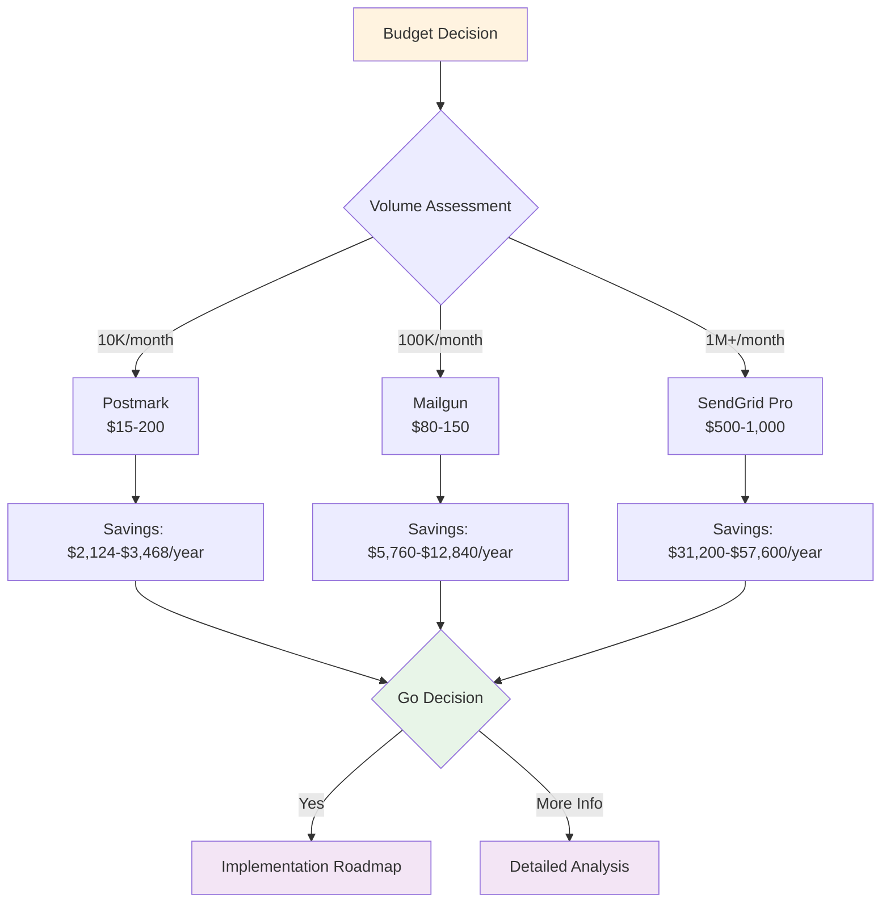

# ROI Calculator: Email Infrastructure Cost-Benefit Analysis

**For CFOs, VPs, and Budget Owners**: Quick cost-benefit analysis and financial planning tool

**Strategic Value**: This ROI calculator provides data-driven insights for email infrastructure investment decisions, enabling informed budget allocation and cost optimization planning.

---

## Quick ROI Assessment

### Progressive Disclosure Flow

### Current State vs. Optimized Infrastructure

## Enter your current metrics below to calculate potential savings

#### Input Variables

- **Monthly Email Volume**: [10K / 100K / 1M+]

- **Current Deliverability Rate**: [60% / 80% / 90% / 95%]

- **Industry/Vertical**: [SaaS / IT Services / Agency / Professional Services / General B2B]

- **Team Size**: [1-2 / 3-4 / 5+ people]

- **Current Monthly Tool Stack Cost**: $[Enter current spend]

- **Compliance Requirements**: [Basic / Standard / Enterprise]

---

## Cost Comparison Summary

{: width="100%" }

{: width="100%" }

### Managed ESP vs Self-Hosted TCO Analysis

| Volume Band | Managed ESP (Monthly) | Self-Hosted VPS (Monthly) | Annual Savings (Managed) |
|-------------|----------------------|---------------------------|-------------------------|
| **10K emails** | $65-$135 | $312-$424 | $2,124-$3,468 |
| **100K emails** | $180-$350 | $830-$1,250 | $5,760-$12,840 |
| **1M+ emails** | $1,400-$3,000 | $4,000-$6,400+ | $31,200-$57,600 |

### Provider Recommendations by Scale

| Scale | Recommended Provider | Monthly Cost | Best For |
|-------|---------------------|--------------|----------|
| **Small (10K)** | Postmark | $15/month | Lowest entry price, reliable delivery |
| **Medium (100K)** | Mailgun Growth | $80-150/month | Best value, dedicated IP included |
| **Enterprise (1M+)** | SendGrid Pro | $500-1,000/month | Enterprise features, support |

---

## Output Calculations

### Current Monthly Cost

## Base Infrastructure Cost:** $______

## Monitoring & Tools:** $______

## Personnel (time × $100):** $______

## Compliance & Security:** $______

## TOTAL CURRENT:** $______

### Alternative Monthly Cost

## Managed ESP Plan:** $______

## Additional Tools:** $______

## Reduced Personnel:** $______

## Compliance (built-in):** $______

## TOTAL ALTERNATIVE:** $______

### ROI Analysis

## Annual Cost Difference:** $______

**ROI Percentage:** _______%
**Payback Period:** _____ months

## 3-Year Net Benefit:** $______

---

## Performance Impact Summary

### Deliverability Impact on Pipeline

## For 100K email campaigns at different deliverability rates

| Deliverability Band | Delivered Emails | Expected Opens | Expected Replies | Expected Meetings |
|-------------------|------------------|----------------|------------------|-------------------|
| **60.0% (Poor)** | 60,000 | 24,000 | 5,100 | 1,800 |
| **80.0% (Average)** | 80,000 | 32,000 | 6,800 | 2,400 |
| **90.0% (Good)** | 90,000 | 36,000 | 7,650 | 2,700 |
| **95.0% (Top Tier)** | 95,000 | 38,000 | 8,075 | 2,850 |

**Key Insight**: Improving deliverability from 60% to 95% increases meetings by 58.3%

---

## Executive Decision Framework

### When to Choose Managed ESPs

- Volume < 1M emails/month

- Deliverability is business critical

- No dedicated DevOps team

- Need built-in compliance and security

- Want predictable costs and support

### When to Consider Self-Hosted

- Volume > 10M emails/month

- Have 4-6+ email infrastructure engineers

- Email is core product (not just marketing)

- Need complete infrastructure control

- Have complex custom requirements

---

## Implementation Timeline ROI

| Phase | Volume Target | Investment | Break-Even Timeline |
|-------|---------------|------------|-------------------|
| **MVP** | 10K emails/month | $20-25/month | 1-2 months |
| **Growth** | 100K emails/month | $150-200/month | 2-4 months |
| **Scale** | 500K+ emails/month | $1,000-2,000/month | 3-6 months |

---

## Scenario Planning Summary

### Best Case Scenario (Optimized)

- **Deliverability**: 95%

- **Provider**: Managed ESP

- **Annual Savings**: $40,000-$57,600

- **ROI**: 300-500%

- **Payback**: 2-3 months

### Realistic Scenario (Average)

- **Deliverability**: 80-90%

- **Provider**: Managed ESP

- **Annual Savings**: $15,000-$30,000

- **ROI**: 150-300%

- **Payback**: 3-6 months

---

## Progressive Disclosure Navigation

## For strategic context

- [Executive Summary](executive-summary) - Strategic findings and recommendations

## For detailed analysis

- [Detailed ROI Calculator](/docs/business/financial-analysis) - Complete cost-benefit analysis with detailed calculations

- [Implementation Roadmap](/docs/business/implementation) - Resource planning and timeline

- [Competitive Analysis](competitive-analysis) - Provider selection matrix

## For technical teams

- [Technical Infrastructure](/docs/business/implementation) - Technical specifications

- [Performance Benchmarks](/docs/business/performance) - Industry data and metrics

---

ROI calculator, cost-benefit analysis, TCO analysis, email infrastructure ROI, managed ESP vs self-hosted, payback period, financial planning

---

*This ROI calculator is part of the comprehensive Progressive Disclosure Framework for Financial Documentation. Use alongside executive summary and detailed analysis for complete financial planning.*
---
