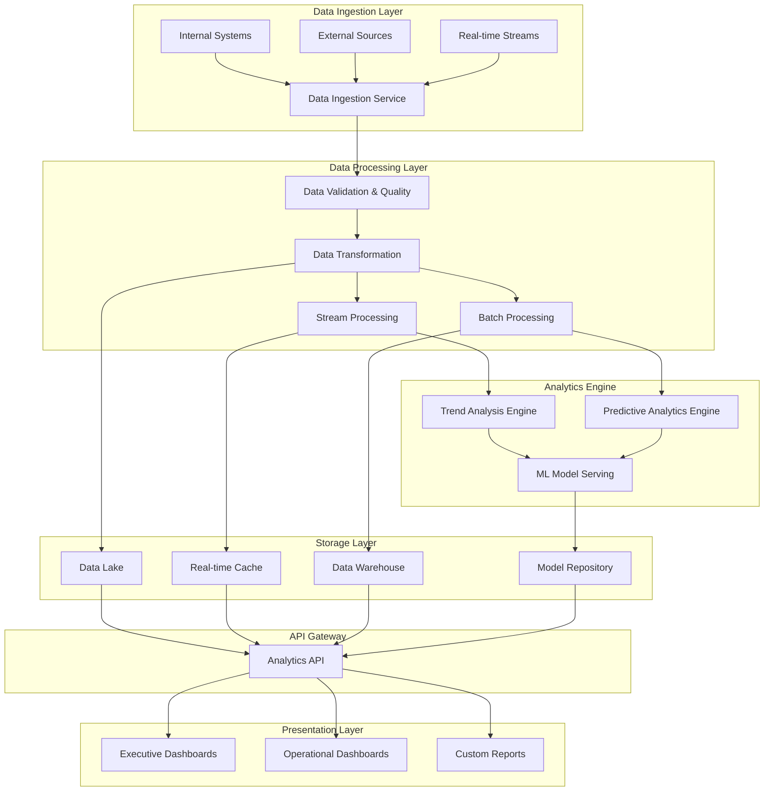

# Advanced Analytics Architecture

## Executive Summary

The Enhanced Analytics Dashboard follows a modern, scalable microservices architecture designed for high-performance data processing, real-time analytics, and predictive modeling. This document outlines the technical architecture, component relationships, and implementation considerations for technical teams.

**Architecture Pattern:** Event-driven microservices with real-time data streaming  
**Data Processing:** Batch and streaming hybrid approach  
**Scalability:** Horizontal scaling with auto-scaling policies  
**Performance Target:** <2 second query response time for 95% of requests  

---

## Architecture Overview

### Design Principles

1. **Separation of Concerns**: Each microservice handles a specific domain (trend analysis, predictive modeling, reporting)
2. **Data Pipeline Architecture**: Unidirectional data flow with proper validation and quality checks
3. **Scalability by Design**: All components designed for horizontal scaling
4. **Real-time First**: Streaming data processing with batch processing for complex analytics
5. **ML-Integrated**: Native machine learning model integration for predictive analytics

### System Architecture Components



---

## Core Analytics Components

### 1. Historical Trend Analysis Engine

**Purpose**: Multi-dimensional analysis of customer health patterns, usage trends, and business metrics over time

#### Key Capabilities

- **Time Series Analysis**: Multi-dimensional trend tracking across health scores, usage patterns, and revenue metrics
- **Seasonal Pattern Recognition**: Automated detection of cyclical behavior patterns by industry and account type
- **Anomaly Detection**: ML-powered identification of unusual patterns requiring intervention
- **Correlation Analysis**: Cross-metric relationship mapping to identify leading indicators

#### Technical Implementation

```yaml
Trend Analysis Architecture:
  Data Pipeline:
    - Real-time stream processing (Apache Kafka/Pulsar)
    - Batch processing for historical analysis (Apache Spark)
    - Time-series database (InfluxDB/TimescaleDB)
  Analytics Engine:
    - Statistical analysis engine (Python/Scala)
    - ML model training pipeline (MLflow/Kubeflow)
    - Automated pattern recognition algorithms
  Storage:
    - Hot data: Redis cache for real-time queries
    - Warm data: Time-series database for trend analysis
    - Cold data: Data lake for historical patterns
```

#### Performance Characteristics

- **Query Response Time**: <500ms for trend queries
- **Data Latency**: <5 minutes for real-time trends
- **Historical Analysis**: <30 seconds for 12-month trend analysis
- **Pattern Detection**: Automated with 95% accuracy rate

### 2. Predictive Analytics Engine

**Purpose**: ML-based forecasting for churn prediction, expansion opportunities, and health trajectory modeling

#### Core Components

### Churn Prediction Module

- **Input Features**: Health scores, usage patterns, support tickets, stakeholder engagement
- **Model Type**: Gradient Boosting (XGBoost/LightGBM) with ensemble methods
- **Accuracy Target**: >85% precision, >80% recall
- **Update Frequency**: Daily retraining with weekly full model refresh

### Expansion Forecasting Module

- **Revenue Prediction**: Upsell and cross-sell opportunity sizing
- **Timeline Forecasting**: 30/90/365-day opportunity prediction
- **Confidence Scoring**: Probability-based expansion likelihood
- **Business Impact**: Revenue realization forecasting

### Health Trajectory Modeling

- **Predictive Health Scores**: Future health trajectory based on current patterns
- **Intervention Timing**: Optimal intervention window identification
- **Confidence Intervals**: Prediction reliability scoring
- **Action Recommendations**: Automated intervention strategy suggestions

#### Technical Architecture

```yaml
Predictive Engine Components:
  Model Training Pipeline:
    - Feature engineering service
    - Model training orchestration (Airflow)
    - A/B testing framework for model validation
    - Automated model versioning and deployment
  Model Serving:
    - Real-time prediction API (<100ms response)
    - Batch prediction jobs for scheduled reports
    - Model performance monitoring
    - Drift detection and retraining triggers
  Data Sources:
    - Historical customer data (3+ years)
    - Real-time behavioral signals
    - External market data
    - Feature store for consistent data access
```

### 3. Advanced Reporting Engine

**Purpose**: Automated report generation, custom dashboard creation, and real-time visualization

#### Report Generation Architecture

- **Template Engine**: Dynamic report generation based on user roles and preferences
- **Scheduling System**: Automated delivery with configurable frequencies
- **Format Support**: PDF, Excel, HTML, JSON APIs
- **Distribution**: Email, web portal, API endpoints

#### Dashboard Customization Framework

- **Widget Library**: Pre-built analytics widgets with customization options
- **User Role Mapping**: Automatic dashboard configuration based on user permissions
- **Real-time Updates**: WebSocket connections for live data streaming
- **Mobile Optimization**: Responsive design for mobile and tablet access

#### Visualization Engine

```yaml
Reporting Components:
  Data Visualization:
    - Chart.js/D3.js for interactive visualizations
    - Real-time data binding with WebSockets
    - Custom chart types for customer success metrics
    - Export capabilities for external analysis
  Dashboard Engine:
    - Drag-and-drop dashboard builder
    - Template-based quick start options
    - Role-based dashboard permissions
    - Automated sharing and collaboration features
```

---

## Data Architecture & Integration

### Data Ingestion Framework

### Multi-Source Data Aggregation

- **Internal Systems**: CRM platforms (Salesforce, HubSpot), support systems (Zendesk), product analytics (Mixpanel, Amplitude)
- **External Data Sources**: Industry benchmarks, competitive intelligence, market research data
- **Real-time Streams**: User behavior events, system metrics, support ticket updates

#### Data Quality & Validation

```yaml
Data Quality Framework:
  Validation Rules:
    - Data type and format validation
    - Business rule compliance checks
    - Referential integrity verification
    - Duplicate detection and handling
  Quality Monitoring:
    - Data freshness indicators
    - Completeness score tracking
    - Accuracy validation against source systems
    - Automated quality alerts and escalation
  Data Lineage:
    - Source-to-destination mapping
    - Transformation tracking
    - Impact analysis for data changes
    - Audit trail maintenance
```

### Processing Architecture

#### Real-time Processing Pipeline

- **Stream Processing**: Apache Kafka for event streaming with Apache Flink for complex event processing
- **Cache Layer**: Redis for high-speed data access and session management
- **API Gateway**: Rate limiting, authentication, and request routing
- **Monitoring**: Real-time system health and performance tracking

#### Batch Processing Framework

- **Scheduling**: Apache Airflow for complex workflow orchestration
- **Data Warehouse**: Snowflake/BigQuery for analytical queries
- **Data Lake**: S3/Azure Data Lake for raw and processed data storage
- **ETL Pipeline**: Apache Spark for large-scale data transformations

### Storage Architecture

```yaml
Storage Strategy:
  Hot Storage (Real-time access):
    - Redis Cluster: Cached analytics results and session data
    - MongoDB: User preferences and dashboard configurations
    - Response time: <50ms for 99% of queries
  
  Warm Storage (Analytical queries):
    - Time-series DB: Historical trend data and metrics
    - Data Warehouse: Aggregated business metrics
    - Response time: <2 seconds for 95% of queries
  
  Cold Storage (Historical data):
    - Data Lake: Raw data and long-term archives
    - Backup systems: Disaster recovery and compliance
    - Access time: <30 seconds for data retrieval
```

---

## API Design & Integration

### Analytics API Architecture

### RESTful API Design

- **Authentication**: JWT tokens with role-based access control
- **Rate Limiting**: Configurable limits based on user tier
- **Response Format**: JSON with standardized error codes
- **Documentation**: OpenAPI 3.0 specification with interactive examples

#### Core API Endpoints

```yaml
Analytics API Endpoints:
  Trend Analysis:
    GET /api/v1/trends/health-scores/{account_id}
    GET /api/v1/trends/usage-patterns/{timeframe}
    GET /api/v1/trends/anomalies/{account_segment}
  
  Predictive Analytics:
    GET /api/v1/predictions/churn-risk/{account_id}
    GET /api/v1/predictions/expansion-opportunities
    GET /api/v1/predictions/health-trajectory/{account_id}
  
  Reporting:
    GET /api/v1/reports/executive-summary
    POST /api/v1/reports/custom
    GET /api/v1/reports/scheduled
```

### External System Integration

### CRM Integration

- **Salesforce**: Real-time health score updates and opportunity sync
- **HubSpot**: Contact engagement tracking and lifecycle stage updates
- **Custom CRM**: API-based integration with configurable field mapping

### Support System Integration

- **Zendesk**: Ticket data integration for health score calculation
- **Intercom**: Conversation analytics and customer interaction tracking
- **Custom Support**: Webhook-based integration for support event processing

---

## Security & Compliance

### Data Security Framework

- **Encryption**: At-rest encryption for all data storage, TLS 1.3 for data in transit
- **Access Control**: Role-based access with multi-factor authentication
- **Data Masking**: PII protection in reports and dashboards
- **Audit Logging**: Comprehensive activity tracking for compliance

### Compliance Architecture

- **GDPR Compliance**: Data retention policies and right-to-be-forgotten implementation
- **SOC 2**: Security controls and monitoring for Type II compliance
- **Industry Standards**: HIPAA compliance for healthcare customers, PCI DSS for financial services

---

## Performance & Scalability

### Horizontal Scaling Strategy

```yaml
Scaling Architecture:
  Microservices Scaling:
    - Containerized services (Docker/Kubernetes)
    - Auto-scaling based on CPU/memory utilization
    - Load balancing across service instances
    - Service mesh for inter-service communication
  
  Data Scaling:
    - Database sharding for large datasets
    - Read replicas for query performance
    - Partitioning strategies for time-series data
    - Caching layers for frequently accessed data
  
  ML Model Scaling:
    - Model serving with GPU acceleration
    - Batch prediction optimization
    - Model caching and pre-computation
    - Distributed training for large datasets
```

### Performance Targets

- **API Response Time**: <2 seconds for 95% of requests
- **Dashboard Load Time**: <3 seconds for initial page load
- **Report Generation**: <30 minutes for comprehensive reports
- **Data Freshness**: <15 minutes for real-time metrics
- **System Uptime**: 99.9% availability target

---

## Monitoring & Observability

### System Monitoring

- **Application Performance**: Custom metrics for business KPIs and technical performance
- **Infrastructure Monitoring**: Server health, database performance, network latency
- **Alert Management**: Intelligent alerting with escalation policies and noise reduction
- **Log Aggregation**: Centralized logging with search and analysis capabilities

### Business Intelligence Monitoring

- **Predictive Model Performance**: Accuracy tracking and drift detection
- **User Engagement**: Dashboard usage, report consumption, feature adoption
- **Business Impact**: ROI measurement and business outcome tracking

---

## Implementation Considerations

### Deployment Strategy

- **Environment Separation**: Development, staging, and production environments
- **Blue-Green Deployment**: Zero-downtime deployments with rollback capabilities
- **Database Migrations**: Automated schema evolution with backward compatibility
- **Feature Flags**: Gradual feature rollout and A/B testing capabilities

### Development Workflow

- **CI/CD Pipeline**: Automated testing, security scanning, and deployment
- **Code Quality**: Automated linting, testing, and security analysis
- **Documentation**: Automated API documentation and architecture diagrams
- **Version Management**: Semantic versioning for API and service releases

### Risk Mitigation

- **Data Backup**: Automated backup with point-in-time recovery
- **Disaster Recovery**: Multi-region deployment with failover capabilities
- **Security Monitoring**: Continuous security scanning and vulnerability assessment
- **Performance Monitoring**: Proactive performance optimization and capacity planning

---

## Next Steps for Implementation

1. **Infrastructure Setup**: Establish Kubernetes clusters and CI/CD pipelines
2. **Data Pipeline Development**: Implement core data ingestion and processing services
3. **ML Model Development**: Build and train initial predictive models
4. **API Development**: Create core analytics APIs with proper documentation
5. **Dashboard Development**: Build user interfaces and visualization components
6. **Testing & Validation**: Comprehensive testing including load testing and security validation
7. **Deployment & Monitoring**: Production deployment with full observability stack

---

**Technical Contact**: Engineering Team  
**Architecture Review**: Monthly review cycle for continuous improvement  
**Version**: 6.0  
**Last Updated**: December 5, 2025
