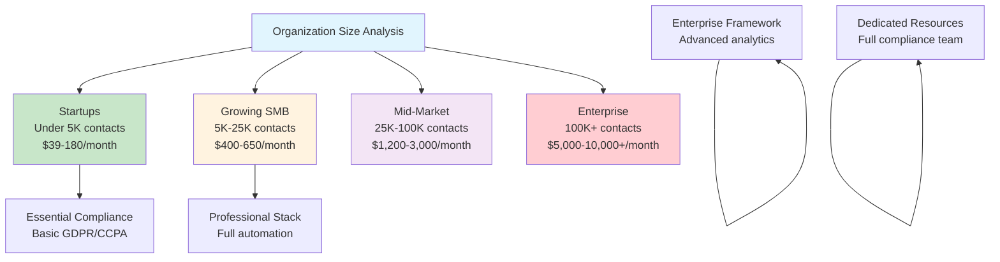
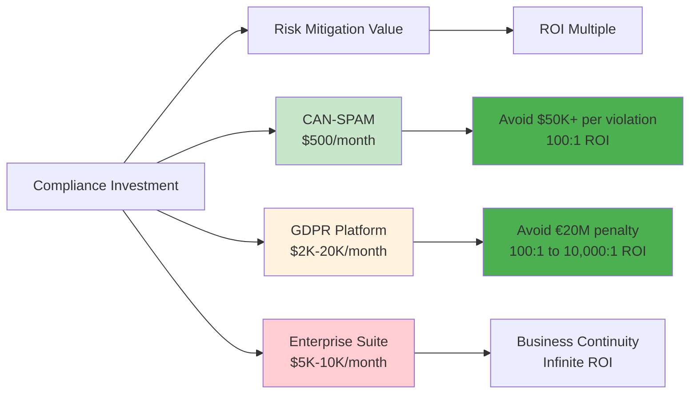

# Cost Analysis Overview - Strategic Compliance Investment

**For CFOs and Finance Directors**: Strategic compliance investment analysis with regulatory risk assessment and ROI framework for compliance decisions

**Strategic Value**: This overview provides essential compliance investment analysis, regulatory risk assessment, and ROI calculations to support strategic compliance budgeting and risk management decisions.

---

## Regulatory Risk Context & Penalty Exposure

### Critical Penalty Exposure Analysis

**Why Compliance Investment Matters**: Organizations face substantial financial exposure without proper compliance measures

#### High-Impact Regulatory Risks

| Regulation | Penalty Range | Business Impact | Prevention Cost | ROI of Investment |
|------------|---------------|-----------------|-----------------|-------------------|
| **GDPR (EU)** | €20M ($21.8M) or 4% global revenue | **Critical** - Complete market exclusion | $2,000-20,000/month | 100:1 to 10,000:1 |
| **CAN-SPAM (US)** | $50,120–$53,088 per violation | **High** - Cumulative penalties | $500/month | 10,000:1 |
| **CCPA (California)** | $2,500-$7,500 per violation | **Medium** - Regional market impact | $500-5,000/month | 1:1 to 5:1 |
| **PCI DSS v4.0** | Payment processing loss | **Critical** - Business continuity | $100-1,000/month | Infinite |
| **Gmail Requirements** | Complete email delivery failure | **High** - Operational continuity | $200-2,000/month | Infinite |

**Key Business Insight**: Prevention costs are 100-10,000x lower than potential penalty exposure.

### 2025 Regulatory Changes Impact

**Critical New Requirements**:

- **PCI DSS v4.0**: DMARC compliance mandatory March 2025

- **Gmail/Outlook**: 5,000+ daily emails require SPF/DKIM/DMARC

- **EU AI Act**: Additional compliance for AI-powered email tools

**Financial Impact**: Organizations failing to comply face complete loss of payment processing or email delivery capabilities.

---

## Strategic Compliance Investment Framework

### Total Cost Analysis by Organization Size

#### Investment Tiers and Recommendations

##### Tier 1: Startups & Lean SMBs (Under 5K contacts)

- **Investment Range**: $39–$180)

- **Core Stack**: Basic GDPR platform (Osano Free) + email verification

- **Key Value**: Essential compliance foundation at minimal cost

##### Tier 2: Growing B2B Teams (5K–25K contacts)

- **Investment Range**: $400–$650)

- **Core Stack**: Professional compliance platform + full email monitoring

- **Key Value**: Complete automation with professional monitoring

##### Tier 3: Mid-Market Enterprise (25K–100K contacts)

- **Investment Range**: $1,200–$3,000)

- **Core Stack**: Enterprise platform + dedicated resources

- **Key Value**: Comprehensive framework with fractional DPO

##### Tier 4: Large Enterprise (100K+ contacts)

- **Investment Range**: $5,000–$10,000+)

- **Core Stack**: Full enterprise suite + dedicated compliance team

- **Key Value**: Complete enterprise compliance framework

---

## ROI Calculation and Business Impact

### Risk vs. Prevention Cost Matrix

### Strategic ROI Examples

#### Example 1: Mid-Market B2B Company (25K contacts)

- **Investment**: $3,400/month ($40,800)

- **Risk Exposure**:

  - GDPR: €20M potential penalty

  - CAN-SPAM: $500K+ cumulative exposure

  - Payment processing: $1M+ business continuity risk

- **Conservative ROI**: 100:1 to 1,000:1

##### Example 2: Startup (2K contacts)

- **Investment**: $100/month ($1,200)

- **Risk Exposure**:

  - CCPA: $25K+ potential exposure

  - CAN-SPAM: $50K+ per violation

  - Email delivery failure: Operational risk

- **Conservative ROI**: 25:1 to 500:1

### Compliance Investment Prioritization

#### Tier 1: Critical (Must-Have)

1. **CAN-SPAM compliance**: All US email marketing operations

2. **SPF/DKIM)

3. **Email archiving**: Legal and compliance retention

4. **Basic consent management**: GDPR/CCPA minimum compliance

##### Tier 2: Important (Should-Have)

1. **Advanced GDPR tools**: EU/UK operations

2. **Deliverability monitoring**: Professional email operations

3. **Email verification**: List hygiene and deliverability

4. **Data Protection Officer**: Mid-market and enterprise

##### Tier 3: Beneficial (Could-Have)

1. **Advanced analytics**: Optimization and reporting

2. **Competitor benchmarking**: Strategic advantage

3. **White-label solutions**: Brand consistency

4. **Custom integrations**: Operational efficiency

---

## Budget Planning and Cost Optimization

### Strategic Cost Optimization Strategies

**Phase Implementation Approach**:

- **Year 1**: Foundation tier (critical compliance)

- **Year 2**: Enhancement tier (important features)

- **Year 3**: Optimization tier (beneficial features)

**Cost Reduction Opportunities**:

1. **Bundle vendor relationships**: 20-30% savings through integration

2. **Fractional DPO services**: 50-70% savings vs. full-time hire

3. **Self-service tools**: Reduce external consulting costs

4. **Automated workflows**: Minimize manual compliance overhead

### Budget Allocation Framework

**Recommended Annual Budget Distribution**:

- **40%**: Core compliance platform and tools

- **25%**: Personnel (DPO, legal, training)

- **20%**: External services (audits, consulting)

- **10%**: Technology infrastructure

- **5%**: Insurance and risk management

---

## Strategic Recommendations by Business Stage

### Startup Phase (0-2 years)

**Investment Philosophy**: Essential compliance foundation

- **Focus**: Legal compliance basics + email deliverability

- **Budget**: $500-2,000 annually

- **Risk Management**: Avoid critical violations while building

### Growth Phase (2-5 years)

**Investment Philosophy**: Professional compliance automation

- **Focus**: Complete GDPR/CCPA automation + monitoring

- **Budget**: $5,000-15,000 annually

- **Risk Management**: Prevent penalties while scaling operations

### Scale Phase (5+ years)

**Investment Philosophy**: Enterprise-grade compliance framework

- **Focus**: Advanced analytics + dedicated compliance resources

- **Budget**: $25,000-100,000+ annually

- **Risk Management**: Comprehensive risk mitigation + competitive advantage

---

## Progressive Disclosure Navigation

**For detailed cost analysis:**

- [Compliance Tool Pricing](cost-tool-pricing:1) - Detailed platform pricing and comparison

- [Implementation Management](cost-implementation:1) - Implementation and ongoing management costs

**For strategic planning:**

- [Executive Summary](executive-summary:1) - Complete strategic analysis

- [ROI Calculator](roi-calculator:1) - Interactive cost-benefit analysis

**For compliance framework:**

- [Compliance Overview](compliance-overview:1) - Regulatory compliance requirements

- [Technical Infrastructure](technical-infrastructure:1) - Technical implementation costs

---

**Keywords**: compliance costs, regulatory risk, penalty exposure, compliance ROI, GDPR investment, compliance budgeting, regulatory compliance

---

*This cost analysis overview is part of the comprehensive Progressive Disclosure Framework for Business Leaders. It provides strategic compliance investment analysis for executive decision-making.*
---
