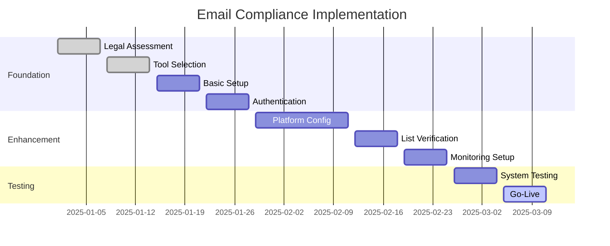

# Implementation and Management Costs - Email-Specific Tools

**For Technical Teams and Operations Managers**: Email-specific compliance tools, implementation costs, and ongoing management expenses

**Implementation Value**: This document provides detailed email-specific compliance tools, implementation frameworks, and ongoing cost management for technical teams.

---

## Email-Specific Monitoring & Compliance Tools

### Email Verification & Validation

#### BriteVerify (Validity) – Email Verification & Validation

**Pricing Structure**:

- **Entry Level**: $40 (5,000 verifications) - List cleaning, deliverability testing
- **Small Business**: $80–$150 (10,000–20,000 verifications) - Monthly list maintenance
- **Enterprise**: $600–$1,250 (100,000–250,000 verifications) - Large-scale validation
- **Alternative**: Custom monthly subscription plans

**Technical Features**:

- 97%+ accuracy rate
- Real-time API (0.5 second average response)
- GDPR compliant, ISO 27001/27701 certified
- Custom integrations with mailbox providers

**Cold Email Implementation**:

- Essential for list hygiene maintenance
- Validates email deliverability before campaigns
- Prevents bounce penalties and reputation damage
- Compliant with GDPR data handling requirements

**ROI Calculation**:

- **Pre-verification**: 15-25% bounce rate typical
- **Post-verification**: <2% bounce rate target
- **Cost**: $0.001-0.01 per email verified
- **ROI**: 300-500% through reduced bounces and improved deliverability

### Email Warming & Deliverability Testing

#### Mailreach – Email Warming & Spam Testing

**Pricing Tiers**:

- **Entry Level**: $9.60–$25/month - Basic inbox placement, spam testing
- **Small Business**: $25–$50/month - Automated warmup, engagement tracking
- **Enterprise**: Custom tiered pricing - Advanced analytics, white-label options

**Technical Features**:

- Inbox placement tracking across major providers
- Blacklist monitoring and alerting
- SPF/DKIM/DMARC authentication checks
- Engagement simulation for reputation building

**Cold Email Use Cases**:

- Pre-send spam testing before campaigns
- Automated warmup sequences for new domains/IPs
- Deliverability score tracking and optimization
- Critical for maintaining cold outreach sender reputation

#### GlockApps – Inbox Placement & Spam Filter Testing

**Pricing Structure**:

- **Essential Plan**: $59/month - Basic inbox placement testing
- **Growth Plan**: $99/month - Advanced deliverability analysis
- **Enterprise Plan**: $129/month + custom for higher volumes

**Advanced Features**:

- Inbox placement testing across major email providers
- DMARC monitoring and reporting
- Detailed deliverability analysis and recommendations
- Bulk testing capabilities for high-volume campaigns

**Implementation Benefits**:

- Pre-campaign testing identifies spam folder risks
- SPF/DKIM/DMARC troubleshooting and optimization
- Competitive deliverability benchmarking
- Required for professional cold email operations

### Email Reputation & Monitoring

#### Validity Elements – Email Reputation Monitoring

**Service Tiers**:

- **Elements Basic**: $20/month - Basic reputation tracking
- **Elements Plus**: $525/month with advanced features - Detailed analytics, competitor benchmarking
- **Custom Enterprise**: Formerly Return Path, now Validity - High-volume monitoring, reputation scoring

**Monitoring Capabilities**:

- Competitor benchmarking and market intelligence
- Detailed deliverability analytics and insights
- High-volume sender reputation monitoring
- Automated reputation scoring and alerts

**Strategic Value**:

- Ongoing sender reputation management
- Long-term campaign optimization insights
- Competitive intelligence and market positioning
- Essential for scaling cold email operations

#### Gmail Postmaster Tools – Direct Provider Insights

**Pricing**: **COMPLETELY FREE**

- **Entry Level**: FREE for all senders
- **Small Business**: FREE for all senders
- **Enterprise**: FREE for senders with 5,000+ emails/day

**Key Features**:

- Direct Google feedback on sending practices
- Spam rate tracking and trend analysis
- Authentication monitoring (SPF/DKIM)
- Data aggregation and historical performance

**Critical Implementation**:

- Essential free resource for all email operations
- Required for high-volume senders (5,000+ daily)
- Direct insights from world's largest email provider
- **HIGHLY RECOMMENDED** for all cold email operations

### Email Archiving & Compliance

#### ArcTitan Email Archiving – GDPR Compliance Archiving

**Pricing Structure**:

- **Entry Level**: $4/user/month - Basic archiving, unlimited storage
- **Small Business**: $4–$8/user) - eDiscovery, GDPR compliance
- **Enterprise**: $4+/user/month + custom scaling - Advanced retention policies

**Technical Features**:

- Unlimited storage with fast eDiscovery
- GDPR-compliant retention policies
- Microsoft 365 native integration
- Automatic encryption and security

**Compliance Benefits**:

- Email retention/deletion compliance automation
- Automated "right to be forgotten" handling
- GDPR audit trail maintenance
- 28% cost savings vs Barracuda alternative

#### Barracuda Email Archive – Enterprise Email Compliance

**Enterprise Pricing**:

- **Entry Level**: ~$5.70/user/year - Basic compliance archiving
- **Small Business**: Tiered per-user structure - Enhanced compliance tools
- **Enterprise**: Volume discounts available - Advanced security and compliance

**Security Features**:

- AES 256-bit encryption standard
- GDPR/FINRA/HIPAA compliance certified
- Disaster recovery and business continuity
- Advanced eDiscovery capabilities

**Use Case**: Enterprise-grade compliance retention with maximum security for regulated industries

---

## Implementation Framework and Timeline

### 12-Week Implementation Plan

#### Phase 1: Foundation (Weeks 1-4)

**Week 1-2 Tasks**:

- [ ] Legal compliance assessment
- [ ] Email tool vendor selection
- [ ] Gmail Postmaster Tools setup (free)
- [ ] SPF/DKIM/DMARC configuration

**Week 3-4 Tasks**:

- [ ] Email verification service integration
- [ ] Deliverability monitoring setup
- [ ] Email archiving configuration
- [ ] Basic compliance workflows

#### Phase 2: Enhancement (Weeks 5-8)

- [ ] Advanced deliverability testing
- [ ] Automated list hygiene processes
- [ ] Reputation monitoring deployment
- [ ] Compliance reporting setup

#### Phase 3: Optimization (Weeks 9-12)

- [ ] Performance optimization
- [ ] Advanced analytics deployment
- [ ] Team training completion
- [ ] Ongoing maintenance procedures

### Ongoing Operational Costs

#### Monthly Operational Expenses

**Small Business (5K–25K emails)**:

- **Email verification**: $100–$200 (quarterly batches)
- **Deliverability monitoring**: $99 (GlockApps)
- **Email archiving**: $20–$40 (ArcTitan for 5–10 users)
- **Gmail Postmaster**: FREE
- **Total Monthly**: $220–$340

**Mid-Market (25K–100K emails)**:

- **Email verification**: $300–$600 (monthly)
- **Deliverability monitoring**: $129 (GlockApps Enterprise)
- **Email reputation**: $525 (Validity Elements)
- **Email archiving**: $100–$200 (enterprise tier)
- **Total Monthly**: $1,050–$1,450

#### Annual Compliance Investments

**Implementation Costs** (One-time):

- **Setup and configuration**: $5,000–$15,000
- **Data migration and cleanup**: $2,000–$8,000
- **Integration development**: $3,000–$12,000
- **Team training**: $1,000–$5,000

**Recurring Annual Costs**:

- **Platform licensing**: $12,000–$60,000
- **External audits**: $5,000–$25,000
- **Legal consultations**: $10,000–$50,000
- **Insurance policies**: $5,000–$20,000

---

## Performance Metrics and Optimization

### Key Performance Indicators

**Email Performance Metrics**:

- **Bounce Rate**: <2% (target with verification)
- **Deliverability Rate**: >95% (target with monitoring)
- **Authentication Success**: >98% (SPF/DKIM)
- **Spam Complaint Rate**: <0.1% (industry best practice)

**Compliance Performance Metrics**:

- **Data Subject Request Response**: <30 days (GDPR requirement)
- **Compliance Gap Score**: <5% for mature programs
- **Audit Findings**: 0 critical issues
- **Policy Update Frequency**: Quarterly minimum

### Cost Optimization Strategies

**Automated Workflows**:

- Reduce manual compliance overhead by 60-80%
- Implement automated list hygiene processes
- Use API integrations for real-time monitoring
- Deploy automated reporting and alerts

**Vendor Relationship Optimization**:

- Bundle email tools for 20-30% cost savings
- Negotiate volume discounts based on growth
- Implement multi-year contracts for 15-20% savings
- Use freemium tools where appropriate (Gmail Postmaster)

---

## Progressive Disclosure Navigation

**For strategic overview:**

- [Cost Analysis Overview](cost-analysis-overview:1) - Strategic investment analysis

**For platform comparison:**

- [Cost Tool Pricing](cost-tool-pricing:1) - Detailed platform analysis

**For business context:**

- [Executive Summary](executive-summary:1) - Complete strategic analysis
- [Performance Overview](performance-overview:1) - Performance cost analysis

---

**Keywords**: email compliance tools, deliverability monitoring, email verification, implementation costs, operational expenses

---

*This implementation guide is part of the comprehensive Progressive Disclosure Framework for Business Leaders. It provides detailed email-specific compliance tool analysis and implementation guidance.*
---
