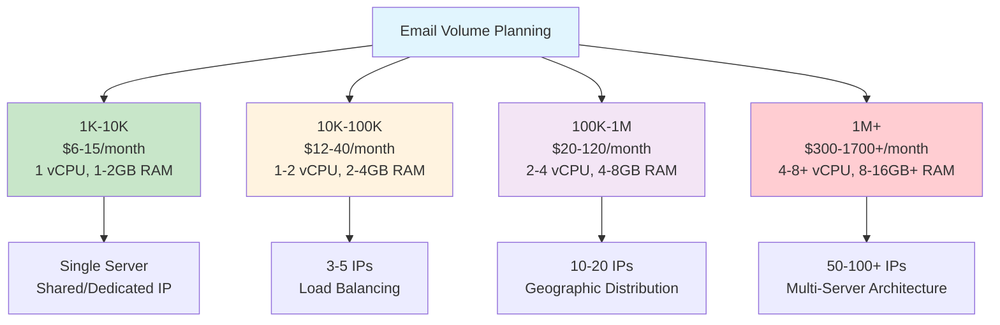
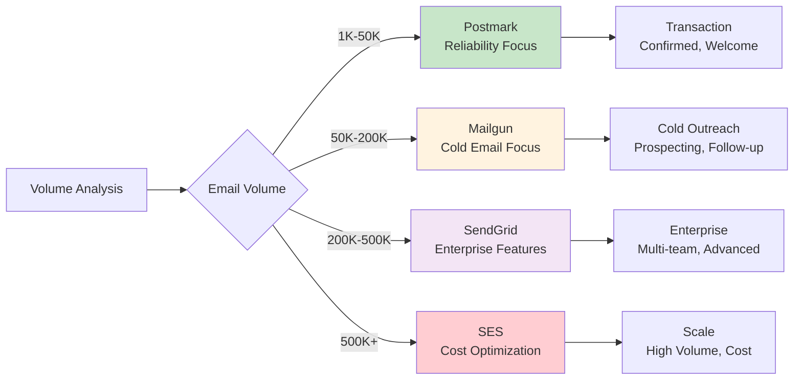

# Infrastructure Overview - Strategic Technical Planning

**For CTOs and Technical Directors**: Strategic infrastructure planning with VPS specifications, ESP selection, and technical architecture decisions

**Strategic Value**: This overview provides essential infrastructure planning guidance, technical architecture decisions, and cost-performance analysis for technical leadership and procurement decisions.

---

## Internal Infrastructure Cost Model (Canonical Overview)

This section provides the high-level, canonical explanation of how PenguinMails models infrastructure costs internally. It is the reference point for Finance, Operations, Product, Sales, and Customer Service when explaining “how infra costs work” without exposing misleading or low-level implementation details.

### 1. Provider Roles

- NileDB (Database & Auth Layer):

  - Used as a shared managed Postgres/auth provider.

  - Billed to PenguinMails at the platform).

  - No reliable per-tenant metering API for precise “database cost per customer”.

  - Therefore:

    - Database spend is treated as shared core infrastructure overhead.

    - We do NOT offer or promise per-tenant database cost tracking sourced from NileDB.

    - Any allocation of DB costs is an internal Finance exercise, not exposed as line-item tenant billing.

- Hostwinds (VPS & Dedicated IP Infrastructure):

  - Primary external provider for VPS instances and dedicated IPs used by PenguinMails.

  - Serves as the concrete basis for internal infra cost approximations:

    - VPS instances → vps_instances.approximate_cost

    - Dedicated SMTP IPs → smtp_ip_addresses.approximate_cost

### 2. Canonical Approximate Cost Rules

These rules define how we approximate costs. They are:

- Internal.

- Configurable by Finance & Operations.

- Designed for directional accuracy, not cent-level billing.

- VPS Instances (vps_instances.approximate_cost):

  - Meaning:

    - Estimated monthly cost in USD for each VPS instance used to run tenant infrastructure (e.g. Mailu SMTP stack).

  - Baseline Profile:

    - Default target plan: Hostwinds Unmanaged Linux VPS 1 CPU / 2 GB / 50 GB / 2 TB at **$9.99/month** as the minimum viable instance for production SMTP workloads.

    - The previously tested ~$4.99 tier is considered insufficient for stable Mailu under real workloads and should not be treated as the planning baseline.

  - Source:

    - Derived from the actual selected Hostwinds plan (and any upgrades), using official pricing (e.g. price list ) normalized to a monthly equivalent.

  - Governance:

    - Set/updated on instance creation, resize/upgrade, or significant configuration change.

    - Periodically reconciled (e.g. monthly) against Hostwinds invoices to detect drift.

  - Usage:

    - Internal unit economics and cost-per-tenant modeling.

    - Detection of tenants whose infra requirements (upgraded plans) materially increase operating costs.

    - Input to pricing and packaging decisions.

    - Not directly surfaced as binding customer invoice items.

- SMTP IP Addresses (smtp_ip_addresses.approximate_cost):

  - Constraint:

    - Hostwinds API does not expose a clean, standalone “price per IP” object.

  - Internal baseline:

    - Use **$4.99/month per dedicated IP** as the standard modeled cost based on observed Hostwinds behavior for dedicated IPs.

  - Implementation:

    - Treat $4.99 as a configurable constant (config table ), owned by Finance & Operations.

    - Permit overrides for:

      - Special contracts or bundled pricing.

      - Future empirical validation or provider pricing changes.

  - Usage:

    - Internal view of IP-related spend and efficiency.

    - Supports deliverability, pool sizing, and allocation decisions.

    - Not exposed as separate, authoritative charges to tenants.

### 3. Scope, Cadence, and Ownership

- Scope:

  - All approximate_cost fields and dependent views:

    - Are for internal PenguinMails use.

    - Power admin-only dashboards and financial analytics.

    - Support:

      - Margin analysis.

      - Pricing decisions.

      - Detection of abnormal infra usage.

- Cadence:

  - Updated:

    - On infra events (create/resize).

    - On a regular billing cycle cadence using Hostwinds invoices.

- Ownership:

  - Finance & Operations:

    - Own the approximation methodology and constants (e.g. IP baseline, mapping from plans to VPS profiles).

  - Engineering:

    - Own implementation of fields, background jobs, and role-restricted visibility.

  - Customer Service / Sales:

    - Use this model for explanations, not for quoting raw infra as invoices.

### 4. Communication Guidelines

To keep messaging consistent and accurate:

- Must NOT claim:

  - “Real-time per-tenant database cost tracking from NileDB.”

  - “Exact infra billing derived from internal approximate_cost fields.”

- Should explain:

  - “PenguinMails uses internal, provider-based cost models (primarily Hostwinds plus shared overhead like NileDB) to ensure sustainable pricing and healthy unit economics.”

  - “Customer-facing invoices are produced by our billing system according to plans and agreements; internal cost models are for our own operations, not direct pass-through metering.”

For SQL-level definitions, implementation details, and governance specifics, refer to:

- [`docs/implementation-technical/database-infrastructure/business-leaders-database-migration-guide`](/docs/implementation-technical/database-infrastructure)

- Hostwinds Unmanaged Linux VPS reference pricing: [https://www.hostwinds.com/vps/unmanaged-linux](https://www.hostwinds.com/vps)

---

## Infrastructure Planning Framework

### Volume-Based Infrastructure Strategy

### VPS Provider Comparison Matrix

| Provider | Entry Level | Mid-Tier | Enterprise | Key Strengths |
|----------|-------------|----------|------------|---------------|
| **DigitalOcean** | $6-12/month | $24-48/month | $96+/month | Simple UI, global DCs, 1-click apps |
| **Vultr** | $10-12/month | $24-48/month | $110+/month | High frequency CPUs, 30+ locations |
| **AWS EC2** | $6-8/month | $30-40/month | $192-336+/month | Enterprise features, global scale |

**Strategic Considerations**:

- **DigitalOcean**: Best for simplicity and ease of use

- **Vultr**: Best for performance and geographic distribution

- **AWS EC2**: Best for enterprise integration and scaling

### Email Volume Capacity Planning

| Volume Tier | Server Specs | IP Requirements | Architecture |
|-------------|--------------|-----------------|--------------|
| **1K-10K/month** | 1 vCPU, 1-2GB RAM, 25-50GB SSD | 1-2 dedicated IPs | Single server |
| **10K-100K/month** | 1-2 vCPUs, 2-4GB RAM, 50-80GB SSD | 3-5 dedicated IPs | Load balanced |
| **100K-1M/month** | 2-4 vCPUs, 4-8GB RAM, 100-160GB SSD | 10-20 dedicated IPs | Multi-server |
| **1M+/month** | 4-8+ vCPUs, 8-16GB+ RAM, 160-320GB+ SSD | 50-100+ IPs | Multi-data center |

---

## ESP Selection and Architecture

### Provider Technical Capabilities

**SendGrid Enterprise Features**:

- **API Rate Limits**: 1,000 requests/hour per API key

- **Email Limits**: 12x contact limit per month (Pro)

- **IP Management**: Automated warmup and rotation

- **Analytics**: Real-time delivery tracking

- **Best For**: Enterprise campaigns with dedicated IP management

**Mailgun Cold Email Optimization**:

- **API Rate Limits**: 2,000 requests/hour per user

- **Email Limits**: 12x contact limit per send (Scale)

- **Cold Email Focus**: Built-in list hygiene and compliance

- **Deliverability**: Real-time inbox placement tracking

- **Best For**: High-volume cold email campaigns

**Postmark Transactional Excellence**:

- **API Rate Limits**: 500 requests/minute per token

- **Reliability**: 99.99% uptime SLA

- **Transaction Focus**: Unlimited transactional email volume

- **Security**: SOC 2 Type II certified

- **Best For**: Transactional emails, confirmations, notifications

**Amazon SES Cost Optimization**:

- **Scaling**: Auto-scaling sending quota

- **Integration**: Full AWS ecosystem support

- **Cost**: Most cost-effective at high volumes

- **Requirements**: Technical expertise required

- **Best For**: High-volume, cost-conscious operations

### Strategic Provider Selection

**Technology Stack Recommendations**:

---

## Technical Architecture Decisions

### Self-Hosted vs Managed ESP Analysis

#### Self-Hosted Infrastructure

**Advantages**:

- **Complete Control**: Full customization and configuration

- **Cost Efficiency**: Lower per-email costs at scale

- **Data Sovereignty**: Complete data ownership and control

- **Custom Integration**: Direct integration with existing systems

**Disadvantages**:

- **Technical Complexity**: Requires significant technical expertise

- **Maintenance Overhead**: Ongoing system administration

- **Reputation Management**: Manual IP reputation monitoring

- **Compliance Burden**: GDPR/CCPA compliance self-implementation

#### Managed ESP Solutions

**Advantages**:

- **Technical Simplicity**: Provider handles infrastructure complexity

- **Built-in Compliance**: GDPR/CCPA tools and processes

- **Expert Support**: Provider technical support and guidance

- **Rapid Deployment**: Quick setup and scaling

**Disadvantages**:

- **Vendor Lock-in**: Difficult migration between providers

- **Per-email Costs**: Higher per-email pricing

- **Limited Customization**: Provider feature constraints

- **Data Sharing**: Data processed by third-party providers

### Architecture Decision Framework

**Choose Self-Hosted When**:

- **Volume**: 500K+ emails)

- **Technical Team**: Strong email infrastructure expertise

- **Customization**: Need specific integrations or workflows

- **Compliance**: Have dedicated compliance and legal resources

**Choose Managed ESP When**:

- **Volume**: Under 500K emails)

- **Technical Team**: Limited email infrastructure expertise

- **Speed to Market**: Need rapid deployment and scaling

- **Compliance**: Want built-in compliance tools and processes

---

## Performance and Cost Optimization

### Performance Benchmarks by Infrastructure

**Email Processing Capacity**:

- **Single Server**: 1,000 emails/minute per CPU core

- **Database**: 500 queries/second per CPU core

- **Memory**: 1GB RAM per 10,000 active email addresses

- **Storage**: 1GB per 1,000 emails stored

**Key Performance Indicators**:

- **Queue Size**: <100 messages for healthy system

- **Processing Rate**: 100+ messages/minute for active systems

- **Delivery Time**: <5 minutes for 95% of messages

- **Bounce Rate**: <1% for well-maintained lists

- **API Response Time**: <1 second for API calls

### Cost-Performance Optimization

**Total Cost of Ownership Analysis**:

| Infrastructure Type | Monthly Cost | Technical Overhead | Compliance Cost | Total TCO |
|-------------------|-------------|-------------------|-----------------|-----------|
| **Self-Hosted VPS** | $20-200 | High (40h) | $500-2,000 | $1,000-3,000 |
| **Managed ESP (Mailgun)** | $300-1,500 | Low (5h) | $200-500 | $500-2,000 |
| **Managed ESP (SendGrid)** | $400-2,000 | Low (5h) | $200-500 | $600-2,500 |
| **AWS SES** | $100-800 | Medium (20h) | $500-1,500 | $800-2,500 |

**Optimization Strategies**:

1. **Hybrid Approach**: Self-hosted for volume, ESP for deliverability

2. **Phased Migration**: Start with ESP, migrate to self-hosted at scale

3. **Multi-Provider Strategy**: Use different providers for different use cases

4. **Performance Monitoring**: Continuous optimization based on metrics

---

## Strategic Recommendations

### Phase 1: Foundation (1-3 months)

1. **Provider Selection**: Choose primary VPS/ESP provider

2. **Basic Setup**: Deploy essential infrastructure components

3. **Authentication**: Implement SPF/DKIM/DMARC

4. **Monitoring**: Deploy basic performance monitoring

### Phase 2: Optimization (3-6 months)

1. **Performance Tuning**: Optimize server and ESP configurations

2. **IP Management**: Implement IP rotation and reputation management

3. **Backup Strategy**: Deploy comprehensive backup and disaster recovery

4. **Compliance**: Complete GDPR/CCPA compliance implementation

### Phase 3: Scale (6-12 months)

1. **Multi-Server**: Deploy load balanced infrastructure

2. **Advanced Monitoring**: Implement comprehensive analytics

3. **Cost Optimization**: Optimize costs based on usage patterns

4. **Disaster Recovery**: Test and validate disaster recovery procedures

---

## Progressive Disclosure Navigation

**For technical implementation:**

- [ESP Technical Analysis](esp-technical-analysis:1) - Detailed ESP specifications

- [Implementation Requirements](implementation-requirements:1) - Technical setup details

**For business context:**

- [Cost Analysis Overview](cost-analysis-overview:1) - Infrastructure cost analysis

- [Performance Overview](performance-overview:1) - Performance impact analysis

**For compliance:**

- [Compliance Overview](compliance-overview:1) - Compliance requirements

- [Compliance Implementation](compliance-implementation:1) - Technical compliance

---

**Keywords**: infrastructure planning, VPS selection, ESP architecture, technical decisions, cost optimization, performance planning

---

*This infrastructure overview is part of the comprehensive Progressive Disclosure Framework for Business Leaders. It provides strategic technical planning guidance for infrastructure decision-making.*
---
