# Visual Enhancement Strategy for Business Leaders

## Executive Summary

This document outlines a comprehensive visual enhancement strategy to improve engagement and reduce cognitive load for busy executives reviewing PenguinMails business documentation.

## Current Issues Identified

### File Size Problems - RESOLVED ✅
- **compliance-framework.md**: ✅ COMPLETED - Partitioned into 4 files (198-269 lines each)
- **performance-benchmarks.md**: ✅ COMPLETED - Partitioned into 3 files (183-228 lines each)
- **compliance-costs.md**: ✅ COMPLETED - Partitioned into 3 files (222-293 lines each)
- **technical-infrastructure.md**: ✅ COMPLETED - Partitioned into 3 files (142-242 lines each)

### User Persona Pain Points
- **Agency Owners (Sarah Chen)**: "Managing IPs and domains across 15 different campaigns is a nightmare" - need quick visual summaries
- **Enterprise Directors (Jennifer Walsh)**: "50K emails per month across 8 different campaigns" - need dashboard-style overviews
- **Startup Founders (Marcus Rodriguez)**: "Can't justify hiring a full-time email admin" - need visual ROI presentations

---

## Mermaid Diagram Strategy

### 1. Progressive Disclosure Flow Charts

#### Level 1: Executive Overview Flow

```mermaid
graph TD
    A[Executive Dashboard] --> B{CFO/VP}
    A --> C{Director/Manager}
    A --> D{Procurement Team}
    
    B --> E[Executive Summary<br/>✅ 15-min read]
    B --> F[ROI Calculator<br/>✅ Interactive]
    
    C --> G[Performance Dashboard<br/>✅ Real-time metrics]
    C --> H[Cost Comparisons<br/>✅ Visual matrix]
    
    D --> I[Procurement Guide<br/>✅ Enterprise ready]
    D --> J[Security Overview<br/>✅ High-level]
    
    style A fill:#e1f5fe
    style E fill:#c8e6c9
    style F fill:#c8e6c9
    style I fill:#c8e6c9
    style J fill:#c8e6c9
```

#### Level 2: Decision Support Flow

### 2. ROI Visualization Diagrams

#### Cost Comparison Waterfall

#### Performance Impact Chain

### 3. Technical Architecture Visualizations

#### Email Infrastructure Overview

#### Implementation Timeline

### 4. Compliance & Security Visualizations

#### Security Framework Map

#### Risk Assessment Matrix

```mermaid
graph TB
    A[Risk Assessment] --> B[High Impact]
    A --> C[Medium Impact]
    A --> D[Low Impact]
    
    A --> E[High Probability]
    A --> F[Medium Probability]
    A --> G[Low Probability]
    
    B --> E --> H[🔴 Critical Risk<br/>IP Blacklisting]
    B --> F --> I[🟡 High Risk<br/>Deliverability Issues]
    C --> E --> J[🟡 High Risk<br/>Compliance Violations]
    C --> F --> K[🟢 Medium Risk<br/>Cost Overruns]
    D --> F --> L[🟢 Low Risk<br/>Minor Delays]
    
    style H fill:#ff5252
    style I fill:#ffb74d
    style J fill:#ffb74d
    style K fill:#4caf50
    style L fill:#4caf50
```

---

## Visual Asset Integration Plan

### From docs/assets/

1. **esp-pricing.png**: Integrate into competitive analysis comparison tables
2. **monthly-cost-comparison.png**: Embed in ROI calculator section
3. **toc-comparison.png**: Use in progressive disclosure navigation

### New Visual Elements Needed

1. **Executive Summary Dashboard**: Visual KPI cards showing key metrics
2. **Provider Selection Tree**: Decision tree for ESP selection
3. **Implementation Roadmap**: Gantt chart with milestones
4. **ROI Comparison Chart**: Bar charts showing cost savings
5. **Compliance Checklist**: Interactive visual checklist

---

## Implementation Priority

### Phase 1: Critical Files (Immediate)
1. **compliance-framework.md** → Split into 4 files of 150-200 lines each
2. **performance-benchmarks.md** → Split into 3 files of 200 lines each
3. Add **security-compliance.md** as executive summary

### Phase 2: Enhancement (Week 2)
1. Add mermaid diagrams to all high/mid-level documents
2. Integrate visual assets from docs/assets/
3. Create quick reference cards

### Phase 3: Optimization (Week 3)
1. Finalize industry-specific business cases
2. Add interactive elements where possible
3. Test with user personas

---

## Success Metrics

### Executive Engagement
- 70% reduction in time-to-decision for CFO/VP review
- 50% increase in procurement guide completion rate
- 60% reduction in follow-up questions for technical details

### Documentation Quality
- All business files under 200 lines (high/mid-level)
- 80% of documents include visual elements
- 100% of oversized files partitioned appropriately

### User Experience
- Improved "quick scan" capability for executives
- Clear visual separation of strategic vs tactical information
- Enhanced progressive disclosure navigation

---

**Next Steps**: Begin partitioning the oversized files while implementing visual enhancements, starting with compliance-framework.md as the highest priority.