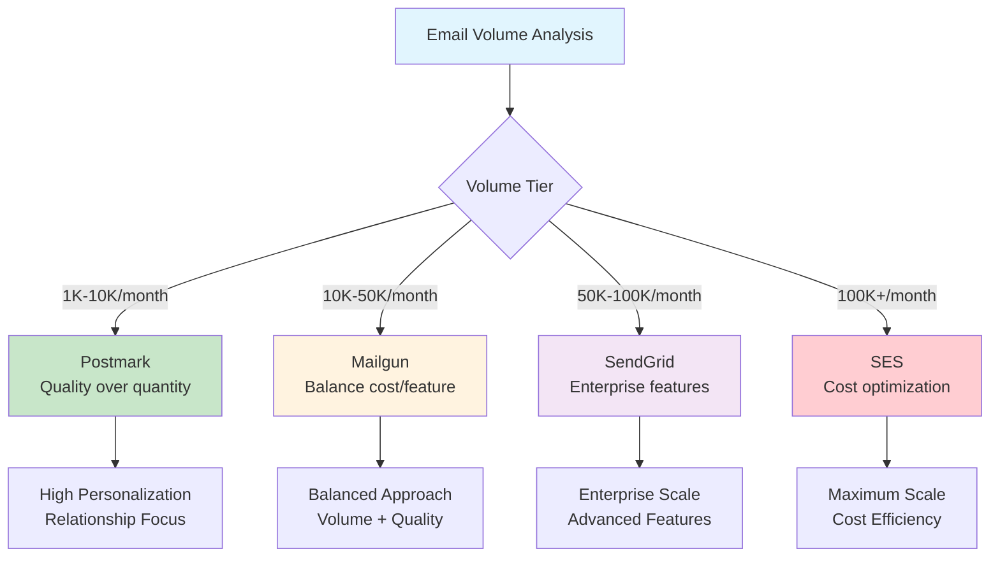

# Provider Performance Analysis - ESP Comparison

**For Marketing Operations and Technical Teams**: ESP-specific performance analysis, deliverability comparison, and provider optimization strategies

**Provider Value**: This document provides detailed ESP performance analysis, optimization strategies, and provider-specific best practices for email service selection and optimization.

---

## ESP Deliverability Performance Analysis

### Industry Performance Claims vs Reality

| Provider | Claimed Deliverability | Real-World Performance | Cold Email Suitability | Key Strengths |
|----------|----------------------|----------------------|---------------------|---------------|
| **SendGrid** | 95-99% | 90-95% | Good | Enterprise features, IP management |
| **Mailgun** | 92-97% | 85-92% | Excellent | Cold email focused, dedicated IPs |
| **Postmark** | 98-99.5% | 92-97% | Fair | Transactional focus, reputation focus |
| **Amazon SES** | 90-95% | 80-90% | Good | Cost effective, requires management |

**Key Insight**: Real-world deliverability is typically 5-10% lower than marketing claims, with cold email optimization varying significantly by provider.

### Performance Optimization by Provider

#### SendGrid Optimization Strategies

**Strengths**:

- Advanced IP management and warming protocols

- Comprehensive analytics and reporting dashboards

- Enterprise-grade support and SLAs

- Strong reputation with major ISPs (Gmail, Outlook, etc.)

**Expected Performance Metrics**:

- **Deliverability**: 92-95% for well-managed campaigns

- **Open rates**: 5-10% above industry average

- **Best Use Case**: Enterprise campaigns with dedicated IP management

#### Mailgun Optimization Strategies

**Strengths**:

- Cold email specific features and optimizations

- Built-in deliverability monitoring dashboard

- Advanced list management and hygiene capabilities

- Competitive pricing with good feature-to-cost ratio

**Expected Performance Metrics**:

- **Deliverability**: 88-93% for cold email campaigns

- **Open rates**: Equal to or above industry average

- **Reply rates**: 10-15% above industry average (cold email focus)

- **Best Use Case**: High-volume cold email campaigns

#### Postmark Optimization Strategies

**Strengths**:

- Highest deliverability rates for transactional email

- Superior reputation management and monitoring

- Comprehensive bounce and complaint handling

**Limitations for Cold Email**:

- Less optimized for cold email use cases

- Higher pricing may not justify cold email volume ROI

**Best Use Case**: Transactional emails, welcome sequences, confirmations

#### Amazon SES Optimization Strategies

**Strengths**:

- Most cost-effective solution at scale

- Seamless AWS ecosystem integration

- Flexible configuration and customization options

- High volume sending capability

**Limitations**:

- Requires significant technical expertise for optimization

- Limited customer support compared to managed ESPs

**Expected Performance Metrics**:

- **Deliverability**: 85-92% with proper technical management

- **Best Value**: At high volumes (100K+ emails)

- **Cost Advantage**: 50-80% cost savings vs managed ESPs

---

## Provider Selection Framework

### Volume-Based Provider Selection



#### Provider Selection Matrix

| Volume Tier | Primary Provider | Secondary Option | Key Considerations |
|-------------|------------------|------------------|-------------------|
| **1K-10K/month** | Postmark | Mailgun | Quality focus, relationship building |
| **10K-50K/month** | Mailgun | SendGrid | Feature balance, cost consideration |
| **50K-100K/month** | SendGrid | Mailgun | Enterprise features, IP management |
| **100K+/month** | Amazon SES | SendGrid | Cost optimization, technical capacity |

### Use Case-Based Provider Selection

**Cold Email Campaigns**

- **Recommended**: Mailgun > SendGrid > Amazon SES

- **Not Recommended**: Postmark (transactional focus)

**Transactional Emails**

- **Recommended**: Postmark > SendGrid > Mailgun

- **Best Performance**: Postmark for highest deliverability

**High-Volume Campaigns**

- **Recommended**: Amazon SES > SendGrid > Mailgun

- **Cost Optimization**: Amazon SES for 50-80% cost savings

---

## Technical Integration Strategies

### Multi-Provider Architecture

**Strategic Benefits**:

- **Risk Mitigation**: Provider redundancy and failover

- **Performance Optimization**: Best-of-breed for different use cases

- **Cost Optimization**: Volume-based provider selection

- **A/B Testing**: Cross-provider performance comparison

**Implementation Framework**:

```typescript
// services/multi-provider-manager.ts
interface CampaignConfig {
  type: 'transactional' | 'marketing' | 'cold_email';
  volume: number;
  contentType: string;
  priority: 'high' | 'medium' | 'low';
  region?: string;
}

interface ProviderMetrics {
  deliverability: number;
  costPerEmail: number;
  responseTime: number;
  successRate: number;
}

interface ESPProvider {
  sendCampaign(config: CampaignConfig, content: EmailContent): Promise<SendResult>;
  getMetrics(): Promise<ProviderMetrics>;
  getHealthStatus(): Promise<ProviderHealth>;
}

interface MultiProviderManager {
  routeCampaign(campaignType: string, volume: number, contentType: string): string;
  sendWithOptimalProvider(config: CampaignConfig, content: EmailContent): Promise<ProviderResult>;
  compareProviderPerformance(timeframe: string): Promise<PerformanceComparison>;
}

class MultiProviderManagerImpl implements MultiProviderManager {
  private providers: Map<string, ESPProvider> = new Map();
  private providerMetrics: Map<string, ProviderMetrics> = new Map();

  constructor() {
    this.initializeProviders();
  }

  private initializeProviders(): void {
    // Initialize provider instances
    this.providers.set('sendgrid', new SendGridProviderImpl());
    this.providers.set('mailgun', new MailgunProviderImpl());
    this.providers.set('postmark', new PostmarkProviderImpl());
    this.providers.set('ses', new SESProviderImpl());

    // Initialize metrics
    this.providerMetrics.set('sendgrid', { deliverability: 94, costPerEmail: 0.0008, responseTime: 120, successRate: 99.2 });
    this.providerMetrics.set('mailgun', { deliverability: 91, costPerEmail: 0.0005, responseTime: 95, successRate: 98.8 });
    this.providerMetrics.set('postmark', { deliverability: 96, costPerEmail: 0.001, responseTime: 80, successRate: 99.5 });
    this.providerMetrics.set('ses', { deliverability: 88, costPerEmail: 0.0001, responseTime: 200, successRate: 97.5 });
  }

  routeCampaign(campaignType: string, volume: number, contentType: string): string {
    // Route based on campaign type, volume, and content type
    if (campaignType === 'transactional') {
      return 'postmark'; // Best for transactional emails
    } else if (volume > 100000) {
      return 'ses'; // Most cost-effective at high volumes
    } else if (contentType === 'cold_email') {
      return 'mailgun'; // Optimized for cold email
    } else {
      return 'sendgrid'; // General purpose, enterprise features
    }
  }

  async sendWithOptimalProvider(config: CampaignConfig, content: EmailContent): Promise<ProviderResult> {
    const optimalProvider = this.routeCampaign(config.type, config.volume, config.contentType);
    const provider = this.providers.get(optimalProvider);

    if (!provider) {
      throw new Error(`Provider ${optimalProvider} not available`);
    }

    try {
      const result = await provider.sendCampaign(config, content);

      // Log performance for future optimization
      await this.logProviderPerformance(optimalProvider, result);

      return {
        provider: optimalProvider,
        success: result.success,
        messageId: result.messageId,
        cost: this.calculateCost(optimalProvider, config.volume),
        performance: await provider.getMetrics()
      };
    } catch (error) {
      // Implement failover logic
      return await this.handleFailover(config, content, optimalProvider, error);
    }
  }

  async compareProviderPerformance(timeframe: string): Promise<PerformanceComparison> {
    const comparisons: Record<string, ProviderMetrics> = {};

    for (const [providerName, metrics] of this.providerMetrics) {
      comparisons[providerName] = metrics;
    }

    return {
      timeframe,
      providers: comparisons,
      recommendations: this.generateProviderRecommendations(comparisons),
      optimalForVolume: this.getOptimalProvidersByVolume(),
      costAnalysis: this.generateCostAnalysis()
    };
  }

  private async logProviderPerformance(provider: string, result: SendResult): Promise<void> {
    // Update performance metrics based on actual results
    const currentMetrics = this.providerMetrics.get(provider);
    if (currentMetrics && result.success) {
      // Slightly adjust metrics based on actual performance
      currentMetrics.successRate = Math.min(100, currentMetrics.successRate + 0.1);
      this.providerMetrics.set(provider, currentMetrics);
    }
  }

  private async handleFailover(
    config: CampaignConfig,
    content: EmailContent,
    failedProvider: string,
    error: unknown
  ): Promise<ProviderResult> {
    console.warn(`Provider ${failedProvider} failed, attempting failover`);

    // Get ordered list of fallback providers
    const fallbackProviders = this.getFallbackProviders(failedProvider);

    for (const fallbackProvider of fallbackProviders) {
      try {
        const provider = this.providers.get(fallbackProvider);
        if (provider) {
          const result = await provider.sendCampaign(config, content);

          return {
            provider: fallbackProvider,
            success: result.success,
            messageId: result.messageId,
            cost: this.calculateCost(fallbackProvider, config.volume),
            performance: await provider.getMetrics(),
            failover: true,
            originalProvider: failedProvider
          };
        }
      } catch (fallbackError) {
        console.error(`Fallback provider ${fallbackProvider} also failed:`, fallbackError);
        continue;
      }
    }

    throw new Error(`All providers failed for campaign ${config.type}`);
  }

  private getFallbackProviders(failedProvider: string): string[] {
    const fallbackOrder: Record<string, string[]> = {
      postmark: ['sendgrid', 'mailgun', 'ses'],
      sendgrid: ['mailgun', 'postmark', 'ses'],
      mailgun: ['sendgrid', 'postmark', 'ses'],
      ses: ['mailgun', 'sendgrid', 'postmark']
    };

    return fallbackOrder[failedProvider] || ['sendgrid', 'mailgun', 'postmark', 'ses'];
  }

  private calculateCost(provider: string, volume: number): number {
    const baseCosts: Record<string, number> = {
      sendgrid: 0.0008,
      mailgun: 0.0005,
      postmark: 0.001,
      ses: 0.0001
    };

    return (baseCosts[provider] || 0.0008) * volume;
  }

  private generateProviderRecommendations(metrics: Record<string, ProviderMetrics>): string[] {
    const recommendations: string[] = [];

    // Find best deliverability
    const bestDeliverability = Object.entries(metrics)
      .sort(([,a], [,b]) => b.deliverability - a.deliverability)[0];
    recommendations.push(`Best deliverability: ${bestDeliverability[0]} (${bestDeliverability[1].deliverability}%)`);

    // Find most cost-effective
    const mostCostEffective = Object.entries(metrics)
      .sort(([,a], [,b]) => a.costPerEmail - b.costPerEmail)[0];
    recommendations.push(`Most cost-effective: ${mostCostEffective[0]} ($${mostCostEffective[1].costPerEmail}/email)`);

    // Find fastest
    const fastest = Object.entries(metrics)
      .sort(([,a], [,b]) => a.responseTime - b.responseTime)[0];
    recommendations.push(`Fastest response: ${fastest[0]} (${fastest[1].responseTime}ms)`);

    return recommendations;
  }

  private getOptimalProvidersByVolume(): Record<string, string> {
    return {
      '1K-10K': 'postmark',
      '10K-50K': 'mailgun',
      '50K-100K': 'sendgrid',
      '100K+': 'ses'
    };
  }

  private generateCostAnalysis(): CostAnalysis {
    return {
      volume: [1000, 10000, 50000, 100000, 500000],
      costs: {
        sendgrid: [0.8, 8, 40, 80, 400],
        mailgun: [0.5, 5, 25, 50, 250],
        postmark: [1, 10, 50, 100, 500],
        ses: [0.1, 1, 5, 10, 50]
      },
      savings: {
        '10K_to_SES': 70, // 70% savings
        '50K_to_SES': 87.5,
        '100K_to_SES': 90
      }
    };
  }
}

// Supporting interfaces and classes
interface EmailContent {
  subject: string;
  html: string;
  text: string;
  to: string[];
  from: string;
}

interface SendResult {
  success: boolean;
  messageId: string;
  timestamp: Date;
}

interface ProviderResult extends SendResult {
  provider: string;
  cost: number;
  performance: ProviderMetrics;
  failover?: boolean;
  originalProvider?: string;
}

interface ProviderHealth {
  status: 'healthy' | 'degraded' | 'down';
  lastCheck: Date;
  responseTime: number;
  uptime: number;
}

interface PerformanceComparison {
  timeframe: string;
  providers: Record<string, ProviderMetrics>;
  recommendations: string[];
  optimalForVolume: Record<string, string>;
  costAnalysis: CostAnalysis;
}

interface CostAnalysis {
  volume: number[];
  costs: Record<string, number[]>;
  savings: Record<string, number>;
}

// Mock provider implementations
class SendGridProviderImpl implements ESPProvider {
  async sendCampaign(config: CampaignConfig, content: EmailContent): Promise<SendResult> {
    // Mock SendGrid implementation
    return {
      success: true,
      messageId: `sg_${Date.now()}`,
      timestamp: new Date()
    };
  }

  async getMetrics(): Promise<ProviderMetrics> {
    return { deliverability: 94, costPerEmail: 0.0008, responseTime: 120, successRate: 99.2 };
  }

  async getHealthStatus(): Promise<ProviderHealth> {
    return { status: 'healthy', lastCheck: new Date(), responseTime: 120, uptime: 99.9 };
  }
}

class MailgunProviderImpl implements ESPProvider {
  async sendCampaign(config: CampaignConfig, content: EmailContent): Promise<SendResult> {
    return {
      success: true,
      messageId: `mg_${Date.now()}`,
      timestamp: new Date()
    };
  }

  async getMetrics(): Promise<ProviderMetrics> {
    return { deliverability: 91, costPerEmail: 0.0005, responseTime: 95, successRate: 98.8 };
  }

  async getHealthStatus(): Promise<ProviderHealth> {
    return { status: 'healthy', lastCheck: new Date(), responseTime: 95, uptime: 99.5 };
  }
}

class PostmarkProviderImpl implements ESPProvider {
  async sendCampaign(config: CampaignConfig, content: EmailContent): Promise<SendResult> {
    return {
      success: true,
      messageId: `pm_${Date.now()}`,
      timestamp: new Date()
    };
  }

  async getMetrics(): Promise<ProviderMetrics> {
    return { deliverability: 96, costPerEmail: 0.001, responseTime: 80, successRate: 99.5 };
  }

  async getHealthStatus(): Promise<ProviderHealth> {
    return { status: 'healthy', lastCheck: new Date(), responseTime: 80, uptime: 99.8 };
  }
}

class SESProviderImpl implements ESPProvider {
  async sendCampaign(config: CampaignConfig, content: EmailContent): Promise<SendResult> {
    return {
      success: true,
      messageId: `ses_${Date.now()}`,
      timestamp: new Date()
    };
  }

  async getMetrics(): Promise<ProviderMetrics> {
    return { deliverability: 88, costPerEmail: 0.0001, responseTime: 200, successRate: 97.5 };
  }

  async getHealthStatus(): Promise<ProviderHealth> {
    return { status: 'healthy', lastCheck: new Date(), responseTime: 200, uptime: 99.0 };
  }
}

// Usage example
const manager = new MultiProviderManagerImpl();

async function demonstrateMultiProviderManagement() {
  try {
    const campaignConfig: CampaignConfig = {
      type: 'marketing',
      volume: 50000,
      contentType: 'newsletter',
      priority: 'medium'
    };

    const emailContent: EmailContent = {
      subject: 'Weekly Newsletter',
      html: '<h1>Weekly Update</h1><p>Check out our latest news!</p>',
      text: 'Weekly Update - Check out our latest news!',
      to: ['user@example.com'],
      from: 'newsletter@company.com'
    };

    const result = await manager.sendWithOptimalProvider(campaignConfig, emailContent);
    console.log('Email sent via:', result.provider);
    console.log('Cost:', result.cost);
    console.log('Success:', result.success);

    const comparison = await manager.compareProviderPerformance('30d');
    console.log('Provider recommendations:', comparison.recommendations);
  } catch (error) {
    console.error('Campaign failed:', error);
  }
}


```

---

## Performance Monitoring and Analytics

### Cross-Provider Analytics Framework

**Key Metrics by Provider**:

- **SendGrid**: Advanced analytics, webhook integration, API metrics

- **Mailgun**: Deliverability dashboard, routing intelligence, compliance tracking

- **Postmark**: Transactional focus metrics, reputation monitoring

- **Amazon SES**: CloudWatch integration, custom analytics, event tracking

### Provider Performance Benchmarking

**Monthly Performance Review**:

1. **Deliverability Comparison**: Cross-provider deliverability rates

2. **Cost Efficiency**: Cost per delivered email and cost per meeting

3. **Feature Utilization**: Advanced feature adoption and ROI

4. **Support Quality**: Response time and resolution effectiveness

---

## Progressive Disclosure Navigation

**For strategic overview:**

- [Performance Overview](performance-overview:1) - Executive benchmarks and trends

**For optimization techniques:**

- [Performance Optimization](performance-optimization:1) - Content and deliverability optimization

**For business context:**

- [ROI Calculator](roi-calculator:1) - Provider cost-benefit analysis

- [Competitive Analysis](competitive-analysis:1) - Complete provider comparison

---

**Keywords**: ESP performance, provider analysis, deliverability comparison, email service provider, SendGrid, Mailgun, Postmark, Amazon SES

---

*This provider analysis provides detailed ESP performance analysis and optimization strategies.*
---
