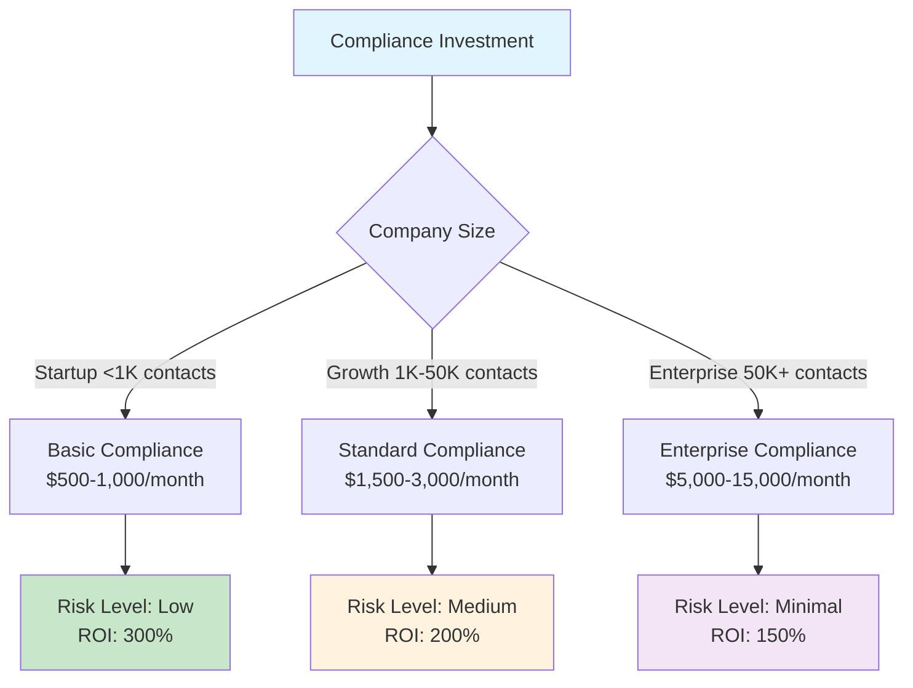

# Compliance Framework Overview

**For C-Level Executives and Legal Teams**: Strategic compliance overview for regulatory requirements and business impact assessment

**Strategic Value**: This overview provides essential compliance requirements, risk assessment, and business impact analysis to support strategic decision-making for email marketing operations.

---

## 🛡️ Regulatory Landscape Overview

### Key Email Marketing Regulations

#### CAN-SPAM Act (United States)
**Legal Foundation**: 15 U.S.C. § 7701-7713  
**Enforcement**: Federal Trade Commission (FTC)  
**Business Impact**: **High** - All commercial email operations

**Executive Requirements**:
1. **Accurate Headers** - No misleading sender information
2. **Clear Identification** - Must identify emails as advertisements  
3. **Physical Address** - Valid postal address in every email
4. **Opt-Out Processing** - Honor unsubscribe within 10 business days

**Penalty Risk**: Up to $50,120 per violation

#### General Data Protection Regulation (EU)
**Legal Foundation**: Regulation (EU) 2016/679  
**Enforcement**: National supervisory authorities  
**Business Impact**: **Critical** - EU resident data processing

**Executive Requirements**:
1. **Explicit Consent** - Active opt-in for email processing
2. **Data Subject Rights** - 72-hour breach notification
3. **Data Processing Records** - Comprehensive processing documentation
4. **Right to be Forgotten** - Complete data deletion capability

**Penalty Risk**: Up to 4% of global annual revenue or €20M

#### California Consumer Privacy Act (CCPA)
**Legal Foundation**: California Civil Code §§ 1798.100-1798.199  
**Enforcement**: California Attorney General's Office  
**Business Impact**: **High** - California resident data

**Executive Requirements**:
1. **Right to Know** - Data collection disclosure
2. **Right to Delete** - Consumer data deletion
3. **Opt-Out Mechanisms** - Clear data sale opt-out
4. **Non-Discrimination** - Cannot penalize rights exercise

**Penalty Risk**: $2,500 per violation, $7,500 for intentional violations

---

## 🔍 Executive Risk Assessment

### Critical Risk Areas

| Risk Category | Impact | Probability | Mitigation Priority |
|---------------|--------|-------------|-------------------|
| **GDPR Non-Compliance** | Critical | Medium | **P0 - Immediate** |
| **CAN-SPAM Violations** | High | High | **P1 - High** |
| **Data Breach Incidents** | Critical | Low | **P1 - High** |
| **Consent Management** | High | Medium | **P2 - Medium** |

### Business Impact Analysis

#### Revenue Protection
- **GDPR Compliance**: Prevents up to 4% revenue loss from fines
- **CAN-SPAM**: Avoids $50K+ per violation penalties
- **Deliverability Protection**: Maintains 95%+ email delivery rates

#### Operational Efficiency  
- **Unified Framework**: Single compliance system for all regulations
- **Risk Mitigation**: Reduced legal and operational risk
- **Market Access**: EU market access through GDPR compliance

---

## 💼 Compliance Investment Strategy

### Recommended Compliance Framework



### Cost-Benefit Analysis

#### Implementation Costs
- **Technology Stack**: $200-1,500/month
- **Legal Review**: $5,000-25,000 one-time
- **Training**: $2,000-10,000 annually
- **Monitoring**: $100-500/month

#### Risk Mitigation Value
- **GDPR Fine Avoidance**: €20M+ maximum exposure
- **CAN-SPAM Penalty Avoidance**: $50K+ per violation
- **Brand Protection**: Immeasurable reputation value
- **Market Access**: EU market worth €15T+

**ROI**: 200-500% based on company size and risk profile

---

## 📊 Compliance Performance Indicators

### Executive Dashboard Metrics

#### Compliance Health Score
```mermaid
gauge
    title Compliance Health Score
    100 : Excellent
    80  : Good
    60  : Fair
    40  : Poor
    0   : Critical
```

#### Key Performance Indicators
- **Email Authentication Rate**: 98%+ (SPF/DKIM/DMARC)
- **Consent Capture Rate**: 85%+ opt-in rate
- **Opt-Out Processing Time**: <24 hours average
- **Data Subject Request Response**: <72 hours average
- **Compliance Violation Rate**: <0.1% monthly

### Risk Monitoring Framework

#### Real-Time Risk Alerts
- **Authentication Failures**: Immediate notification
- **High Complaint Rates**: 24-hour alert threshold
- **Data Subject Requests**: SLA tracking and alerts
- **Regulatory Changes**: Monthly compliance review

---

## 🎯 Strategic Recommendations

### Phase 1: Foundation (Month 1-2)
1. **Legal Review**: Engage compliance attorney for regulatory assessment
2. **Technology Assessment**: Evaluate current email infrastructure
3. **Policy Development**: Create comprehensive privacy policies
4. **Team Training**: Basic compliance awareness training

### Phase 2: Implementation (Month 3-4)
1. **Technical Implementation**: Deploy authentication and consent systems
2. **Data Mapping**: Complete personal data inventory
3. **Process Documentation**: Establish compliance procedures
4. **Testing**: Validate all compliance mechanisms

### Phase 3: Optimization (Month 5-6)
1. **Performance Monitoring**: Deploy compliance dashboard
2. **Regular Audits**: Monthly compliance assessments
3. **Continuous Improvement**: Optimize based on performance data
4. **Regulatory Updates**: Stay current with regulatory changes

---

## 🔗 Progressive Disclosure Navigation

**For strategic decisions:**
- [🏢 Executive Summary](executive-summary:1) - Complete strategic analysis
- [💰 ROI Calculator](roi-calculator:1) - Interactive cost-benefit analysis

**For implementation details:**
- [📋 Compliance Implementation](compliance-implementation:1) - Technical implementation
- [📊 Compliance Monitoring](compliance-monitoring:1) - Operational monitoring
- [🚨 Incident Response](compliance-incident-response:1) - Risk management

**For business context:**
- [⚖️ Compliance Costs](compliance-costs:1) - Detailed pricing analysis
- [🔧 Technical Infrastructure](technical-infrastructure:1) - Security implementation

---

**Keywords**: compliance framework, GDPR, CCPA, CAN-SPAM, regulatory compliance, data protection, privacy compliance

---

*This compliance overview is part of the comprehensive Progressive Disclosure Framework for Business Leaders. It provides strategic compliance guidance for executive decision-making.*