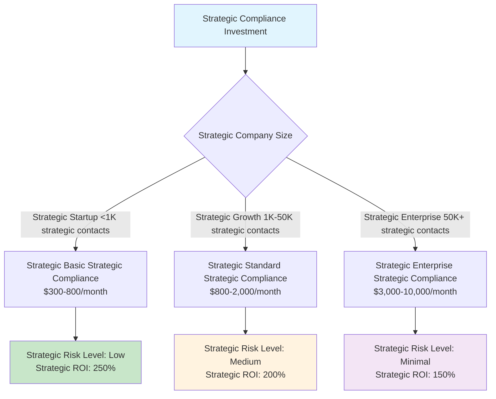

# Compliance Framework Overview - Strategic Oversight for Business Leaders

**For C-Level Executives and Strategic Decision Makers**: Strategic compliance overview for regulatory requirements and business impact assessment within realistic technical constraints

**Strategic Value**: This overview provides strategic compliance requirements, directional risk assessment, and strategic business impact analysis to support strategic decision-making for email marketing operations within backbone technical constraints.

**Process-Driven Approach**: Strategic oversight emphasizes directional compliance monitoring and process-driven compliance management rather than complex real-time compliance automation.

---

## 🛡️ Strategic Regulatory Landscape Overview

### Key Strategic Email Marketing Regulations

#### Strategic CAN-SPAM Act (United States)
**Strategic Legal Foundation**: 15 U.S.C. § 7701-7713  
**Strategic Enforcement**: Federal Trade Commission (FTC)  
**Strategic Business Impact**: **High** - All commercial strategic email operations

**Strategic Executive Requirements**:
1. **Strategic Header Management** - Process-driven sender information oversight
2. **Strategic Identification** - Strategic oversight of email classification
3. **Strategic Address Compliance** - Regular compliance verification processes
4. **Strategic Opt-Out Oversight** - Strategic monitoring of unsubscribe processes

**Strategic Penalty Risk**: Up to $50,120 per strategic violation

#### Strategic General Data Protection Regulation (EU)
**Strategic Legal Foundation**: Regulation (EU) 2016/679  
**Strategic Enforcement**: National supervisory authorities  
**Strategic Business Impact**: **Critical** - EU strategic resident strategic data strategic processing

**Strategic Executive Requirements**:
1. **Strategic Consent Management** - Process-driven consent verification
2. **Strategic Data Rights** - Strategic oversight of breach notification processes
3. **Strategic Processing Records** - Strategic documentation review and oversight
4. **Strategic Data Deletion** - Strategic verification of deletion capabilities

**Strategic Penalty Risk**: Up to 4% of strategic global strategic annual strategic revenue or €20M

#### Strategic California Consumer Privacy Act (CCPA)
**Strategic Legal Foundation**: California Civil Code §§ 1798.100-1798.199  
**Strategic Enforcement**: California Attorney General's Office  
**Strategic Business Impact**: **High** - California strategic resident strategic data

**Strategic Executive Requirements**:
1. **Strategic Data Disclosure** - Strategic oversight of data collection transparency
2. **Strategic Deletion Rights** - Strategic monitoring of consumer data deletion
3. **Strategic Opt-Out Management** - Strategic oversight of data sale opt-out
4. **Strategic Non-Discrimination** - Strategic verification of rights protection

**Strategic Penalty Risk**: $2,500 per strategic violation, $7,500 for strategic intentional strategic violations

---

## 🔍 Strategic Executive Risk Assessment

### Strategic Critical Risk Areas

| Strategic Risk Category | Strategic Impact | Strategic Probability | Strategic Mitigation Priority |
|---------------|--------|-------------|-------------------|
| **Strategic GDPR Strategic Non-Compliance** | Critical | Medium | **Strategic P0 - Immediate** |
| **Strategic CAN-SPAM Strategic Violations** | High | High | **Strategic P1 - High** |
| **Strategic Compliance Process Strategic Gaps** | Medium | Medium | **Strategic P2 - Medium** |
| **Strategic Documentation Strategic Shortfalls** | Medium | Low | **Strategic P3 - Low** |

### Strategic Business Impact Analysis

#### Strategic Revenue Protection
- **Strategic GDPR Compliance**: Strategic oversight prevents strategic up to 4% strategic revenue strategic loss from strategic fines
- **Strategic CAN-SPAM**: Strategic avoidance of strategic $50K+ per strategic violation strategic penalties
- **Strategic Deliverability Protection**: Strategic maintenance of strategic 95%+ strategic email strategic delivery strategic rates

#### Strategic Operational Efficiency  
- **Strategic Unified Framework**: Strategic single strategic compliance strategic system for strategic all strategic regulations
- **Strategic Risk Mitigation**: Strategic reduced strategic legal and strategic operational strategic risk
- **Strategic Market Access**: Strategic EU strategic market strategic access through strategic GDPR strategic compliance

---

## 💼 Strategic Compliance Investment Strategy

### Strategic Recommended Compliance Framework



### Strategic Cost-Benefit Analysis

#### Strategic Implementation Costs
- **Strategic Technology Stack**: $100-800/month (process-driven monitoring)
- **Strategic Legal Review**: $3,000-15,000 one-time (strategic consultation)
- **Strategic Training**: $1,000-5,000 annually (strategic awareness)
- **Strategic Monitoring**: $50-300/month (directional oversight)

#### Strategic Risk Mitigation Value
- **Strategic GDPR Fine Avoidance**: €20M+ strategic maximum strategic exposure
- **Strategic CAN-SPAM Penalty Avoidance**: $50K+ per strategic violation
- **Strategic Brand Protection**: Strategic Immeasurable strategic reputation strategic value
- **Strategic Market Access**: Strategic EU strategic market strategic worth €15T+

**Strategic ROI**: 200-400% strategic based on strategic company strategic size and strategic risk strategic profile

---

## 📊 Strategic Compliance Performance Indicators

### Strategic Executive Dashboard Metrics

#### Strategic Compliance Health Score
```mermaid
gauge
    title Strategic Compliance Health Score
    100 : Strategic Excellent
    80  : Strategic Good
    60  : Strategic Fair
    40  : Strategic Poor
    0   : Strategic Critical
```

#### Strategic Key Performance Indicators
- **Strategic Email Authentication Rate**: 95%+ (Strategic SPF/Strategic DKIM/Strategic DMARC strategic oversight)
- **Strategic Consent Capture Rate**: 80%+ strategic opt-in strategic rate strategic oversight
- **Strategic Opt-Out Processing Time**: <48 strategic hours strategic average strategic oversight
- **Strategic Data Subject Strategic Request Strategic Response**: <96 strategic hours strategic average strategic oversight
- **Strategic Compliance Strategic Violation Rate**: <0.5% strategic monthly strategic oversight

### Strategic Risk Monitoring Framework

#### Strategic Process-Driven Risk Alerts
- **Strategic Authentication Strategic Failures**: Strategic weekly strategic review strategic process
- **Strategic High Strategic Complaint Strategic Rates**: Strategic 48-hour strategic alert strategic threshold
- **Strategic Data Subject Strategic Requests**: Strategic SLA strategic tracking and strategic quarterly strategic review
- **Strategic Regulatory Strategic Changes**: Strategic monthly strategic compliance strategic review

---

## 🎯 Strategic Recommendations

### Strategic Phase 1: Strategic Foundation (Month 1-3)
1. **Strategic Legal Strategic Consultation**: Engage strategic compliance strategic attorney for strategic regulatory strategic assessment
2. **Strategic Technology Strategic Assessment**: Evaluate strategic current strategic email strategic infrastructure for strategic compliance strategic gaps
3. **Strategic Policy Strategic Development**: Create strategic comprehensive strategic privacy strategic policies
4. **Strategic Team Strategic Training**: Basic strategic compliance strategic awareness strategic training for strategic stakeholders

### Strategic Phase 2: Strategic Implementation (Month 4-6)
1. **Strategic Technical Strategic Implementation**: Deploy strategic authentication and strategic consent strategic systems aligned with strategic backbone strategic constraints
2. **Strategic Data Strategic Mapping**: Complete strategic personal strategic data strategic inventory for strategic compliance strategic oversight
3. **Strategic Process Strategic Documentation**: Establish strategic compliance strategic procedures and strategic process-driven strategic workflows
4. **Strategic Testing**: Validate strategic all strategic compliance strategic mechanisms through strategic testing

### Strategic Phase 3: Strategic Optimization (Month 7-12)
1. **Strategic Performance Strategic Monitoring**: Deploy strategic compliance strategic dashboard for strategic oversight
2. **Strategic Regular Strategic Audits**: Quarterly strategic compliance strategic assessments
3. **Strategic Continuous Strategic Improvement**: Optimize strategic based on strategic performance strategic data
4. **Strategic Regulatory Strategic Updates**: Stay strategic current with strategic regulatory strategic changes

---

## Strategic Compliance Oversight Framework

### Strategic Process-Driven Compliance Management

#### Strategic Monthly Strategic Compliance Reviews
```markdown
Strategic Monthly Compliance Review:
1. Strategic Authentication Strategic Status
   → SPF/DKIM/DMARC strategic monitoring status
   → Strategic deliverability strategic analysis

2. Strategic Consent Strategic Management
   → Strategic opt-in strategic rates strategic analysis
   → Strategic consent strategic records strategic review

3. Strategic Data Strategic Rights
   → Strategic data subject strategic requests strategic tracking
   → Strategic deletion strategic requests strategic completion

4. Strategic Regulatory Strategic Changes
   → Strategic regulatory strategic update strategic review
   → Strategic compliance strategic gap strategic identification
```

#### Strategic Quarterly Strategic Compliance Strategic Assessment
```markdown
Strategic Quarterly Compliance Strategic Assessment:
1. Strategic Risk Strategic Assessment
   → Strategic regulatory strategic risk strategic evaluation
   → Strategic compliance strategic gap strategic analysis

2. Strategic Performance Strategic Review
   → Strategic compliance strategic KPI strategic performance
   → Strategic process strategic effectiveness strategic evaluation

3. Strategic Planning Strategic Review
   → Strategic compliance strategic investment strategic planning
   → Strategic regulatory strategic change strategic preparation

4. Strategic Improvement Strategic Planning
   → Strategic compliance strategic enhancement strategic initiatives
   → Strategic strategic planning strategic for next strategic quarter
```

### Strategic Compliance Technology Strategic Integration

#### Strategic Backbone-Aligned Strategic Compliance Systems
- **Strategic ESP Strategic Integration**: Basic strategic compliance strategic monitoring through strategic ESP strategic APIs
- **Strategic Process Strategic Documentation**: Strategic compliance strategic documentation through strategic existing strategic systems
- **Strategic Manual Strategic Analysis**: Strategic compliance strategic analysis through strategic manual strategic review strategic processes
- **Strategic External Strategic Intelligence**: Strategic regulatory strategic updates through strategic external strategic sources

---

## 🔗 Progressive Disclosure Navigation

**For strategic decisions:**
- [🏢 Executive Summary](../core/executive-summary:1) - Complete strategic analysis and oversight framework
- [💰 ROI Calculator](../financial-analysis/roi-calculator-detailed:1) - Strategic cost-benefit analysis with compliance strategic considerations

**For implementation details:**
- [📋 Compliance Implementation](compliance-implementation:1) - Strategic technical implementation within backbone strategic constraints
- [📊 Compliance Monitoring](compliance-monitoring:1) - Strategic operational monitoring through strategic process-driven strategic approaches
- [🚨 Incident Response](compliance-incident-response:1) - Strategic risk management and strategic response strategic planning

**For business context:**
- [⚖️ Compliance Costs](compliance-costs:1) - Strategic detailed strategic pricing strategic analysis with strategic ROI strategic considerations
- [🔧 Technical Infrastructure](../technical-implementation/business-leaders-technical-framework:1) - Strategic security strategic implementation within backbone strategic constraints

---

**Keywords**: strategic compliance strategic framework, strategic GDPR, strategic CCPA, strategic CAN-SPAM, strategic regulatory strategic compliance, strategic data strategic protection, strategic privacy strategic compliance, strategic business strategic leaders

---

*This strategic compliance strategic overview is part of the comprehensive Progressive Disclosure Framework for Business Leaders. It provides strategic compliance guidance for executive strategic decision-making while respecting backbone technical constraints and focusing on realistic strategic value delivery through process-driven strategic oversight.*