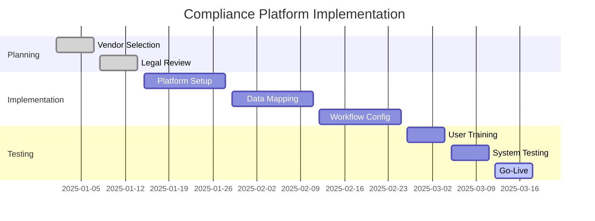

# Compliance Tool Pricing - Platform Comparison

**For Operations Teams and Procurement Managers**: Detailed compliance platform pricing, feature comparison, and vendor selection framework

**Platform Value**: This document provides comprehensive compliance platform analysis, detailed pricing structures, and vendor selection criteria for procurement decisions.

---

## Core Privacy & Compliance Platforms

### Enterprise Privacy Management Solutions

#### OneTrust – Enterprise Privacy Management

**SME Entry Level**:

- **Consent & Preference Essentials**: $827–$1,125/month

- **CCPA Module**: $827–$1,125/month

- **Features**: Basic GDPR workflows, consent management

**SME Mid-Tier**:

- **Full GDPR Compliance Bundle**: $2,275)

- **Privacy Essentials Suite**: $3,680/month

- **Features**: Complete GDPR toolkit, privacy rights automation

**Mid-Market**:

- **Typical Pricing**: $10,000–$20,000/month

- **Scales with**: Domains, users, module selection

- **Custom enterprise agreements** available

**Email-Specific Add-ons**:

- Privacy Rights Automation: $275/month

- Cookie Consent: $300/month

- Data Mapping Automation: $275/month

**Key Assessment**: Custom-quoted enterprise platform; no transparent pricing online; 14-day free trial; per-domain billing; steep learning curve; best for organizations processing payment cards or managing complex multi-region compliance

#### TrustArc – Privacy Risk & Compliance Management

**SME Entry Level**:

- **Entry-level modules**: $100–$400/month

- **Basic GDPR tools**: Limited features

**SME Mid-Tier**:

- **Typical pricing**: $1,800–$3,000/month

- **Features**: Data mapping, DPIA assessments, vendor management

**Mid-Market**:

- **Average cost**: $22,000/year (~$1,833)

- **Range**: $10,000–$137,000)

**Email-Specific Features**:

- Data mapping and flow visualization

- DPIA/privacy impact assessments

- Vendor risk management

- Consent management

**Key Assessment**: Custom pricing; strong for detailed data flow visualization; complex user experience; integrates with HubSpot, Salesforce; best for enterprises needing comprehensive data mapping

#### Osano – Lightweight GDPR/CCPA Compliance

**SME Entry Level**:

- **Free tier**: Available (limited features)

- **Business/Plus tiers**: $119.99–$199/month

- **Features**: Basic GDPR/CCPA workflows

**SME Mid-Tier**:

- **Pricing**: $200–$500)

- **Features**: DPA management, privacy policy generation, consent forms, vendor tracking

**Mid-Market**:

- **Custom pricing**: Scales with traffic volume

- **Email integrations**: HubSpot, Salesforce, Microsoft Dynamics

**Key Assessment**: Most affordable paid option; free plan suitable for startups; cloud-based, easy setup; best for cost-conscious SMBs

### Platform Evaluation Matrix

| Criteria | Weight | OneTrust | TrustArc | Osano | Enzuzo |
|----------|--------|----------|----------|-------|--------|
| **Cost** | 25% | 2/10 | 3/10 | 8/10 | 9/10 |
| **Ease of Use** | 20% | 6/10 | 7/10 | 9/10 | 8/10 |
| **Feature Completeness** | 20% | 10/10 | 8/10 | 6/10 | 5/10 |
| **Email Integration** | 15% | 8/10 | 9/10 | 8/10 | 7/10 |
| **Scalability** | 10% | 10/10 | 9/10 | 6/10 | 5/10 |
| **Support Quality** | 10% | 7/10 | 8/10 | 7/10 | 6/10 |
| **Total Score** | 100% | 6.8/10 | 7.2/10 | 7.8/10 | 7.5/10 |

### Website-Focused Consent Management

#### Cookiebot CMP – Website-Focused Consent Management

**SME Entry Level**:

- **Basic tier**: €7–€12)

- **Features**: Basic consent management, limited pages

**SME Mid-Tier**:

- **Professional tier**: €49–€200)

- **Features**: 50–350+ subpages, advanced consent options

**Mid-Market**:

- **Enterprise agreements**: $500+/month custom

- **Features**: White-labeling, multi-domain management

**Email-Specific Features**:

- Automated cookie scanning and blocking

- Customizable consent banners

- GDPR/CCPA/LGPD compliance workflows

**Key Assessment**: Usage-based (pageviews); per-domain billing; 14-day free trial; best for multi-website publishers

#### Enzuzo – Affordable Alternative Privacy Suite

**SME Entry Level**:

- **Basic tier**: $39–$99/month

- **Features**: Privacy policy builder, basic GDPR tools

**SME Mid-Tier**:

- **Mid-tier**: $200–$500/month

- **Features**: Policy updates, vendor tracking

**Mid-Market**:

- **Custom pricing**: Scales with traffic volume

- **Email integrations**: Major platforms supported

**Key Assessment**: 68–90% cheaper than OneTrust; integrations with major platforms; good entry point for SMBs; less robust than enterprise competitors

---

## Vendor Selection Framework

### Selection Recommendations by Use Case

**Enterprise/High-Risk Operations**:

- **Primary**: TrustArc or OneTrust (comprehensive features)

- **Rationale**: Complete feature set, enterprise support, audit readiness

- **Investment**: $10,000–$50,000+ annually

**Mid-Market/Balanced Requirements**:

- **Primary**: Osano Business (best value proposition)

- **Rationale**: Good feature set, reasonable cost, strong integrations

- **Investment**: $2,400–$6,000 annually

**Small Business/Cost-Conscious**:

- **Primary**: Enzuzo or Osano Free

- **Rationale**: Essential features at minimal cost

- **Investment**: $468–$2,400 annually

**Email-Heavy Operations**:

- **Primary**: TrustArc (strong HubSpot integration)

- **Rationale**: Email platform integration, marketing focus

- **Investment**: $3,000–$15,000 annually

### Implementation Timeline and Costs

---

## Total Cost of Ownership Analysis

### Hidden Costs and Considerations

**Implementation Costs**:

- **Setup and configuration**: $5,000–$25,000 (one-time)

- **Data migration**: $2,000–$10,000 (one-time)

- **Training**: $1,000–$5,000 (annually)

- **Integration development**: $5,000–$20,000 (one-time)

**Ongoing Operational Costs**:

- **Platform licensing**: As listed above

- **User licenses**: Additional $50–$200/user/month

- **Support and maintenance**: 15–25% of license cost annually

- **Regulatory updates**: $2,000–$10,000 annually

### Cost Optimization Strategies

1. **Bundle vendor relationships**: 20-30% savings through integrated platforms

2. **Phase implementation**: Spread costs across 12-18 months

3. **Self-service configuration**: Reduce implementation consulting

4. **Volume discounts**: Negotiate based on organization size

5. **Multi-year contracts**: 10-20% discount for 2-3 year commitments

---

## Progressive Disclosure Navigation

**For strategic overview:**

- [Cost Analysis Overview](cost-analysis-overview:1) - Strategic investment analysis

**For implementation details:**

- [Implementation Management](cost-implementation:1) - Implementation and ongoing costs

**For business context:**

- [Executive Summary](executive-summary:1) - Complete strategic analysis

- [ROI Calculator](roi-calculator:1) - Platform cost-benefit analysis

---

**Keywords**: compliance platform pricing, privacy management tools, GDPR platform costs, compliance vendor selection, platform comparison

---

*This platform pricing guide is part of the comprehensive Progressive Disclosure Framework for Business Leaders. It provides detailed compliance platform analysis and vendor selection guidance.*
---
