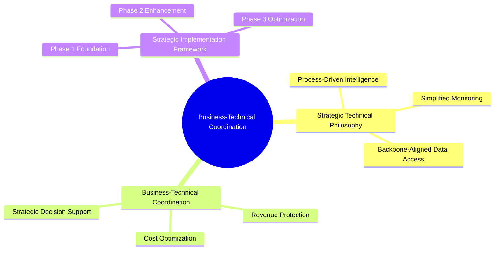

# Business Leaders Technical Framework: Strategic Coordination Guide

## Overview

This document provides practical guidance for business leaders on coordinating technical implementation with realistic backbone constraints, emphasizing process-driven strategic oversight rather than complex real-time automation.

**Document Level:** Level 2 - Strategic Coordination
**Target Audience:** Business Leaders, Executive Stakeholders, Technical Project Managers
**Business Impact Priority:** Strategic - Process-driven decision support with realistic constraints

---

## Strategic Technical Coordination Visual



## Part I: Strategic Technical Alignment

### 1. Realistic Technical Capabilities for Business Leaders

**Primary Strategic Challenge:** Business leaders need meaningful oversight and directional insights within technical constraints, focusing on strategic decision support rather than real-time operational management.

**Strategic Technical Solution:** Process-driven intelligence using backbone-aligned data access with directional analytics and simple monitoring systems.

**Strategic Rationale:**

- **Realistic Expectations**: Directional insights vs. real-time precision

- **Process-Driven Approach**: Manual analysis and reporting vs. automated decision making

- **Backbone Alignment**: Uses available API surfaces and data sources

- **Strategic Value**: Focus on strategic oversight and decision support

### 2. Business-Technical Coordination Framework

| Business Need | Strategic Impact | Technical Reality | Coordination Approach |
|---------------|------------------|-------------------|----------------------|
| **Revenue Protection** | High | Directional indicators | Process-driven alerts via queue/notification systems |
| **Cost Optimization** | Medium | Approximate signals | Manual cost tracking with ESP billing integration |
| **Strategic Planning** | High | External intelligence | Process-driven competitive analysis |
| **Operational Oversight** | Medium | Backbone monitoring | Existing system health endpoints |

### 3. Strategic Technical Philosophy

#### 3.1 Process-Driven Intelligence Strategy

**Strategic Decision:** Use process-driven analysis with backbone data access for cost efficiency and realistic implementation

**Strategic Rationale:**

- **Strategic Insights**: Business leaders need directional analysis for strategic decision making

- **Cost Efficiency**: Process-driven approach avoids over-engineering and high infrastructure costs

- **Implementation Reality**: Aligns with available technical capabilities and team resources

- **Strategic Value**: Focus on meaningful insights rather than complex real-time automation

**Strategic Benefits:**

- **Budget Efficiency**: Lower infrastructure costs through process-driven approach

- **Implementation Speed**: Faster deployment using existing backbone systems

- **Strategic Clarity**: Clear separation between tactical operations and strategic oversight

#### 3.2 Simplified Strategic Monitoring

**Strategic Decision:** Focus on strategic oversight through simple monitoring and directional analytics

**Strategic Rationale:**

- **Risk Management**: Avoid over-promising complex real-time capabilities

- **Practical Implementation**: Use existing monitoring and notification systems

- **Strategic Focus**: Emphasize directional insights for strategic decision making

- **Cost Control**: Leverage backbone monitoring rather than custom systems

**Strategic Monitoring Categories:**

```markdown
Revenue Protection Monitoring:


- Directional deliverability indicators through ESP monitoring


- Approximate cost signals from billing data


- Process-driven trend analysis

Cost Optimization Monitoring:


- Budget tracking through manual and automated cost monitoring


- Vendor performance assessment through service level indicators


- Strategic procurement oversight

Strategic Decision Support:


- Competitive intelligence through external data sources


- Investment tracking through process-driven analysis


- Strategic planning support through directional analytics


```

#### 3.3 Backbone-Aligned Data Access

**Strategic Decision:** Use available API surfaces and data sources for strategic intelligence

**Strategic Data Sources:**

- **ESP Billing APIs**: For approximate cost signals and service performance

- **Backbone Monitoring**: For system health and operational indicators

- **External Intelligence**: For competitive analysis and market data

- **Process Documentation**: For strategic planning and decision tracking

**Strategic Data Access Principles:**

- Use available backbone API surfaces

- Avoid complex data aggregation systems

- Focus on directional insights from existing data

- Emphasize strategic pattern recognition over real-time precision

---

## Part II: Strategic Implementation Coordination

### 4. Process-Driven Strategic Implementation

#### 4.1 Revenue Protection Coordination

**Strategic Requirement:** Directional insights for revenue protection without complex real-time monitoring

**Technical Implementation Approach:**

- **ESP Integration**: Use existing ESP monitoring APIs for deliverability signals

- **Billing Correlation**: Link deliverability issues to approximate revenue impact

- **Process Workflows**: Implement manual review and response processes

- **Strategic Reporting**: Generate monthly reports on revenue protection status

**Strategic Coordination Process:**

```markdown
Monthly Revenue Protection Review:


1. ESP deliverability reports → Directional risk indicators


2. Billing data analysis → Approximate revenue impact assessment


3. Process-driven investigation → Strategic response planning


4. Executive reporting → Strategic decision support


```

#### 4.2 Cost Optimization Coordination

**Strategic Requirement:** Budget tracking and cost optimization through process-driven analysis

**Technical Implementation Approach:**

- **ESP Billing Integration**: Monthly cost tracking and variance analysis

- **Resource Monitoring**: Approximate utilization signals from backbone systems

- **Vendor Performance**: Service level tracking and relationship management

- **Strategic Procurement**: Process-driven vendor evaluation and optimization

**Strategic Coordination Framework:**

```markdown
Quarterly Cost Optimization Review:


1. ESP billing analysis → Cost trend identification


2. Resource utilization review → Optimization opportunity assessment


3. Vendor performance evaluation → Strategic procurement insights


4. Strategic investment planning → Budget optimization recommendations


```

#### 4.3 Strategic Decision Support Coordination

**Strategic Requirement:** Enhanced strategic planning and decision-making support

**Technical Implementation Approach:**

- **External Intelligence**: Competitive analysis and market positioning data

- **Investment Tracking**: Process-driven ROI analysis and performance monitoring

- **Strategic Planning**: Resource allocation support and risk assessment

- **Executive Reporting**: Strategic insights and decision framework

**Strategic Support Framework:**

```markdown
Strategic Planning Cycle:


1. External intelligence gathering → Competitive positioning insights


2. Investment performance analysis → Strategic ROI tracking


3. Risk assessment and planning → Strategic decision framework


4. Executive planning sessions → Strategic roadmap development


```

### 5. Strategic Intelligence Service Implementation

#### 5.1 Process-Driven Executive Intelligence

**Strategic Service Framework:**

```typescript
interface StrategicExecutiveService {
  // Revenue protection intelligence
  generateRevenueProtectionReport(tenantId: string, timeframe: string): Promise<RevenueProtectionReport>;

  // Cost optimization intelligence
  generateCostOptimizationReport(tenantId: string, timeframe: string): Promise<CostOptimizationReport>;

  // Strategic planning support
  generateStrategicPlanningReport(tenantId: string, timeframe: string): Promise<StrategicPlanningReport>;
}

interface RevenueProtectionReport {
  directionalRiskIndicators: DirectionalRiskIndicator[];
  approximateRevenueImpact: number;
  strategicRecommendations: string[];
  processFollowUp: string[];
}


```

#### 5.2 Strategic Monitoring Implementation

**Business Event Framework (Simplified):**

```typescript
// Strategic business events for business leaders
interface StrategicBusinessEvents {
  // Process-driven revenue protection
  trackRevenueProtectionAlert(tenantId: string, alert: RevenueProtectionAlert): void;

  // Process-driven cost optimization
  trackCostOptimizationOpportunity(tenantId: string, opportunity: CostOptimizationOpportunity): void;

  // Strategic decision support
  trackStrategicDecision(tenantId: string, decision: StrategicDecision): void;
}

interface RevenueProtectionAlert {
  type: 'deliverability_trend' | 'cost_risk' | 'customer_impact';
  severity: 'low' | 'medium' | 'high';
  directionalInsight: string;
  recommendedAction: string;
  followUpRequired: boolean;
}


```

---

## Part III: Strategic Business Impact & Coordination

### 6. Strategic Implementation Framework

#### 6.1 Business Leader Coordination Process

**Strategic Implementation Phases:**

## Phase 1: Foundation (Months 1-

- Establish basic monitoring and reporting processes

- Integrate with existing ESP and backbone systems

- Create strategic oversight workflows

- Develop executive reporting templates

## Phase 2: Enhancement (Months 3

- Enhance strategic analysis capabilities

- Implement competitive intelligence gathering

- Develop strategic planning support tools

- Create strategic decision tracking framework

## Phase 3: Optimization (Months

- Optimize strategic processes and workflows

- Enhance strategic intelligence capabilities

- Develop strategic performance measurement

- Create strategic planning enhancement cycles

#### 6.2 Strategic Success Framework

**Strategic KPI Coordination:**

| Strategic Metric | Target Range | Coordination Method | Strategic Impact |
|-----------------|--------------|-------------------|------------------|
| **Revenue Protection Effectiveness** | 80-90% directional accuracy | Process-driven analysis | Strategic risk mitigation |
| **Cost Optimization ROI** | 150-300% | Budget tracking and vendor management | Strategic cost control |
| **Strategic Decision Speed** | <1 week | Process-driven strategic analysis | Enhanced strategic agility |
| **Executive Satisfaction** | 85-95% | Strategic value delivery | Strategic alignment |

### 7. Strategic Implementation Case

#### 7.1 Strategic Investment Rationale

**Strategic Investment Required:**

- **Coordination**: 4-6 weeks (business-technical alignment)

- **Process Implementation**: 2-3 weeks setup + ongoing manual processes

- **Strategic Training**: 1 week for business teams

- **Total Strategic Investment**: $25K-40K setup + $3K-5K/month operational

**Strategic Returns:**

- **Strategic Insight Value**: Enhanced decision-making capability ($50K-100K annually)

- **Cost Optimization**: Process-driven cost monitoring and vendor optimization ($30K-60K annually)

- **Risk Mitigation**: Strategic risk identification and mitigation ($25K-50K annually)

- **Strategic Planning**: Enhanced long-term strategic planning capability ($40K-80K annually)

**Strategic Payback Period**: 6-9 months

#### 7.2 Strategic Risk Management

**Strategic Risks Addressed:**

1. **Strategic Blind Spots**: Process-driven oversight prevents strategic surprises

2. **Cost Inefficiency**: Strategic monitoring enables proactive cost optimization

3. **Competitive Disadvantage**: Strategic intelligence improves market positioning

4. **Strategic Drift**: Regular strategic review prevents misalignment with business objectives

---

## Progressive Disclosure Navigation

### Level 1: Strategic Overview

- [Executive Summary](/docs/business/core) - Strategic oversight framework for business leaders

- [Success Metrics](/docs/business/implementation) - Realistic KPIs for strategic oversight

### Level 2: Strategic Analysis

- [Strategic Implementation Guide](/docs/business/implementation) - Realistic strategic implementation

- [Financial Analysis](/docs/business/financial-analysis) - Strategic financial benchmarks

### Level 3: Technical Coordination

- [Executive API Overview](/docs/implementation-technical/api) - Realistic data access capabilities

- [PostHog Business Events](/docs/implementation-technical/analytics-integration) - Simplified event tracking

---

**Document Classification:** Level 2 - Strategic Business Coordination
**Business Stakeholder Access:** C-Suite, VPs, Strategic Planning Directors, Operations Leaders
**Technical Stakeholder Access:** Technical Project Managers, Strategic Technology Directors, Implementation Coordinators

This strategic framework provides practical guidance for business leaders to coordinate technical implementation while respecting backbone constraints and focusing on strategic value delivery through process-driven oversight and directional insights
---
