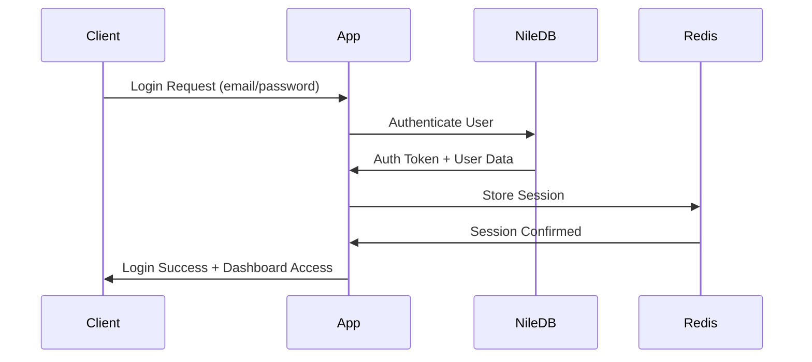
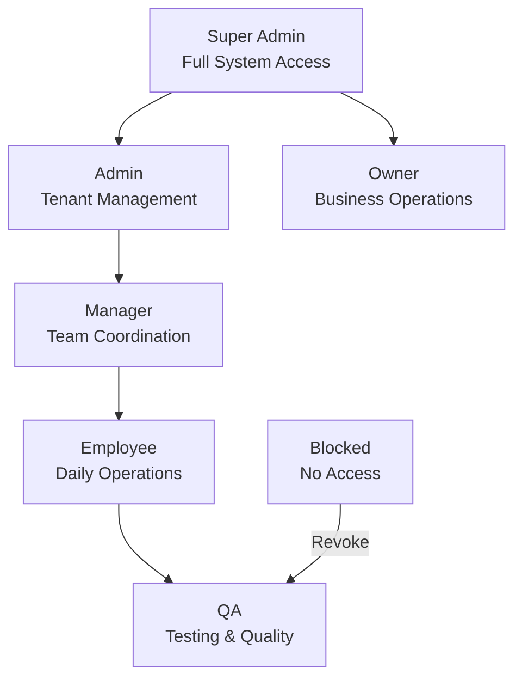
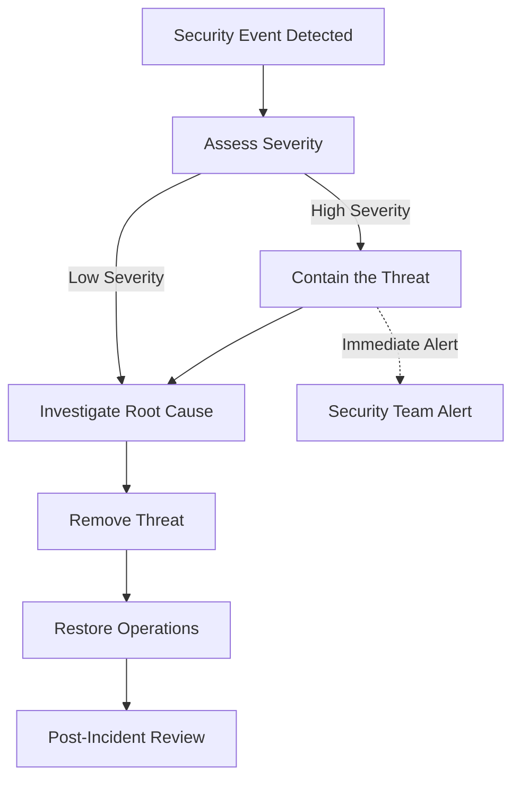

# Enterprise Security Framework

---

## **Strategic Alignment**

**Strategic Alignment**: This security framework supports our enterprise compliance strategy by providing regulatory compliance and risk mitigation across all system components, establishing market leadership through comprehensive security architecture and advanced threat protection systems.

**Technical Authority**: Our security infrastructure integrates with comprehensive monitoring systems featuring real-time threat detection, automated compliance reporting, and enterprise-grade encryption, positioning us as a technical authority in multi-tenant email infrastructure security.

**Operational Excellence**: Backed by enterprise security platforms with 99.9% security uptime, advanced threat monitoring, and automated incident response, ensuring reliable and secure service delivery across all operational domains.

**User Journey Integration**: This security feature is part of your complete compliance and data protection experience - connects to user authentication workflows, data management processes, and privacy controls throughout the entire user lifecycle.

---

## Overview

This document outlines the security practices and protocols for the PenguinMails multi-tenant SaaS platform. While we leverage NileDB's authentication services, we maintain comprehensive security practices across all system components.

### Security Philosophy
- **Defense in Depth**: Multiple layers of security controls
- **Zero Trust**: Verify every access request regardless of origin
- **Principle of Least Privilege**: Minimum necessary access for all users
- **Security by Design**: Security considerations in all development phases

---

## Authentication & Authorization

### NileDB Authentication Integration

#### Authentication Flow


#### Security Features
- **Managed Authentication**: NileDB handles core authentication (users table)
- **Session Management**: Fully handled by NileDB authentication system
- **Email Verification**: ✅ IMPLEMENTED using Loop service + custom verification endpoint
- **Password Reset**: Planned alongside email verification
- **Multi-Factor Authentication**: Not implemented (planned under feature flag)
- **Password Policies**: Configurable through tenant_policies table (not enforced)
- **Account Lockout**: Not implemented - relies on password reset flow
- **Failed Login Tracking**: No tracking implemented - users contact support

#### Implementation Example
```javascript
// Authentication middleware
const authenticateUser = async (req, res, next) => {
  try {
    const token = req.headers.authorization?.replace('Bearer ', '');
    
    if (!token) {
      return res.status(401).json({ error: 'No token provided' });
    }
    
    // Verify with NileDB
    const user = await nileDB.auth.verifyToken(token);
    
    if (!user) {
      return res.status(401).json({ error: 'Invalid token' });
    }
    
    // Check tenant access
    const tenantAccess = await checkTenantAccess(user.id, req.params.tenantId);
    
    if (!tenantAccess) {
      return res.status(403).json({ error: 'Access denied' });
    }
    
    req.user = user;
    req.tenant = tenantAccess;
    next();
    
  } catch (error) {
    logger.error('Authentication error:', error);
    res.status(401).json({ error: 'Authentication failed' });
  }
};
```

### Role-Based Access Control (RBAC)

#### Permission Matrix
Our 7-tier permission system provides granular access control:



#### Permission Levels Detail

| Role | User Management | Billing | Email Config | Data Export | System Settings |
|------|----------------|---------|--------------|-------------|-----------------|
| **Super Admin** | Full | Full | Full | Full | Full |
| **Admin** | Tenant Users | Plans | Full | Full | Limited |
| **Owner** | Team Members | Payment History | Email Setup | Data Download | None |
| **Manager** | View Users | Usage Stats | Email Templates | Campaign Reports | None |
| **Employee** | Own Profile | None | Send Emails | Own Data | None |
| **QA** | None | None | Test Config | Test Data | None |
| **Blocked** | None | None | None | None | None |

#### Implementation
```javascript
// Permission checking middleware
const checkPermission = (requiredPermission) => {
  return async (req, res, next) => {
    try {
      const userRole = req.user.role;
      const tenantId = req.tenant.id;
      
      // Check if user has required permission for tenant
      const hasPermission = await nileDB.permissions.check({
        userId: req.user.id,
        tenantId: tenantId,
        permission: requiredPermission,
        role: userRole
      });
      
      if (!hasPermission) {
        return res.status(403).json({ 
          error: 'Insufficient permissions' 
        });
      }
      
      next();
    } catch (error) {
      logger.error('Permission check error:', error);
      res.status(500).json({ error: 'Permission verification failed' });
    }
  };
};

// Usage in routes
app.get('/api/tenant/:tenantId/users', 
  authenticateUser,
  checkPermission('user_management'),
  getUsers
);
```

## Row Level Security (RLS) Policies

### Complete RLS Policy Matrix
*For comprehensive RLS policy documentation and implementation details, see [Security & Compliance Gaps Analysis](../../temp_old_docs/security_compliance_gaps_analysis.md)*

**Current Implementation:**
- **Q83**: Basic RLS example exists with NileDB tenant isolation enforcement
- **Q84**: Staff bypass via super admin/admin privileges or internal dev tickets  
- **Q85**: Cross-tenant access policies for staff need documentation (immediate action required)
- **Q86**: RLS testing procedures planned as part of feature implementation

### Staff Emergency Access Protocols

#### Current Bypass Methods
1. **Super Admin/Admin Privileges**
   - Users with super_admin or admin roles can access tenant data
   - All actions are logged for audit purposes
   - No additional approval required beyond role assignment

2. **Internal Dev Ticket Process**
   - Staff can create internal tickets for temporary access
   - Dev team creates time-limited access for specific tasks
   - Full audit trail maintained for all temporary access

#### Documentation Requirements (Q4 2025)
- [ ] Formalize staff bypass procedures
- [ ] Document cross-tenant access validation framework  
- [ ] Create RLS testing procedures as part of feature rollout

---

## Data Security

### Multi-Tenant Data Isolation

#### Database Security
```sql
-- Row Level Security Example
ALTER TABLE tenant_data ENABLE ROW LEVEL SECURITY;

CREATE POLICY tenant_isolation ON tenant_data
  USING (tenant_id = current_setting('app.current_tenant_id')::bigint);

-- Session-based tenant context
SET app.current_tenant_id = '12345';
```

#### API Security
```javascript
// Tenant context middleware
const setTenantContext = async (req, res, next) => {
  try {
    const tenantId = req.params.tenantId || req.user.default_tenant_id;
    
    // Verify user has access to this tenant
    const hasAccess = await nileDB.tenants.verifyAccess({
      userId: req.user.id,
      tenantId: tenantId
    });
    
    if (!hasAccess) {
      return res.status(403).json({ error: 'Tenant access denied' });
    }
    
    // Set tenant context for database queries
    await nileDB.query('SET app.current_tenant_id = $1', [tenantId]);
    
    req.tenantId = tenantId;
    next();
  } catch (error) {
    logger.error('Tenant context error:', error);
    res.status(500).json({ error: 'Failed to set tenant context' });
  }
};
```

### Data Encryption

#### Encryption at Rest
- **Database**: PostgreSQL TDE (Transparent Data Encryption)
- **File Storage**: Encrypted backups and log files
- **Configuration**: Encrypted environment variables

#### Encryption in Transit
```javascript
// HTTPS enforcement
const enforceHTTPS = (req, res, next) => {
  if (req.headers['x-forwarded-proto'] !== 'https') {
    const secureUrl = `https://${req.headers.host}${req.url}`;
    return res.redirect(301, secureUrl);
  }
  next();
};

// API security headers
app.use(helmet({
  contentSecurityPolicy: {
    directives: {
      defaultSrc: ["'self'"],
      styleSrc: ["'self'", "'unsafe-inline'"],
      scriptSrc: ["'self'"],
      imgSrc: ["'self'", "data:", "https:"],
    },
  },
}));
```

#### API Key Management
```javascript
// Secure API key handling
const apiKeyManager = {
  generateKey: () => {
    return crypto.randomBytes(32).toString('hex');
  },
  
  hashKey: (key) => {
    return crypto.createHash('sha256').update(key).digest('hex');
  },
  
  encryptSensitive: (data) => {
    const cipher = crypto.createCipher('aes-256-gcm', process.env.ENCRYPTION_KEY);
    return cipher.update(JSON.stringify(data), 'utf8', 'hex') + cipher.final('hex');
  }
};
```

---

## Infrastructure Security

### Network Security

#### Firewall Configuration
```bash
# UFW Firewall Rules
ufw default deny incoming
ufw default allow outgoing

# SSH access (specific IPs only)
ufw allow from 192.168.1.0/24 to any port 22

# HTTP/HTTPS
ufw allow 80/tcp
ufw allow 443/tcp

# Application ports (internal only)
ufw allow from 10.0.0.0/8 to any port 3000
ufw allow from 10.0.0.0/8 to any port 5432
ufw allow from 10.0.0.0/8 to any port 6379
```

#### VPN Access
- **Team Access**: VPN required for infrastructure management
- **Database Access**: VPN-only access to production databases
- **Monitoring**: VPN access to monitoring dashboards

### Server Security

#### VPS Security Hardening
```bash
# Disable root SSH login
sed -i 's/PermitRootLogin yes/PermitRootLogin no/' /etc/ssh/sshd_config

# Disable password authentication (key-based only)
sed -i 's/#PasswordAuthentication yes/PasswordAuthentication no/' /etc/ssh/sshd_config

# Install fail2ban
apt-get install fail2ban
systemctl enable fail2ban

# Update system packages
apt-get update && apt-get upgrade -y
```

#### SSL/TLS Configuration
```nginx
# Nginx SSL Configuration
server {
    listen 443 ssl http2;
    server_name penguinmails.com;
    
    ssl_certificate /etc/letsencrypt/live/penguinmails.com/fullchain.pem;
    ssl_certificate_key /etc/letsencrypt/live/penguinmails.com/privkey.pem;
    
    ssl_protocols TLSv1.2 TLSv1.3;
    ssl_ciphers ECDHE-RSA-AES256-GCM-SHA512:DHE-RSA-AES256-GCM-SHA512;
    ssl_prefer_server_ciphers off;
    
    # HSTS
    add_header Strict-Transport-Security "max-age=63072000" always;
    
    # Security headers
    add_header X-Frame-Options DENY;
    add_header X-Content-Type-Options nosniff;
    add_header X-XSS-Protection "1; mode=block";
}
```

---

## Email Security

### SPF, DKIM, DMARC Configuration

#### DNS Records
```dns
# SPF Record
TXT @ "v=spf1 include:_spf.penguinmails.com ~all"

# DKIM Record
TXT mailu._domainkey.penguinmails.com "v=DKIM1; k=rsa; p=MIIBIjANBgkqhkiG9w0BAQEFAAOCAQ8AMIIBCgKCAQE..."

# DMARC Record
TXT _dmarc.penguinmails.com "v=DMARC1; p=quarantine; rua=mailto:dmarc@penguinmails.com"
```

#### Email Authentication
```javascript
// Email sending with authentication headers
const sendEmail = async (emailData) => {
  const mailOptions = {
    from: emailData.from,
    to: emailData.to,
    subject: emailData.subject,
    html: emailData.content,
    headers: {
      'DKIM-Signature': generateDKIMSignature(emailData),
      'Authentication-Results': 'spf=pass smtp.mailfrom=penguinmails.com'
    }
  };
  
  return await smtpTransporter.sendMail(mailOptions);
};
```

### Email Warm-up Security

#### Reputation Management
```javascript
// Safe warm-up algorithm
const emailWarmup = {
  // Daily volume limits based on reputation
  calculateDailyLimit: (reputationScore, daysActive) => {
    const baseLimit = 10; // Start with 10 emails
    const maxLimit = Math.min(1000, daysActive * 50); // Scale up gradually
    
    // Adjust based on reputation (0-100)
    const reputationMultiplier = reputationScore / 100;
    
    return Math.floor(baseLimit * reputationMultiplier + maxLimit * (1 - reputationMultiplier));
  },
  
  // Monitor bounce rates and adjust
  checkBounceRate: (sentCount, bouncedCount) => {
    const bounceRate = bouncedCount / sentCount;
    
    if (bounceRate > 0.1) { // 10% bounce rate
      return { action: 'pause', reason: 'High bounce rate' };
    } else if (bounceRate > 0.05) { // 5% bounce rate
      return { action: 'reduce_volume', reason: 'Moderate bounce rate' };
    }
    
    return { action: 'continue', reason: 'Healthy bounce rate' };
  }
};
```

---

## Application Security

### Input Validation & Sanitization

#### SQL Injection Prevention
```javascript
// Parameterized queries
const getUserData = async (userId, tenantId) => {
  const query = `
    SELECT * FROM users 
    WHERE id = $1 AND tenant_id = $2
  `;
  
  const result = await nileDB.query(query, [userId, tenantId]);
  return result.rows[0];
};

// Query builder with validation
const campaignQuery = nileDB('campaigns')
  .where({ tenant_id: tenantId, status: 'active' })
  .select(['id', 'name', 'status']);
```

#### XSS Prevention
```javascript
// Input sanitization
const sanitizeInput = (input) => {
  return input
    .replace(/[<>'"]/g, '') // Remove dangerous characters
    .trim()
    .substring(0, 1000); // Limit length
};

// Output encoding
const escapeHTML = (unsafe) => {
  return unsafe
    .replace(/&/g, "&")
    .replace(/</g, "<")
    .replace(/>/g, ">")
    .replace(/"/g, """)
    .replace(/'/g, "&#039;");
};
```

### Rate Limiting

#### API Rate Limiting
```javascript
// Redis-based rate limiter
const rateLimiter = {
  check: async (identifier, limit, window) => {
    const key = `rate_limit:${identifier}`;
    const current = await redis.get(key) || 0;
    
    if (current >= limit) {
      return { allowed: false, remaining: 0 };
    }
    
    await redis.multi()
      .incr(key)
      .expire(key, window)
      .exec();
    
    return { allowed: true, remaining: limit - current - 1 };
  }
};

// Middleware usage
app.use('/api/', async (req, res, next) => {
  const identifier = `${req.ip}:${req.user?.id || 'anonymous'}`;
  const result = await rateLimiter.check(identifier, 100, 3600); // 100 requests per hour
  
  if (!result.allowed) {
    return res.status(429).json({ error: 'Rate limit exceeded' });
  }
  
  res.setHeader('X-RateLimit-Remaining', result.remaining);
  next();
});
```

---

## Security Monitoring

- All privileged staff roles (including super_admin, admin, support, and QA) operate under strict least-privilege policies, and every privileged action affecting tenant data, billing, authentication, or configuration MUST be logged with tenant context, resource identifiers, and sufficient metadata to satisfy SOC 2 and GDPR audit expectations.

### Logging & Auditing

#### Security Event Logging
```javascript
// Security event logger
const securityLogger = {
  logEvent: async (event) => {
    const logEntry = {
      timestamp: new Date().toISOString(),
      event: event.type,
      userId: event.userId,
      tenantId: event.tenantId,
      ip: event.ip,
      userAgent: event.userAgent,
      details: event.details
    };
    
    // Log to secure storage
    await nileDB.security_logs.insert(logEntry);
    
    // Alert on critical events
    if (event.severity === 'critical') {
      await sendSecurityAlert(logEntry);
    }
  },
  
  // Track suspicious activities
  trackSuspiciousActivity: async (req, activity) => {
#### Enhanced Audit Logging (Q4 2025)
*For comprehensive audit schema with GDPR, CCPA, PIPEDA, and CASL compliance, see [Security & Compliance Gaps Analysis](../../temp_old_docs/security_compliance_gaps_analysis.md)*

**Current Enhancements Planned:**
- Multi-legislation compliance fields (GDPR, CCPA, PIPEDA, CASL)
- Legal basis tracking for GDPR compliance
- Cross-border transfer monitoring
- Enhanced retention management

**Note**: Some audit logging enhancements are scheduled for 2026 due to database storage constraints.

---
    const suspicious = {
      ip: req.ip,
      userAgent: req.get('User-Agent'),
      activity: activity,
      timestamp: new Date()
    };
    
    // Store for analysis
    await nileDB.suspicious_activities.insert(suspicious);
  }
};
```

#### Audit Trail
```javascript
// Comprehensive audit logging
const auditLogger = {
  logAction: async (userId, tenantId, action, resource, details) => {
    const auditEntry = {
      id: uuid.v4(),
      user_id: userId,
      tenant_id: tenantId,
      action: action,
      resource: resource,
      details: details,
      timestamp: new Date(),
      ip_address: getClientIP(),
      user_agent: getUserAgent()
    };
    
    await nileDB.audit_log.insert(auditEntry);
  }
};
```

### Incident Response

#### Security Incident Types
1. **Unauthorized Access**: Detected login from unusual locations
2. **Data Breach**: Suspicious data access or extraction
3. **System Compromise**: Malware or unauthorized system changes
4. **Email Abuse**: Spam or phishing from our infrastructure

#### Response Procedures


---

## Compliance & Privacy

### GDPR Compliance

#### Data Processing Rights
```javascript
// GDPR compliance functions
const gdprCompliance = {
  // Right to be forgotten
  deleteUserData: async (userId, tenantId) => {
    await nileDB.transaction(async (trx) => {
      // Delete user data in proper order (respect foreign keys)
      await trx('user_sessions').where({ user_id: userId }).del();
      await trx('tenant_users').where({ user_id: userId, tenant_id: tenantId }).del();
      await trx('users').where({ id: userId }).del();
    });
  },
  
  // Data export
  exportUserData: async (userId, tenantId) => {
    const userData = {
      profile: await nileDB('users').where({ id: userId }).first(),
      tenant_access: await nileDB('tenant_users').where({ user_id: userId }),
      activity_log: await nileDB('audit_log').where({ user_id: userId })
    };
    
    return userData;
  },
  
  // Data portability
  exportDataJSON: (data) => {
    return JSON.stringify(data, null, 2);
  }
};
```

### Data Retention Policies

#### Retention Schedule
| Data Type | Retention Period | Deletion Method |
|-----------|------------------|-----------------|
| **User Sessions** | 30 days | Automated purge |
| **Audit Logs** | 7 years | Secure deletion |
| **Email Campaigns** | 3 years | Tenant option |
| **Payment Records** | 7 years | Regulatory compliance |
| **System Logs** | 90 days | Automated rotation |

---

## Security Training & Awareness

### Team Security Practices

#### Development Security
- **Secure Coding Training**: Regular training on OWASP Top 10
- **Code Review Process**: Security-focused code reviews
- **Dependency Management**: Regular security updates and vulnerability scanning
- **Environment Segregation**: Clear separation of dev/staging/production

#### Access Management
- **Principle of Least Privilege**: Minimum necessary access
- **Regular Access Reviews**: Quarterly access audits
- **Password Management**: Use of secure password managers
- **MFA Enforcement**: Multi-factor authentication for all admin access

---

## Security Checklist

### Pre-Deployment Security
- [ ] Environment variables secured
- [ ] SSL/TLS certificates valid
- [ ] Database connections encrypted
- [ ] API endpoints protected
- [ ] Rate limiting configured
- [ ] Input validation implemented
- [ ] Security headers set
- [ ] Error handling secure
- [ ] Logging configured
- [ ] Backup encryption verified

### Ongoing Security Maintenance
- [ ] Weekly security updates
- [ ] Monthly vulnerability scans
- [ ] Quarterly access reviews
- [ ] Semi-annual penetration testing
- [ ] Annual security training
- [ ] Regular backup testing
- [ ] Security incident drills

---

*Security is everyone's responsibility. Report any security concerns immediately to the security team.*

**Related Documents**
- [Security & Privacy Integration](security-privacy-integration.md) - Unified security and privacy approach
- [Traffic Security Matrix](traffic-security-matrix.md) - Database security strategy framework
- [Compliance Procedures](../detailed-compliance/compliance-procedures.md) - Regulatory compliance workflows
- [Data Privacy Policy](../international/data-privacy-policy.md) - Customer-facing privacy information