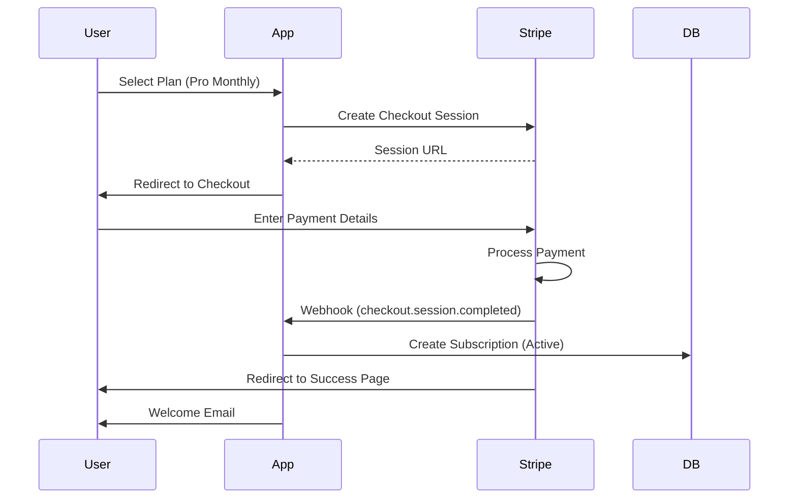
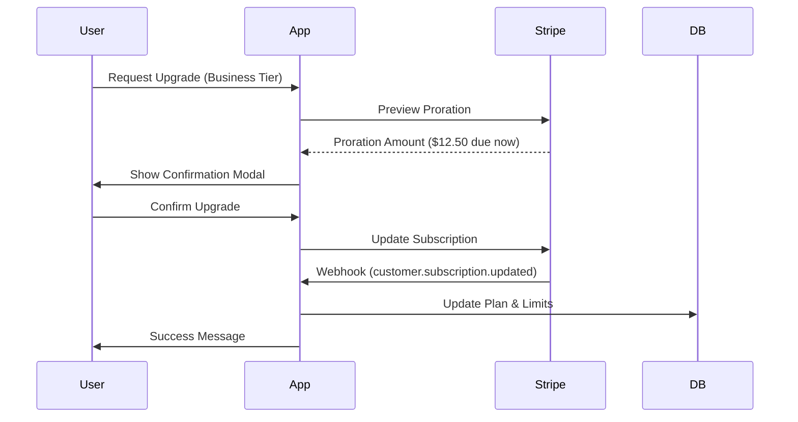
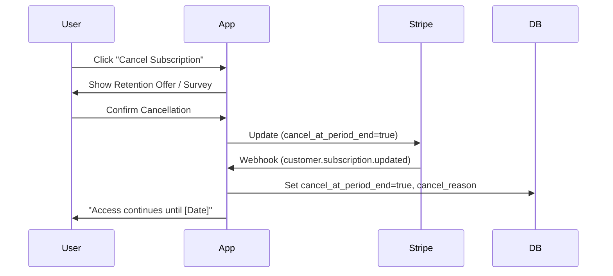
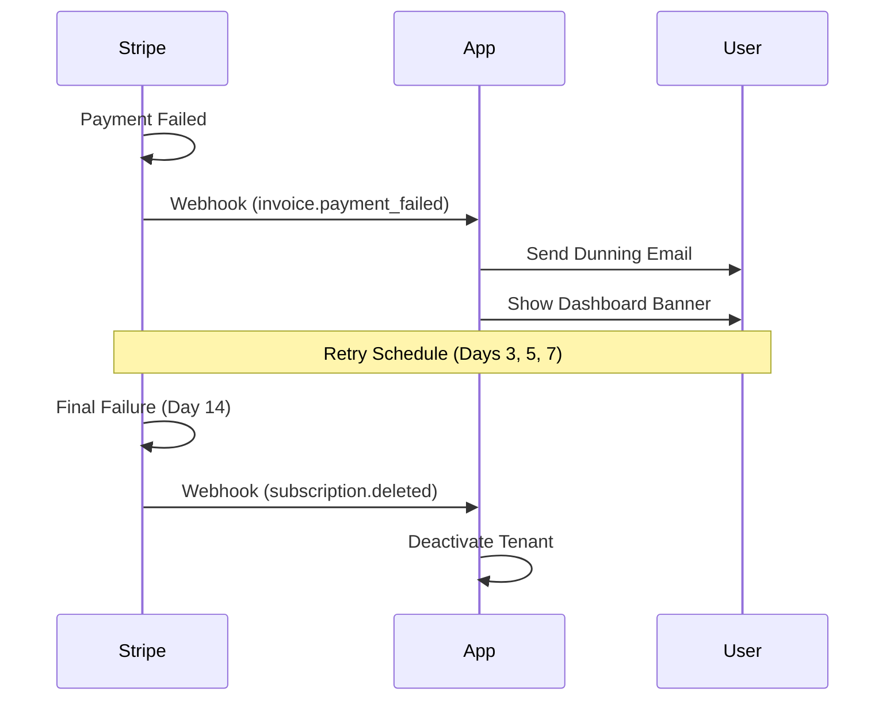

# User Flows

**Visualizing critical user journeys through the platform.**

---

## Subscription Lifecycle

### 1. Subscription Creation (Onboarding)

### 2. Plan Upgrade/Downgrade

### 3. Cancellation

### 4. Payment Failure (Dunning)

