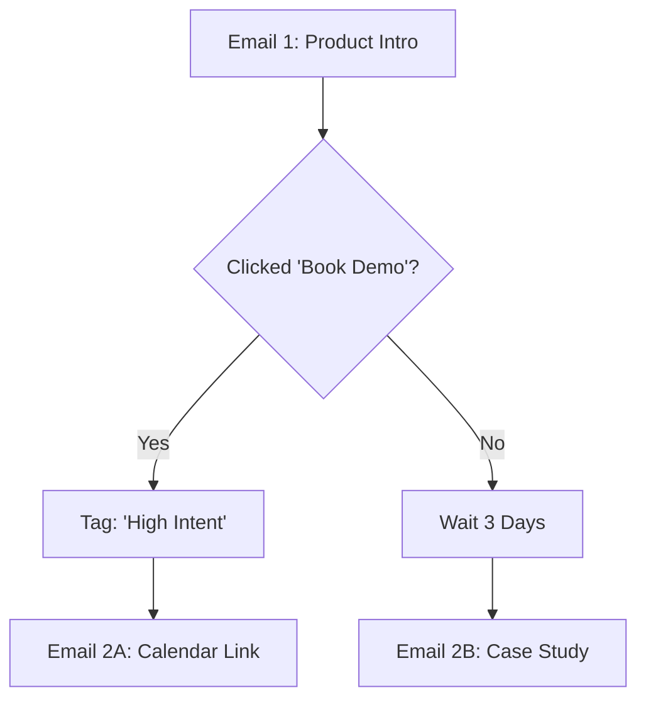

# Email Sequences

**Quick Access**: Build sophisticated automated email journeys with conditional logic, behavioral triggers, and dynamic content adaptation.

## Overview

Email Sequences are the engine behind automated relationship building. Unlike simple autoresponders, PenguinMails sequences are dynamic workflows that adapt based on recipient behavior. Whether it's a welcome series, a sales nurture flow, or a re-engagement loop, sequences ensure the right message reaches the right person at the right time.

### Key Capabilities

- **Visual Workflow Builder**: Design complex sequences with a drag-and-drop interface
- **Conditional Branching**: Route contacts based on opens, clicks, replies, or data changes
- **Dynamic Delays**: Wait for specific times, days of the week, or until an event occurs
- **Behavioral Triggers**: Start, stop, or jump to steps based on user actions
- **A/B Testing per Step**: Optimize individual emails within a sequence
- **Goal Tracking**: Define and track conversion goals for each sequence

---

## Level 1: Quick Start Guide

### Create Your First Sequence

#### Step 1: Define the Trigger

Every sequence starts with an entry point.

```
Sequence Settings:
┌─────────────────────────────────────────────────────┐
│ Name: "New User Onboarding"                         │
│                                                     │
│ Entry Trigger:                                      │
│ ● Segment Join: "New Signups"                       │
│ ○ Form Submission: "Ebook Download"                 │
│ ○ Manual Add                                        │
│ ○ API Event                                         │
│                                                     │
│ Exit Condition:                                     │
│ ☑ User replies                                      │
│ ☑ User converts (Goal: "Paid Subscription")         │
└─────────────────────────────────────────────────────┘
```

#### Step 2: Add Email Steps

**Build a 3-Email Flow:**

```
[START]
   │
   ▼
1. Email: "Welcome & Getting Started"
   Subject: Welcome to PenguinMails!
   Delay: Immediate
   │
   ▼
   ⏱ Wait 2 Days
   │
   ▼
2. Email: "Key Features Overview"
   Subject: 3 things you can do today
   │
   ▼
   ⏱ Wait 3 Days
   │
   ▼
3. Email: "Pro Tips & Best Practices"
   Subject: Become a pro user
   │
   ▼
[END]
```

#### Step 3: Configure Delays

**Smart Waiting:**

```
Delay Settings (Step 2):
┌─────────────────────────────────────────────────────┐
│ Wait Duration: [2] Days                             │
│                                                     │
│ Delivery Window:                                    │
│ ☑ Only send on Weekdays (Mon-Fri)                   │
│ ☑ Send between 9:00 AM - 5:00 PM (Recipient Time)   │
│                                                     │
│ If window missed:                                   │
│ ● Wait for next available window                    │
│ ○ Send immediately anyway                           │
└─────────────────────────────────────────────────────┘
```

#### Step 4: Activate

**Launch Checklist:**

```
✓ Trigger active: "New Signups" segment
✓ All 3 emails have content
✓ Delays configured correctly
✓ Test email sent to self

[Activate Sequence]
```

---

## Level 2: Advanced Sequences

### Conditional Branching

Create adaptive paths based on recipient engagement.

#### Engagement-Based Logic

**Scenario**: If they clicked the "Demo" link, fast-track them to sales. If not, nurture them with case studies.



**Configuration:**

```yaml
step_config:
  type: "branch"
  condition:
    type: "email_event"
    email_step_id: "step_1"
    event: "clicked_link"
    link_url_contains: "/book-demo"
    lookback_window: "3 days"
  
  true_path_next: "step_2a_sales"
  false_path_next: "step_2b_nurture"
```

### Dynamic Delays & Triggers

#### "Wait Until" Logic

Instead of fixed time delays, wait for specific conditions.

**Examples:**

1. **Wait until Monday**: Ensure the next email hits the inbox at the start of the week.
2. **Wait until Event**: Pause the sequence until the user logs in or visits a pricing page.
3. **Wait until Field Update**: Wait until the "Company Size" field is enriched.

```yaml
delay_config:
  type: "wait_until"
  conditions:
    - event: "user_login"
      timeout: "7 days"
  
  on_timeout:
    action: "send_reengagement_email"
```

### Exit & Re-enrollment Rules

#### Goal-Based Exits

Stop the sequence immediately when the objective is met.

```
Goal Definition:
┌─────────────────────────────────────────────────────┐
│ Goal Name: "Booked Meeting"                         │
│                                                     │
│ Triggered when:                                     │
│ ● CRM Deal Stage changes to "Meeting Booked"        │
│ ○ Visited URL: "/meeting-confirmed"                 │
│ ○ Custom Event: "meeting_booked"                    │
│                                                     │
│ Action:                                             │
│ ● Exit Sequence Immediately                         │
│ ○ Move to "Pre-meeting Prep" Sequence               │
└─────────────────────────────────────────────────────┘
```

#### Re-enrollment Settings

Control if and when a contact can restart a sequence.

- **Never**: One-time journey (e.g., Welcome Series).
- **Always**: Transactional flows (e.g., Order Confirmation).
- **After Delay**: Recurring flows (e.g., "It's been a while" re-engagement, allowed once every 90 days).

### Sequence Templates

Save complex workflows as reusable blueprints.

**Standard Templates:**

- **SaaS Trial**: Welcome -> Feature Highlight -> Case Study -> Expiry Warning -> Offer.
- **Webinar Promo**: Invite -> Reminder (1 week) -> Reminder (1 day) -> Link (1 hour) -> Replay.
- **Cold Outreach**: Value Prop -> Follow-up 1 -> Follow-up 2 -> Breakup.

---

## Level 3: Technical Implementation

### Database Schema

```sql
-- Sequences Table
CREATE TABLE sequences (
  id UUID PRIMARY KEY DEFAULT gen_random_uuid(),
  tenant_id UUID NOT NULL REFERENCES tenants(id),
  workspace_id UUID REFERENCES workspaces(id),
  name VARCHAR(255) NOT NULL,
  description TEXT,
  status VARCHAR(50) DEFAULT 'draft', -- draft, active, paused, archived
  
  -- Configuration
  trigger_config JSONB, -- Definition of entry triggers
  exit_config JSONB, -- Definition of exit goals
  re_enrollment_config JSONB, -- Rules for re-entry
  
  -- Metadata
  created_by UUID REFERENCES users(id),
  created_at TIMESTAMP DEFAULT NOW(),
  updated_at TIMESTAMP DEFAULT NOW(),
  archived_at TIMESTAMP
);

CREATE INDEX idx_sequences_tenant ON sequences(tenant_id);
CREATE INDEX idx_sequences_status ON sequences(status);

-- Sequence Steps Table (Nodes in the workflow graph)
CREATE TABLE sequence_steps (
  id UUID PRIMARY KEY DEFAULT gen_random_uuid(),
  sequence_id UUID NOT NULL REFERENCES sequences(id) ON DELETE CASCADE,
  parent_step_id UUID REFERENCES sequence_steps(id), -- For simple linear flows
  
  -- Step Definition
  name VARCHAR(255),
  type VARCHAR(50) NOT NULL, -- email, delay, branch, action, goal
  config JSONB NOT NULL, -- Specific config based on type
  
  -- Graph Positioning (for UI)
  ui_position_x INTEGER,
  ui_position_y INTEGER,
  
  created_at TIMESTAMP DEFAULT NOW(),
  updated_at TIMESTAMP DEFAULT NOW()
);

CREATE INDEX idx_sequence_steps_sequence ON sequence_steps(sequence_id);

-- Sequence Connections (Edges in the workflow graph)
-- Handles branching logic where one step can have multiple next steps
CREATE TABLE sequence_connections (
  id UUID PRIMARY KEY DEFAULT gen_random_uuid(),
  sequence_id UUID NOT NULL REFERENCES sequences(id) ON DELETE CASCADE,
  source_step_id UUID NOT NULL REFERENCES sequence_steps(id),
  target_step_id UUID NOT NULL REFERENCES sequence_steps(id),
  
  -- Branching Logic
  condition_label VARCHAR(50), -- e.g., 'true', 'false', 'opened', 'clicked'
  condition_expression JSONB, -- Logic to evaluate for this path
  
  created_at TIMESTAMP DEFAULT NOW()
);

CREATE INDEX idx_sequence_connections_source ON sequence_connections(source_step_id);

-- Contact Sequence State (Enrollment)
CREATE TABLE contact_sequences (
  id UUID PRIMARY KEY DEFAULT gen_random_uuid(),
  tenant_id UUID NOT NULL REFERENCES tenants(id),
  sequence_id UUID NOT NULL REFERENCES sequences(id),
  contact_id UUID NOT NULL REFERENCES contacts(id),
  
  status VARCHAR(50) DEFAULT 'active', -- active, completed, exited, paused
  current_step_id UUID REFERENCES sequence_steps(id),
  
  -- Timing
  enrolled_at TIMESTAMP DEFAULT NOW(),
  last_step_completed_at TIMESTAMP,
  next_execution_at TIMESTAMP, -- When the scheduler should pick this up
  
  -- Context
  context_data JSONB, -- Store variables specific to this run
  
  created_at TIMESTAMP DEFAULT NOW(),
  updated_at TIMESTAMP DEFAULT NOW(),
  
  UNIQUE(sequence_id, contact_id) -- Unless re-enrollment allows duplicates (handle via history table)
);

CREATE INDEX idx_contact_sequences_execution ON contact_sequences(status, next_execution_at);
```

### Sequence Engine (TypeScript)

The engine processes active enrollments, evaluates conditions, and executes steps.

```typescript
// Core Engine Logic
class SequenceEngine {
  
  async processDueEnrollments() {
    const now = new Date();
    
    // 1. Fetch enrollments ready for execution
    const dueEnrollments = await db.contactSequences.find({
      where: {
        status: 'active',
        next_execution_at: { lte: now }
      },
      limit: 100 // Batch processing
    });

    for (const enrollment of dueEnrollments) {
      await this.executeStep(enrollment);
    }
  }

  async executeStep(enrollment: ContactSequence) {
    const step = await db.sequenceSteps.findById(enrollment.current_step_id);
    
    try {
      switch (step.type) {
        case 'email':
          await this.handleEmailStep(enrollment, step);
          break;
        case 'delay':
          await this.handleDelayStep(enrollment, step);
          break;
        case 'branch':
          await this.handleBranchStep(enrollment, step);
          break;
        case 'action':
          await this.handleActionStep(enrollment, step);
          break;
      }
    } catch (error) {
      await this.handleError(enrollment, error);
    }
  }

  async handleBranchStep(enrollment: ContactSequence, step: SequenceStep) {
    const context = await this.buildContext(enrollment);
    
    // Evaluate conditions for all outgoing connections
    const connections = await db.sequenceConnections.find({ source_step_id: step.id });
    
    let nextStepId = null;
    
    for (const conn of connections) {
      if (this.evaluateCondition(conn.condition_expression, context)) {
        nextStepId = conn.target_step_id;
        break; // Take first matching path
      }
    }

    // Move to next step immediately (branches are usually instant)
    await this.advanceToStep(enrollment, nextStepId);
  }

  async advanceToStep(enrollment: ContactSequence, nextStepId: string | null) {
    if (!nextStepId) {
      // End of sequence
      await db.contactSequences.update(enrollment.id, {
        status: 'completed',
        completed_at: new Date(),
        next_execution_at: null
      });
      return;
    }

    // Update pointer and schedule immediate execution (unless it's a delay step)
    await db.contactSequences.update(enrollment.id, {
      current_step_id: nextStepId,
      next_execution_at: new Date() // Run immediately
    });
  }
}
```

### Background Jobs

1. **`sequence-processor`**: Runs every minute. Queries `contact_sequences` for records where `next_execution_at <= NOW()` and `status = 'active'`. Executes the logic for the current step.
2. **`trigger-listener`**: Listens for system events (e.g., `segment.contact_added`, `email.opened`). Checks if any active sequences have "Wait Until" steps waiting for this event or if any new sequences should be triggered.
3. **`goal-monitor`**: Periodically or event-driven check to see if active contacts have met the exit goal conditions.

### API Endpoints

- `POST /api/sequences`: Create a new sequence definition.
- `GET /api/sequences/{id}`: Retrieve full sequence graph.
- `PATCH /api/sequences/{id}`: Update configuration (versioned).
- `POST /api/sequences/{id}/enroll`: Manually enroll a contact or segment.
- `GET /api/sequences/{id}/analytics`: Get aggregate stats (conversion rates per step).
- `POST /api/sequences/{id}/pause`: Pause all active enrollments.

---

**Last Updated**: November 25, 2025
**Status**: Planned - High Priority Q1 2026 Feature
**Target Release**: Q1 2026
**Owner**: Campaigns Team
