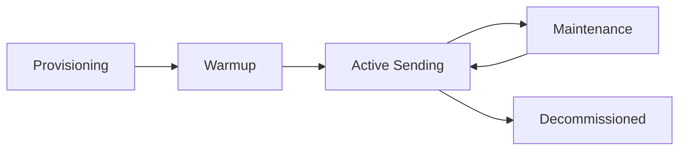

# Hostwind Infrastructure Management

**Automated management of Hostwind VPS instances for scalable email delivery.**

---

## Overview

PenguinMails leverages [Hostwind](https://www.hostwinds.com/) for its underlying infrastructure, providing cost-effective, scalable VPS instances for email sending. The platform automates the entire lifecycle of these instances, from provisioning to monitoring and scaling.

### Key Capabilities

- **Automated Provisioning** - One-click VPS deployment

- **IP Reputation Monitoring** - Real-time blacklist checking

- **Resource Scaling** - Dynamic CPU/RAM adjustment

- **Health Checks** - Automated service recovery

- **Cost Management** - Usage tracking and optimization

---

## Level 1: Infrastructure Architecture

### The Sending Node

Each "Sending Node" in PenguinMails corresponds to a Hostwind VPS instance configured specifically for email delivery.

**Standard Node Configuration:**

- **OS:** Ubuntu 22.04 LTS

- **MTA:** Postfix (custom configuration)

- **IP:** Dedicated IPv4 address

- **Reverse DNS:** Automatically configured

- **Security:** UFW firewall, Fail2Ban

### Node Lifecycle



1. **Provisioning**: API triggers VPS creation, installs dependencies, configures DNS.

2. **Warmup**: Node enters "Warmup Mode" with gradually increasing send limits.

3. **Active Sending**: Node handles full production traffic.

4. **Maintenance**: Temporary removal from rotation for updates or reputation repair.

5. **Decommissioned**: Node destroyed, IP released.

---

## Level 2: Automated Management

### VPS Provisioning

**API-Driven Deployment:**

PenguinMails uses the Hostwind API to programmatically create instances.

```javascript
// POST /api/v1/infrastructure/nodes
{
  "region": "dallas",
  "plan": "ssd-1", // 1 CPU, 1GB RAM
  "label": "node-us-east-045"
}


```

**Provisioning Steps:**

1. **Request Instance**: Call Hostwind API to create VPS.

2. **Wait for IP**: Poll until public IP is assigned.

3. **DNS Setup**: Configure A records and rDNS (PTR).

4. **Ansible/Script Setup**: SSH into node, install Postfix, Redis, Worker.

5. **Verification**: Send test email to internal sink.

6. **Register**: Add node to active pool in database.

### IP Reputation Monitoring

**Continuous Health Checks:**

The system continuously monitors the health and reputation of every sending IP.

- **Blacklist Monitoring**: Checks against Spamhaus, SORBS, Barracuda, etc.

- **Deliverability Metrics**: Tracks bounce rates and complaint rates per IP.

- **Automatic Pausing**: If an IP is blacklisted, the node is automatically paused to prevent further damage.

**Alerting:**

- **Severity High**: IP listed on Spamhaus (Immediate pause).

- **Severity Medium**: High bounce rate (>5%) detected.

- **Severity Low**: High CPU usage on node.

### Resource Scaling

**Vertical & Horizontal Scaling:**

- **Vertical**: Upgrade VPS plan (e.g., 1GB → 2GB RAM) via API if queue depth remains high.

- **Horizontal**: Provision additional nodes when total system throughput reaches 80% capacity.

---

## Level 3: Technical Implementation

### Hostwind API Integration

**Authentication:**
Uses API Key and API Secret stored in secure environment variables.

**Key Endpoints Used:**

- `POST /instances` - Create VPS

- `DELETE /instances/{id}` - Destroy VPS

- `GET /instances/{id}/status` - Check state

- `POST /instances/{id}/resize` - Upgrade plan

### Monitoring Agent

Each node runs a lightweight monitoring agent (written in Go or Node.js) that reports back to the central platform.

**Metrics Reported:**

- CPU / Memory Usage

- Disk Space (Mail queue buffer)

- Postfix Queue Length

- Network Throughput

**Heartbeat Protocol:**
Nodes send a heartbeat every 30 seconds. If 3 heartbeats are missed, the node is marked "Unhealthy" and removed from the sending rotation.

### Database Schema

```sql
CREATE TABLE sending_nodes (
  id UUID PRIMARY KEY DEFAULT gen_random_uuid(),
  provider_id VARCHAR(255), -- Hostwind Instance ID
  ip_address INET NOT NULL,
  hostname VARCHAR(255),
  region VARCHAR(50),
  status VARCHAR(50), -- provisioning, active, warming, paused, maintenance
  reputation_score INT DEFAULT 100,
  current_load INT DEFAULT 0,
  created_at TIMESTAMP DEFAULT CURRENT_TIMESTAMP,
  last_heartbeat TIMESTAMP
);

CREATE TABLE ip_blacklist_events (
  id UUID PRIMARY KEY,
  node_id UUID REFERENCES sending_nodes(id),
  blacklist_provider VARCHAR(100),
  listed_at TIMESTAMP,
  delisted_at TIMESTAMP,
  details TEXT
);


```

---

## Related Documentation

### Infrastructure

- **[Free Mailbox Creation](/docs/features/infrastructure/free-mailbox-creation/overview)** - User-facing mailbox setup

- **[Email Warmups](/docs/features/warmup/email-warmups/overview)** - Warmup logic applied to nodes

### Tasks

- **[Epic 5: Infrastructure Management](/tasks/epic-5-infrastructure-management/README)** - Development tasks

---

**Last Updated:** November 24, 2025
**Provider:** Hostwind
**Automation:** Ansible + Node.js

*Automated infrastructure management ensures high availability and consistent deliverability without manual intervention.*
