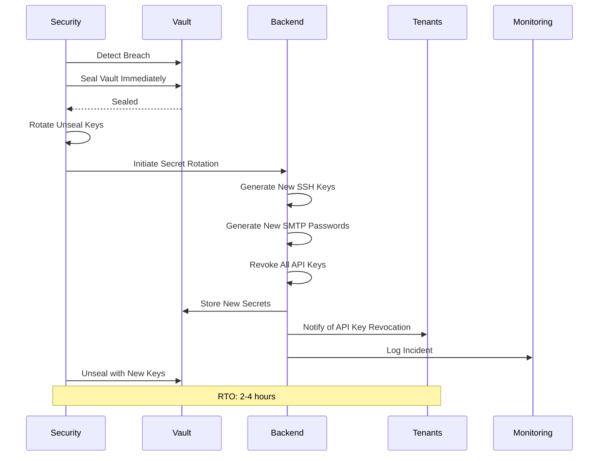

---
title: "Vault Disaster Recovery (Deprecated)"
description: "Deprecated landing page that routes readers to the modular Vault disaster recovery documentation hub"
last_modified_date: "2025-12-04"
level: "3"
persona: "Infrastructure Teams, Security Teams, Operations Teams"
keywords: ["vault", "disaster recovery", "deprecation", "single-source-of-truth"]
---

# Vault Disaster Recovery (Deprecated)

## Status

This file is intentionally deprecated and retained only to preserve historical links.
All canonical disaster recovery content now lives in the modular documentation hub:

- [Vault Disaster Recovery Overview](/docs/features/infrastructure/vault-disaster-recovery/README)
- [Automated Backup Strategy](/docs/features/infrastructure/vault-disaster-recovery/automated-backup-strategy)
- [VPS Migration Workflow](/docs/features/infrastructure/vault-disaster-recovery/vps-migration-workflow)
- [Vault Restoration from Backup](/docs/features/infrastructure/vault-disaster-recovery/vault-restoration-from-backup)
- [High Availability Setup](/docs/features/infrastructure/vault-disaster-recovery/high-availability-setup)
- [Monitoring and Alerting](/docs/features/infrastructure/vault-disaster-recovery/monitoring-and-alerting)
- [Emergency Procedures for Vault Compromise](/docs/features/infrastructure/vault-disaster-recovery/emergency-procedures-for-vault-compromise)
- [Implementation Checklist](/docs/features/infrastructure/vault-disaster-recovery/implementation-checklist)
- [Related Documentation](/docs/features/infrastructure/vault-disaster-recovery/related-documentation)

## Guidance

- Update any lingering bookmarks to the new structure.
- Remove this deprecated shim once external references adopt the new links.
      });
    }
  }
}

### Grafana Dashboard

**Metrics to Display:**

1. **Vault Status Panel**

   - Seal status (sealed/unsealed)

   - Leader status (active/standby)

   - Cluster size (3 nodes)

2. **Performance Metrics**

   - Request rate (requests/second)

   - Request latency (p50, p95, p99)

   - Error rate (%)

3. **Storage Metrics**

   - PostgreSQL disk usage (GB)

   - Secret count by path

   - Backup size (GB)

4. **Replication Metrics**

   - Replication lag (seconds)

   - Standby node status

   - Last successful sync

5. **Backup Metrics**

   - Last backup timestamp

   - Backup success rate (%)

   - Backup size trend

**Prometheus Metrics:**

```yaml

# Vault metrics exposed at /v1/sys/metrics

- vault_core_unsealed (gauge)

- vault_core_leader (gauge)

- vault_runtime_alloc_bytes (gauge)

- vault_runtime_sys_bytes (gauge)

- vault_core_handle_request_count (counter)

- vault_core_handle_request_duration_seconds (histogram)

- vault_replication_wal_last_wal (gauge)

- vault_storage_backend_size_bytes (gauge)

```

## Emergency Procedures for Vault Compromise

### Scenario: Vault Security Breach

If Vault is compromised (unauthorized access detected), immediate action is required to protect all secrets.

**Emergency Response Workflow:**



**Emergency Response Steps:**

#### Step 1: Immediate Containment (< 5 minutes)

```bash

# Seal Vault immediately to prevent further access

vault operator seal

# Verify Vault is sealed

vault status

# Output: Sealed: true

# Disable all authentication methods temporarily

vault auth disable approle
vault auth disable jwt

# Revoke all active tokens

vault token revoke -mode=path auth/

```

#### Step 2: Incident Assessment (5-15 minutes)

```typescript
// Analyze audit logs to determine breach scope
async function assessVaultBreach(): Promise<BreachAssessment> {
  // Get all audit events in last 24 hours
  const auditEvents = await auditLog.query({
    timestamp_gte: new Date(Date.now() - 24 * 60 * 60 * 1000),
    order_by: 'timestamp DESC'
  });

  // Identify suspicious activity
  const suspiciousEvents = auditEvents.filter(event =>
    event.event.includes('unauthorized') ||
    event.severity === 'critical' ||
    event.details?.error?.includes('permission denied')
  );

  // Determine which secrets were accessed
  const accessedSecrets = auditEvents
    .filter(event => event.event === 'secret_read')
    .map(event => event.request.path);

  // Identify affected tenants
  const affectedTenants = new Set(
    accessedSecrets
      .map(path => path.split('/')[1]) // Extract tenant_id from path
      .filter(id => id !== 'test-tenant-id')
  );

  return {
    breach_detected_at: new Date().toISOString(),
    suspicious_events: suspiciousEvents.length,
    accessed_secrets: accessedSecrets.length,
    affected_tenants: Array.from(affectedTenants),
    breach_scope: affectedTenants.size > 10 ? 'widespread' : 'limited'
  };
}

```

#### Step 3: Rotate Unseal Keys (15-30 minutes)

```bash

# Generate new unseal keys

vault operator rekey -init -key-shares=5 -key-threshold=3

# Complete rekey process with existing unseal keys

vault operator rekey -target=recovery <old-unseal-key-1>
vault operator rekey -target=recovery <old-unseal-key-2>
vault operator rekey -target=recovery <old-unseal-key-3>

# New unseal keys generated

# IMPORTANT: Store new keys securely in separate locations

```

#### Step 4: Rotate All Secrets (30 minutes - 2 hours)

```typescript
// Emergency rotation of all secrets
async function emergencyRotateAllSecrets(
  incidentId: string
): Promise<void> {
  console.log(`[${incidentId}] Starting emergency secret rotation...`);

  // Get all tenants
  const tenants = await getAllTenants();

  for (const tenant of tenants) {
    try {
      // Rotate SSH keys
      await rotateSSHKeys(tenant.id, 'emergency', incidentId);

      // Rotate SMTP credentials
      await rotateSMTPCredentials(tenant.id, 'emergency', incidentId);

      // Revoke all API keys (tenants must regenerate)
      await revokeAllApiKeys(tenant.id, incidentId);

      // Rotate DKIM keys
      await rotateDKIMKeys(tenant.domain, 'emergency', incidentId);

      console.log(`[${incidentId}] Rotated secrets for tenant: ${tenant.id}`);

    } catch (error) {
      console.error(`[${incidentId}] Failed to rotate secrets for tenant ${tenant.id}: ${error.message}`);
    }
  }

  console.log(`[${incidentId}] Emergency secret rotation completed`);
}

// Revoke all API keys for a tenant
async function revokeAllApiKeys(
  tenantId: string,
  incidentId: string
): Promise<void> {
  // List all API keys for tenant
  const apiKeys = await vaultClient.list(`api_keys/${tenantId}`);

  // Revoke each key
  for (const keyId of apiKeys) {
    await vaultClient.delete(`api_keys/${tenantId}/${keyId}`);
  }

  // Log revocation
  await auditLog.create({
    event: 'api_keys_revoked_emergency',
    tenant_id: tenantId,
    timestamp: new Date().toISOString(),
    severity: 'critical',
    details: {
      incident_id: incidentId,
      keys_revoked: apiKeys.length
    }
  });
}

```

#### Step 5: Notify Tenants (Immediate)

```typescript
// Notify all affected tenants
async function notifyTenantsOfBreach(
  affectedTenants: string[],
  incidentId: string
): Promise<void> {
  for (const tenantId of affectedTenants) {
    await sendTenantNotification(tenantId, {
      type: 'security_incident',
      severity: 'critical',
      subject: 'URGENT: Security Incident - API Keys Revoked',
      message: `
        We have detected a security incident affecting our secrets management system.

        As a precautionary measure, we have:

        - Rotated all SSH keys

        - Rotated all SMTP credentials

        - Revoked all API keys

        ACTION REQUIRED:

        - Regenerate your API keys in the dashboard

        - Update any applications using the old API keys

        Your email sending infrastructure is unaffected and continues to operate normally.

        Incident ID: ${incidentId}

        We apologize for any inconvenience. Your security is our top priority.
      `
    });
  }
}

```

#### Step 6: Unseal Vault with New Keys (30-60 minutes)

```bash

# Unseal Vault with new unseal keys

vault operator unseal <new-unseal-key-1>
vault operator unseal <new-unseal-key-2>
vault operator unseal <new-unseal-key-3>

# Verify Vault is unsealed

vault status

# Output: Sealed: false

# Re-enable authentication methods

vault auth enable approle
vault auth enable jwt

# Verify services can reconnect

vault token lookup

```

#### Step 7: Post-Incident Review (1-2 days)

```typescript
// Conduct post-incident review
async function conductPostIncidentReview(
  incidentId: string
): Promise<IncidentReport> {
  // Gather all incident data
  const assessment = await assessVaultBreach();
  const auditEvents = await getIncidentAuditEvents(incidentId);
  const affectedTenants = assessment.affected_tenants;

  // Generate incident report
  const report: IncidentReport = {
    incident_id: incidentId,
    detected_at: assessment.breach_detected_at,
    resolved_at: new Date().toISOString(),
    breach_scope: assessment.breach_scope,
    affected_tenants: affectedTenants.length,
    actions_taken: [
      'Sealed Vault immediately',
      'Rotated unseal keys',
      'Rotated all SSH keys',
      'Rotated all SMTP credentials',
      'Revoked all API keys',
      'Rotated all DKIM keys',
      'Notified affected tenants'
    ],
    root_cause: 'TBD - Under investigation',
    lessons_learned: [],
    preventive_measures: []
  };

  // Store incident report
  await storeIncidentReport(report);

  return report;
}

```

## Implementation Checklist

### Phase 1: Automated Backup System (Week 1)

- [ ] Configure S3 bucket for encrypted backups

- [ ] Generate and securely store backup encryption key

- [ ] Implement automated backup script (daily at 02:00 UTC)

- [ ] Implement backup encryption (AES-256-GCM)

- [ ] Implement backup verification (checksum validation)

- [ ] Configure backup retention policy (30 daily, 12 monthly)

- [ ] Test backup creation and upload to S3

- [ ] Configure backup failure alerts

### Phase 2: Backup Restoration (Week 2)

- [ ] Document step-by-step restoration runbook

- [ ] Implement automated restoration script

- [ ] Test backup decryption

- [ ] Test Vault snapshot restoration

- [ ] Verify secrets accessible after restoration

- [ ] Conduct weekly restore test to staging

- [ ] Measure actual RTO/RPO

### Phase 3: VPS Migration Workflow (Week 3)

- [ ] Implement VPS migration script

- [ ] Test secret recovery from Vault

- [ ] Test SSH key installation on new VPS

- [ ] Test SMTP credential recovery

- [ ] Test DKIM key installation

- [ ] Verify email sending after migration

- [ ] Document VPS migration procedures

- [ ] Conduct VPS migration drill

### Phase 4: High Availability Setup (Week 4-5)

- [ ] Provision 3 Vault servers

- [ ] Configure Raft consensus protocol

- [ ] Set up PostgreSQL replication (primary + 2 replicas)

- [ ] Configure load balancer (HAProxy/Nginx)

- [ ] Test automatic failover

- [ ] Configure health checks (every 5 seconds)

- [ ] Verify audit logs replicate correctly

- [ ] Measure failover time (target: < 30 seconds)

### Phase 5: Monitoring and Alerting (Week 5)

- [ ] Implement Vault health monitoring script

- [ ] Configure Prometheus metrics collection

- [ ] Create Grafana dashboards

- [ ] Configure alert rules (seal status, replication lag, backup status)

- [ ] Set up alert notifications (email, Slack, PagerDuty)

- [ ] Test alert delivery for each severity level

- [ ] Document monitoring procedures

### Phase 6: Disaster Recovery Drills (Week 6)

- [ ] Schedule quarterly DR drills

- [ ] Document drill scenarios (vault failure, cluster loss, VPS compromise, credential compromise)

- [ ] Implement drill execution scripts

- [ ] Conduct first DR drill (vault server failure)

- [ ] Generate drill report

- [ ] Identify and fix issues found during drill

- [ ] Update DR procedures based on lessons learned

### Phase 7: Emergency Response Procedures (Week 6)

- [ ] Document Vault compromise response workflow

- [ ] Implement emergency secret rotation script

- [ ] Create tenant notification templates

- [ ] Test emergency seal and unseal procedures

- [ ] Test unseal key rotation

- [ ] Document post-incident review process

- [ ] Train team on emergency procedures

### Phase 8: SMTP Credential Recovery Integration (Week 7)

- [ ] Integrate SMTP credential recovery into VPS migration workflow

- [ ] Test SMTP credential decryption

- [ ] Test MailU configuration with recovered credentials

- [ ] Verify webmail access after recovery

- [ ] Document SMTP-specific recovery procedures

- [ ] Reference SMTP disaster recovery documentation

- [ ] Conduct end-to-end SMTP recovery drill

## Related Documentation

### Route Specifications

- **[Infrastructure SSH Access Routes](/docs/design/routes/infrastructure-ssh-access)** - SSH and secrets management UI

- **[Admin Routes](/docs/design/routes/admin)** - Admin secrets management panel

### Feature Documentation

- **[Vault SSH Management](/docs/features/infrastructure/vault-ssh-management)** - SSH key storage and rotation

- **[Vault SMTP Credentials](/docs/features/infrastructure/vault-smtp-credentials)** - SMTP-specific disaster recovery

- **[Vault API Keys](/docs/features/integrations/vault-api-keys)** - API key storage and rotation

- **[Email Infrastructure Setup](/docs/features/infrastructure/email-infrastructure-setup)** - MailU configuration

- **[Hostwind Management](/docs/features/infrastructure/hostwind-management)** - VPS provisioning workflow

### Operations Documentation

- **[Incident Response](/docs/operations/incident-response)** - Security incident procedures

- **[Security Monitoring](/docs/operations/security-monitoring)** - Monitoring and alerting

- **[Operational Runbooks](/docs/operations/operational-runbooks)** - Operational procedures

### Architecture & Security

- **[Vault Integration Architecture](/.kiro/specs/feature-completeness-review/findings/vault-integration-architecture)** - Complete Vault architecture

- **[Multi-Tenant Architecture](/docs/features/infrastructure/multi-tenant-architecture)** - Tenant isolation

- **[Enterprise Security](/docs/compliance-security/enterprise/overview)** - Security features

### Planning & Review

- **[Integrations Review](/.kiro/specs/feature-completeness-review/findings/integrations)** - Integration completeness review

- **[Feature Completeness Review Requirements](/.kiro/specs/feature-completeness-review/requirements)** - Review requirements

- **[Technical Roadmap](/docs/operations/roadmap/technical-roadmap)** - Infrastructure roadmap

### Implementation Tasks

- **[Task 11.7 - Vault Disaster Recovery](/.kiro/specs/feature-completeness-review/tasks#117-implement-vault-disaster-recovery-procedures)** - Disaster recovery implementation

- **[Task 11.3 - Vault Integration Architecture](/.kiro/specs/feature-completeness-review/tasks#113-document-vault-integration-architecture)** - Architecture documentation

- **[Task 11.4 - VPS SSH Key Management](/.kiro/specs/feature-completeness-review/tasks#114-implement-vps-ssh-key-management-with-vault)** - SSH key storage

- **[Task 11.5 - SMTP Credentials Vault Storage](/.kiro/specs/feature-completeness-review/tasks#115-implement-smtp-credentials-vault-storage)** - SMTP credential management

- **[Task 11.6 - Tenant API Key System](/.kiro/specs/feature-completeness-review/tasks#116-implement-tenant-api-key-system-with-vault)** - API key storage

- **Epic 5: Infrastructure Management** - Internal task reference for infrastructure tasks

### External Resources

- **[HashiCorp Vault Documentation](https://www.vaultproject.io/docs)** - Official Vault docs

- **[Vault Disaster Recovery](https://learn.hashicorp.com/tutorials/vault/disaster-recovery)** - DR tutorial

- **[Vault High Availability](https://learn.hashicorp.com/tutorials/vault/ha-with-consul)** - HA setup

- **[Vault Backup and Restore](https://www.vaultproject.io/docs/commands/operator/raft/snapshot)** - Backup commands

- **[Vault Monitoring](https://www.vaultproject.io/docs/internals/telemetry)** - Monitoring guide

---

**Last Updated:** November 26, 2025
**Document Version:** 1.0
**Status:** APPROVED
**Next Review:** December 26, 2025

*This document provides comprehensive disaster recovery procedures for HashiCorp Vault, ensuring rapid recovery from any failure scenario with minimal data loss and service disruption. All Vault-dependent features must reference this document for disaster recovery planning.*
