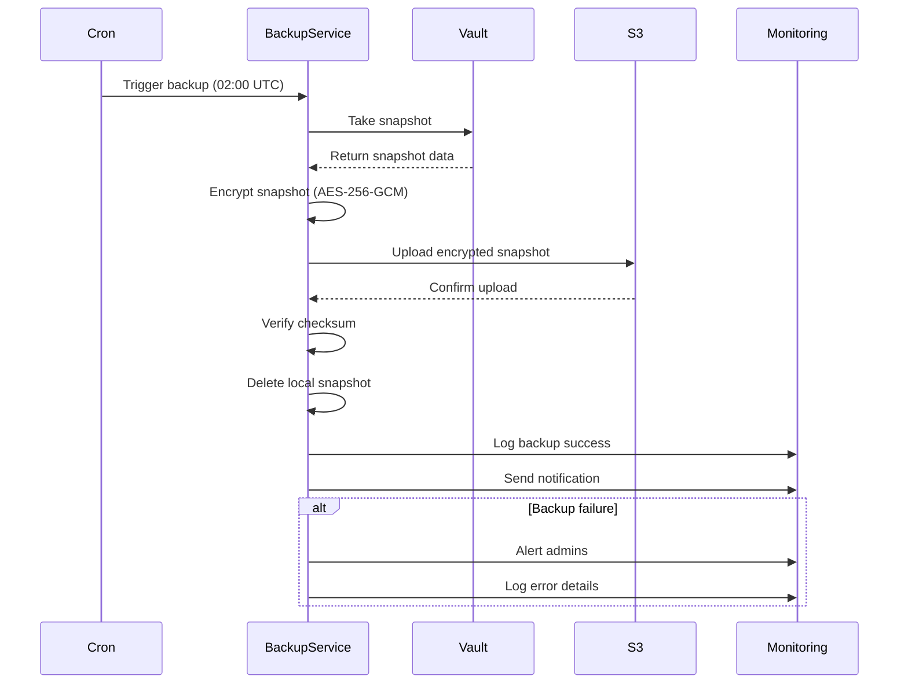

# Automated Backup Strategy

## Backup Schedule

**Daily backups**

- **Frequency:** Every day at 02:00 UTC
- **Retention:** 30 daily backups (rolling window)
- **Storage:** Encrypted S3 bucket (or equivalent object storage)
- **Encryption:** AES-256-GCM with dedicated encryption key material
- **Verification:** Automated integrity check after each backup completes

**Monthly backups**

- **Frequency:** First day of each month at 02:00 UTC
- **Retention:** 12 monthly backups (rolling twelve-month window)
- **Storage:** Same encrypted S3 bucket under dedicated prefix
- **Purpose:** Compliance-ready archival and long-term recovery

**Backup naming convention**

```text
s3://penguinmails-vault-backups/
|- daily/
|  |- 2025-11-26/vault-snapshot-20251126-020000.enc
|  |- 2025-11-25/vault-snapshot-20251125-020000.enc
|  \- ...
\- monthly/
   |- 2025-11/vault-snapshot-20251101-020000.enc
   |- 2025-10/vault-snapshot-20251001-020000.enc
   \- ...
```

## Backup Process

**Automated workflow**



**Implementation**

```typescript
// Automated backup service (runs daily at 02:00 UTC)
async function performVaultBackup(): Promise<void> {
  const timestamp = new Date().toISOString().replace(/[:.]/g, '-');
  const backupDate = new Date().toISOString().split('T')[0];
  const isMonthly = new Date().getDate() === 1;

  try {
    // Take Vault snapshot
    console.log(`[${timestamp}] Starting Vault backup...`);
    const snapshot = await vaultClient.sys.snapshot();

    // Encrypt snapshot with AES-256-GCM
    const encryptedSnapshot = await encryptBackup(snapshot, backupEncryptionKey);

    // Generate checksum for integrity verification
    const checksum = crypto.createHash('sha256').update(encryptedSnapshot).digest('hex');

    // Determine backup path (daily or monthly)
    const backupPath = isMonthly
      ? `monthly/${backupDate}/vault-snapshot-${timestamp}.enc`
      : `daily/${backupDate}/vault-snapshot-${timestamp}.enc`;

    // Upload to S3
    await s3.putObject({
      Bucket: 'penguinmails-vault-backups',
      Key: backupPath,
      Body: encryptedSnapshot,
      Metadata: {
        checksum: checksum,
        timestamp: timestamp,
        vault_version: await vaultClient.sys.health().version
      }
    });

    // Verify upload integrity
    const uploadedObject = await s3.headObject({
      Bucket: 'penguinmails-vault-backups',
      Key: backupPath
    });

    if (uploadedObject.Metadata.checksum !== checksum) {
      throw new Error('Backup checksum mismatch after upload');
    }

    // Delete local snapshot file
    await fs.unlink(`/tmp/vault-snapshot-${timestamp}`);

    // Log backup success
    await auditLog.create({
      event: 'vault_backup_completed',
      timestamp: new Date().toISOString(),
      details: {
        backup_path: backupPath,
        checksum: checksum,
        size_bytes: encryptedSnapshot.length,
        backup_type: isMonthly ? 'monthly' : 'daily'
      }
    });

    // Send success notification
    await sendNotification({
      type: 'vault_backup_success',
      message: `Vault backup completed successfully: ${backupPath}`,
      timestamp: timestamp
    });

    console.log(`[${timestamp}] Vault backup completed: ${backupPath}`);
  } catch (error) {
    // Log backup failure
    await auditLog.create({
      event: 'vault_backup_failed',
      timestamp: new Date().toISOString(),
      severity: 'critical',
      details: {
        error: error.message,
        stack: error.stack
      }
    });

    // Alert admins immediately
    await sendAlert({
      type: 'vault_backup_failure',
      severity: 'critical',
      message: `Vault backup failed: ${error.message}`,
      timestamp: timestamp
    });

    throw error;
  }
}

// Encrypt backup with AES-256-GCM
async function encryptBackup(
  snapshot: Buffer,
  encryptionKey: Buffer
): Promise<Buffer> {
  // Generate random IV
  const iv = crypto.randomBytes(16);

  // Create cipher
  const cipher = crypto.createCipheriv('aes-256-gcm', encryptionKey, iv);

  // Encrypt snapshot
  const encrypted = Buffer.concat([
    cipher.update(snapshot),
    cipher.final()
  ]);

  // Get authentication tag
  const authTag = cipher.getAuthTag();

  // Return: IV + authTag + encrypted data
  return Buffer.concat([iv, authTag, encrypted]);
}
```

## Backup Retention Policy

```typescript
// Clean up old backups (runs daily after backup)
async function cleanupOldBackups(): Promise<void> {
  const now = new Date();

  // Clean up daily backups older than 30 days
  const dailyBackups = await s3.listObjectsV2({
    Bucket: 'penguinmails-vault-backups',
    Prefix: 'daily/'
  });

  for (const backup of dailyBackups.Contents) {
    const backupDate = new Date(backup.LastModified);
    const ageInDays = (now.getTime() - backupDate.getTime()) / (1000 * 60 * 60 * 24);

    if (ageInDays > 30) {
      await s3.deleteObject({
        Bucket: 'penguinmails-vault-backups',
        Key: backup.Key
      });

      console.log(`Deleted old daily backup: ${backup.Key}`);
    }
  }

  // Clean up monthly backups older than 12 months
  const monthlyBackups = await s3.listObjectsV2({
    Bucket: 'penguinmails-vault-backups',
    Prefix: 'monthly/'
  });

  for (const backup of monthlyBackups.Contents) {
    const backupDate = new Date(backup.LastModified);
    const ageInMonths = (now.getTime() - backupDate.getTime()) / (1000 * 60 * 60 * 24 * 30);

    if (ageInMonths > 12) {
      await s3.deleteObject({
        Bucket: 'penguinmails-vault-backups',
        Key: backup.Key
      });

      console.log(`Deleted old monthly backup: ${backup.Key}`);
    }
  }
}
```

## Backup Verification

```typescript
// Test backup restoration to staging environment (runs weekly)
async function testBackupRestoration(): Promise<void> {
  try {
    // Get latest daily backup
    const latestBackup = await getLatestBackup('daily');

    // Download encrypted backup
    const encryptedBackup = await s3.getObject({
      Bucket: 'penguinmails-vault-backups',
      Key: latestBackup.Key
    });

    // Decrypt backup
    const decryptedBackup = await decryptBackup(
      encryptedBackup.Body,
      backupEncryptionKey
    );

    // Restore to staging Vault instance
    await stagingVaultClient.sys.restore(decryptedBackup);

    // Verify secrets are accessible
    const testTenantId = 'test-tenant-id';
    const testSecret = await stagingVaultClient.read(`smtp/${testTenantId}/admin`);

    if (!testSecret) {
      throw new Error('Test secret not found after restoration');
    }

    // Log successful test
    await auditLog.create({
      event: 'vault_backup_test_success',
      timestamp: new Date().toISOString(),
      details: {
        backup_tested: latestBackup.Key,
        staging_vault: 'vault-staging.penguinmails.com'
      }
    });

    console.log('Backup restoration test successful');
  } catch (error) {
    // Alert admins of test failure
    await sendAlert({
      type: 'vault_backup_test_failure',
      severity: 'high',
      message: `Backup restoration test failed: ${error.message}`
    });

    throw error;
  }
}
```
