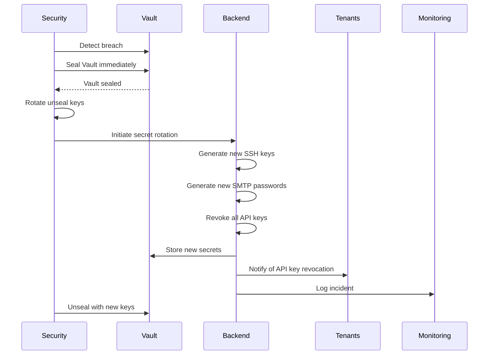

# Emergency Procedures for Vault Compromise

## Scenario: Vault Security Breach

If unauthorized access to Vault is detected, seal the cluster immediately, rotate every credential, and notify stakeholders. Target RTO: 2–4 hours.



## Step 1: Immediate Containment (< 5 minutes)

```bash
vault operator seal
vault status # Expect "Sealed: true"
vault auth disable approle
vault auth disable jwt
vault token revoke -mode=path auth/
```

## Step 2: Incident Assessment (5–15 minutes)

```typescript
// Analyze audit logs to determine breach scope
async function assessVaultBreach(): Promise<BreachAssessment> {
  const auditEvents = await auditLog.query({
    timestamp_gte: new Date(Date.now() - 24 * 60 * 60 * 1000),
    order_by: 'timestamp DESC'
  });

  const suspiciousEvents = auditEvents.filter(event =>
    event.event.includes('unauthorized') ||
    event.severity === 'critical' ||
    event.details?.error?.includes('permission denied')
  );

  const accessedSecrets = auditEvents
    .filter(event => event.event === 'secret_read')
    .map(event => event.request.path);

  const affectedTenants = new Set(
    accessedSecrets
      .map(path => path.split('/')[1])
      .filter(id => id !== 'test-tenant-id')
  );

  return {
    breach_detected_at: new Date().toISOString(),
    suspicious_events: suspiciousEvents.length,
    accessed_secrets: accessedSecrets.length,
    affected_tenants: Array.from(affectedTenants),
    breach_scope: affectedTenants.size > 10 ? 'widespread' : 'limited'
  };
}
```

## Step 3: Rotate Unseal Keys (15–30 minutes)

```bash
vault operator rekey -init -key-shares=5 -key-threshold=3
vault operator rekey -target=recovery <old-unseal-key-1>
vault operator rekey -target=recovery <old-unseal-key-2>
vault operator rekey -target=recovery <old-unseal-key-3>
# Store new unseal keys securely
```

## Step 4: Rotate All Secrets (30 minutes–2 hours)

```typescript
async function emergencyRotateAllSecrets(
  incidentId: string
): Promise<void> {
  console.log(`[${incidentId}] Starting emergency secret rotation...`);
  const tenants = await getAllTenants();

  for (const tenant of tenants) {
    try {
      await rotateSSHKeys(tenant.id, 'emergency', incidentId);
      await rotateSMTPCredentials(tenant.id, 'emergency', incidentId);
      await revokeAllApiKeys(tenant.id, incidentId);
      await rotateDKIMKeys(tenant.domain, 'emergency', incidentId);
      console.log(`[${incidentId}] Rotated secrets for tenant: ${tenant.id}`);
    } catch (error) {
      console.error(`[${incidentId}] Failed to rotate secrets for tenant ${tenant.id}: ${error.message}`);
    }
  }

  console.log(`[${incidentId}] Emergency secret rotation completed`);
}

async function revokeAllApiKeys(
  tenantId: string,
  incidentId: string
): Promise<void> {
  const apiKeys = await vaultClient.list(`api_keys/${tenantId}`);

  for (const keyId of apiKeys) {
    await vaultClient.delete(`api_keys/${tenantId}/${keyId}`);
  }

  await auditLog.create({
    event: 'api_keys_revoked_emergency',
    tenant_id: tenantId,
    timestamp: new Date().toISOString(),
    severity: 'critical',
    details: {
      incident_id: incidentId,
      keys_revoked: apiKeys.length
    }
  });
}
```

## Step 5: Notify Tenants (Immediate)

```typescript
async function notifyTenantsOfBreach(
  affectedTenants: string[],
  incidentId: string
): Promise<void> {
  for (const tenantId of affectedTenants) {
    await sendTenantNotification(tenantId, {
      type: 'security_incident',
      severity: 'critical',
      subject: 'URGENT: Security Incident - API Keys Revoked',
      message: `
        We detected a security incident affecting secrets management.

        Actions taken:
        - Rotated all SSH keys
        - Rotated all SMTP credentials
        - Revoked all API keys

        Required action:
        - Regenerate API keys in the dashboard
        - Update any integrations with the new keys

        Email sending infrastructure continues to operate normally.

        Incident ID: ${incidentId}
      `
    });
  }
}
```

## Step 6: Unseal Vault with New Keys (30–60 minutes)

```bash
vault operator unseal <new-unseal-key-1>
vault operator unseal <new-unseal-key-2>
vault operator unseal <new-unseal-key-3>

vault status # Expect "Sealed: false"

vault auth enable approle
vault auth enable jwt
```

## Step 7: Post-Incident Review (1–2 days)

```typescript
async function conductPostIncidentReview(
  incidentId: string
): Promise<IncidentReport> {
  const assessment = await assessVaultBreach();
  const auditEvents = await getIncidentAuditEvents(incidentId);
  const affectedTenants = assessment.affected_tenants;

  const report: IncidentReport = {
    incident_id: incidentId,
    detected_at: assessment.breach_detected_at,
    resolved_at: new Date().toISOString(),
    breach_scope: assessment.breach_scope,
    affected_tenants: affectedTenants.length,
    actions_taken: [
      'Sealed Vault immediately',
      'Rotated unseal keys',
      'Rotated all SSH keys',
      'Rotated all SMTP credentials',
      'Revoked all API keys',
      'Rotated all DKIM keys',
      'Notified affected tenants'
    ],
    root_cause: 'TBD - under investigation',
    lessons_learned: [],
    preventive_measures: []
  };

  await storeIncidentReport(report);
  return report;
}
```
