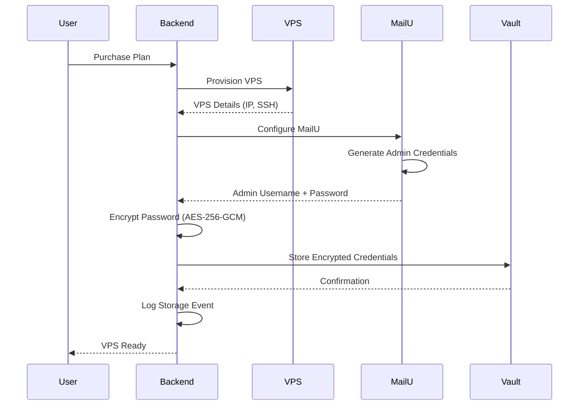
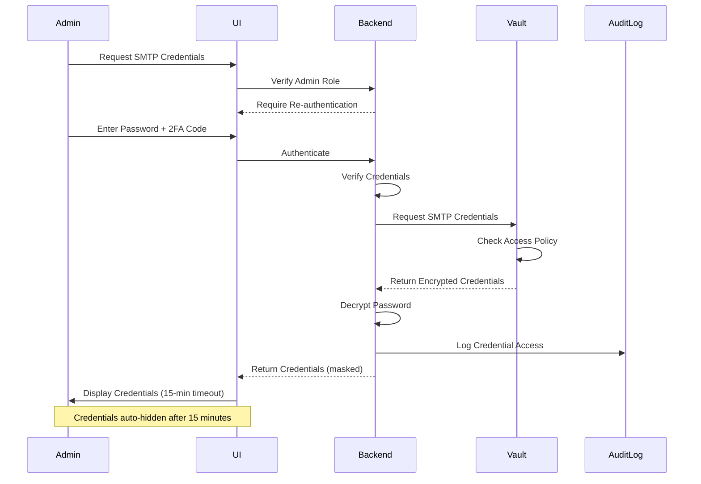
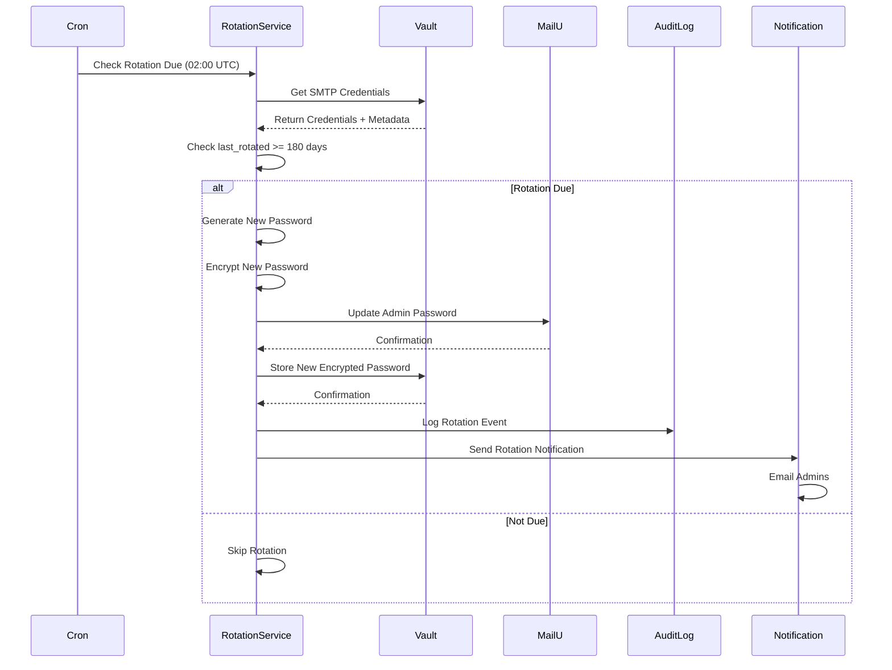
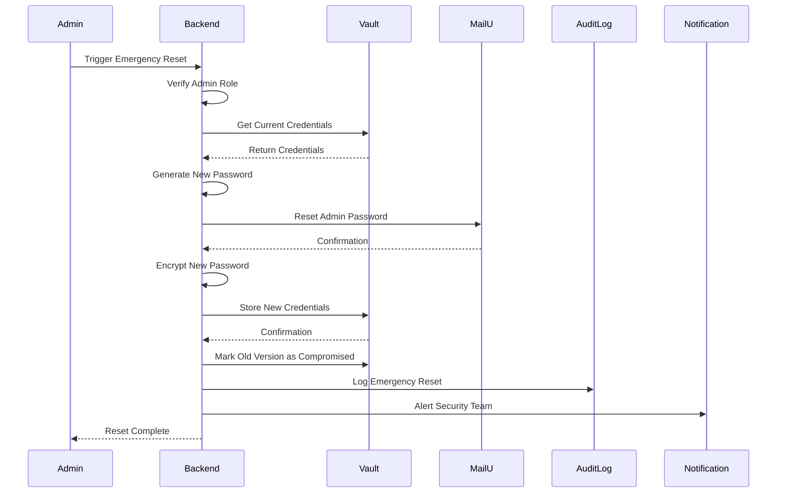
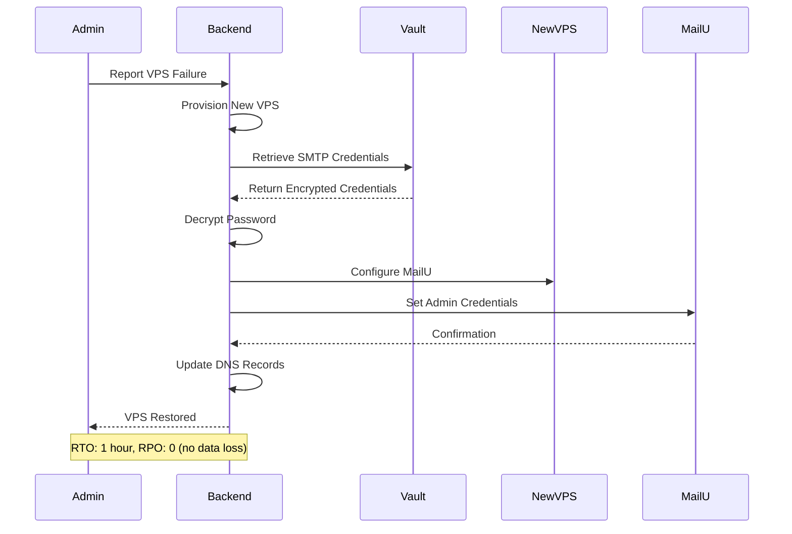

# SMTP Credentials Vault Storage

## Overview

This document describes the secure storage and management of MailU SMTP admin credentials in HashiCorp Vault. All SMTP credentials are encrypted before storage, automatically rotated every 180 days, and protected with comprehensive audit logging.

### Purpose

Traditional approaches to storing SMTP credentials create security vulnerabilities:

- Credentials stored in ENV files on VPS are exposed if VPS is compromised

- Manual credential rotation is error-prone and often neglected

- No centralized audit trail for credential access

- Difficult to recover credentials after VPS failure

Vault-based SMTP credential storage provides:

- **Centralized Storage** - Credentials stored in Vault, not on VPS

- **Encryption at Rest** - AES-256-GCM encryption before Vault storage

- **Automated Rotation** - 180-day rotation policy with zero downtime

- **Audit Trail** - All credential access logged with timestamp and user

- **Disaster Recovery** - Rapid credential recovery from Vault backups

### Key Benefits

1. **VPS Compromise Protection** - If VPS is compromised, credentials can be rotated immediately

2. **Zero-Downtime Rotation** - Automated rotation without service interruption

3. **Admin Troubleshooting** - PenguinMails admins can retrieve credentials for support

4. **Emergency Reset** - Rapid credential reset in case of security incident

5. **Compliance** - Audit trail supports SOC 2, ISO 27001, and GDPR requirements

## Architecture

### Vault Secret Structure

SMTP credentials are stored in Vault at the following path:

```text

vault/smtp/{tenant_id}/admin/
├── username          # MailU admin username
├── password          # Encrypted password (AES-256-GCM)
├── webmail_url       # MailU webmail URL (https://mail.example.com)
├── created_at        # ISO 8601 timestamp
├── last_rotated      # ISO 8601 timestamp
└── rotation_policy   # "180_days"


```

**Path Parameters:**

- `{tenant_id}` - UUID v4 format (e.g., `550e8400-e29b-41d4-a716-446655440000`)

**Secret Fields:**

- `username` - MailU admin username (typically `admin@domain.com`)

- `password` - Encrypted password (AES-256-GCM with random IV)

- `webmail_url` - Full URL to MailU webmail interface

- `created_at` - Timestamp when credentials were first created

- `last_rotated` - Timestamp of last password rotation

- `rotation_policy` - Rotation frequency (`180_days`)

### Encryption Specification

**Algorithm:** AES-256-GCM (Galois/Counter Mode)

**Key Derivation:**

- Master encryption key stored in Vault's encryption backend

- Per-tenant encryption keys derived using HKDF (HMAC-based Key Derivation Function)

- Salt: Tenant ID + timestamp

- Iterations: 100,000 (PBKDF2)

**Encryption Process:**

```typescript
// Generate random IV (Initialization Vector)
const iv = crypto.randomBytes(16);

// Derive encryption key from master key
const encryptionKey = deriveKey(masterKey, tenantId, salt);

// Encrypt password with AES-256-GCM
const cipher = crypto.createCipheriv('aes-256-gcm', encryptionKey, iv);
const encryptedPassword = Buffer.concat([
  cipher.update(password, 'utf8'),
  cipher.final()
]);

// Get authentication tag
const authTag = cipher.getAuthTag();

// Store: IV + authTag + encryptedPassword
const storedValue = Buffer.concat([iv, authTag, encryptedPassword]).toString('base64');


```

## Credential Storage Workflow

### Initial Storage (During MailU Setup)

When a new VPS is provisioned and MailU is configured, SMTP credentials are automatically stored in Vault:



**Implementation Steps:**

1. **Generate MailU Admin Credentials**

   ```typescript
   // Generate secure random password
   const password = crypto.randomBytes(32).toString('base64');
   const username = `admin@${domain}`;
   
   // Configure MailU with credentials
   await configureMailU(vpsIp, username, password);
   ```

2. **Encrypt Password**

   ```typescript
   // Encrypt password before Vault storage
   const encryptedPassword = await encryptPassword(password, tenantId);
   ```

3. **Store in Vault**

   ```typescript
   // Store credentials in Vault
   await vaultClient.write(`smtp/${tenantId}/admin`, {
     username: username,
     password: encryptedPassword,
     webmail_url: `https://mail.${domain}`,
     created_at: new Date().toISOString(),
     last_rotated: new Date().toISOString(),
     rotation_policy: '180_days'
   });
   ```

4. **Audit Logging**

   ```typescript
   // Log credential storage event
   await auditLog.create({
     event: 'smtp_credentials_stored',
     tenant_id: tenantId,
     user_id: 'system',
     timestamp: new Date().toISOString(),
     details: {
       username: username,
       webmail_url: `https://mail.${domain}`
     }
   });
   ```

## Credential Retrieval

### Admin Troubleshooting Access

PenguinMails administrators can retrieve SMTP credentials for troubleshooting purposes with strict security controls:

**Access Requirements:**

- Admin role with `support-team` Vault policy

- Re-authentication required (password + 2FA)

- Time-limited access (15-minute session)

- All access logged in audit trail

**Retrieval Workflow:**



**Implementation:**

```typescript
// API endpoint for admin credential retrieval
async function retrieveSmtpCredentials(
  tenantId: string,
  adminUserId: string,
  reauthToken: string
): Promise<SmtpCredentials> {
  // Verify admin role
  const admin = await verifyAdminRole(adminUserId);
  if (!admin.hasRole('support-team')) {
    throw new Error('Insufficient permissions');
  }
  
  // Verify re-authentication token
  const isValid = await verifyReauthToken(reauthToken, adminUserId);
  if (!isValid) {
    throw new Error('Re-authentication required');
  }
  
  // Retrieve credentials from Vault
  const vaultData = await vaultClient.read(`smtp/${tenantId}/admin`);
  
  // Decrypt password
  const decryptedPassword = await decryptPassword(
    vaultData.password,
    tenantId
  );
  
  // Log credential access
  await auditLog.create({
    event: 'smtp_credentials_accessed',
    tenant_id: tenantId,
    user_id: adminUserId,
    timestamp: new Date().toISOString(),
    ip_address: req.ip,
    user_agent: req.headers['user-agent']
  });
  
  // Return credentials with time-limited access
  return {
    username: vaultData.username,
    password: decryptedPassword,
    webmail_url: vaultData.webmail_url,
    expires_at: new Date(Date.now() + 15 * 60 * 1000) // 15 minutes
  };
}


```

## Secure Credential Viewing UI

### Admin Dashboard Route

**Route:** `/platform-admin/tenants/{tenant_id}/smtp-credentials`

**Access Control:**

- Requires `platform-admin` role

- Requires re-authentication (password + 2FA)

- Session expires after 15 minutes of inactivity

**UI Components:**

1. **Re-authentication Modal**

   ```typescript
   interface ReauthModalProps {
     onSuccess: (token: string) => void;
     onCancel: () => void;
   }
   
   // Display modal requiring password + 2FA
   // Generate time-limited re-auth token on success
   ```

2. **Credential Display Component**

   ```typescript
   interface SmtpCredentialsViewProps {
     tenantId: string;
     credentials: SmtpCredentials;
     expiresAt: Date;
   }
   
   // Display credentials with:
   // - Masked password (click to reveal)
   // - Copy to clipboard button
   // - Countdown timer (15 minutes)
   // - Auto-hide after expiration
   ```

3. **Audit Trail Display**

   ```typescript
   interface AuditTrailProps {
     tenantId: string;
     events: AuditEvent[];
   }
   
   // Display recent credential access events:
   // - Timestamp
   // - Admin user
   // - IP address
   // - Action (viewed, rotated, reset)
   ```

**Security Features:**

- Password initially masked (click to reveal)

- Copy to clipboard with confirmation

- Auto-hide credentials after 15 minutes

- Warning banner: "Credentials expire in X minutes"

- Audit trail visible to all admins

## Automated Credential Rotation

### 180-Day Rotation Policy

SMTP credentials are automatically rotated every 180 days to maintain security:

**Rotation Schedule:**

- **Frequency:** Every 180 days

- **Trigger:** Automated cron job (daily check at 02:00 UTC)

- **Downtime:** Zero (MailU supports immediate password change)

- **Notification:** Email to admins 7 days before rotation

**Rotation Workflow:**



**Implementation:**

```typescript
// Automated rotation service (runs daily)
async function checkAndRotateSmtpCredentials(): Promise<void> {
  // Get all tenants with SMTP credentials
  const tenants = await getTenantsWith SmtpCredentials();
  
  for (const tenant of tenants) {
    // Get credentials from Vault
    const vaultData = await vaultClient.read(`smtp/${tenant.id}/admin`);
    
    // Check if rotation is due
    const lastRotated = new Date(vaultData.last_rotated);
    const daysSinceRotation = (Date.now() - lastRotated.getTime()) / (1000 * 60 * 60 * 24);
    
    if (daysSinceRotation >= 180) {
      // Rotation due - execute rotation
      await rotateSmtpCredentials(tenant.id);
    } else if (daysSinceRotation >= 173) {
      // 7 days before rotation - send notification
      await sendRotationNotification(tenant.id, 180 - daysSinceRotation);
    }
  }
}

// Rotate SMTP credentials for a tenant
async function rotateSmtpCredentials(tenantId: string): Promise<void> {
  // Get current credentials
  const vaultData = await vaultClient.read(`smtp/${tenantId}/admin`);
  const currentPassword = await decryptPassword(vaultData.password, tenantId);
  
  // Generate new password
  const newPassword = crypto.randomBytes(32).toString('base64');
  
  // Update MailU password
  await updateMailUPassword(
    tenant.vps_ip,
    vaultData.username,
    currentPassword,
    newPassword
  );
  
  // Encrypt new password
  const encryptedPassword = await encryptPassword(newPassword, tenantId);
  
  // Update Vault with new password
  await vaultClient.write(`smtp/${tenantId}/admin`, {
    ...vaultData,
    password: encryptedPassword,
    last_rotated: new Date().toISOString()
  });
  
  // Log rotation event
  await auditLog.create({
    event: 'smtp_credentials_rotated',
    tenant_id: tenantId,
    user_id: 'system',
    timestamp: new Date().toISOString(),
    details: {
      rotation_type: 'automated',
      previous_rotation: vaultData.last_rotated
    }
  });
  
  // Send notification to admins
  await sendRotationCompletedNotification(tenantId);
}


```

### Manual Rotation

Admins can manually trigger credential rotation at any time:

**Use Cases:**

- Security incident (suspected credential compromise)

- Compliance requirement (immediate rotation)

- Troubleshooting (reset to known state)

**Manual Rotation Workflow:**

```typescript
// API endpoint for manual rotation
async function manualRotateSmtpCredentials(
  tenantId: string,
  adminUserId: string,
  reason: string
): Promise<void> {
  // Verify admin role
  const admin = await verifyAdminRole(adminUserId);
  if (!admin.hasRole('platform-admin')) {
    throw new Error('Insufficient permissions');
  }
  
  // Execute rotation
  await rotateSmtpCredentials(tenantId);
  
  // Log manual rotation with reason
  await auditLog.create({
    event: 'smtp_credentials_rotated',
    tenant_id: tenantId,
    user_id: adminUserId,
    timestamp: new Date().toISOString(),
    details: {
      rotation_type: 'manual',
      reason: reason
    }
  });
}


```

**UI Component:**

```typescript
// Manual rotation button in admin dashboard
<Button
  variant="danger"
  onClick={() => {
    if (confirm('Rotate SMTP credentials? This will update the MailU password immediately.')) {
      manualRotateSmtpCredentials(tenantId, adminUserId, 'Manual rotation by admin');
    }
  }}
>
  Rotate Credentials Now
</Button>


```

## Emergency Credential Reset

### Reset Workflow

In case of security incident or credential compromise, admins can perform an emergency reset:

**Emergency Reset Process:**



**Implementation:**

```typescript
// Emergency reset endpoint
async function emergencyResetSmtpCredentials(
  tenantId: string,
  adminUserId: string,
  incidentId: string,
  reason: string
): Promise<SmtpCredentials> {
  // Verify admin role
  const admin = await verifyAdminRole(adminUserId);
  if (!admin.hasRole('platform-admin')) {
    throw new Error('Insufficient permissions');
  }
  
  // Get current credentials
  const vaultData = await vaultClient.read(`smtp/${tenantId}/admin`);
  
  // Generate new password (stronger for emergency reset)
  const newPassword = crypto.randomBytes(48).toString('base64');
  
  // Reset MailU password (bypass current password)
  await resetMailUPasswordEmergency(
    tenant.vps_ip,
    vaultData.username,
    newPassword
  );
  
  // Encrypt new password
  const encryptedPassword = await encryptPassword(newPassword, tenantId);
  
  // Store new credentials in Vault
  await vaultClient.write(`smtp/${tenantId}/admin`, {
    ...vaultData,
    password: encryptedPassword,
    last_rotated: new Date().toISOString()
  });
  
  // Mark old version as compromised
  await vaultClient.metadata.put(`smtp/${tenantId}/admin`, {
    custom_metadata: {
      compromised: 'true',
      incident_id: incidentId,
      reset_by: adminUserId,
      reset_at: new Date().toISOString()
    }
  });
  
  // Log emergency reset
  await auditLog.create({
    event: 'smtp_credentials_emergency_reset',
    tenant_id: tenantId,
    user_id: adminUserId,
    timestamp: new Date().toISOString(),
    severity: 'critical',
    details: {
      incident_id: incidentId,
      reason: reason
    }
  });
  
  // Alert security team
  await sendSecurityAlert({
    type: 'smtp_credentials_reset',
    tenant_id: tenantId,
    incident_id: incidentId,
    admin_user: admin.email,
    reason: reason
  });
  
  // Return new credentials (one-time display)
  return {
    username: vaultData.username,
    password: newPassword,
    webmail_url: vaultData.webmail_url,
    expires_at: new Date(Date.now() + 15 * 60 * 1000)
  };
}


```

**UI Component:**

```typescript
// Emergency reset button (requires confirmation)
<Button
  variant="danger"
  onClick={() => {
    const incidentId = prompt('Enter incident ID:');
    const reason = prompt('Enter reason for emergency reset:');
    
    if (incidentId && reason) {
      emergencyResetSmtpCredentials(tenantId, adminUserId, incidentId, reason);
    }
  }}
>
  Emergency Reset
</Button>


```

## Audit Logging

### Logged Events

All SMTP credential operations are logged in the audit trail:

**Event Types:**

- `smtp_credentials_stored` - Initial credential storage during VPS provisioning

- `smtp_credentials_accessed` - Admin retrieval for troubleshooting

- `smtp_credentials_rotated` - Automated or manual rotation

- `smtp_credentials_emergency_reset` - Emergency credential reset

- `smtp_credentials_viewed` - Credential viewing in UI

- `smtp_credentials_copied` - Copy to clipboard action

**Audit Log Schema:**

```typescript
interface SmtpCredentialAuditEvent {
  id: string;                    // UUID v4
  event: string;                 // Event type
  tenant_id: string;             // Tenant UUID
  user_id: string;               // Admin user ID or 'system'
  timestamp: string;             // ISO 8601 timestamp
  ip_address?: string;           // Client IP address
  user_agent?: string;           // Client user agent
  severity: 'info' | 'warning' | 'critical';
  details: {
    rotation_type?: 'automated' | 'manual';
    reason?: string;
    incident_id?: string;
    previous_rotation?: string;
  };
}


```

**Audit Log Query Examples:**

```typescript
// Get all credential access events for a tenant
const accessEvents = await auditLog.query({
  tenant_id: tenantId,
  event: 'smtp_credentials_accessed',
  order_by: 'timestamp DESC',
  limit: 50
});

// Get all emergency resets in the last 30 days
const emergencyResets = await auditLog.query({
  event: 'smtp_credentials_emergency_reset',
  timestamp_gte: new Date(Date.now() - 30 * 24 * 60 * 60 * 1000),
  order_by: 'timestamp DESC'
});

// Get all credential operations by a specific admin
const adminOperations = await auditLog.query({
  user_id: adminUserId,
  event_in: [
    'smtp_credentials_accessed',
    'smtp_credentials_rotated',
    'smtp_credentials_emergency_reset'
  ],
  order_by: 'timestamp DESC',
  limit: 100
});


```

### Audit Alerts

Configure alerts for suspicious activity:

**Alert Triggers:**

- Multiple credential access attempts (>5 in 1 hour)

- Credential access outside business hours (10pm-6am)

- Emergency reset without incident ID

- Failed authentication attempts (>3 in 5 minutes)

**Alert Implementation:**

```typescript
// Monitor audit log for suspicious activity
async function monitorSmtpCredentialAccess(): Promise<void> {
  // Check for multiple access attempts
  const recentAccess = await auditLog.query({
    event: 'smtp_credentials_accessed',
    timestamp_gte: new Date(Date.now() - 60 * 60 * 1000), // Last hour
    group_by: 'user_id'
  });
  
  for (const [userId, count] of Object.entries(recentAccess)) {
    if (count > 5) {
      await sendSecurityAlert({
        type: 'suspicious_credential_access',
        user_id: userId,
        access_count: count,
        time_window: '1 hour'
      });
    }
  }
  
  // Check for after-hours access
  const currentHour = new Date().getHours();
  if (currentHour >= 22 || currentHour <= 6) {
    const afterHoursAccess = await auditLog.query({
      event: 'smtp_credentials_accessed',
      timestamp_gte: new Date(Date.now() - 5 * 60 * 1000) // Last 5 minutes
    });
    
    if (afterHoursAccess.length > 0) {
      await sendSecurityAlert({
        type: 'after_hours_credential_access',
        events: afterHoursAccess
      });
    }
  }
}


```

## Disaster Recovery Procedures

### Scenario 1: VPS Failure

If a VPS fails or needs to be replaced, SMTP credentials can be rapidly recovered from Vault:

**Recovery Process:**



**Implementation:**

```typescript
// Recover SMTP credentials to new VPS
async function recoverSmtpCredentialsToNewVps(
  tenantId: string,
  newVpsIp: string
): Promise<void> {
  // Retrieve credentials from Vault
  const vaultData = await vaultClient.read(`smtp/${tenantId}/admin`);
  const password = await decryptPassword(vaultData.password, tenantId);
  
  // Configure MailU on new VPS
  await configureMailU(newVpsIp, vaultData.username, password);
  
  // Verify MailU is accessible
  const isAccessible = await verifyMailUAccess(
    vaultData.webmail_url,
    vaultData.username,
    password
  );
  
  if (!isAccessible) {
    throw new Error('Failed to verify MailU access after recovery');
  }
  
  // Log recovery event
  await auditLog.create({
    event: 'smtp_credentials_recovered',
    tenant_id: tenantId,
    user_id: 'system',
    timestamp: new Date().toISOString(),
    details: {
      old_vps_ip: tenant.vps_ip,
      new_vps_ip: newVpsIp,
      recovery_type: 'vps_failure'
    }
  });
}


```

**Recovery Time Objective (RTO):** 1 hour
**Recovery Point Objective (RPO):** 0 (no data loss)

### Scenario 2: Vault Backup Restoration

If Vault itself fails, credentials can be restored from encrypted backups:

**Backup Strategy:**

- **Frequency:** Daily at 02:00 UTC

- **Retention:** 30 daily backups, 12 monthly backups

- **Storage:** Encrypted S3 bucket (AES-256-GCM)

- **Encryption Key:** Stored separately from backups

**Restoration Process:**

```typescript
// Restore Vault from backup
async function restoreVaultFromBackup(
  backupDate: string
): Promise<void> {
  // Download encrypted backup from S3
  const encryptedBackup = await s3.getObject({
    Bucket: 'penguinmails-vault-backups',
    Key: `backups/${backupDate}/vault-snapshot.enc`
  });
  
  // Decrypt backup
  const decryptedBackup = await decryptBackup(
    encryptedBackup,
    backupEncryptionKey
  );
  
  // Restore Vault snapshot
  await vaultClient.sys.restore(decryptedBackup);
  
  // Verify all secrets accessible
  const testTenantId = 'test-tenant-id';
  const testSecret = await vaultClient.read(`smtp/${testTenantId}/admin`);
  
  if (!testSecret) {
    throw new Error('Vault restoration verification failed');
  }
  
  // Log restoration event
  await auditLog.create({
    event: 'vault_restored_from_backup',
    user_id: 'system',
    timestamp: new Date().toISOString(),
    details: {
      backup_date: backupDate,
      restoration_time: new Date().toISOString()
    }
  });
}


```

**Recovery Time Objective (RTO):** 30 minutes
**Recovery Point Objective (RPO):** 24 hours (daily backups)

### Scenario 3: Credential Compromise

If SMTP credentials are compromised, immediate rotation is required:

**Compromise Response:**

```typescript
// Respond to credential compromise
async function respondToCredentialCompromise(
  tenantId: string,
  incidentId: string,
  compromiseDetails: string
): Promise<void> {
  // Immediately rotate credentials
  await emergencyResetSmtpCredentials(
    tenantId,
    'system',
    incidentId,
    `Credential compromise: ${compromiseDetails}`
  );
  
  // Notify tenant
  await sendTenantNotification(tenantId, {
    type: 'security_incident',
    subject: 'SMTP Credentials Rotated - Security Incident',
    message: `Your SMTP credentials have been rotated due to a security incident. 
              Incident ID: ${incidentId}. 
              No action required on your part.`
  });
  
  // Notify security team
  await sendSecurityAlert({
    type: 'credential_compromise_response',
    tenant_id: tenantId,
    incident_id: incidentId,
    details: compromiseDetails,
    action_taken: 'emergency_rotation'
  });
  
  // Log incident response
  await auditLog.create({
    event: 'credential_compromise_response',
    tenant_id: tenantId,
    user_id: 'system',
    timestamp: new Date().toISOString(),
    severity: 'critical',
    details: {
      incident_id: incidentId,
      compromise_details: compromiseDetails,
      action_taken: 'emergency_rotation'
    }
  });
}


```

**Response Time:** Immediate (< 5 minutes)
**Impact:** Zero downtime (MailU supports immediate password change)

## API Endpoints

### Platform Admin API

**Base URL:** `/api/v1/platform-admin`

#### Get SMTP Credentials

```http
GET /tenants/{tenant_id}/smtp-credentials
Authorization: Bearer {admin_token}
X-Reauth-Token: {reauth_token}


```

**Response:**

```json
{
  "username": "admin@example.com",
  "password": "encrypted_password_base64",
  "webmail_url": "https://mail.example.com",
  "created_at": "2025-01-15T10:00:00Z",
  "last_rotated": "2025-07-15T10:00:00Z",
  "next_rotation": "2026-01-15T10:00:00Z",
  "expires_at": "2025-11-26T10:15:00Z"
}


```

#### Rotate SMTP Credentials

```http
POST /tenants/{tenant_id}/smtp-credentials/rotate
Authorization: Bearer {admin_token}
Content-Type: application/json

{
  "reason": "Manual rotation for security audit"
}


```

**Response:**

```json
{
  "success": true,
  "rotated_at": "2025-11-26T10:00:00Z",
  "next_rotation": "2026-05-26T10:00:00Z"
}


```

#### Emergency Reset SMTP Credentials

```http
POST /tenants/{tenant_id}/smtp-credentials/emergency-reset
Authorization: Bearer {admin_token}
Content-Type: application/json

{
  "incident_id": "INC-2025-001",
  "reason": "Suspected credential compromise"
}


```

**Response:**

```json
{
  "success": true,
  "username": "admin@example.com",
  "password": "new_password_base64",
  "webmail_url": "https://mail.example.com",
  "expires_at": "2025-11-26T10:15:00Z",
  "incident_id": "INC-2025-001"
}


```

#### Get Audit Trail

```http
GET /tenants/{tenant_id}/smtp-credentials/audit
Authorization: Bearer {admin_token}


```

**Response:**

```json
{
  "events": [
    {
      "id": "550e8400-e29b-41d4-a716-446655440000",
      "event": "smtp_credentials_accessed",
      "user_id": "admin-123",
      "timestamp": "2025-11-26T10:00:00Z",
      "ip_address": "192.168.1.100",
      "severity": "info"
    },
    {
      "id": "660e8400-e29b-41d4-a716-446655440001",
      "event": "smtp_credentials_rotated",
      "user_id": "system",
      "timestamp": "2025-11-20T02:00:00Z",
      "severity": "info",
      "details": {
        "rotation_type": "automated"
      }
    }
  ],
  "total": 2,
  "page": 1,
  "per_page": 50
}


```

## Security Considerations

### Threat Model

**Threats Mitigated:**

1. **VPS Compromise** - Credentials stored in Vault, not on VPS

2. **Credential Theft** - Encrypted before Vault storage (AES-256-GCM)

3. **Unauthorized Access** - Role-based access control with re-authentication

4. **Insider Threats** - Comprehensive audit trail tracks all access

5. **Credential Aging** - Automated 180-day rotation policy

**Residual Risks:**

1. **Vault Compromise** - If Vault is compromised, encrypted credentials exposed (mitigated by encryption)

2. **Encryption Key Theft** - If encryption key stolen, credentials can be decrypted (mitigated by key rotation)

3. **Admin Account Compromise** - Compromised admin can access credentials (mitigated by re-authentication, audit trail)

### Best Practices

1. **Principle of Least Privilege**

   - Only `platform-admin` and `support-team` roles can access credentials

   - Re-authentication required for every access

   - Time-limited access (15 minutes)

2. **Defense in Depth**

   - Multiple layers: Vault access control + encryption + re-authentication + audit logging

   - No single point of failure

   - Assume breach mentality

3. **Audit Everything**

   - All credential access logged

   - Monitor for suspicious activity

   - Alert on anomalies

4. **Rotate Regularly**

   - Automated 180-day rotation

   - Manual rotation capability

   - Emergency reset workflow

5. **Test Recovery**

   - Quarterly disaster recovery drills

   - Verify backup restoration

   - Document recovery procedures

## Compliance

### SOC 2 Type II

**Vault SMTP Credential Storage Supports:**

- **Security** - Access control, encryption, audit logging

- **Availability** - Disaster recovery, automated backups

- **Confidentiality** - Encryption at rest and in transit

- **Processing Integrity** - Audit trail, versioning

- **Privacy** - Tenant isolation, access control

### ISO 27001

**Vault SMTP Credential Storage Supports:**

- **A.9 Access Control** - Role-based access control, re-authentication

- **A.10 Cryptography** - AES-256-GCM encryption

- **A.12 Operations Security** - Backup, monitoring, incident response

- **A.14 System Acquisition** - Secure development lifecycle

- **A.18 Compliance** - Audit logging, regular reviews

### GDPR

**Vault SMTP Credential Storage Supports:**

- **Article 32 - Security of Processing** - Encryption, access control

- **Article 33 - Breach Notification** - Audit trail, monitoring

- **Article 25 - Data Protection by Design** - Encryption by default

## Implementation Checklist

### Phase 1: Vault Integration (Week 1)

- [ ] Configure Vault KV v2 secrets engine for SMTP path

- [ ] Create access policies for SMTP credentials

- [ ] Implement encryption/decryption functions (AES-256-GCM)

- [ ] Test credential storage and retrieval

### Phase 2: Storage Workflow (Week 1-2)

- [ ] Implement credential storage during MailU setup

- [ ] Encrypt passwords before Vault storage

- [ ] Add audit logging for storage events

- [ ] Test end-to-end VPS provisioning with credential storage

### Phase 3: Admin Access (Week 2)

- [ ] Create platform admin API endpoints

- [ ] Implement re-authentication requirement

- [ ] Build secure credential viewing UI

- [ ] Add time-limited access (15 minutes)

- [ ] Test admin credential retrieval workflow

### Phase 4: Automated Rotation (Week 3)

- [ ] Implement rotation check cron job (daily at 02:00 UTC)

- [ ] Build automated rotation workflow

- [ ] Add rotation notifications (7 days before)

- [ ] Test automated rotation end-to-end

- [ ] Verify zero downtime during rotation

### Phase 5: Emergency Reset (Week 3)

- [ ] Implement emergency reset API endpoint

- [ ] Build emergency reset UI component

- [ ] Add security alerts for emergency resets

- [ ] Test emergency reset workflow

- [ ] Document incident response procedures

### Phase 6: Disaster Recovery (Week 4)

- [ ] Document VPS failure recovery procedures

- [ ] Test credential recovery to new VPS

- [ ] Implement Vault backup restoration

- [ ] Conduct disaster recovery drill

- [ ] Verify RTO/RPO targets met

### Phase 7: Monitoring & Alerts (Week 4)

- [ ] Configure audit log monitoring

- [ ] Set up alerts for suspicious activity

- [ ] Create admin dashboard for audit trail

- [ ] Test alert delivery (email, Slack)

- [ ] Document monitoring procedures

## Related Documentation

### Route Specifications

- **[Infrastructure SSH Access Routes](/docs/design/routes/infrastructure-ssh-access)** - SSH and secrets management UI

- **[Admin Routes](/docs/design/routes/admin)** - Admin secrets management panel

- **[Settings Routes](/docs/design/routes/settings)** - General settings navigation

### Feature Documentation

- **[Vault SSH Management](/docs/features/infrastructure/vault-ssh-management)** - SSH key storage and rotation

- **[Vault API Keys](/docs/features/integrations/vault-api-keys)** - Tenant API key system

- **[Vault Disaster Recovery](/docs/features/infrastructure/vault-disaster-recovery)** - Backup and recovery

- **[Email Infrastructure Setup](/docs/features/infrastructure/email-infrastructure-setup)** - MailU configuration

- **[Hostwind Management](/docs/features/infrastructure/hostwind-management)** - VPS provisioning workflow

### API Documentation

- **[Platform API](/docs/implementation-technical/api/platform-api)** - Platform-level endpoints

- **[Tenant SMTP API](/docs/implementation-technical/api/tenant-smtp)** - SMTP configuration endpoints

- **[API Reference](/docs/implementation-technical/api/README)** - Complete API documentation

### Architecture & Security

- **[Vault Integration Architecture](/.kiro/specs/feature-completeness-review/findings/vault-integration-architecture.md)** - Complete Vault architecture

- **[Multi-Tenant Architecture](/docs/features/infrastructure/multi-tenant-architecture)** - Tenant isolation

- **[Enterprise Security](/docs/compliance-security/enterprise/overview)** - Security features

- **[Security Monitoring](/docs/operations/security-monitoring)** - Monitoring and alerting

### Planning & Review

- **[Integrations Review](/.kiro/specs/feature-completeness-review/findings/integrations.md)** - Integration completeness review

- **[Feature Completeness Review Requirements](/.kiro/specs/feature-completeness-review/requirements.md)** - Review requirements

- **[Technical Roadmap](/docs/roadmap/technical-roadmap)** - Infrastructure roadmap

### Implementation Tasks

- **[Task 11.5 - SMTP Credentials Vault Storage](/.kiro/specs/feature-completeness-review/tasks.md#115-implement-smtp-credentials-vault-storage)** - SMTP credentials implementation

- **[Task 11.3 - Vault Integration Architecture](/.kiro/specs/feature-completeness-review/tasks.md#113-document-vault-integration-architecture)** - Architecture documentation

- **[Task 11.4 - VPS SSH Key Management](/.kiro/specs/feature-completeness-review/tasks.md#114-implement-vps-ssh-key-management-with-vault)** - SSH key storage

- **[Task 11.6 - Tenant API Key System](/.kiro/specs/feature-completeness-review/tasks.md#116-implement-tenant-api-key-system-with-vault)** - API key storage

- **[Task 11.7 - Vault Disaster Recovery](/.kiro/specs/feature-completeness-review/tasks.md#117-implement-vault-disaster-recovery-procedures)** - Disaster recovery

- **[Epic 5: Infrastructure Management](/tasks/epic-5-infrastructure-management/)** - Infrastructure tasks

### External Resources

- **[HashiCorp Vault Documentation](https://www.vaultproject.io/docs)** - Official Vault docs

- **[Vault KV Secrets Engine](https://www.vaultproject.io/docs/secrets/kv/kv-v2)** - Key-value storage

- **[Vault Access Policies](https://www.vaultproject.io/docs/concepts/policies)** - Access control

- **[AES-256-GCM Encryption](https://en.wikipedia.org/wiki/Galois/Counter_Mode)** - Encryption standard

---

**Last Updated:** November 26, 2025  
**Document Version:** 1.0  
**Status:** APPROVED  
**Next Review:** December 26, 2025

*This document provides comprehensive guidance for implementing secure SMTP credential storage in HashiCorp Vault with automated rotation, emergency reset, and disaster recovery capabilities.*
