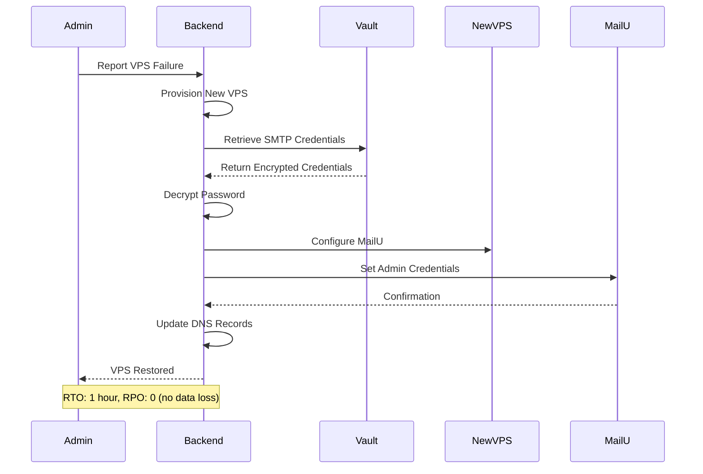

# Disaster Recovery Procedures

## Disaster Recovery Procedures

### Scenario 1: VPS Failure

If a VPS fails or needs to be replaced, SMTP credentials can be rapidly recovered from Vault:

**Recovery Process:**



**Implementation:**

```typescript
// Recover SMTP credentials to new VPS
async function recoverSmtpCredentialsToNewVps(
  tenantId: string,
  newVpsIp: string
): Promise<void> {
  // Retrieve credentials from Vault
  const vaultData = await vaultClient.read(`smtp/${tenantId}/admin`);
  const password = await decryptPassword(vaultData.password, tenantId);

  // Configure MailU on new VPS
  await configureMailU(newVpsIp, vaultData.username, password);

  // Verify MailU is accessible
  const isAccessible = await verifyMailUAccess(
    vaultData.webmail_url,
    vaultData.username,
    password
  );

  if (!isAccessible) {
    throw new Error('Failed to verify MailU access after recovery');
  }

  // Log recovery event
  await auditLog.create({
    event: 'smtp_credentials_recovered',
    tenant_id: tenantId,
    user_id: 'system',
    timestamp: new Date().toISOString(),
    details: {
      old_vps_ip: tenant.vps_ip,
      new_vps_ip: newVpsIp,
      recovery_type: 'vps_failure'
    }
  });
}

```

**Recovery Time Objective (RTO):** 1 hour
**Recovery Point Objective (RPO):** 0 (no data loss)

### Scenario 2: Vault Backup Restoration

If Vault itself fails, credentials can be restored from encrypted backups:

**Backup Strategy:**

- **Frequency:** Daily at 02:00 UTC

- **Retention:** 30 daily backups, 12 monthly backups

- **Storage:** Encrypted S3 bucket (AES-256-GCM)

- **Encryption Key:** Stored separately from backups

**Restoration Process:**

```typescript
// Restore Vault from backup
async function restoreVaultFromBackup(
  backupDate: string
): Promise<void> {
  // Download encrypted backup from S3
  const encryptedBackup = await s3.getObject({
    Bucket: 'penguinmails-vault-backups',
    Key: `backups/${backupDate}/vault-snapshot.enc`
  });

  // Decrypt backup
  const decryptedBackup = await decryptBackup(
    encryptedBackup,
    backupEncryptionKey
  );

  // Restore Vault snapshot
  await vaultClient.sys.restore(decryptedBackup);

  // Verify all secrets accessible
  const testTenantId = 'test-tenant-id';
  const testSecret = await vaultClient.read(`smtp/${testTenantId}/admin`);

  if (!testSecret) {
    throw new Error('Vault restoration verification failed');
  }

  // Log restoration event
  await auditLog.create({
    event: 'vault_restored_from_backup',
    user_id: 'system',
    timestamp: new Date().toISOString(),
    details: {
      backup_date: backupDate,
      restoration_time: new Date().toISOString()
    }
  });
}

```

**Recovery Time Objective (RTO):** 30 minutes
**Recovery Point Objective (RPO):** 24 hours (daily backups)

### Scenario 3: Credential Compromise

If SMTP credentials are compromised, immediate rotation is required:

**Compromise Response:**

```typescript
// Respond to credential compromise
async function respondToCredentialCompromise(
  tenantId: string,
  incidentId: string,
  compromiseDetails: string
): Promise<void> {
  // Immediately rotate credentials
  await emergencyResetSmtpCredentials(
    tenantId,
    'system',
    incidentId,
    `Credential compromise: ${compromiseDetails}`
  );

  // Notify tenant
  await sendTenantNotification(tenantId, {
    type: 'security_incident',
    subject: 'SMTP Credentials Rotated - Security Incident',
    message: `Your SMTP credentials have been rotated due to a security incident.
              Incident ID: ${incidentId}.
              No action required on your part.`
  });

  // Notify security team
  await sendSecurityAlert({
    type: 'credential_compromise_response',
    tenant_id: tenantId,
    incident_id: incidentId,
    details: compromiseDetails,
    action_taken: 'emergency_rotation'
  });

  // Log incident response
  await auditLog.create({
    event: 'credential_compromise_response',
    tenant_id: tenantId,
    user_id: 'system',
    timestamp: new Date().toISOString(),
    severity: 'critical',
    details: {
      incident_id: incidentId,
      compromise_details: compromiseDetails,
      action_taken: 'emergency_rotation'
    }
  });
}

```

**Response Time:** Immediate (< 5 minutes)
**Impact:** Zero downtime (MailU supports immediate password change)
