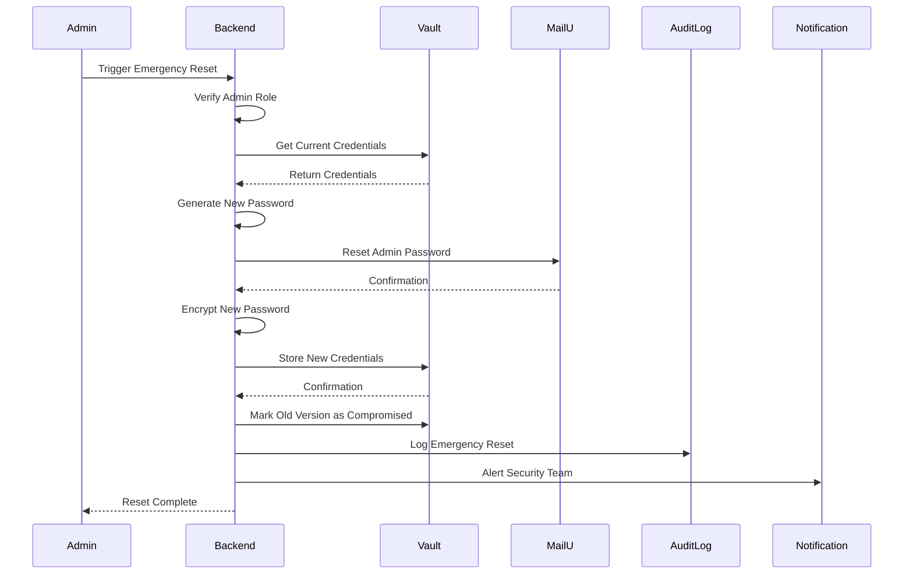

# Emergency Credential Reset

## Emergency Credential Reset

### Reset Workflow

In case of security incident or credential compromise, admins can perform an emergency reset:

**Emergency Reset Process:**



**Implementation:**

```typescript
// Emergency reset endpoint
async function emergencyResetSmtpCredentials(
  tenantId: string,
  adminUserId: string,
  incidentId: string,
  reason: string
): Promise<SmtpCredentials> {
  // Verify admin role
  const admin = await verifyAdminRole(adminUserId);
  if (!admin.hasRole('platform-admin')) {
    throw new Error('Insufficient permissions');
  }

  // Get current credentials
  const vaultData = await vaultClient.read(`smtp/${tenantId}/admin`);

  // Generate new password (stronger for emergency reset)
  const newPassword = crypto.randomBytes(48).toString('base64');

  // Reset MailU password (bypass current password)
  await resetMailUPasswordEmergency(
    tenant.vps_ip,
    vaultData.username,
    newPassword
  );

  // Encrypt new password
  const encryptedPassword = await encryptPassword(newPassword, tenantId);

  // Store new credentials in Vault
  await vaultClient.write(`smtp/${tenantId}/admin`, {
    ...vaultData,
    password: encryptedPassword,
    last_rotated: new Date().toISOString()
  });

  // Mark old version as compromised
  await vaultClient.metadata.put(`smtp/${tenantId}/admin`, {
    custom_metadata: {
      compromised: 'true',
      incident_id: incidentId,
      reset_by: adminUserId,
      reset_at: new Date().toISOString()
    }
  });

  // Log emergency reset
  await auditLog.create({
    event: 'smtp_credentials_emergency_reset',
    tenant_id: tenantId,
    user_id: adminUserId,
    timestamp: new Date().toISOString(),
    severity: 'critical',
    details: {
      incident_id: incidentId,
      reason: reason
    }
  });

  // Alert security team
  await sendSecurityAlert({
    type: 'smtp_credentials_reset',
    tenant_id: tenantId,
    incident_id: incidentId,
    admin_user: admin.email,
    reason: reason
  });

  // Return new credentials (one-time display)
  return {
    username: vaultData.username,
    password: newPassword,
    webmail_url: vaultData.webmail_url,
    expires_at: new Date(Date.now() + 15 * 60 * 1000)
  };
}

```

**UI Component:**

```typescript
// Emergency reset button (requires confirmation)
<Button
  variant="danger"
  onClick={() => {
    const incidentId = prompt('Enter incident ID:');
    const reason = prompt('Enter reason for emergency reset:');

    if (incidentId && reason) {
      emergencyResetSmtpCredentials(tenantId, adminUserId, incidentId, reason);
    }
  }}
>
  Emergency Reset
</Button>

```

