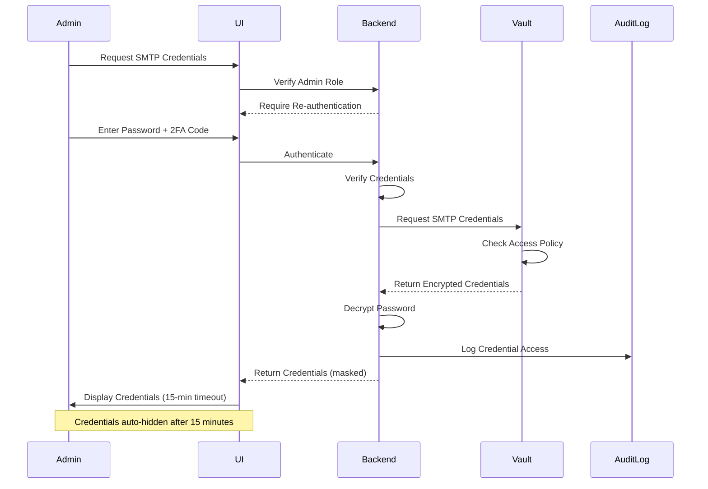

# Credential Retrieval

## Credential Retrieval

### Admin Troubleshooting Access

PenguinMails administrators can retrieve SMTP credentials for troubleshooting purposes with strict security controls:

**Access Requirements:**

- Admin role with `support-team` Vault policy

- Re-authentication required (password + 2FA)

- Time-limited access (15-minute session)

- All access logged in audit trail

**Retrieval Workflow:**



**Implementation:**

```typescript
// API endpoint for admin credential retrieval
async function retrieveSmtpCredentials(
  tenantId: string,
  adminUserId: string,
  reauthToken: string
): Promise<SmtpCredentials> {
  // Verify admin role
  const admin = await verifyAdminRole(adminUserId);
  if (!admin.hasRole('support-team')) {
    throw new Error('Insufficient permissions');
  }

  // Verify re-authentication token
  const isValid = await verifyReauthToken(reauthToken, adminUserId);
  if (!isValid) {
    throw new Error('Re-authentication required');
  }

  // Retrieve credentials from Vault
  const vaultData = await vaultClient.read(`smtp/${tenantId}/admin`);

  // Decrypt password
  const decryptedPassword = await decryptPassword(
    vaultData.password,
    tenantId
  );

  // Log credential access
  await auditLog.create({
    event: 'smtp_credentials_accessed',
    tenant_id: tenantId,
    user_id: adminUserId,
    timestamp: new Date().toISOString(),
    ip_address: req.ip,
    user_agent: req.headers['user-agent']
  });

  // Return credentials with time-limited access
  return {
    username: vaultData.username,
    password: decryptedPassword,
    webmail_url: vaultData.webmail_url,
    expires_at: new Date(Date.now() + 15 * 60 * 1000) // 15 minutes
  };
}

```
