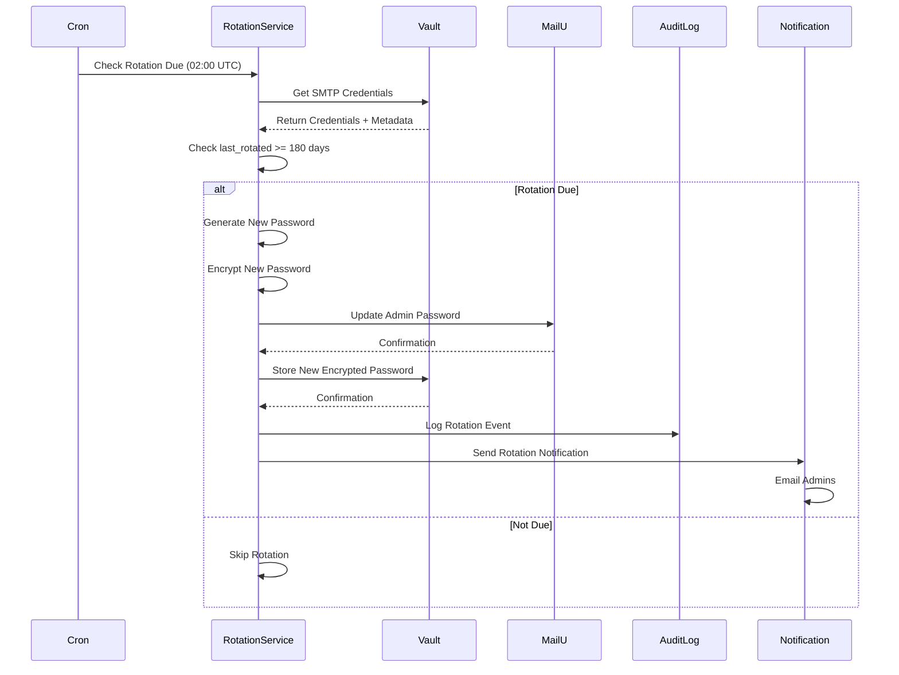

# Automated Credential Rotation

## Automated Credential Rotation

### 180-Day Rotation Policy

SMTP credentials are automatically rotated every 180 days to maintain security:

**Rotation Schedule:**

- **Frequency:** Every 180 days

- **Trigger:** Automated cron job (daily check at 02:00 UTC)

- **Downtime:** Zero (MailU supports immediate password change)

- **Notification:** Email to admins 7 days before rotation

**Rotation Workflow:**



**Implementation:**

```typescript
// Automated rotation service (runs daily)
async function checkAndRotateSmtpCredentials(): Promise<void> {
  // Get all tenants with SMTP credentials
  const tenants = await getTenantsWith SmtpCredentials();

  for (const tenant of tenants) {
    // Get credentials from Vault
    const vaultData = await vaultClient.read(`smtp/${tenant.id}/admin`);

    // Check if rotation is due
    const lastRotated = new Date(vaultData.last_rotated);
    const daysSinceRotation = (Date.now() - lastRotated.getTime()) / (1000 * 60 * 60 * 24);

    if (daysSinceRotation >= 180) {
      // Rotation due - execute rotation
      await rotateSmtpCredentials(tenant.id);
    } else if (daysSinceRotation >= 173) {
      // 7 days before rotation - send notification
      await sendRotationNotification(tenant.id, 180 - daysSinceRotation);
    }
  }
}

// Rotate SMTP credentials for a tenant
async function rotateSmtpCredentials(tenantId: string): Promise<void> {
  // Get current credentials
  const vaultData = await vaultClient.read(`smtp/${tenantId}/admin`);
  const currentPassword = await decryptPassword(vaultData.password, tenantId);

  // Generate new password
  const newPassword = crypto.randomBytes(32).toString('base64');

  // Update MailU password
  await updateMailUPassword(
    tenant.vps_ip,
    vaultData.username,
    currentPassword,
    newPassword
  );

  // Encrypt new password
  const encryptedPassword = await encryptPassword(newPassword, tenantId);

  // Update Vault with new password
  await vaultClient.write(`smtp/${tenantId}/admin`, {
    ...vaultData,
    password: encryptedPassword,
    last_rotated: new Date().toISOString()
  });

  // Log rotation event
  await auditLog.create({
    event: 'smtp_credentials_rotated',
    tenant_id: tenantId,
    user_id: 'system',
    timestamp: new Date().toISOString(),
    details: {
      rotation_type: 'automated',
      previous_rotation: vaultData.last_rotated
    }
  });

  // Send notification to admins
  await sendRotationCompletedNotification(tenantId);
}

```

### Manual Rotation

Admins can manually trigger credential rotation at any time:

**Use Cases:**

- Security incident (suspected credential compromise)

- Compliance requirement (immediate rotation)

- Troubleshooting (reset to known state)

**Manual Rotation Workflow:**

```typescript
// API endpoint for manual rotation
async function manualRotateSmtpCredentials(
  tenantId: string,
  adminUserId: string,
  reason: string
): Promise<void> {
  // Verify admin role
  const admin = await verifyAdminRole(adminUserId);
  if (!admin.hasRole('platform-admin')) {
    throw new Error('Insufficient permissions');
  }

  // Execute rotation
  await rotateSmtpCredentials(tenantId);

  // Log manual rotation with reason
  await auditLog.create({
    event: 'smtp_credentials_rotated',
    tenant_id: tenantId,
    user_id: adminUserId,
    timestamp: new Date().toISOString(),
    details: {
      rotation_type: 'manual',
      reason: reason
    }
  });
}

```

**UI Component:**

```typescript
// Manual rotation button in admin dashboard
<Button
  variant="danger"
  onClick={() => {
    if (confirm('Rotate SMTP credentials? This will update the MailU password immediately.')) {
      manualRotateSmtpCredentials(tenantId, adminUserId, 'Manual rotation by admin');
    }
  }}
>
  Rotate Credentials Now
</Button>

```

