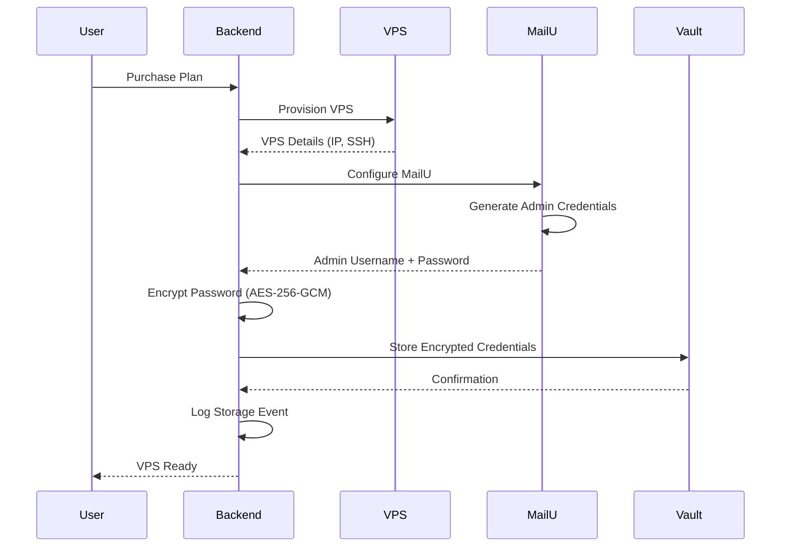

# Credential Storage Workflow

## Credential Storage Workflow

### Initial Storage (During MailU Setup)

When a new VPS is provisioned and MailU is configured, SMTP credentials are automatically stored in Vault:



**Implementation Steps:**

1. **Generate MailU Admin Credentials**

   ```typescript
   // Generate secure random password
   const password = crypto.randomBytes(32).toString('base64');
   const username = `admin@${domain}`;

   // Configure MailU with credentials
   await configureMailU(vpsIp, username, password);
   ```

2. **Encrypt Password**

   ```typescript
   // Encrypt password before Vault storage
   const encryptedPassword = await encryptPassword(password, tenantId);
   ```

3. **Store in Vault**

   ```typescript
   // Store credentials in Vault
   await vaultClient.write(`smtp/${tenantId}/admin`, {
     username: username,
     password: encryptedPassword,
     webmail_url: `https://mail.${domain}`,
     created_at: new Date().toISOString(),
     last_rotated: new Date().toISOString(),
     rotation_policy: '180_days'
   });
   ```

4. **Audit Logging**

   ```typescript
   // Log credential storage event
   await auditLog.create({
     event: 'smtp_credentials_stored',
     tenant_id: tenantId,
     user_id: 'system',
     timestamp: new Date().toISOString(),
     details: {
       username: username,
       webmail_url: `https://mail.${domain}`
     }
   });
   ```
