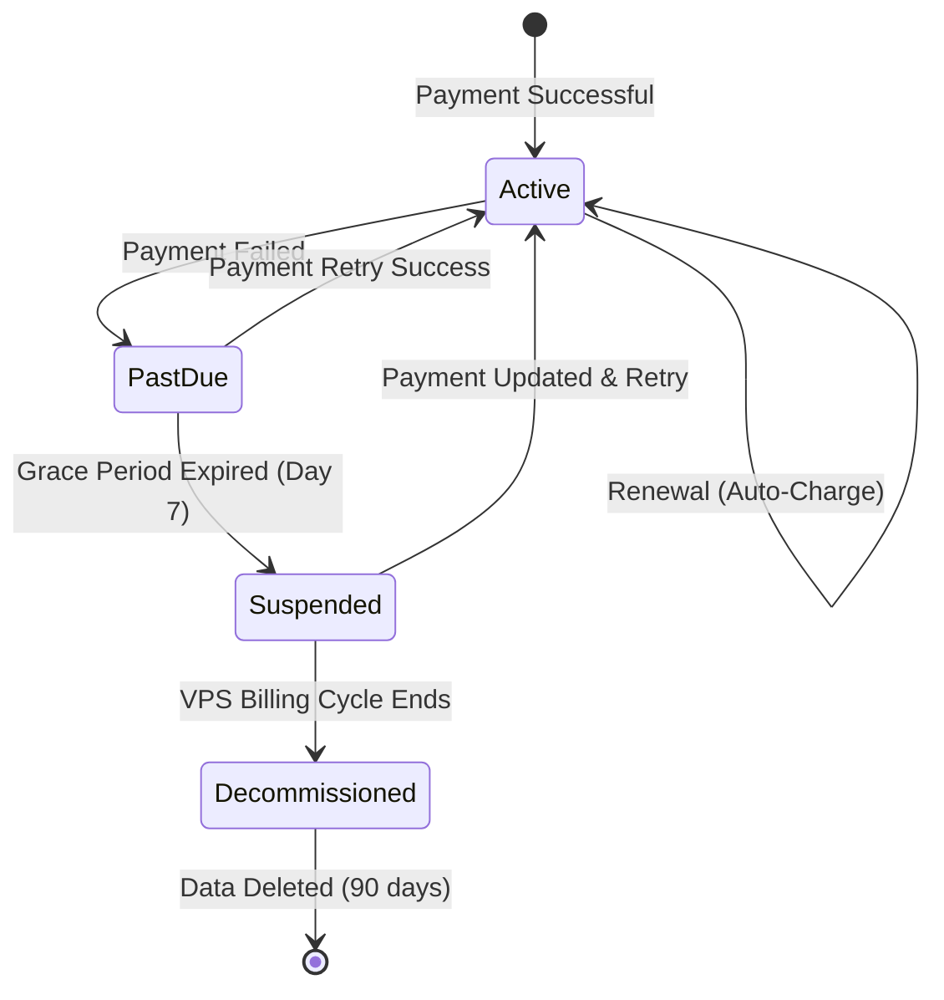
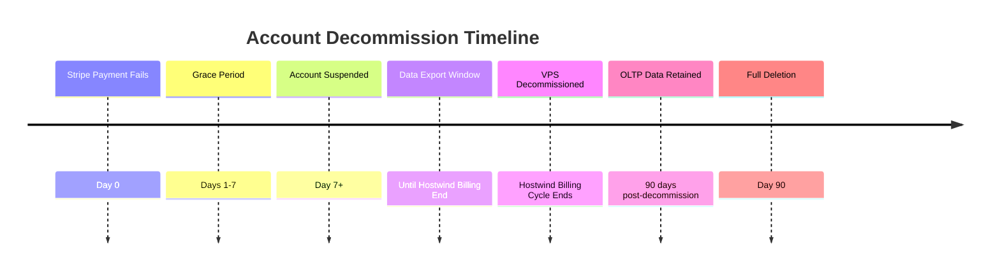

# Account Lifecycle

**Understanding subscription states, payment handling, and infrastructure decommissioning.**

---

## Overview

This document covers the complete lifecycle of a PenguinMails account from active subscription through potential suspension and decommissioning. Understanding these flows helps tenants maintain uninterrupted service and plan for data management.

### Lifecycle States



---

## Subscription Renewal

### Automatic Billing

**Subscriptions renew automatically** via Stripe on the billing date.

**How It Works:**

1. Stripe charges the card on file on `current_period_end` date
2. If successful: Period extends, tenant continues without interruption
3. Webhook `invoice.paid` → PenguinMails updates subscription status

**View Next Billing Date:**

Navigate to **Settings → Billing** to see:

- Current plan and pricing
- Next billing date
- Payment method on file

**Update Payment Method:**

1. Go to **Settings → Billing → Manage Payment**
2. Opens Stripe Customer Portal
3. Add/update card, set as default
4. Changes apply to next billing cycle

> [!TIP]
> Update your payment method **before** the billing date to avoid failed payments.

---

## Failed Payments

### Grace Period (Days 0-7)

When a payment fails, you have **7 days** to resolve it before service interruption.

**What Happens:**

| Timeline | Status | Operations | User Actions |
|----------|--------|------------|--------------|
| Day 0 | Past Due | ✅ Full access | Email notification sent |
| Day 3 | Past Due | ✅ Full access | Automatic retry #1 |
| Day 5 | Past Due | ✅ Full access | Automatic retry #2 |
| Day 7 | Past Due | ✅ Full access | Final retry, then suspension |

**Dashboard Indicators:**

- 🔴 Red banner: "Payment failed. Update payment method."
- Countdown timer showing days until suspension
- One-click "Update Payment & Retry" button

**User Actions During Grace Period:**

1. **Update Payment Method** → Settings → Billing → Manage Payment
2. **Retry Payment** → Click "Retry Now" in dashboard banner
3. **Contact Support** → If you believe this is an error

### Retry Logic

Stripe automatically retries failed payments:

- **Day 0**: Initial failure
- **Day 3**: First retry (different time of day)
- **Day 5**: Second retry
- **Day 7**: Final retry before suspension

> [!NOTE]
> You can manually retry at any time after updating your payment method.

---

## Account Suspension

### When Suspension Occurs

If all payment retries fail and 7 days have passed:

**Status Changes:**

- Account status: `suspended`
- Access: **Read-only mode**
- Email sending: **Paused**
- Campaigns: **Paused** (queued emails held)

**What You CAN Do:**

- ✅ Log in and view dashboard
- ✅ View contacts, templates, campaigns
- ✅ Export your data (CSV, JSON)
- ✅ Update payment method

**What You CANNOT Do:**

- ❌ Send emails
- ❌ Create new campaigns
- ❌ Add domains or team members
- ❌ Modify settings

### Reactivation

**To restore full access:**

1. Go to **Settings → Billing**
2. Click **"Update Payment Method"**
3. Enter valid card in Stripe Customer Portal
4. Click **"Reactivate Subscription"**
5. Immediate restoration of full access

> [!IMPORTANT]
> Outstanding balance (failed payment amount) will be charged immediately upon reactivation.

---

## VPS Decommissioning

### Understanding the Timeline

PenguinMails provisions a dedicated VPS for each tenant's email infrastructure. The decommission timeline is tied to **Hostwind's monthly billing cycle**.



### Data Export Window

**Between suspension and VPS decommission:**

You have until your VPS billing cycle ends to export critical data.

**Export Available:**

| Data Type | Format | Location |
|-----------|--------|----------|
| Contacts | CSV, JSON | Dashboard → Contacts → Export |
| Campaign History | CSV | Dashboard → Campaigns → Export |
| Templates | JSON | Dashboard → Templates → Export |
| Analytics | CSV | Dashboard → Analytics → Export |
| Account Settings | JSON | Settings → Export Data |

> [!WARNING]
> **Email data stored on VPS (mailboxes, logs) cannot be exported after decommission.** Export critical data during the window.

### What Happens at Decommission

**VPS Destruction:**

When the Hostwind billing cycle ends without payment:

1. VPS instance terminated
2. Dedicated IP released back to pool
3. Email mailbox content **permanently deleted**
4. SMTP logs **permanently deleted**

**Data Retained in OLTP (90 days):**

- Contact lists
- Campaign metadata
- Template definitions
- User accounts
- Analytics summaries
- Billing history

**After 90 Days:**

- All OLTP data permanently deleted
- Account cannot be recovered
- Must register as new customer

### Preventing Decommission

**At any point before VPS decommission:**

1. Update payment method
2. Pay outstanding balance
3. Account reactivated
4. VPS continues running (no data loss)

---

## API Reference

### Check Subscription Status

```javascript
GET /api/v1/billing/subscription

Response:
{
  "status": "active" | "past_due" | "suspended" | "canceled",
  "current_period_end": "2025-12-24T00:00:00Z",
  "days_until_suspension": null | 5,
  "can_send_emails": true | false,
  "infrastructure_status": "active" | "suspended" | "scheduled_decommission"
}
```

### Get Decommission Schedule

```javascript
GET /api/v1/infrastructure/status

Response:
{
  "vps_status": "active" | "scheduled_decommission",
  "decommission_scheduled_for": "2025-12-31T00:00:00Z" | null,
  "data_export_deadline": "2025-12-30T00:00:00Z" | null,
  "oltp_deletion_date": "2026-03-31T00:00:00Z" | null
}
```

---

## Related Documentation

### Payments

- **[Stripe Integration](/docs/features/payments/stripe-integration)** - Payment processing and webhooks
- **[Subscription Management](/docs/features/payments/subscription-management)** - Plan upgrades and downgrades
- **[Billing Dashboard](/docs/features/payments/billing-dashboard)** - Usage and invoices

### Infrastructure

- **[Hostwind Management](/docs/features/infrastructure/hostwind-management)** - VPS lifecycle
- **[Vault SSH Management](/docs/features/infrastructure/vault-ssh-management)** - SSH key handling

### Compliance

- **[Data Privacy](/docs/features/compliance/data-privacy)** - Data retention policies
- **[GDPR Compliance](/docs/features/compliance/gdpr-compliance)** - Right to data export

---

**Last Updated:** December 5, 2025
**Grace Period:** 7 days
**OLTP Retention:** 90 days post-cancellation

*Maintain an active subscription to ensure uninterrupted email service and data retention.*
