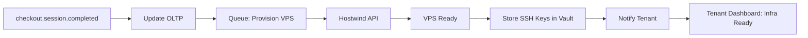

---
title: "Stripe Integration"
description: "Stripe payment processing for secure subscription billing in PenguinMails"
last_modified_date: "2025-11-24"
level: "2"
persona: "Developers, Billing Administrators"
status: "ACTIVE"
category: "Payments"
---

# Stripe Integration

**Secure, PCI-compliant payment processing powered by Stripe.**

---

## Overview

PenguinMails uses [Stripe](https://stripe.com) as our payment processor to handle all subscription billing, ensuring secure, reliable, and compliant payment processing.

### Why Stripe?

- **Security** - PCI DSS Level 1 compliant (highest security standard)

- **Global** - Supports 135+ currencies and payment methods

- **Reliable** - 99.99% uptime SLA

- **No Card Storage** - PenguinMails never stores card details

- **Fraud Protection** - Advanced fraud detection built-in

- **Developer-Friendly** - Robust API and webhooks

---

## Level 1: Payment Flow

### How Payments Work

```text
User Signs Up
  ↓
Redirect to Stripe Checkout
  ↓
User Enters Payment Info (on Stripe's secure page)
  ↓
Stripe Processes Payment
  ↓
Stripe Sends Webhook to PenguinMails
  ↓
Subscription Activated
  ↓
User Redirected to Dashboard

```

**Security:** Card details never touch PenguinMails servers - all handled by Stripe.

---

## Integration Philosophy

### Stripe Checkout - Hosted Payment Pages

**PenguinMails uses Stripe Checkout** (not Stripe Elements) for all payment flows:

- **PCI Compliance**: Hosted pages mean card data never touches our servers
- **Mobile-Optimized**: Perfect experience on any device
- **Localized**: Automatic translation and currency conversion
- **Conversion-Optimized**: Stripe's best-converting checkout UI
- **Lower Maintenance**: No custom payment form code to maintain

### Dashboard-First Approach

**Self-service via Stripe Customer Portal:**

- Users manage subscriptions directly through Stripe's portal
- Update payment methods without PenguinMails involvement
- View billing history and download invoices
- Cancel subscriptions with automatic sync

**Benefits**:

- Reduced support burden
- Better UX (Stripe's specialized interface)
- Automatic compliance updates
- No custom billing UI to build

### Webhooks as Source of Truth

**All subscription state changes flow through webhooks:**

- Stripe sends webhook → PenguinMails updates database
- Never poll Stripe API for subscription status
- Real-time sync for all subscription lifecycle events
- Automatic retry and idempotency handling

**Key Events**:

- `checkout.session.completed`: Link Stripe subscription to tenant, update `stripe_customer_id`
- `invoice.paid`: Record payment in `payments` table
- `customer.subscription.updated`: Sync status, period end, cancellation flags
- `customer.subscription.deleted`: Handle subscription end

---

### Stripe Checkout

**Hosted checkout page** for seamless payment experience.

#### Checkout Features

- ✅ **Mobile-optimized** - Perfect on any device

- ✅ **Multiple payment methods** - Credit/debit cards,Apple Pay, Google Pay

- ✅ **Localized** - Available in 25+ languages

- ✅ **Tax calculation** - Automatic tax computation

- ✅ **Saved payment methods** - Quick checkout for returning users

#### Implementation

```javascript
// Create Checkout Session
POST /api/v1/billing/checkout
Authorization: Bearer {api_key}

{
  "plan": "professional",
  "billing_cycle": "monthly",
  "success_url": "https://app.penguinmails.com/billing/success",
  "cancel_url": "https://app.penguinmails.com/billing/cancel"
}

Response:
{
  "checkout_url": "https://checkout.stripe.com/c/pay/cs_test_..."
}

```

---

## Level 2: Subscription Management

### Creating Subscriptions

**Automatic subscription creation** via Stripe Checkout.

1. User selects plan

2. Redirected to Stripe Checkout

3. Enters payment information

4. Stripe creates subscription

5. Webhook notifies PenguinMails

6. Subscription activated in database

### Updating Payment Methods

**Update card without subscription interruption.**

**Customer Portal:**

```javascript
POST /api/v1/billing/portal
Authorization: Bearer {api_key}

Response:
{
  "portal_url": "https://billing.stripe.com/p/session/cs_..."
}

```

**Users can:**

- Update payment method

- View billing history

- Download invoices

- Update billing address

---

### Handling Failed Payments

**Automatic retry logic** for declined payments.

#### Retry Schedule

- **Day 0:** Payment fails, email notification sent

- **Day 3:** First retry attempt

- **Day 5:** Second retry attempt

- **Day 7:** Third retry attempt, account suspended

- **Day 14:** Final retry, subscription canceled if fails

**User Actions:**

- Update payment method anytime

- Retry payment manually

- Contact support for assistance

---

## Level 3: Webhooks & Sync

### Stripe Webhooks

**Real-time subscription state sync** via webhooks.

#### Webhook Endpoint

```text
POST https://api.penguinmails.com/webhooks/stripe
Header: stripe-signature: {signature}

```

#### Handled Events

```javascript
// Subscription Events

- customer.subscription.created

- customer.subscription.updated

- customer.subscription.deleted

- customer.subscription.trial_will_end

// Payment Events

- invoice.paid

- invoice.payment_failed

- invoice.payment_action_required

// Customer Events

- customer.updated

- customer.deleted

```

#### Event Processing

```javascript
// Example: Subscription Created
{
  "type": "customer.subscription.created",
  "data": {
    "object": {
      "id": "sub_abc123",
      "customer": "cus_xyz789",
      "status": "active",
      "plan": {
        "id": "price_professional_monthly",
        "amount": 14900 // $149.00 in cents
      },
      "current_period_end": 1735027200
    }
  }
}

// PenguinMails Action:
// 1. Verify webhook signature
// 2. Update tenant subscription status
// 3. Activate features for plan tier
// 4. Send confirmation email
// 5. Log event in audit trail

```

---

### Post-Payment Infrastructure Provisioning

**After successful payment, PenguinMails automatically provisions tenant infrastructure.**



#### Provisioning Workflow

**Triggered by:** `checkout.session.completed` webhook

1. **OLTP Update**: Subscription status set to `active`, `stripe_customer_id` linked
2. **Queue Job**: VPS provisioning job enqueued (async, background)
3. **Hostwind API**: Create VPS with tenant configuration
4. **Wait for IP**: Poll until public IP assigned (~2-5 minutes)
5. **DNS Setup**: Configure A records and rDNS (PTR)
6. **Vault Storage**: Store admin + tenant SSH keys in Vault
7. **Email Notification**: Tenant notified that infrastructure is ready
8. **Dashboard Access**: Infrastructure section unlocked in tenant dashboard

#### What Tenants See

**After payment confirmation:**

- Dashboard shows "Infrastructure provisioning..." status
- Email notification when VPS is ready (~5-10 minutes)
- Infrastructure tab unlocked with:
  - VPS IP address
  - SSH access information (via Vault credentials viewer)
  - Domain setup wizard
  - SMTP configuration

#### Error Handling

If VPS provisioning fails:

- Job retries 3 times with exponential backoff
- Alert sent to operations team
- Tenant sees "Provisioning delayed - we're on it" message
- Manual intervention if all retries fail

---

### Subscription Status Sync

**Database schema for subscription state:**

```sql
CREATE TABLE subscriptions (
    id UUID PRIMARY KEY DEFAULT gen_random_uuid(),
    tenant_id UUID REFERENCES tenants(id) ON DELETE CASCADE,
    plan_id UUID REFERENCES plans(id),
    pending_plan_id UUID REFERENCES plans(id),
    status VARCHAR(50) CHECK (status IN ('active', 'past_due', 'canceled', 'unpaid')),
    current_period_start TIMESTAMP WITH TIME ZONE,
    current_period_end TIMESTAMP WITH TIME ZONE,
    cancel_at_period_end BOOLEAN DEFAULT FALSE,
    cancel_reason TEXT,  -- User-provided cancellation reason
    cancel_date TIMESTAMP WITH TIME ZONE,  -- When cancellation was initiated
    billing_contact_user_id UUID REFERENCES users(id),
    stripe_subscription_id VARCHAR(255),
    created TIMESTAMP WITH TIME ZONE DEFAULT NOW(),
    updated TIMESTAMP WITH TIME ZONE DEFAULT NOW()
);

```

**Key Fields**:

- `stripe_subscription_id`: Links to Stripe subscription object
- `status`: Synced from Stripe subscription status
- `current_period_end`: Next billing date = `current_period_end + 1 day`
- `cancel_at_period_end`: User canceled but active until period end
- `cancel_reason`: For churn analysis ("Too expensive", "Missing features", etc.)
- `cancel_date`: When cancellation was initiated

**Note on Table Name**: The subscription table is called `subscriptions` (not `tenant_subscriptions` or `company_billing`), consistent with other OLTP tables.

---

## Billing Dashboard Integration

### Invoices

**Automatic invoice generation** via Stripe.

- **Auto-generated** - Every billing cycle

- **Email delivery** - Sent to billing email

- **PDF download** - Available in customer portal

- **Itemized** - Subscription + usage charges + taxes

### Payment History

**Complete transaction history:**

```javascript
GET /api/v1/billing/payments
Authorization: Bearer {api_key}

Response:
{
  "payments": [
    {
      "id": "pi_abc123",
      "amount": 149.00,
      "currency": "USD",
      "status": "succeeded",
      "description": "Professional Plan - Monthly",
      "created": "2025-11-24T10:30:00Z",
      "receipt_url": "https://stripe.com/receipts/..."
    }
  ]
}

```

---

---

## Environment Configuration

### Required Environment Variables

**PenguinMails requires the following Stripe environment variables:**

```bash
# Stripe API Keys
STRIPE_SECRET_KEY=sk_live_xxxxx...  # or sk_test_xxxxx for testing
NEXT_PUBLIC_STRIPE_PUBLISHABLE_KEY=pk_live_xxxxx...  # or pk_test_xxxxx

# Webhook Configuration
STRIPE_WEBHOOK_SIGNING_SECRET=whsec_xxxxx...

# Application URLs
NEXT_PUBLIC_APP_URL=https://app.penguinmails.com  # or http://localhost:3000 for development
```

### Setup Steps

## 1. Create Stripe Account

- Sign up at [stripe.com](https://stripe.com)
- Complete business verification (required for live mode)
- Enable Customer Portal in Stripe Dashboard → Settings → Customer Portal

## 2. Retrieve API Keys

- Navigate to Stripe Dashboard → Developers → API keys
- Copy "Secret key" to `STRIPE_SECRET_KEY`
- Copy "Publishable key" to `NEXT_PUBLIC_STRIPE_PUBLISHABLE_KEY`

## 3. Configure Webhooks

- Go to Stripe Dashboard → Developers → Webhooks
- Click "Add endpoint"
- Endpoint URL: `https://api.penguinmails.com/webhooks/stripe`
- Select events to listen for:
  - `checkout.session.completed`
  - `invoice.paid`
  - `invoice.payment_failed`
  - `customer.subscription.created`
  - `customer.subscription.updated`
  - `customer.subscription.deleted`
- Copy "Signing secret" to `STRIPE_WEBHOOK_SIGNING_SECRET`

## 4. Test Configuration

```bash
# Install Stripe CLI for local testing
brew install stripe/stripe-cli/stripe

# Login to Stripe
stripe login

# Forward webhooks to local development
stripe listen --forward-to localhost:3000/api/webhooks/stripe

# Test webhook delivery
stripe trigger checkout.session.completed
```

---

## Security & Compliance

### PCI Compliance

**PenguinMails is PCI DSS compliant** by using Stripe.

- ✅ **No card data stored** - Stripe handles all card info

- ✅ **Tokenization** - Only store Stripe tokens

- ✅ **Secure transmission** - TLS 1.3 encryption

- ✅ **Annual audits** - Stripe maintains compliance

### SCA (Strong Customer Authentication)

**European regulation compliance** for card payments.

- **3D Secure** - Built into Stripe Checkout

- **Automatic handling** - Stripe manages SCA requirements

- **Fallback methods** - Alternative authentication if needed

---

## Related Documentation

### Payments

- **[Subscription Management](/docs/features/payments/subscription-management)** - Plan details and management

- **[Billing Dashboard](/docs/features/payments/billing-dashboard)** - Usage and invoices

- **[Payments Overview](https://github.com/penguinmails/penguinmails.github.io/blob/main/README.md)** - All payment features

### Technical

- **[Stripe API Documentation](/docs/implementation-technical/integration/stripe)** - Technical integration details

- **[Webhook Handling](/docs/implementation-technical/api/platform-api/webhooks)** - Webhook implementation

### Support

- **[Billing FAQ](/docs/business/faq/billing-faq)** - Common questions

- **[Contact Support](mailto:support@penguinmails.com)** - Payment issues

---

**Last Updated:** November 24, 2025
**Stripe API Version:** 2023-10-16
**Compliance:** PCI DSS Level 1, SCA compliant

*All payments are processed securely by Stripe. PenguinMails never stores credit card information.*
