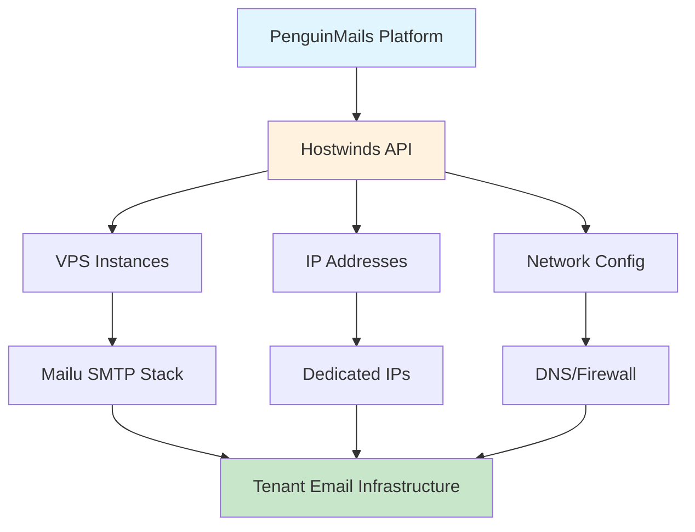

# Hostwinds API Overview

---
title: "Hostwinds Cloud API Integration"
description: "Overview of Hostwinds VPS and infrastructure API integration for PenguinMails server management"
last_modified_date: "2025-11-19"
level: "2"
persona: "Documentation Users"
---

**For Platform Engineers and DevOps Teams**: Strategic overview of Hostwinds API integration for VPS provisioning, IP management, and infrastructure automation

**Technical Authority**: Official Hostwinds Cloud API documentation is available at [https://developers.hostwinds.com/cloud/](https://developers.hostwinds.com/cloud/)

---

> [!WARNING]
> **API Limitations**: This documentation currently lacks information for required Hostwinds APIs regarding **VPS management**, **secondary IP**, **monitoring**, and **billing**. Refer to the official Hostwinds documentation for complete coverage.

---

## 🎯 Purpose and Scope

The Hostwinds Cloud API is PenguinMails' primary infrastructure provider for:

- **VPS Instance Provisioning**: Automated server creation and management
- **IP Address Management**: Dedicated IP allocation and configuration
- **Network Configuration**: DNS, firewall, and networking setup
- **Cost Management**: Billing cycle management and pricing queries

This API integration enables PenguinMails to:

1. **Automate Infrastructure**: Provision VPS instances on-demand for tenant workloads
2. **Manage Costs**: Track and optimize infrastructure spending through pricing APIs
3. **Ensure Reliability**: Monitor and maintain server health and performance
4. **Scale Efficiently**: Add capacity as tenant demand grows

---

## 🏗️ Integration Architecture

### Role in PenguinMails Infrastructure

### Key Integration Points

1. **Database Schema Integration**
   - `vps_instances.hostwinds_instance_id` - Links to Hostwinds server UUID
   - `vps_instances.approximate_cost` - Populated from Hostwinds pricing APIs
   - `smtp_ip_addresses.approximate_cost` - IP cost modeling

2. **Cost Modeling**
   - See [Infrastructure Overview](../../business/implementation/infrastructure-overview.md) for canonical cost model
   - Baseline: Hostwinds Unmanaged Linux VPS 1 CPU / 2 GB / 50 GB / 2 TB at **$9.99/month**
   - IP pricing: **$4.99/month per dedicated IP** (configurable constant)

3. **Automation Workflows**
   - Tenant onboarding → VPS provisioning → Mailu deployment
   - IP allocation → DNS configuration → warmup process
   - Billing reconciliation → cost tracking → margin analysis

---

## 📡 API Overview

### Base Configuration

- **Base URL**: `https://clients.hostwinds.com/cloud/api.php`
- **Protocol**: HTTP POST (all requests)
- **Data Format**: `application/x-www-form-urlencoded`
- **Authentication**: API Key (`API` field) in POST body

### Error Response Format

| Code | Status | Content | Notes |
| :---- | :---- | :---- | :---- |
| **200 OK** | "error" | `[ { "result": "error", "action": "...", "message": "<error_detail>", "ERROR": "<code-optional>" } ]` | **Critical:** Check the result field for "error". |
| **401/403** | N/A | `[ { "result": "error", "message": "Not Authorized!" } ]` | Authentication or permission failure. |

> [!IMPORTANT]
> Always check the `result` field in the response. A 200 status code does not guarantee success - the response body may contain `"result": "error"`.

---

## 🔧 API Functional Areas

### 1. Server Instance Management

Endpoints for creating, managing, and monitoring VPS instances.

**Key Operations**:
- Create and provision new servers
- Retrieve server details and status
- Start, stop, reboot instances
- Rebuild and repair servers
- Manage rescue mode

**Documentation**: [Hostwinds Server Management API](hostwinds-server-management-api.md)

**Common Use Cases**:
- Tenant onboarding: Create VPS for new tenant
- Maintenance: Reboot servers for updates
- Troubleshooting: Enter rescue mode for diagnostics

---

### 2. Networking and IP Management

Endpoints for managing IP addresses, networking, and firewall configuration.

**Key Operations**:
- Allocate and manage dedicated IPs
- Configure primary and secondary IPs
- Set reverse DNS (rDNS)
- Manage firewall profiles
- Regenerate network configuration

**Documentation**: [Hostwinds Networking API](hostwinds-networking-api.md)

**Common Use Cases**:
- IP allocation: Add dedicated IP for tenant
- DNS configuration: Set rDNS for deliverability
- Network troubleshooting: Regenerate networking

---

### 3. Upgrade, Billing, and Pricing

Endpoints for managing server upgrades, billing cycles, and pricing queries.

**Key Operations**:
- Upgrade server resources (CPU, RAM, disk)
- Change billing cycles
- Query pricing and plans
- Manage service levels (managed/unmanaged)
- Create upgrade orders and invoices

**Documentation**: [Hostwinds Upgrade & Billing API](hostwinds-upgrade-billing-api.md)

**Common Use Cases**:
- Capacity planning: Query available plans and pricing
- Resource scaling: Upgrade server for growing tenant
- Cost optimization: Change billing cycle for savings

---

### 4. Monitoring and Diagnostics

Endpoints for monitoring server health, logs, and performance.

**Key Operations**:
- Retrieve server logs and serial console
- Get server performance charts
- Check maintenance events
- Validate service IDs
- Monitor SMTP filters

**Documentation**: [Hostwinds Monitoring API](hostwinds-monitoring-api.md)

**Common Use Cases**:
- Troubleshooting: Access serial console logs
- Performance monitoring: Retrieve server metrics
- Maintenance planning: Check scheduled events

---

### 5. Automation Best Practices

Recommendations for reliable, secure, and efficient automation.

**Key Topics**:
- Error handling and retry strategies
- Asynchronous operation polling
- Security and credential management
- Rate limiting and efficiency
- Integration patterns

**Documentation**: [Hostwinds Automation Best Practices](hostwinds-automation-best-practices.md)

**Critical for**:
- Production automation scripts
- CI/CD pipeline integration
- Monitoring and alerting systems

---

## 🔗 Related Documentation

### Infrastructure Planning
- [Infrastructure Overview](../../business/implementation/infrastructure-overview.md) - Cost modeling and provider roles
- [Database Infrastructure](../database-infrastructure/business-leaders-database-migration-guide.md) - Schema integration and cost fields

### API Documentation
- [Central SMTP Operations API](central-smtp-operations-api.md) - Internal SMTP infrastructure management
- [Executive API](executive-api.md) - High-level business metrics and reporting

### Implementation Guides
- [Architecture Overview](../architecture-system/architecture-overview.md) - System architecture and integration points
- [Development Standards](../development-guidelines/development-standards.md) - API integration best practices

---

## 🚀 Getting Started

### For Platform Engineers

1. **Review API Authentication**: Understand API key management and security
2. **Study Server Management**: Learn instance lifecycle and operations
3. **Understand Cost Model**: Review pricing APIs and cost tracking
4. **Implement Error Handling**: Follow automation best practices

### For DevOps Teams

1. **Automation Setup**: Integrate Hostwinds API into deployment pipelines
2. **Monitoring Integration**: Set up health checks and alerting
3. **Cost Tracking**: Implement billing reconciliation workflows
4. **Disaster Recovery**: Plan for instance backup and restoration

### For Finance Teams

1. **Cost Modeling**: Understand `approximate_cost` field population
2. **Pricing Queries**: Use pricing APIs for budget planning
3. **Reconciliation**: Compare modeled costs with Hostwinds invoices
4. **Margin Analysis**: Track infrastructure costs per tenant

---

**Keywords**: Hostwinds API, VPS provisioning, infrastructure automation, IP management, cloud infrastructure, cost modeling, server management

---

*This API overview is part of the comprehensive Implementation Technical documentation. It provides strategic guidance for Hostwinds API integration and infrastructure automation.*
