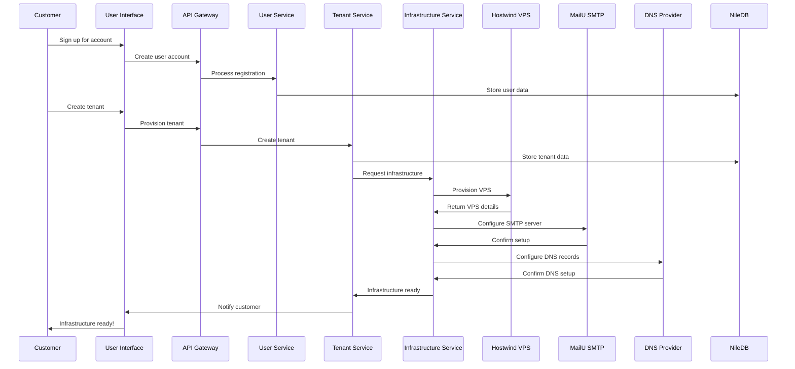
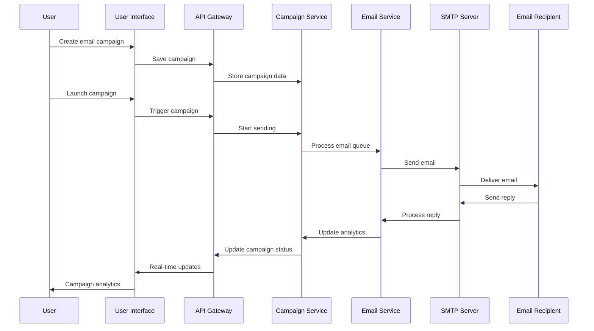

# Architecture Overview


## Strategic Alignment

**Strategic Alignment**: This comprehensive architecture overview supports our enterprise infrastructure framework by providing detailed technical specifications, system design principles, and architectural decisions for the PenguinMails multi-tenant cold email platform.

**Technical Authority**: Our multi-tenant, microservices architecture integrates with enterprise infrastructure platforms including Hostwinds VPS provisioning, MailU SMTP orchestration, NileDB database management, and comprehensive monitoring systems featuring automated scaling and performance optimization.

**Operational Excellence**: Backed by enterprise systems with 99.9% uptime guarantees, automated infrastructure provisioning, and comprehensive monitoring across all architectural components with real-time alerting capabilities.

**User Journey Integration**: This architectural foundation is part of your complete user experience - connects to business strategy decisions, compliance frameworks, and operational excellence procedures.

---


## Document Summary

This document provides a comprehensive overview of PenguinMails' technical architecture, designed for both technical and non-technical stakeholders. It explains how the system works, why certain decisions were made, and what trade-offs were considered in building a scalable cold email infrastructure platform.

---


## Executive Summary

PenguinMails is built on a **multi-tenant, microservices architecture** designed specifically for cold email infrastructure management. The system combines automated infrastructure provisioning, real-time deliverability monitoring, and intelligent campaign management in a unified platform.


### Key Architectural Decisions


- **Multi-tenant by design**: Each customer (tenant) gets complete data isolation while sharing efficient infrastructure


- **Email infrastructure specialization**: Built specifically for cold email deliverability, not general email marketing


- **Automation-first approach**: Minimize manual operations through intelligent automation


- **Compliance built-in**: GDPR, CAN-SPAM, and international compliance as core architecture features


- **Real-time monitoring**: Continuous monitoring of deliverability, performance, and system health

---


## System Architecture Overview


### High-Level Architecture Diagram


```markdown
                    ┌─────────────────────────────────────────────────────────────┐
                    │                    PENGUINMAILS PLATFORM                    │
                    └─────────────────────────────────────────────────────────────┘
                                             │
                    ┌────────────────────────┼────────────────────────┐
                    │                        │                        │
         ┌──────────▼──────────┐  ┌──────────▼──────────┐  ┌────────▼────────┐
         │   USER INTERFACE    │  │    API GATEWAY      │  │  EXTERNAL       │
         │                     │  │                     │  │  SERVICES       │
         │ • Landing Page      │  │ • Authentication    │  │                 │
         │ • User Dashboard    │  │ • Rate Limiting     │  │ • Hostwind VPS  │
         │ • Admin Panel       │  │ • Load Balancing    │  │ • MailU SMTP    │
         │ • Knowledge Base    │  │ • Request Routing   │  │ • Stripe        │
         │                     │  │                     │  │ • NileDB        │
         └──────────┬──────────┘  └──────────┬──────────┘  └────────┬────────┘
                    │                        │                      │
                    └─────────────┬──────────┼──────────────────────┘
                                  │          │
                    ┌─────────────▼───────────▼─────────────────┐
                    │               CORE SERVICES                │
                    │                                             │
                    │ • User Management        • Campaign Engine │
                    │ • Tenant Management      • Email Processor │
                    │ • Infrastructure Mgmt    • Analytics       │
                    │ • Billing & Subscriptions• Notifications    │
                    │                                             │
                    └─────────────┬─────────────────────────────┘
                                  │
                    ┌─────────────▼─────────────────────────────┐
                    │           INFRASTRUCTURE LAYER            │
                    │                                             │
                    │ • VPS Management      • DNS Configuration │
                    │ • SMTP Servers       • IP Pool Management │
                    │ • Database (PostgreSQL) • Monitoring     │
                    │ • Cache (Redis)      • Backup Systems    │
                    │                                             │
                    └─────────────────────────────────────────────┘


```

---


## Core System Components


### 1. User Interface Layer


#### Landing Page & Marketing Site

**Purpose**: Customer acquisition and information
**Technology**: Static site with dynamic content
**Key Features**:


- SEO-optimized content for each target segment


- Interactive pricing calculator


- Customer testimonials and case studies


- Blog and resource center


#### User Application Dashboard

**Purpose**: Primary customer interface
**Technology**: React.js with TypeScript
**Key Features**:


- Real-time infrastructure monitoring


- Campaign management and analytics


- Team and tenant management


- Billing and subscription management


#### Admin Panel

**Purpose**: Platform management and monitoring
**Technology**: React.js with administrative interface
**Key Features**:


- System health monitoring


- Customer management


- Infrastructure oversight


- Compliance reporting


### 2. API Gateway & Services


#### API Gateway

**Purpose**: Single entry point for all API requests
**Responsibilities**:


- Authentication and authorization


- Rate limiting and throttling


- Request routing to appropriate services


- Response caching and optimization


- Request/response logging and monitoring


#### Core Services Architecture

**User Management Service**


- User registration and authentication


- Profile management


- Password reset and security features


- Session management

**Tenant Management Service**


- Multi-tenant data isolation


- Tenant configuration and settings


- Resource allocation and limits


- Billing integration

**Infrastructure Management Service**


- VPS provisioning and configuration


- SMTP server setup and management


- DNS record automation


- IP pool management and routing

**Campaign Management Service**


- Email campaign creation and editing


- Contact management and segmentation


- A/B testing framework


- Performance tracking and analytics

**Email Processing Service**


- Email sending and delivery


- Bounce and complaint handling


- Unsubscribe processing


- Reply processing and threading


### 3. Infrastructure Layer


#### Email Infrastructure Specialization

**VPS Management**


```markdown
Customer Request → VPS Provisioning → SMTP Setup → DNS Configuration → Warm-up → Ready for Campaigns
      │                │                 │             │              │           │
   5 minutes        10 minutes        15 minutes    10 minutes    48 hours   Active


```

**SMTP Server Stack**


- **MailU Postfix**: Reliable email sending with anti-spam features


- **Dovecot**: Secure email storage and retrieval


- **Roundcube Webmail**: Web-based email access (optional)


- **SpamAssassin**: Advanced spam filtering and reputation management


### DNS Configuration Automation


- **SPF Records**: Email sending authorization


- **DKIM Signatures**: Email integrity verification


- **DMARC Policies**: Anti-spoofing protection


- **MX Records**: Mail server routing


#### Database Architecture

**Primary Database (PostgreSQL)**


- **User Data**: Authentication, profiles, preferences


- **Tenant Data**: Multi-tenant isolation and configuration


- **Campaign Data**: Email campaigns, contacts, analytics


- **Infrastructure Data**: VPS instances, SMTP configurations


- **Compliance Data**: Audit logs, consent records, unsubscribe lists

**Cache Layer (Redis)**


- **Session Storage**: User sessions and authentication tokens


- **Real-time Data**: Current campaign status, deliverability metrics


- **Rate Limiting**: API rate limiting and abuse prevention


- **Queue Processing**: Fast job queues for email processing and analytics aggregation


- **Temporary Data**: Processing queues, temporary calculations


### Hybrid Queue System (PostgreSQL + Redis)


- **PostgreSQL**: Durable record of truth for job state and audit trail


- **Redis**: Fast ephemeral queue processing for high-performance job execution


- **Queuer Process**: Separate service that migrates ready jobs from PostgreSQL to Redis


- **Worker Servers**: Horizontal scaling with Redis-based job consumption


- **Priority Queues**: Separate queues for high/normal/low priority jobs


- **Analytics Pipeline**: Queue-driven analytics aggregation with OLAP schema integration


### 4. External Service Integration


#### VPS Provider Integration (Hostwind)

**Purpose**: Automated VPS provisioning and management
**Integration Method**: REST API with webhooks
**Key Features**:


- Geographic IP distribution for optimal deliverability


- Automatic scaling based on usage


- Dedicated IP pools per customer segment


- Real-time health monitoring and alerts


#### SMTP Provider Integration (MailU)

**Purpose**: Specialized email infrastructure
**Integration Method**: API and configuration automation
**Key Features**:


- Postfix SMTP server configuration


- Dovecot IMAP/POP3 server setup


- SpamAssassin integration for deliverability


- Mail queue management and monitoring


#### Payment Processing (Stripe)

**Purpose**: Subscription billing and payment processing
**Integration Method**: Stripe API with webhooks
**Key Features**:


- Flexible subscription management


- Automatic billing and dunning


- Invoice generation and management


- PCI compliance and security


#### Authentication & Database (NileDB)

**Purpose**: User authentication and data persistence
**Integration Method**: Built-in NileDB services
**Key Features**:


- Secure user authentication with JWT tokens


- PostgreSQL database with automatic backups


- Row-level security for multi-tenant isolation


- Automatic scaling and high availability

---


## Data Flow Architecture


### Customer Onboarding Flow





### Email Campaign Flow




---


## Multi-Tenant Architecture


### Tenant Isolation Strategy

**Data Isolation**


- Each tenant has dedicated database schemas


- Row-level security ensures complete data separation


- Tenant-specific encryption keys for sensitive data


- Dedicated resource quotas and limits

**Infrastructure Isolation**


- Dedicated SMTP servers per tenant (enterprise tier)


- Shared SMTP infrastructure with strict tenant separation


- Dedicated IP addresses per tenant (optional)


- Isolated monitoring and alerting per tenant

**Security Isolation**


- Tenant-specific authentication domains


- Role-based access control with tenant scoping


- API keys scoped to specific tenants


- Audit logging per tenant for compliance


### Tenant Scaling Model

**Small Business Tier**


- Shared infrastructure with other small businesses


- Pooled IP addresses with reputation management


- Standard feature set with usage limits


- Cost-effective pricing model

**Enterprise Tier**


- Dedicated infrastructure components


- Private IP address ranges


- Custom configurations and integrations


- Premium support and SLAs

---


## Performance & Scalability


### Performance Targets


- **API Response Time**: <200ms for 95% of requests


- **Dashboard Load Time**: <3 seconds for initial load


- **Infrastructure Provisioning**: <30 minutes for complete setup


- **Email Delivery**: <1 minute for 95% of emails


- **System Uptime**: 99.9% availability target


### Scalability Approach

**Horizontal Scaling**


- Microservices architecture supports independent scaling


- Database read replicas for high-traffic queries


- CDN integration for static content delivery


- Load balancing across multiple instances

**Vertical Scaling**


- VPS instances scale CPU, memory, and storage


- Database scaling with read/write separation


- Caching layers reduce database load


- Email infrastructure scales with sending volume

**Geographic Scaling**


- VPS instances distributed across geographic regions


- DNS-based routing for optimal performance


- Regional data centers for compliance (GDPR)


- CDN integration for global content delivery

---


## Security Architecture


### Security Layers

**1. Authentication & Authorization**


- Multi-factor authentication support


- JWT-based session management


- Role-based access control (RBAC)


- OAuth integration for enterprise SSO

**2. Data Protection**


- Encryption at rest (AES-256)


- Encryption in transit (TLS 1.3)


- PII data anonymization and masking


- Regular security audits and penetration testing

**3. Infrastructure Security**


- Network firewalls and DDoS protection


- Regular security updates and patches


- Vulnerability scanning and monitoring


- Incident response and forensics capabilities

**4. Email Security**


- DKIM signing for email integrity


- SPF records for sending authorization


- DMARC policies for anti-spoofing


- Spam detection and filtering


### Compliance Framework

**GDPR Compliance**


- Data minimization and purpose limitation


- Right to be forgotten implementation


- Data portability features


- Consent management and audit trails

**CAN-SPAM Compliance**


- Automatic unsubscribe link inclusion


- Accurate header information


- Physical address inclusion


- Honor unsubscribe requests within 10 days

**SOC 2 Preparation**


- Security and availability controls


- Change management procedures


- Incident response procedures


- Regular compliance monitoring

---


## Monitoring & Observability


### Application Monitoring

**System Health Monitoring**


- Real-time infrastructure health checks


- Automated alerting for critical issues


- Performance metrics and trend analysis


- Capacity planning and scaling recommendations

**Business Metrics Monitoring**


- Customer onboarding funnel analytics


- Campaign performance and deliverability metrics


- Revenue and billing metrics


- Customer satisfaction and support metrics

**Security Monitoring**


- Failed login attempt tracking


- Suspicious activity detection


- Data access audit logging


- Compliance violation alerts


### Alert System

**Critical Alerts** (Immediate Response)


- Infrastructure failures


- Security breaches


- Data corruption or loss


- Compliance violations

**Warning Alerts** (4-Hour Response)


- Performance degradation


- Capacity threshold warnings


- Customer support issues


- Billing problems

**Info Alerts** (24-Hour Response)


- System updates and maintenance


- New feature announcements


- Performance optimization suggestions


- Customer feedback and reviews

---


## Development & Deployment


### Development Environment


- **Local Development**: Docker containers for consistent environments


- **Staging Environment**: Production-like environment for testing


- **Continuous Integration**: Automated testing and code quality checks


- **Code Review**: All changes reviewed before deployment


### Deployment Process


- **Blue-Green Deployment**: Zero-downtime deployments


- **Automated Rollback**: Automatic rollback on deployment failures


- **Feature Flags**: Gradual feature rollout and A/B testing


- **Database Migrations**: Safe database schema updates


### Quality Assurance


- **Automated Testing**: Unit, integration, and end-to-end tests


- **Performance Testing**: Load testing and stress testing


- **Security Testing**: Vulnerability scanning and penetration testing


- **User Acceptance Testing**: Customer feedback integration

---


## Integration Architecture


### API Design Principles

**RESTful APIs**


- Consistent URL patterns and HTTP methods


- Proper HTTP status codes and error handling


- JSON request/response formats


- API versioning for backward compatibility

**Webhook System**


- Real-time event notifications


- Retry logic for failed webhook deliveries


- Webhook signing for security


- Configurable webhook endpoints per tenant

**Rate Limiting**


- API rate limiting to prevent abuse


- Tiered rate limits based on subscription level


- Gradual rate limit increases for burst traffic


- Clear rate limit headers in API responses


### Third-Party Integrations


### CRM Integrations


- Salesforce (bi-directional contact sync)


- HubSpot (trigger-based campaign actions)


- Pipedrive (sales pipeline integration)


- Custom API for other CRM platforms


### Marketing Tool Integrations


- Zapier for workflow automation


- Webhook system for real-time triggers


- CSV import/export for data migration


- API access for custom integrations

---


## Technology Stack Decisions


### Frontend Technologies


- **React.js**: Component-based UI framework with TypeScript


- **Tailwind CSS**: Utility-first CSS framework for rapid development


- **Chart.js**: Data visualization and analytics charts


- **React Query**: Efficient data fetching and caching


### Backend Technologies


- **Node.js**: JavaScript runtime for API development


- **Express.js**: Web application framework


- **PostgreSQL**: Primary database for data persistence


- **Redis**: Caching and session storage


### Infrastructure Technologies


- **Docker**: Containerization for consistent deployments


- **Kubernetes**: Container orchestration (future scaling)


- **NGINX**: Load balancing and reverse proxy


- **Cloudflare**: CDN and security services


### Email Infrastructure


- **Postfix**: SMTP server for reliable email delivery


- **Dovecot**: IMAP/POP3 server for email storage


- **SpamAssassin**: Spam filtering and reputation management


- **Roundcube**: Web-based email client (optional)

---


## Trade-offs & Design Decisions


### Chosen Approach: Multi-tenant Shared Infrastructure

**Why This Approach**:


- Cost-effective for customers at all tiers


- Efficient resource utilization across tenants


- Simplified management and monitoring


- Faster development and deployment cycles

**Trade-offs Considered**:


- **Isolation vs. Cost**: Dedicated infrastructure provides better isolation but higher costs


- **Flexibility vs. Standardization**: Custom solutions provide flexibility but increase complexity


- **Performance vs. Efficiency**: Optimized performance may require more resources


### Alternative Approaches Rejected

**1. Dedicated Infrastructure per Customer**


- **Rejected Because**: 10-50x higher infrastructure costs


- **When It Makes Sense**: Enterprise customers requiring maximum isolation

**2. Third-party Email Service Providers**


- **Rejected Because**: Lack of infrastructure control and customization


- **When It Makes Sense**: Customers with minimal technical requirements

**3. Monolithic Architecture**


- **Rejected Because**: Scaling and deployment complexity


- **When It Makes Sense**: Smaller applications with limited scope

---


## Future Architecture Considerations


### Planned Enhancements (2026+)


- **Microservices Evolution**: Further service decomposition for better scalability


- **Event-Driven Architecture**: Asynchronous processing for better performance


- **AI/ML Integration**: Machine learning for deliverability optimization


- **Edge Computing**: CDN integration for global performance optimization


### Scalability Projections


- **Customer Growth**: Architecture designed for 10,000+ tenants


- **Email Volume**: Support for 100M+ emails per month


- **Geographic Expansion**: Multi-region deployment capabilities


- **Feature Complexity**: Plugin architecture for extensibility

---


## Related Documents


### Supporting Documentation


- [Architecture System README](/docs/implementation-technical/architecture-system) - Architectural overview and decisions


- [Email System Implementation](/docs/implementation-technical/architecture-system/email-system-implementation) - Email infrastructure details


- [Infrastructure Documentation](/docs/implementation-technical/architecture-system) - Infrastructure operations


- [Development Guidelines](/docs/implementation-technical/development-guidelines) - Development standards


### Business Integration


- [Business Strategy Overview](/docs/business/strategy/overview) - Strategic business alignment


- [Security Framework](/docs/compliance-security/enterprise/security-framework) - Security architecture


- [Operations Management](/docs/operations-analytics/operations-management) - Operational procedures


- [Analytics Performance](/docs/operations-analytics/analytics-performance) - Performance monitoring

---

*This architecture overview is designed to provide both strategic context and technical detail. For questions about specific architectural decisions or to propose changes, please contact the Engineering Lead.*
---
