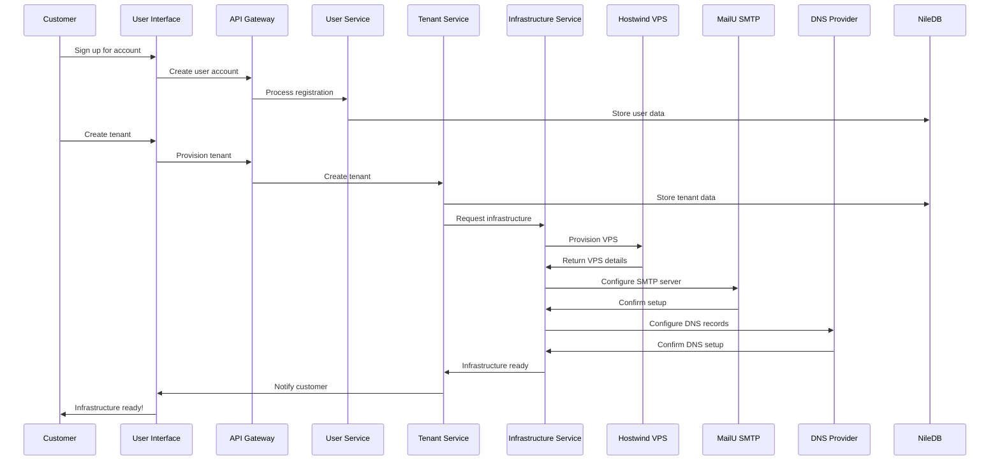
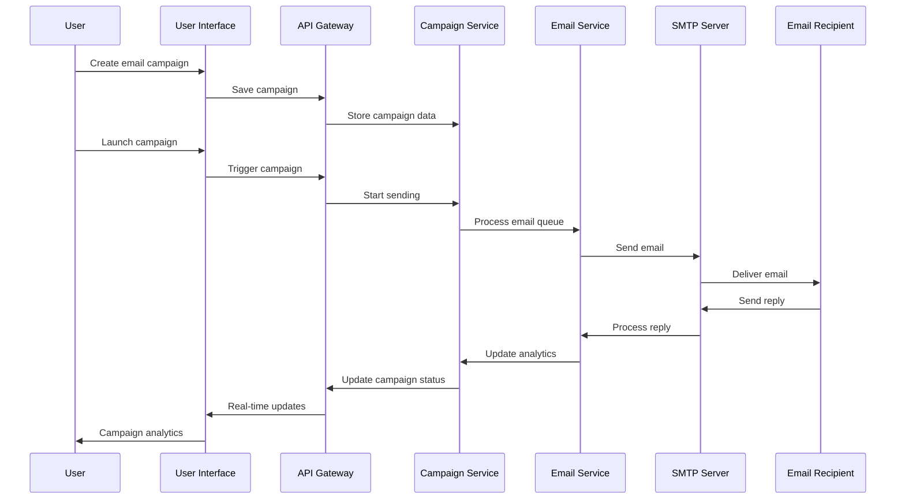

# Data Flow Architecture

## Core Data Flows

### Customer Onboarding Flow

```mermaid
sequenceDiagram
    participant Customer
    participant UI as User Interface
    participant API as API Gateway
    participant UserSvc as User Service
    participant TenantSvc as Tenant Service
    participant InfraSvc as Infrastructure Service
    participant VPS as Hostwind VPS
    participant SMTP as MailU SMTP
    participant DNS as DNS Provider

    Customer->>UI: Sign up for account
    UI->>API: Create user account
    API->>UserSvc: Process registration
    UserSvc->>NileDB: Store user data
    Customer->>UI: Create tenant
    UI->>API: Provision tenant
    API->>TenantSvc: Create tenant
    TenantSvc->>NileDB: Store tenant data
    TenantSvc->>InfraSvc: Request infrastructure
    InfraSvc->>VPS: Provision VPS
    VPS->>InfraSvc: Return VPS details
    InfraSvc->>SMTP: Configure SMTP server
    SMTP->>InfraSvc: Confirm setup
    InfraSvc->>DNS: Configure DNS records
    DNS->>InfraSvc: Confirm DNS setup
    InfraSvc->>TenantSvc: Infrastructure ready
    TenantSvc->>UI: Notify customer
    UI->>Customer: Infrastructure ready!
```

### Email Campaign Flow

```mermaid
sequenceDiagram
    participant User
    participant UI as User Interface
    participant API as API Gateway
    participant Campaign as Campaign Service
    participant Email as Email Service
    participant SMTP as SMTP Server
    participant Recipient as Email Recipient

    User->>UI: Create email campaign
    UI->>API: Save campaign
    API->>Campaign: Store campaign data
    User->>UI: Launch campaign
    UI->>API: Trigger campaign
    API->>Campaign: Start sending
    Campaign->>Email: Process email queue
    Email->>SMTP: Send email
    SMTP->>Recipient: Deliver email
    Recipient->>SMTP: Send reply
    SMTP->>Email: Process reply
    Email->>Campaign: Update analytics
    Campaign->>API: Update campaign status
    API->>UI: Real-time updates
    UI->>User: Campaign analytics
```
