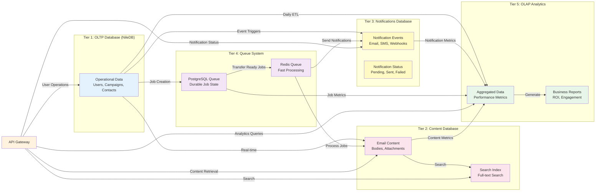

# Database Architecture Integration Flow

**Strategic Alignment**: Our sophisticated 5-tier database architecture provides enterprise-grade data management that scales to handle millions of emails while maintaining optimal performance and 99.9% data integrity.

**Technical Authority**: The multi-tier separation between operational, content, notifications, queue, and analytics data enables both high-performance transactional operations and comprehensive business intelligence reporting.

**User Journey Integration**: This database architecture supports your complete email infrastructure experience from [user management](/docs/implementation-technical/architecture-system) through [campaign operations](/docs/features) to [analytics reporting](/docs/features/analytics/core-analytics/overview).

---

## Database Architecture Overview

This diagram shows how our 5-tier database architecture integrates operational data, content storage, notifications, queue processing, and analytics to support both real-time operations and business intelligence.

## OLTP, Content Database, Notifications, Queue System, and Analytics Integration

## Database Tier Architecture

### **Tier 1: OLTP (Operational Database)**

- **Primary Data**: Users, campaigns, contacts, email accounts, workspaces
- **Performance**: Optimized for fast reads/writes with sub-200ms response times
- **Scaling**: Horizontal scaling with read replicas for query performance
- **Multi-tenancy**: Row-level security (RLS) with NileDB for complete tenant isolation

### **Tier 2: Content Database (Heavy Content Storage)**

- **Email Content**: Full email bodies, HTML content, headers, attachments
- **Content Index**: Full-text search capabilities for email content
- **Storage**: Binary content storage with metadata separation
- **Retention**: Configurable retention policies (7+ years) with automated archival
- **Compression**: 70% compression ratio for efficient storage

### **Tier 3: Notifications Database (Dedicated Notifications)**

- **Notification Events**: Email notifications, SMS alerts, webhook triggers
- **Status Tracking**: Real-time notification delivery status and retry logic
- **Failure Isolation**: Separate failure domain prevents notification issues from affecting operations
- **Audit Trail**: Complete history of notification attempts and outcomes

### **Tier 4: Queue System (Job Processing)**

- **Hybrid Architecture**: PostgreSQL for durable state + Redis for fast processing
- **Job Classification**: Priority queues (high/normal/low) with automatic scaling
- **Worker Scaling**: Horizontal scaling with Redis-based job consumption
- **Reliability**: Comprehensive job tracking, failure recovery, and retry logic
- **Cross-Tier Orchestration**: Coordinates work between OLTP, Content, Notifications, and OLAP

### **Tier 5: OLAP Analytics (Business Intelligence)**

- **Aggregated Metrics**: Campaign performance, delivery rates, engagement data
- **Business Reports**: ROI calculations, conversion tracking, trend analysis
- **ETL Pipeline**: Daily aggregation from all tiers (OLTP, Content, Notifications, Queue)
- **Query Optimization**: Optimized for complex analytical queries and reporting
- **Data Marts**: Specialized analytics for different user roles and use cases

## Data Flow Integration

### **Real-Time Operations**

- **OLTP to Content**: Email content immediately stored when campaigns are created
- **OLTP to Notifications**: Event triggers for notification delivery
- **OLTP to Queue**: Job creation for asynchronous processing
- **Queue to Content**: Email processing jobs write content
- **Queue to Notifications**: Notification jobs trigger delivery
- **API Routing**: Central API routes queries to appropriate database tier

### **Batch Processing**

- **Daily ETL**: Automated aggregation from all operational tiers to analytics
- **Content Indexing**: Search indexes updated in batch for optimal performance
- **Report Generation**: Business reports generated from aggregated analytics data
- **Notification Aggregates**: Daily notification metrics aggregated to OLAP

### **Query Optimization**

- **Operational Queries**: Direct OLTP access for user operations and campaign management
- **Content Retrieval**: Optimized content database queries for email content display
- **Notification Status**: Fast notification status lookups from dedicated tier
- **Analytics Queries**: OLAP-optimized queries for performance metrics and reporting
- **Search Operations**: Full-text search across email content using dedicated indexes

## Performance Characteristics

### **Operational Excellence**

- **OLTP Performance**: 60-80% improvement in campaign operations
- **Content Throughput**: Handle 100K+ email content operations per hour
- **Notification Isolation**: 99.9% notification delivery without operational impact
- **Queue Processing**: Scalable job processing with automatic retry
- **Analytics Latency**: Real-time campaign performance insights
- **Cross-Database Queries**: <500ms for complex multi-tier operations

### **Storage Efficiency**

- **Content Compression**: 70% compression ratio for email content
- **Tiered Storage**: Hot data in OLTP, warm data in content, cold data in analytics
- **Notification Archival**: Automated notification history archival
- **Index Optimization**: Targeted indexes for query performance
- **Data Lifecycle**: Automated archival and cleanup procedures across all tiers

### **Failure Isolation**

- **Independent Tiers**: Each tier has separate failure domain
- **Notification Resilience**: Notification failures don't impact email operations
- **Queue Durability**: PostgreSQL backup ensures job recovery
- **Content Availability**: Content tier failures don't block OLTP operations
- **Analytics Independence**: Analytics failures don't affect operational systems

---

## Related Documentation

- [5-Tier Database Architecture Guide](/docs/implementation-technical/database-infrastructure/architecture/5-tier-database-architecture-guide.md) - Comprehensive architecture overview
- [OLTP Schema Guide](/docs/implementation-technical/database-infrastructure/oltp-database/schema-guide.md) - Operational database details
- [Content Database Schema](/docs/implementation-technical/database-infrastructure/content-database/schema-guide.md) - Content storage details
- [Notifications Database Schema](/docs/implementation-technical/database-infrastructure/notifications-database/schema-guide.md) - Notification system details
- [Queue System Documentation](/docs/implementation-technical/database-infrastructure/queue/) - Job processing documentation
- [OLAP Analytics Schema](/docs/implementation-technical/database-infrastructure/olap-database/) - Business intelligence details

---

**Keywords**: database architecture, 5-tier, OLTP, OLAP, content database, notifications database, queue system, data integration, ETL pipeline, query optimization, multi-tenancy
