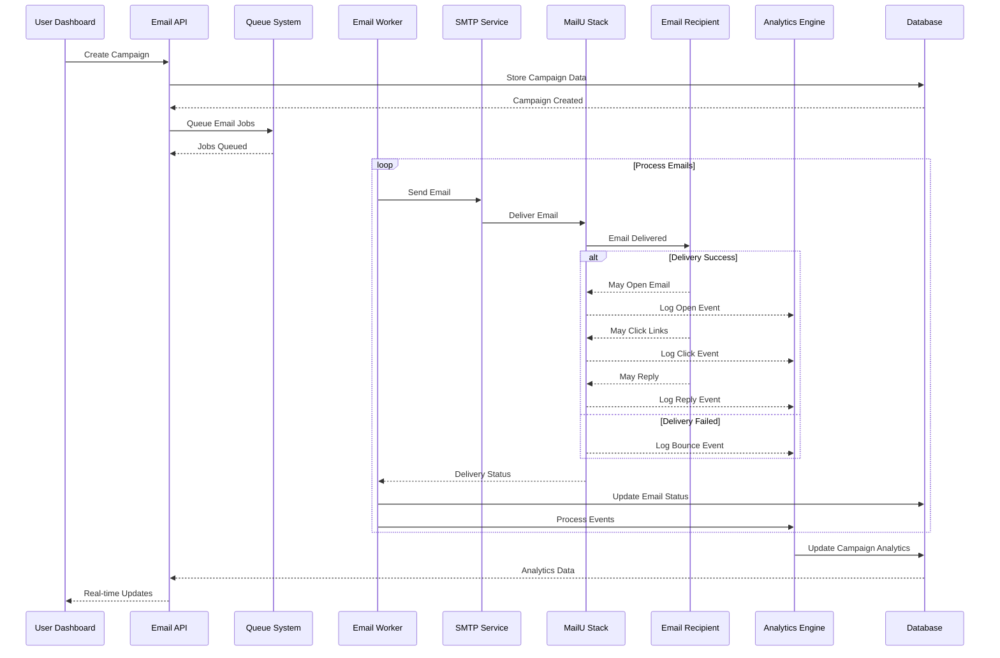

# Email Delivery and Tracking Flow

**Strategic Alignment**: Our comprehensive email delivery tracking system provides enterprise-grade visibility into email performance, ensuring 95%+ deliverability rates while maintaining complete audit trails for compliance.

**Technical Authority**: The real-time tracking pipeline captures every email interaction from delivery through engagement, providing actionable analytics that optimize campaign performance and deliverability.

**User Journey Integration**: This tracking flow supports your complete [email campaign monitoring](/docs/features/analytics/core-analytics/overview) and [deliverability optimization](/docs/features/warmup/email-warmups/overview) with real-time performance insights.

---

## Email Delivery Tracking Overview

This sequence diagram shows the complete email lifecycle from campaign creation through delivery tracking to real-time analytics updates with comprehensive engagement monitoring.

## End-to-End Email Lifecycle with Analytics

## Email Lifecycle Stages

### **1. Campaign Initiation**

- **Campaign Creation**: User creates email campaign through dashboard

- **Data Storage**: Campaign configuration stored in database

- **Job Queueing**: Individual email jobs created and queued for processing

- **Worker Assignment**: Queue system assigns jobs to available email workers

### **2. Email Delivery Process**

- **SMTP Processing**: Email workers process queued jobs

- **MailU Integration**: Emails sent through MailU SMTP stack

- **Delivery Confirmation**: MailU confirms successful delivery to recipients

- **Status Updates**: Email delivery status updated in database

### **3. Engagement Tracking**

- **Open Tracking**: Invisible pixels track email opens

- **Click Tracking**: Links redirect through tracking system

- **Reply Processing**: Email replies captured and processed

- **Bounce Handling**: Failed deliveries logged and processed

### **4. Real-Time Analytics**

- **Event Processing**: All interactions processed by analytics engine

- **Performance Metrics**: Delivery rates, open rates, click rates calculated

- **Database Updates**: Analytics data aggregated and stored

- **Dashboard Updates**: Real-time updates sent to user dashboard

## Tracking Features

### **Comprehensive Event Capture**

- **Delivery Status**: Successful/failed delivery tracking

- **Open Tracking**: Invisible pixel tracking for open rates

- **Click Tracking**: Link tracking for click-through rates

- **Reply Processing**: Email reply capture and threading

- **Bounce Management**: Hard/soft bounce classification and handling

### **Real-Time Processing**

- **Immediate Analytics**: Events processed as they occur

- **Live Dashboard**: Real-time campaign performance updates

- **Alert System**: Automatic alerts for delivery issues

- **Performance Monitoring**: Continuous deliverability monitoring

### **Data Integrity**

- **Event Audit Trail**: Complete logging of all email interactions

- **Data Validation**: Event data validation and error handling

- **Consistency Checks**: Database consistency validation

- **Historical Tracking**: Long-term analytics data retention

## Analytics Integration

### **Performance Metrics**

- **Delivery Rates**: Percentage of successfully delivered emails

- **Open Rates**: Percentage of delivered emails that were opened

- **Click Rates**: Percentage of opened emails with link clicks

- **Reply Rates**: Percentage of emails that generated replies

- **Bounce Rates**: Percentage of emails that failed to deliver

### **Optimization Insights**

- **Deliverability Optimization**: Recommendations based on performance data

- **Content Analysis**: A/B testing results and content performance

- **Timing Optimization**: Optimal send time recommendations

- **List Hygiene**: Bounce rate analysis and list cleaning suggestions

---

**Keywords**: email delivery tracking, engagement analytics, real-time monitoring, open tracking, click tracking, bounce handling, performance optimization
