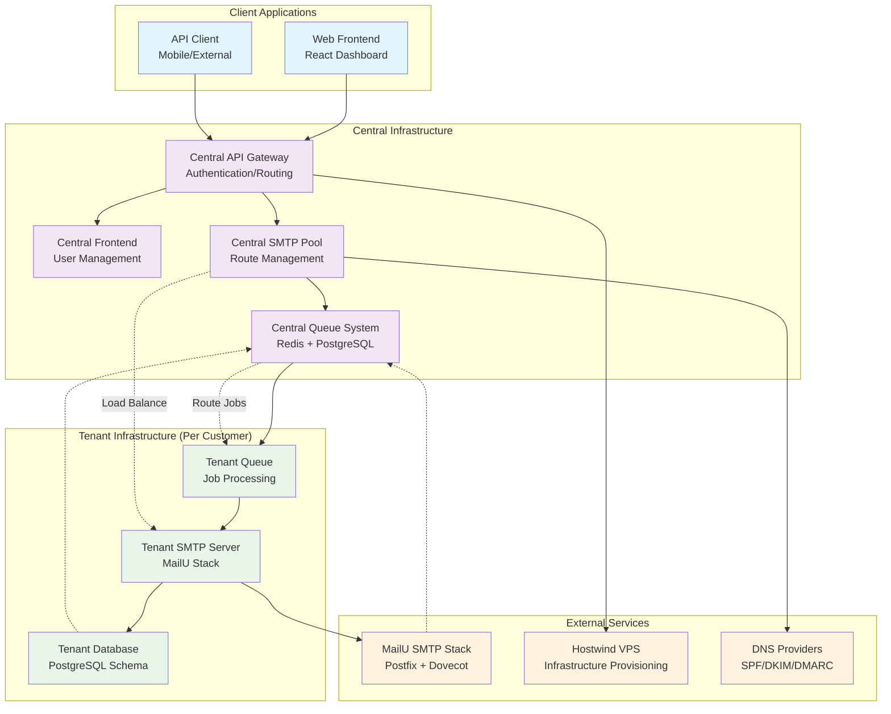

# Email Infrastructure Integration Flow

**Strategic Alignment**: This diagram demonstrates how our multi-tenant architecture seamlessly integrates central services with tenant-specific infrastructure to deliver scalable email services.

**Technical Authority**: Our infrastructure integration showcases enterprise-grade load balancing, queue management, and service mesh communication that ensures 99.9% uptime for all customers.

**User Journey Integration**: This integration flow is the foundation that enables your complete email infrastructure experience from [campaign creation](/docs/features) through [analytics tracking](/docs/features/analytics/core-analytics/overview) to [infrastructure management](/docs/features/warmup/email-warmups/overview).

---

## System Integration Overview

This diagram shows how PenguinMails architecture components interact to deliver email infrastructure services across multiple tenants while maintaining isolation and scalability.

## Central SMTP, Frontend, Queue, and Tenant SMTP Integration

## Integration Architecture Explanation

### **Client Layer**

- **Web Frontend**: React-based dashboard for campaign management and monitoring

- **API Client**: External integrations and mobile applications

### **Central Infrastructure**

- **Central Frontend**: User management and authentication services

- **Central API Gateway**: Routes requests, handles authentication, and manages rate limiting

- **Central SMTP Pool**: Manages SMTP connections and load balancing across tenants

- **Central Queue System**: Redis + PostgreSQL hybrid for job processing and state management

### **Tenant Infrastructure (Per Customer)**

- **Tenant SMTP Server**: MailU stack with Postfix, Dovecot, and SpamAssassin

- **Tenant Database**: PostgreSQL schema with row-level security for data isolation

- **Tenant Queue**: Dedicated job processing for tenant-specific operations

### **External Services**

- **MailU SMTP Stack**: Enterprise email delivery infrastructure

- **Hostwind VPS**: Automated VPS provisioning and management

- **DNS Providers**: SPF, DKIM, DMARC record management

## Key Integration Patterns

### 1. **Multi-Tenant Routing**

The Central API Gateway authenticates users and routes requests to their specific tenant infrastructure, ensuring complete data isolation while maintaining operational efficiency.

### 2. **Load Balancing Strategy**

The Central SMTP Pool intelligently distributes email sending across available tenant SMTP servers, optimizing for deliverability and avoiding overloading individual accounts.

### 3. **Queue Processing**

Central Queue System coordinates with Tenant Queues to process email jobs, ensuring scalable job distribution while maintaining tenant isolation.

### 4. **Infrastructure Automation**

Central services coordinate with external providers (Hostwind, DNS) to automatically provision and configure tenant-specific infrastructure.

### 5. **Data Flow Coordination**

Real-time data synchronization between tenant databases and central systems enables consistent analytics and monitoring across the platform.

---

**Keywords**: email infrastructure, multi-tenant architecture, SMTP integration, queue processing, load balancing, infrastructure automation
