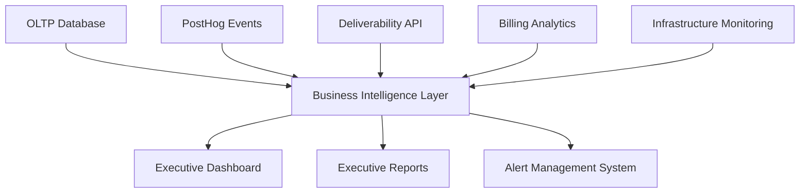

# Executive Dashboard Specification for Business Leaders


## Overview

This document outlines the technical specification for a comprehensive Executive Dashboard designed for Business Leaders (C-Suite, VPs, Finance Directors) to monitor business performance, track cost optimization, and make strategic decisions based on real-time business intelligence.

**Document Level:** Level 3 - Technical Implementation
**Target Audience:** Technical Architects, Frontend Developers, Business Intelligence Engineers
**Implementation Priority:** High - Critical for executive decision making

---


## Business Context & Requirements


### Executive Business Intelligence Needs

**Primary Business Challenge:** Enterprise customers need transparent, real-time insights into email marketing performance, cost attribution, and deliverability management to make data-driven strategic decisions.

**Critical Business Requirements:**


1. **Real-time Revenue Protection Monitoring** - Immediate visibility into deliverability issues that impact revenue


2. **Cost Optimization Tracking** - Clear identification of savings opportunities and realized savings


3. **Operational Efficiency Metrics** - Resource utilization and performance optimization insights


4. **Strategic Decision Support** - Data-driven decision making with ROI tracking


5. **Risk Assessment Dashboard** - Proactive identification of business risks and mitigation strategies


### Executive Success Criteria

| Business Metric | Target | Business Impact | Measurement |
|-----------------|--------|----------------|-------------|
| **Revenue Protection Rate** | >95% | Prevent customer churn | Deliverability issue response time |
| **Cost Optimization Savings** | 10-15% monthly | Improve unit economics | PostHog cost optimization events |
| **Operational Efficiency Score** | >85% | Reduce overhead | Resource utilization metrics |
| **Strategic Decision Velocity** | <48 hours | Faster market response | Decision tracking analytics |
| **Customer Profitability** | >70% gross margin | Sustainable growth | Cost attribution accuracy |

---


## Technical Architecture


### Dashboard Component Structure


```markdown
Executive Dashboard
├── Revenue Protection Monitor
│   ├── Deliverability Status Panel
│   ├── Revenue Risk Assessment
│   ├── Critical Alert Management
│   └── Historical Performance Trends
├── Cost Optimization Center
│   ├── Infrastructure Cost Analysis
│   ├── Email Service Cost Tracking
│   ├── Optimization Opportunities
│   └── ROI Achievement Tracking
├── Operational Efficiency Dashboard
│   ├── Resource Utilization Metrics
│   ├── Performance Benchmarking
│   ├── Efficiency Score Tracking
│   └── Optimization Recommendations
├── Strategic Decision Tracker
│   ├── Decision Log Management
│   ├── Outcome Tracking
│   ├── ROI Measurement
│   └── Strategic Planning Support
└── Executive Summary Panel
    ├── Overall Business Health Score
    ├── Key Performance Indicators
    ├── Critical Alerts Summary
    └── Recommended Actions


```


### Data Integration Architecture


#### Primary Data Sources


1. **OLTP Database** - `executive_business_summary` view for cost allocation data


2. **PostHog Analytics** - Business event tracking for real-time insights


3. **Deliverability API** - Email deliverability metrics and reputation data


4. **Billing Analytics** - Subscription and payment tracking


5. **Infrastructure Monitoring** - VPS and SMTP IP usage data


#### Data Flow Architecture




---


## Component Specifications


### 1. Revenue Protection Monitor

**Purpose:** Real-time monitoring of email deliverability issues that impact revenue


#### Technical Requirements

**Deliverability Status Panel:**


- **Data Source:** PostHog `email_deliverability_event` events


- **Update Frequency:** Real-time (WebSocket connection)


- **Key Metrics:**


  - Overall deliverability rate (%)


  - Bounce rate (%)


  - Spam complaint rate (%)


  - IP reputation status (Good/Fair/Poor)


  - Domain reputation status (Good/Fair/Poor)

**Revenue Risk Assessment:**


- **Calculation:** `(Bounce Rate × $0.05 + Spam Rate × $0.25) × Monthly Email Volume`


- **Visualization:** Risk gauge with color-coded severity levels


- **Threshold Alerts:**


  - Critical: >15% bounce rate or >2% spam rate


  - Warning: 10-15% bounce rate or 1.5-2% spam rate


  - Monitor: 5-10% bounce rate or 1-1.5% spam rate

**Critical Alert Management:**


- **Real-time Notifications:** WebSocket-based alert system


- **Alert Types:**


  - Deliverability degradation


  - Revenue threshold breaches


  - IP reputation changes


  - Critical domain issues


- **Escalation Rules:**


  - Critical alerts: Immediate notification + SMS


  - High alerts: Email + in-app notification


  - Medium alerts: In-app notification only


### 2. Cost Optimization Center

**Purpose:** Track and optimize infrastructure and email service costs


#### Technical Requirements

**Infrastructure Cost Analysis:**


- **Data Source:** `executive_business_summary` view


- **Visualization:** Cost breakdown pie chart + trend lines


- **Key Metrics:**


  - VPS instance costs per tenant


  - SMTP IP address costs per tenant


  - Total infrastructure cost per tenant


  - Cost per email delivered


  - Infrastructure efficiency ratio

**Email Service Cost Tracking:**


- **Data Source:** `smtp_ip_addresses.approximate_cost`


- **Tracking Points:**


  - Cost per IP address


  - Cost per delivered email


  - Cost per warmed IP


  - Cost efficiency trends


- **Optimization Recommendations:**


  - Underutilized IP identification


  - Cost-effective warmup strategies


  - Vendor comparison insights

**Optimization Opportunities:**


- **Algorithm:** ML-based cost optimization recommendations


- **Categories:**


  - Infrastructure right-sizing


  - Email service optimization


  - Vendor negotiation opportunities


  - Process automation potential


- **ROI Calculator:** Expected savings vs implementation effort


### 3. Operational Efficiency Dashboard

**Purpose:** Monitor resource utilization and operational performance


#### Technical Requirements

**Resource Utilization Metrics:**


- **VPS Utilization:**


  - CPU utilization (%)


  - Memory utilization (%)


  - Storage utilization (%)


  - Network utilization (Mbps)


- **Email Service Utilization:**


  - IP warmup progress (%)


  - Daily email volume vs capacity


  - Deliverability success rate


  - Error rate trends

**Performance Benchmarking:**


- **Internal Benchmarks:**


  - Company historical performance


  - Best/worst performing tenants


  - Industry benchmark comparisons


- **Efficiency Score Calculation:**

  ```markdown
  Efficiency Score = (Deliverability Rate × 0.3) +
                    (Cost Efficiency × 0.3) +
                    (Resource Utilization × 0.2) +
                    (Response Time × 0.2)
  ```


### 4. Strategic Decision Tracker

**Purpose:** Track executive decisions and measure outcomes


#### Technical Requirements

**Decision Log Management:**


- **Data Structure:** `strategic_decision_event` from PostHog


- **Tracking Fields:**


  - Decision type (Budget, Infrastructure, Vendor, Process)


  - Decision maker and date


  - Expected outcomes and confidence level


  - Key performance indicators


  - Review schedule

**Outcome Tracking:**


- **Automated Tracking:** Integration with business metrics


- **Manual Updates:** Executive input for qualitative outcomes


- **ROI Measurement:** Expected vs actual outcome comparison


- **Success Rate Analysis:** Decision success percentage by category

---


## Frontend Implementation Specifications


### Technology Stack Recommendations

**Dashboard Framework:** React.js with TypeScript
**State Management:** Redux Toolkit with RTK Query
**Visualization Library:** Chart.js or D3.js for advanced charts
**UI Components:** Material-UI or Ant Design for enterprise look
**Real-time Updates:** WebSocket connection for live data


### Component Architecture


#### Main Dashboard Component


```typescript
interface ExecutiveDashboard {
  tenantId: string;
  refreshInterval: number;
  alertSettings: AlertConfiguration;
  dashboardLayout: LayoutConfiguration;
}

interface ExecutiveDashboardState {
  revenueProtection: RevenueProtectionMetrics;
  costOptimization: CostOptimizationMetrics;
  operationalEfficiency: OperationalEfficiencyMetrics;
  strategicDecisions: StrategicDecisionMetrics;
  overallHealth: BusinessHealthScore;
  alerts: AlertItem[];
  isLoading: boolean;
  lastUpdated: Date;
}


```


#### Key Dashboard Components

**1. Revenue Protection Monitor Component**


```typescript
interface RevenueProtectionMonitorProps {
  tenantId: string;
  realtimeUpdates: boolean;
  alertThresholds: AlertThresholds;
}

const RevenueProtectionMonitor: React.FC<RevenueProtectionMonitorProps> = ({
  tenantId,
  realtimeUpdates,
  alertThresholds
}) => {
  // Real-time deliverability monitoring
  // Revenue risk calculation and visualization
  // Alert management and escalation
};


```

**2. Cost Optimization Center Component**


```typescript
interface CostOptimizationCenterProps {
  tenantId: string;
  showProjections: boolean;
  optimizationFilters: OptimizationFilters;
}

const CostOptimizationCenter: React.FC<CostOptimizationCenterProps> = ({
  tenantId,
  showProjections,
  optimizationFilters
}) => {
  // Cost breakdown visualization
  // Optimization opportunity identification
  // ROI tracking and forecasting
};


```


### Real-time Data Architecture


#### WebSocket Connection Management


```typescript
class ExecutiveDashboardDataService {
  private wsConnection: WebSocket;

  connectToRealtimeData(tenantId: string): void {
    // WebSocket connection to PostHog streaming API
    // Real-time business event updates
    // Dashboard state synchronization
  }

  subscribeToBusinessEvents(eventTypes: string[]): void {
    // Subscribe to specific business event types
    // Revenue impact events
    // Cost optimization events
    // Deliverability alerts
  }
}


```


#### Data Caching Strategy


```typescript
class DashboardCacheManager {
  private cache = new Map<string, DashboardData>();
  private expiryTime = 5 * 60 * 1000; // 5 minutes

  getCachedData(tenantId: string): DashboardData | null {
    // Retrieve cached dashboard data
    // Check expiry and refresh if needed
  }

  updateCachedData(tenantId: string, data: DashboardData): void {
    // Update cache with new business data
    // Invalidate related cache entries
  }
}


```

---


## Backend API Specifications


### Executive Dashboard API Endpoints


#### 1. Dashboard Data Retrieval


```http
GET /api/executive-dashboard/{tenantId}/summary


```

**Response:**


```json
{
  "tenantId": "string",
  "overallBusinessHealth": 85,
  "revenueProtection": {
    "deliverabilityRate": 98.5,
    "bounceRate": 1.2,
    "spamRate": 0.3,
    "revenueAtRisk": 2500,
    "riskLevel": "low"
  },
  "costOptimization": {
    "monthlySavings": 1500,
    "optimizationOpportunities": 3,
    "costEfficiencyRatio": 2.1,
    "infrastructureCosts": 8500,
    "emailServiceCosts": 1200
  },
  "operationalEfficiency": {
    "overallScore": 87,
    "resourceUtilization": 78,
    "performanceScore": 92,
    "efficiencyTrend": "improving"
  },
  "strategicDecisions": {
    "decisionsTracked": 12,
    "avgDecisionTime": "36 hours",
    "successRate": 85,
    "roiAchievement": 120
  },
  "alerts": [
    {
      "id": "alert-123",
      "type": "revenue_risk",
      "severity": "warning",
      "message": "Bounce rate approaching threshold",
      "timestamp": "2025-12-19T10:30:00Z",
      "actionsRequired": ["Review email content", "Check IP reputation"]
    }
  ],
  "lastUpdated": "2025-12-19T10:35:00Z"
}


```


#### 2. Real-time Business Events


```http
GET /api/executive-dashboard/{tenantId}/events/realtime


```

**WebSocket Event Format:**


```json
{
  "eventType": "revenue_impact",
  "tenantId": "string",
  "data": {
    "impactAmount": 2500,
    "impactType": "negative",
    "urgencyLevel": "high",
    "actionRequired": "IP warmup and content review"
  },
  "timestamp": "2025-12-19T10:35:00Z"
}


```


#### 3. Cost Analysis Deep Dive


```http
GET /api/executive-dashboard/{tenantId}/cost-analysis


```

**Response:**


```json
{
  "tenantId": "string",
  "costBreakdown": {
    "infrastructure": {
      "vpsInstances": {
        "totalCost": 8500,
        "costPerTenant": 212.50,
        "utilizationRate": 78,
        "optimizationPotential": 1200
      },
      "smtpIps": {
        "totalCost": 1200,
        "costPerIp": 25,
        "utilizationRate": 85,
        "optimizationPotential": 300
      }
    },
    "emailService": {
      "totalCost": 1500,
      "costPerDeliveredEmail": 0.015,
      "deliverabilityRate": 98.5,
      "optimizationPotential": 450
    }
  },
  "trendAnalysis": {
    "costTrend": "decreasing",
    "efficiencyTrend": "improving",
    "optimizationImpact": 1950
  },
  "recommendations": [
    {
      "category": "infrastructure",
      "description": "Right-size VPS instances for low-utilization tenants",
      "estimatedSavings": 1200,
      "implementationEffort": "low"
    }
  ]
}


```

---


## Performance Requirements


### Response Time Targets


- **Dashboard Initial Load:** <3 seconds


- **Real-time Updates:** <1 second


- **Data Refresh:** <5 seconds


- **Report Generation:** <10 seconds


### Scalability Requirements


- **Concurrent Users:** Support 100+ executives simultaneously


- **Data Processing:** Handle 10K+ business events per minute


- **Storage:** Efficient caching for 30 days of historical data


- **Availability:** 99.9% uptime for executive access


### Security Requirements


- **Authentication:** Multi-factor authentication for executive access


- **Authorization:** Role-based access control (C-Suite, VPs, Directors)


- **Data Encryption:** End-to-end encryption for sensitive business data


- **Audit Logging:** Complete audit trail for executive actions

---


## Implementation Phases


### Phase 1: Foundation (Weeks 1-4)


- [ ] Database migration implementation (vps_instances.approximate_cost, smtp_ip_addresses.approximate_cost)


- [ ] PostHog business events integration


- [ ] Basic dashboard API endpoints


- [ ] Authentication and authorization setup


### Phase 2: Core Dashboard (Weeks 5-8)


- [ ] Revenue Protection Monitor component


- [ ] Cost Optimization Center component


- [ ] Real-time data streaming implementation


- [ ] Basic alert management system


### Phase 3: Advanced Features (Weeks 9-12)


- [ ] Operational Efficiency Dashboard component


- [ ] Strategic Decision Tracker component


- [ ] Advanced analytics and forecasting


- [ ] Mobile-responsive design


### Phase 4: Optimization (Weeks 13-16)


- [ ] Performance optimization and caching


- [ ] Advanced visualization components


- [ ] Executive reporting automation


- [ ] User training and documentation

---


## Success Metrics


### Technical Success Criteria


- Dashboard loads in <3 seconds for 95% of requests


- Real-time updates propagate within 1 second


- 99.9% uptime for executive access


- Zero data loss in business event tracking


### Business Success Criteria


- 25% reduction in manual monitoring time


- 15% improvement in cost optimization identification


- 50% faster executive decision making


- 95% executive satisfaction with dashboard insights

---


## Integration Points


### External Systems Integration


- **PostHog Analytics:** Business event tracking and real-time insights


- **Deliverability Providers:** SendGrid, Mailgun, Amazon SES API integration


- **Infrastructure Monitoring:** VPS provider APIs for real-time usage data


- **Financial Systems:** Billing and subscription management integration


### Internal System Integration


- **OLTP Database:** Executive summary views and cost allocation data


- **Authentication System:** Role-based access and user management


- **Notification System:** Alert distribution and escalation management


- **Report Generation:** Automated executive reporting and export capabilities

---

**Document Classification:** Level 3 - Technical Implementation
**Business Stakeholder Access:** CTOs, Engineering Directors, Solution Architects
**Technical Stakeholder Access:** Frontend Developers, Backend Engineers, DevOps Engineers

This specification provides comprehensive technical guidance for implementing an executive-level business intelligence dashboard that delivers actionable insights for strategic decision making
---
