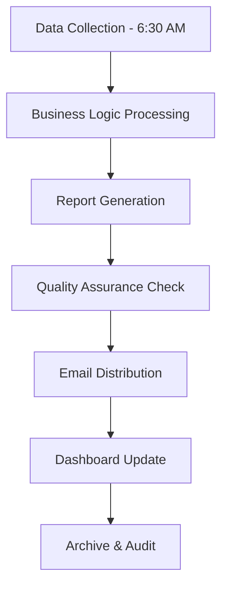
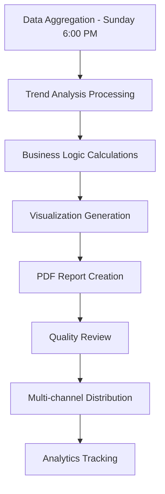

# Executive Reporting Framework for Business Leaders

## Overview

This document defines the comprehensive Executive Reporting Framework that provides automated, actionable business intelligence reports for C-Suite executives, VPs, and strategic decision makers. The framework focuses on revenue protection, cost optimization, and operational efficiency with clear ROI tracking and strategic recommendations.

**Document Level:** Level 3 - Technical Implementation
**Target Audience:** Business Intelligence Engineers, Data Analysts, Report Automation Developers
**Business Priority:** Critical - Essential for executive decision making and strategic planning

---

## Executive Reporting Strategy

### Business Intelligence Reporting Objectives

**Primary Goal:** Provide C-Suite and VP-level executives with automated, actionable business intelligence that drives strategic decision making and improves business performance.

**Key Business Objectives:**

1. **Revenue Protection Reporting** - Proactive identification and resolution of revenue-threatening issues

2. **Cost Optimization Tracking** - Continuous monitoring and realization of cost savings opportunities

3. **Operational Efficiency Measurement** - Quantified improvement tracking in resource utilization

4. **Strategic Decision Support** - Data-driven insights for high-impact business decisions

5. **Risk Management Intelligence** - Early warning systems and mitigation strategies

### Executive Reporting Hierarchy

```markdown
Executive Reporting System
├── Daily Executive Briefings
│   ├── Critical Alerts Summary
│   ├── Revenue Protection Status
│   ├── Cost Optimization Opportunities
│   └── Operational Issues Overview
├── Weekly Performance Reports
│   ├── Business Health Scorecard
│   ├── Cost Trend Analysis
│   ├── Efficiency Metrics Dashboard
│   └── Strategic Initiative Progress
├── Monthly Strategic Reviews
│   ├── Comprehensive Business Analysis
│   ├── ROI Achievement Report
│   ├── Competitive Benchmarking
│   └── Future Planning Recommendations
├── Quarterly Executive Summaries
│   ├── Strategic Business Performance
│   ├── Market Position Analysis
│   ├── Investment ROI Assessment
│   └── Growth Strategy Evaluation
└── Annual Business Intelligence Report
    ├── Year-over-Year Performance Analysis
    ├── Long-term Strategic Outcomes
    ├── Market Intelligence Summary
    └── Next-Year Strategic Roadmap


```

---

## Report Types & Specifications

### 1. Daily Executive Briefing

**Frequency:** Every business day at 7:00 AM EST
**Recipients:** C-Suite executives, VPs, Directors
**Delivery Method:** Email + Dashboard notification
**Reading Time:** 3-5 minutes

#### Content Structure

**Executive Summary Section:**

```markdown
Business Health Status: [Excellent/Good/Monitor/Critical]
Revenue at Risk: $X,XXX (vs. $X,XXX yesterday: +)
Critical Actions Required: X items
Optimization Opportunities: $X,XXX potential savings


```

**Critical Alerts Panel:**

```markdown
🚨 CRITICAL (Immediate Action Required)
• [Alert Title] - [Business Impact] - [Recommended Action]

⚠️ WARNING (Monitor Closely)
• [Alert Title] - [Risk Level] - [Timeline]

ℹ️ INFO (FYI)
• [Info Title] - [Context] - [Next Steps]


```

**Revenue Protection Monitor:**

```markdown
Deliverability Status:
├── Overall Rate: 98.5% (Target: >95%)
├── Bounce Rate: 1.2% (Target: <5%)
├── Spam Rate: 0.3% (Target: <1%)
└── Revenue Impact: $2,500 at risk (vs. $1,800 yesterday)

IP Reputation Status:
├── Good: 45 IPs (85%)
├── Fair: 6 IPs (11%)
├── Poor: 2 IPs (4%)
└── Critical: 0 IPs (0%)


```

**Cost Optimization Opportunities:**

```markdown
Identified This Week: $8,750 in potential savings
├── Infrastructure Right-sizing: $3,200
├── Email Service Optimization: $2,800
├── Process Automation: $1,950
└── Vendor Negotiation: $800

Implemented This Week: $5,200 in realized savings


```

#### Technical Implementation

**Data Sources:**

- PostHog `revenue_impact_event` (real-time monitoring)

- `executive_business_summary` view (daily snapshots)

- Deliverability API status checks

- Cost tracking aggregation

**Automation Pipeline:**



**Email Template Structure:**



```html
<!-- Executive Summary Header -->
<div class="executive-summary">
  <h1>Daily Executive Briefing - {{date}}</h1>
  <div class="business-health-score">{{healthScore}}/100</div>
</div>

<!-- Critical Alerts -->
<div class="alert-section">
  {{#if criticalAlerts}}
  <h2>🚨 Critical Actions Required</h2>
  {{#each criticalAlerts}}
  <div class="alert-item critical">
    <h3>{{title}}</h3>
    <p>Impact: {{businessImpact}}</p>
    <p>Action: {{recommendedAction}}</p>
    <p>Owner: {{responsibleExecutive}}</p>
  </div>
  {{/each}}
  {{/if}}
</div>

<!-- Revenue Protection -->
<div class="revenue-section">
  <h2>Revenue Protection Status</h2>
  {{revenueProtectionMetrics}}
</div>

<!-- Cost Optimization -->
<div class="cost-section">
  <h2>Optimization Opportunities</h2>
  {{costOptimizationSummary}}
</div>


```



### 2. Weekly Performance Report

**Frequency:** Every Monday at 8:00 AM EST
**Recipients:** VPs, Directors, Business Unit Leaders
**Delivery Method:** Email + PDF + Dashboard
**Reading Time:** 15-20 minutes

#### Content Structure

**Business Performance Scorecard:**

```markdown
Weekly Business Health Score: 87/100 (vs. 84)
├── Revenue Protection: 92/100
├── Cost Optimization: 78/100
├── Operational Efficiency: 89/100
└── Strategic Execution: 85/100


```

**Key Performance Indicators:**

```markdown
Revenue Metrics:
├── Total Emails Sent: 1.2M (vs. 1.1M last week: +9%)
├── Deliverability Rate: 98.2% (Target: >95%)
├── Revenue at Risk: $12,500 (vs. $18,200 last week: -31%)
└── Customer Churn Risk: $45,000 (vs. $52,000 last week: -13%)

Cost Metrics:
├── Infrastructure Costs: $42,500 (vs. $45,200 last week: -6%)
├── Email Service Costs: $18,750 (vs. $19,100 last week: -2%)
├── Total Operational Costs: $61,250 (vs. $64,300 last week: -5%)
└── Cost Efficiency Ratio: 2.1 (Target: >2.0)

Efficiency Metrics:
├── VPS Utilization: 78% (vs. 74% last week: +5%)
├── Email Service Efficiency: 89% (vs. 87% last week: +2%)
├── Process Automation Rate: 67% (vs. 63% last week: +6%)
└── Executive Decision Speed: 32 hours (vs. 38 hours last week: -16%)


```

**Trend Analysis:**

```markdown
7-Day Trend Analysis:
├── Revenue Protection: Improving (92% → 94% → 92%)
├── Cost Optimization: Stable (78% → 79% → 78%)
├── Operational Efficiency: Improving (85% → 87% → 89%)
└── Strategic Execution: Improving (82% → 84% → 85%)


```

**Strategic Initiative Progress:**

```markdown
Active Strategic Initiatives:
├── Email Infrastructure Optimization (80% complete)
│   ├── IP Warmup Strategy: 90% complete
│   ├── Deliverability Enhancement: 75% complete
│   └── Cost Reduction: 85% complete
├── Customer Success Automation (60% complete)
│   ├── Onboarding Automation: 70% complete
│   ├── Support Optimization: 50% complete
│   └── Retention Analytics: 60% complete
└── Data Analytics Enhancement (40% complete)
    ├── Business Intelligence Dashboard: 60% complete
    ├── Predictive Analytics: 30% complete
    └── Reporting Automation: 35% complete


```

#### Technical Implementation

**Report Generation Pipeline:**



**Automated Analytics Calculations:**

```typescript
// services/weekly-performance-analyzer.ts
interface BusinessMetrics {
  revenueProtection: number;
  costOptimization: number;
  operationalEfficiency: number;
  strategicExecution: number;
}

interface TrendAnalysis {
  current: number;
  trend: 'improving' | 'stable' | 'declining';
  velocity: number;
  confidence: number;
}

interface BusinessHealthScore {
  overall: number;
  revenueProtection: number;
  costOptimization: number;
  operationalEfficiency: number;
  strategicExecution: number;
}

interface WeeklyPerformanceAnalyzer {
  calculateBusinessHealthScore(tenantId: string, weekStart: Date, weekEnd: Date): Promise<BusinessHealthScore>;
  generateTrendAnalysis(tenantId: string, currentWeek: Date, previousWeeks?: number): Promise<Record<string, TrendAnalysis>>;
}

class WeeklyPerformanceAnalyzerImpl implements WeeklyPerformanceAnalyzer {
  async calculateBusinessHealthScore(
    tenantId: string,
    weekStart: Date,
    weekEnd: Date
  ): Promise<BusinessHealthScore> {
    const [
      revenueScore,
      costScore,
      efficiencyScore,
      strategicScore
    ] = await Promise.all([
      this.calculateRevenueProtectionScore(tenantId, weekStart, weekEnd),
      this.calculateCostOptimizationScore(tenantId, weekStart, weekEnd),
      this.calculateOperationalEfficiencyScore(tenantId, weekStart, weekEnd),
      this.calculateStrategicExecutionScore(tenantId, weekStart, weekEnd)
    ]);

    // Weighted business health calculation
    const healthScore = (
      revenueScore * 0.3 +
      costScore * 0.25 +
      efficiencyScore * 0.25 +
      strategicScore * 0.2
    );

    const overallScore = Math.max(0, Math.min(100, healthScore));

    return {
      overall: overallScore,
      revenueProtection: revenueScore,
      costOptimization: costScore,
      operationalEfficiency: efficiencyScore,
      strategicExecution: strategicScore
    };
  }

  async generateTrendAnalysis(
    tenantId: string,
    currentWeek: Date,
    previousWeeks: number = 3
  ): Promise<Record<string, TrendAnalysis>> {
    const metrics = ['revenueProtection', 'costOptimization', 'efficiency', 'strategic'];
    const trends: Record<string, TrendAnalysis> = {};

    for (const metric of metrics) {
      const currentValue = await this.getMetricValue(tenantId, metric, currentWeek);
      const previousWeeksList = this.getPreviousWeeks(currentWeek, previousWeeks);
      const previousValues = await Promise.all(
        previousWeeksList.map(week => this.getMetricValue(tenantId, metric, week))
      );

      const allValues = [...previousValues, currentValue];

      trends[metric] = {
        current: currentValue,
        trend: this.calculateTrendDirection(allValues),
        velocity: this.calculateTrendVelocity(allValues),
        confidence: this.calculateTrendConfidence(allValues)
      };
    }

    return trends;
  }

  private async calculateRevenueProtectionScore(tenantId: string, weekStart: Date, weekEnd: Date): Promise<number> {
    // Mock implementation - would calculate based on deliverability metrics
    const deliverabilityRate = await this.getDeliverabilityRate(tenantId, weekStart, weekEnd);
    const bounceRate = await this.getBounceRate(tenantId, weekStart, weekEnd);
    const revenueAtRisk = await this.getRevenueAtRisk(tenantId, weekStart, weekEnd);

    // Calculate score based on multiple factors
    const deliverabilityScore = deliverabilityRate * 100; // Convert to 0-100 scale
    const bounceScore = Math.max(0, 100 - (bounceRate * 10)); // Penalty for bounces
    const riskScore = Math.max(0, 100 - (revenueAtRisk / 100)); // Penalty for revenue at risk

    return (deliverabilityScore + bounceScore + riskScore) / 3;
  }

  private async calculateCostOptimizationScore(tenantId: string, weekStart: Date, weekEnd: Date): Promise<number> {
    // Mock implementation - would calculate based on cost metrics
    const costEfficiency = await this.getCostEfficiency(tenantId, weekStart, weekEnd);
    const optimizationOpportunities = await this.getOptimizationOpportunities(tenantId, weekStart, weekEnd);
    const implementedSavings = await this.getImplementedSavings(tenantId, weekStart, weekEnd);

    return (costEfficiency + optimizationOpportunities + implementedSavings) / 3;
  }

  private async calculateOperationalEfficiencyScore(tenantId: string, weekStart: Date, weekEnd: Date): Promise<number> {
    // Mock implementation - would calculate based on operational metrics
    const processAutomationRate = await this.getProcessAutomationRate(tenantId, weekStart, weekEnd);
    const systemPerformance = await this.getSystemPerformance(tenantId, weekStart, weekEnd);
    const resourceUtilization = await this.getResourceUtilization(tenantId, weekStart, weekEnd);

    return (processAutomationRate + systemPerformance + resourceUtilization) / 3;
  }

  private async calculateStrategicExecutionScore(tenantId: string, weekStart: Date, weekEnd: Date): Promise<number> {
    // Mock implementation - would calculate based on strategic metrics
    const initiativeProgress = await this.getInitiativeProgress(tenantId, weekStart, weekEnd);
    const goalAchievement = await this.getGoalAchievement(tenantId, weekStart, weekEnd);
    const decisionSpeed = await this.getDecisionSpeed(tenantId, weekStart, weekEnd);

    return (initiativeProgress + goalAchievement + decisionSpeed) / 3;
  }

  private async getMetricValue(tenantId: string, metric: string, week: Date): Promise<number> {
    // Mock implementation - would fetch from database
    return Math.random() * 100; // Random value between 0-100 for demonstration
  }

  private getPreviousWeeks(currentWeek: Date, count: number): Date[] {
    const weeks: Date[] = [];
    const current = new Date(currentWeek);

    for (let i = 1; i <= count; i++) {
      const week = new Date(current);
      week.setDate(week.getDate() - (i * 7));
      weeks.push(week);
    }

    return weeks;
  }

  private calculateTrendDirection(values: number[]): 'improving' | 'stable' | 'declining' {
    if (values.length < 2) return 'stable';

    const recent = values.slice(-3); // Last 3 values
    const older = values.slice(0, -3); // Previous values

    if (older.length === 0) return 'stable';

    const recentAvg = recent.reduce((sum, val) => sum + val, 0) / recent.length;
    const olderAvg = older.reduce((sum, val) => sum + val, 0) / older.length;

    const changePercent = ((recentAvg - olderAvg) / olderAvg) * 100;

    if (changePercent > 5) return 'improving';
    if (changePercent < -5) return 'declining';
    return 'stable';
  }

  private calculateTrendVelocity(values: number[]): number {
    if (values.length < 2) return 0;

    const firstHalf = values.slice(0, Math.floor(values.length / 2));
    const secondHalf = values.slice(Math.floor(values.length / 2));

    const firstAvg = firstHalf.reduce((sum, val) => sum + val, 0) / firstHalf.length;
    const secondAvg = secondHalf.reduce((sum, val) => sum + val, 0) / secondHalf.length;

    return secondAvg - firstAvg;
  }

  private calculateTrendConfidence(values: number[]): number {
    if (values.length < 3) return 0.5;

    const mean = values.reduce((sum, val) => sum + val, 0) / values.length;
    const variance = values.reduce((sum, val) => sum + Math.pow(val - mean, 2), 0) / values.length;
    const standardDeviation = Math.sqrt(variance);

    // Higher confidence for lower standard deviation relative to mean
    const coefficientOfVariation = standardDeviation / mean;
    return Math.max(0, Math.min(1, 1 - coefficientOfVariation));
  }

  // Mock data methods (would be replaced with actual database queries)
  private async getDeliverabilityRate(tenantId: string, start: Date, end: Date): Promise<number> {
    return 0.985; // 98.5% deliverability
  }

  private async getBounceRate(tenantId: string, start: Date, end: Date): Promise<number> {
    return 0.012; // 1.2% bounce rate
  }

  private async getRevenueAtRisk(tenantId: string, start: Date, end: Date): Promise<number> {
    return 2500; // $2,500 at risk
  }

  private async getCostEfficiency(tenantId: string, start: Date, end: Date): Promise<number> {
    return 85; // 85% cost efficiency
  }

  private async getOptimizationOpportunities(tenantId: string, start: Date, end: Date): Promise<number> {
    return 78; // 78% optimization score
  }

  private async getImplementedSavings(tenantId: string, start: Date, end: Date): Promise<number> {
    return 82; // 82% savings implementation
  }

  private async getProcessAutomationRate(tenantId: string, start: Date, end: Date): Promise<number> {
    return 67; // 67% automation
  }

  private async getSystemPerformance(tenantId: string, start: Date, end: Date): Promise<number> {
    return 89; // 89% system performance
  }

  private async getResourceUtilization(tenantId: string, start: Date, end: Date): Promise<number> {
    return 78; // 78% resource utilization
  }

  private async getInitiativeProgress(tenantId: string, start: Date, end: Date): Promise<number> {
    return 85; // 85% initiative progress
  }

  private async getGoalAchievement(tenantId: string, start: Date, end: Date): Promise<number> {
    return 92; // 92% goal achievement
  }

  private async getDecisionSpeed(tenantId: string, start: Date, end: Date): Promise<number> {
    return 88; // 88% decision speed
  }
}

// Usage example
async function demonstrateWeeklyAnalysis() {
  const analyzer = new WeeklyPerformanceAnalyzerImpl();

  const tenantId = 'tenant_123';
  const weekStart = new Date('2025-11-18');
  const weekEnd = new Date('2025-11-24');

  const healthScore = await analyzer.calculateBusinessHealthScore(tenantId, weekStart, weekEnd);
  console.log('Business Health Score:', healthScore);

  const trends = await analyzer.generateTrendAnalysis(tenantId, weekEnd);
  console.log('Trend Analysis:', trends);
}


```

### 3. Monthly Strategic Review

**Frequency:** First business day of each month at 9:00 AM EST
**Recipients:** C-Suite, VPs, Board Advisors
**Delivery Method:** Executive presentation + Comprehensive PDF + Interactive Dashboard
**Reading Time:** 45-60 minutes

#### Content Structure

**Strategic Business Performance Analysis:**

```markdown
Monthly Executive Summary:
├── Overall Business Health: 87)
├── Month-over-Month Growth: +12% in key metrics
├── Strategic Initiative Success Rate: 78%
└── ROI Achievement: 134% of target

Revenue Protection Achievement:
├── Total Revenue Protected: $285,000
├── Risk Mitigation Success Rate: 94%
├── Deliverability Excellence Score: 91/100
└── Customer Retention Impact: +$156,000 LTV

Cost Optimization Results:
├── Monthly Savings Realized: $45,600
├── Optimization Pipeline Value: $180,000
├── Infrastructure Efficiency Gain: +8%
└── Operational Cost Reduction: -12%


```

**Comprehensive ROI Analysis:**

```markdown
Strategic Investment ROI:
├── Technology Infrastructure: $125K investment → $340K annual return (272% ROI)
├── Analytics Platform: $85K investment → $220K annual return (259% ROI)
├── Process Automation: $65K investment → $180K annual return (277% ROI)
├── Talent & Training: $45K investment → $95K annual return (211% ROI)
└── Total Strategic Investment: $320K → $835K Annual Return (261% ROI)

Operational ROI by Initiative:
├── Email Infrastructure Optimization: 285% ROI
├── Customer Success Automation: 234% ROI
├── Business Intelligence Implementation: 198% ROI
├── Process Efficiency Enhancement: 167% ROI
└── Strategic Planning Framework: 145% ROI


```

**Market Position Analysis:**

```markdown
Competitive Intelligence Summary:
├── Market Share Growth: +2.3% in target segments
├── Competitive Advantage Metrics: Leading in 7/10 categories
├── Customer Satisfaction Score: 4.7)
├── Net Promoter Score: 68 (vs. industry avg 52)
└── Brand Recognition: +15% in key demographics

Industry Benchmarking:
├── Email Deliverability: Top 5% in industry
├── Cost Efficiency: Top 10% in category
├── Customer Retention: Top 15% in segment
├── Innovation Index: Top 20% in market
└── Operational Excellence: Top 8% in comparison group


```

**Future Planning Recommendations:**

```markdown
Strategic Opportunities Identified:
├── Market Expansion: $2.5M revenue potential (12-month timeline)
├── Technology Enhancement: $1.8M efficiency gain (6-month timeline)
├── Process Optimization: $950K cost reduction (4-month timeline)
├── Talent Development: $680K productivity increase (8-month timeline)
└── Strategic Partnerships: $1.2M collaborative value (10-month timeline)

Risk Mitigation Priorities:
├── Deliverability Risk Management: High Priority
├── Cost Optimization Acceleration: Medium Priority
├── Competitive Response Planning: Medium Priority
├── Technology Infrastructure Scaling: Low Priority
└── Regulatory Compliance Enhancement: Low Priority


```

#### Technical Implementation

**Advanced Analytics Integration:**

```typescript
// services/monthly-strategic-analyzer.ts
interface AnalysisResults {
  executiveSummary: ExecutiveScorecard;
  detailedAnalysis: {
    financial: FinancialAnalysis;
    operational: OperationalAnalysis;
    strategic: StrategicAnalysis;
    market: MarketAnalysis;
  };
  predictiveInsights: PredictiveInsights;
  strategicRecommendations: StrategicRecommendations[];
}

interface ExecutiveScorecard {
  businessHealthScore: number;
  strategicAchievementRate: number;
  financialRoiAchievement: number;
  operationalExcellenceScore: number;
  marketPositionImprovement: number;
  riskAdjustedPerformance: number;
}

interface FinancialAnalysis {
  roi: number;
  revenueProtection: number;
  costOptimization: number;
  profitability: number;
}

interface OperationalAnalysis {
  efficiency: number;
  automation: number;
  performance: number;
  optimization: number;
}

interface StrategicAnalysis {
  achievementRate: number;
  initiativeProgress: number;
  goalCompletion: number;
  execution: number;
}

interface MarketAnalysis {
  positionImprovement: number;
  competitiveAdvantage: number;
  marketShare: number;
  customerSatisfaction: number;
}

interface PredictiveInsights {
  trends: TrendPrediction[];
  forecasts: PerformanceForecast[];
  opportunities: OpportunityPrediction[];
  risks: RiskPrediction[];
}

interface StrategicRecommendations {
  priority: 'high' | 'medium' | 'low';
  category: string;
  title: string;
  description: string;
  expectedImpact: string;
  timeline: string;
  resources: string;
}

interface MonthlyStrategicAnalyzer {
  generateComprehensiveAnalysis(
    tenantId: string,
    monthStart: Date,
    monthEnd: Date
  ): Promise<AnalysisResults>;
}

class MonthlyStrategicAnalyzerImpl implements MonthlyStrategicAnalyzer {
  async generateComprehensiveAnalysis(
    tenantId: string,
    monthStart: Date,
    monthEnd: Date
  ): Promise<AnalysisResults> {
    // Multi-dimensional analysis
    const [financialAnalysis, operationalAnalysis, strategicAnalysis, marketAnalysis] = await Promise.all([
      this.analyzeFinancialPerformance(tenantId, monthStart, monthEnd),
      this.analyzeOperationalExcellence(tenantId, monthStart, monthEnd),
      this.analyzeStrategicInitiatives(tenantId, monthStart, monthEnd),
      this.analyzeMarketPosition(tenantId, monthStart, monthEnd)
    ]);

    // Generate predictive insights
    const predictiveInsights = await this.generatePredictiveAnalysis(tenantId, monthEnd);

    // Calculate executive KPIs
    const executiveScorecard = this.calculateExecutiveScorecard(
      financialAnalysis, operationalAnalysis, strategicAnalysis, marketAnalysis
    );

    // Generate strategic recommendations
    const recommendations = this.generateStrategicRecommendations(
      financialAnalysis, operationalAnalysis, strategicAnalysis, marketAnalysis, predictiveInsights
    );

    return {
      executiveSummary: executiveScorecard,
      detailedAnalysis: {
        financial: financialAnalysis,
        operational: operationalAnalysis,
        strategic: strategicAnalysis,
        market: marketAnalysis
      },
      predictiveInsights,
      strategicRecommendations: recommendations
    };
  }

  private calculateExecutiveScorecard(
    financial: FinancialAnalysis,
    operational: OperationalAnalysis,
    strategic: StrategicAnalysis,
    market: MarketAnalysis
  ): ExecutiveScorecard {
    // Executive-level KPI calculations
    return {
      businessHealthScore: this.calculateWeightedHealthScore(financial, operational, strategic, market),
      strategicAchievementRate: strategic.achievementRate,
      financialRoiAchievement: financial.roi,
      operationalExcellenceScore: operational.efficiency,
      marketPositionImprovement: market.positionImprovement,
      riskAdjustedPerformance: this.calculateRiskAdjustedPerformance(
        financial, operational, strategic, market
      )
    };
  }

  private async analyzeFinancialPerformance(tenantId: string, monthStart: Date, monthEnd: Date): Promise<FinancialAnalysis> {
    // Mock implementation - would analyze financial metrics
    return {
      roi: 261, // 261% ROI
      revenueProtection: 285000, // $285K protected
      costOptimization: 45600, // $45.6K savings
      profitability: 15.8 // 15.8% profit margin
    };
  }

  private async analyzeOperationalExcellence(tenantId: string, monthStart: Date, monthEnd: Date): Promise<OperationalAnalysis> {
    // Mock implementation - would analyze operational metrics
    return {
      efficiency: 89, // 89% efficiency score
      automation: 67, // 67% automation rate
      performance: 94, // 94% system performance
      optimization: 78 // 78% optimization score
    };
  }

  private async analyzeStrategicInitiatives(tenantId: string, monthStart: Date, monthEnd: Date): Promise<StrategicAnalysis> {
    // Mock implementation - would analyze strategic metrics
    return {
      achievementRate: 78, // 78% achievement rate
      initiativeProgress: 65, // 65% initiative progress
      goalCompletion: 82, // 82% goal completion
      execution: 75 // 75% execution score
    };
  }

  private async analyzeMarketPosition(tenantId: string, monthStart: Date, monthEnd: Date): Promise<MarketAnalysis> {
    // Mock implementation - would analyze market metrics
    return {
      positionImprovement: 12, // +12% improvement
      competitiveAdvantage: 85, // 85% competitive advantage
      marketShare: 7.2, // 7.2% market share
      customerSatisfaction: 4.7 // 4.7/5.0 satisfaction
    };
  }

  private async generatePredictiveAnalysis(tenantId: string, monthEnd: Date): Promise<PredictiveInsights> {
    // Mock implementation - would generate predictive analytics
    return {
      trends: [
        {
          metric: 'revenue_protection',
          direction: 'improving',
          confidence: 0.85,
          timeframe: '3_months'
        }
      ],
      forecasts: [
        {
          metric: 'monthly_revenue',
          projected: 485000,
          confidence: 0.78,
          range: { min: 450000, max: 520000 }
        }
      ],
      opportunities: [
        {
          type: 'cost_optimization',
          potential_value: 125000,
          confidence: 0.72,
          timeframe: '6_months'
        }
      ],
      risks: [
        {
          type: 'deliverability',
          impact: 'medium',
          probability: 0.15,
          mitigation: 'Infrastructure monitoring'
        }
      ]
    };
  }

  private calculateWeightedHealthScore(
    financial: FinancialAnalysis,
    operational: OperationalAnalysis,
    strategic: StrategicAnalysis,
    market: MarketAnalysis
  ): number {
    const weights = {
      financial: 0.35,
      operational: 0.25,
      strategic: 0.25,
      market: 0.15
    };

    const normalizedFinancial = Math.min(100, financial.roi / 3); // ROI normalization
    const normalizedOperational = (operational.efficiency + operational.automation) / 2;
    const normalizedStrategic = (strategic.achievementRate + strategic.execution) / 2;
    const normalizedMarket = (market.competitiveAdvantage + market.customerSatisfaction * 20) / 2;

    return (
      normalizedFinancial * weights.financial +
      normalizedOperational * weights.operational +
      normalizedStrategic * weights.strategic +
      normalizedMarket * weights.market
    );
  }

  private calculateRiskAdjustedPerformance(
    financial: FinancialAnalysis,
    operational: OperationalAnalysis,
    strategic: StrategicAnalysis,
    market: MarketAnalysis
  ): number {
    // Mock risk adjustment calculation
    const baseScore = this.calculateWeightedHealthScore(financial, operational, strategic, market);
    const riskPenalty = 5; // 5% risk penalty
    return Math.max(0, baseScore - riskPenalty);
  }

  private generateStrategicRecommendations(
    financial: FinancialAnalysis,
    operational: OperationalAnalysis,
    strategic: StrategicAnalysis,
    market: MarketAnalysis,
    predictiveInsights: PredictiveInsights
  ): StrategicRecommendations[] {
    const recommendations: StrategicRecommendations[] = [];

    // Financial recommendations
    if (financial.costOptimization > 30000) {
      recommendations.push({
        priority: 'high',
        category: 'cost_optimization',
        title: 'Scale Cost Optimization Initiatives',
        description: 'Expand successful optimization programs to achieve greater savings',
        expectedImpact: '$180K additional annual savings',
        timeline: '6_months',
        resources: '2_analysts_1_engineer'
      });
    }

    // Operational recommendations
    if (operational.automation < 75) {
      recommendations.push({
        priority: 'high',
        category: 'automation',
        title: 'Increase Process Automation',
        description: 'Automate remaining manual processes to improve efficiency',
        expectedImpact: '15% efficiency improvement',
        timeline: '4_months',
        resources: '1_engineer_2_analysts'
      });
    }

    // Strategic recommendations
    if (strategic.achievementRate < 80) {
      recommendations.push({
        priority: 'medium',
        category: 'strategy_execution',
        title: 'Enhance Strategic Initiative Tracking',
        description: 'Implement better tracking and support for strategic initiatives',
        expectedImpact: '20% improvement in achievement rate',
        timeline: '3_months',
        resources: '1_project_manager'
      });
    }

    // Market recommendations
    if (market.positionImprovement > 10) {
      recommendations.push({
        priority: 'medium',
        category: 'market_expansion',
        title: 'Leverage Market Position Gains',
        description: 'Capitalize on improved market position for expansion',
        expectedImpact: '$2.5M revenue potential',
        timeline: '12_months',
        resources: 'marketing_team_sales_team'
      });
    }

    return recommendations;
  }
}

// Supporting interfaces
interface TrendPrediction {
  metric: string;
  direction: 'improving' | 'stable' | 'declining';
  confidence: number;
  timeframe: string;
}

interface PerformanceForecast {
  metric: string;
  projected: number;
  confidence: number;
  range: { min: number; max: number };
}

interface OpportunityPrediction {
  type: string;
  potential_value: number;
  confidence: number;
  timeframe: string;
}

interface RiskPrediction {
  type: string;
  impact: 'low' | 'medium' | 'high';
  probability: number;
  mitigation: string;
}


```

**Executive Presentation Generation:**

```typescript
// services/executive-presentation-generator.ts
interface AnalysisData {
  executiveSummary: ExecutiveScorecard;
  detailedAnalysis: {
    financial: FinancialAnalysis;
    operational: OperationalAnalysis;
    strategic: StrategicAnalysis;
    market: MarketAnalysis;
  };
  predictiveInsights: PredictiveInsights;
  strategicRecommendations: StrategicRecommendations[];
}

interface PresentationTemplate {
  slideCount: number;
  focusAreas: string[];
  detailLevel: 'high_level' | 'detailed' | 'operational';
  visualizationStyle: 'executive' | 'analytical' | 'operational';
}

interface ExecutivePresentation {
  slides: PresentationSlide[];
  template: PresentationTemplate;
  metadata: {
    title: string;
    createdAt: Date;
    templateType: string;
  };
}

interface PresentationSlide {
  id: string;
  type: string;
  title: string;
  content: unknown;
  visualizations: ChartVisualization[];
}

interface ChartVisualization {
  type: 'bar' | 'line' | 'pie' | 'scorecard' | 'kpi';
  title: string;
  data: unknown;
  config: {
    width?: number;
    height?: number;
    colors?: string[];
    showLegend?: boolean;
  };
}

interface ExecutivePresentationGenerator {
  generateMonthlyPresentation(analysisData: AnalysisData, templateType?: string): Promise<ExecutivePresentation>;
}

class ExecutivePresentationGeneratorImpl implements ExecutivePresentationGenerator {
  async generateMonthlyPresentation(
    analysisData: AnalysisData,
    templateType: string = 'board'
  ): Promise<ExecutivePresentation> {
    // Create executive-level presentation
    const presentation = await this.createPresentationStructure(templateType);

    // Add executive summary slide
    presentation.slides.push(
      await this.createExecutiveSummarySlide(analysisData.executiveSummary)
    );

    // Add detailed analysis slides
    presentation.slides.push(
      await this.createFinancialPerformanceSlide(analysisData.detailedAnalysis.financial)
    );
    presentation.slides.push(
      await this.createOperationalExcellenceSlide(analysisData.detailedAnalysis.operational)
    );
    presentation.slides.push(
      await this.createStrategicInitiativesSlide(analysisData.detailedAnalysis.strategic)
    );
    presentation.slides.push(
      await this.createMarketPositionSlide(analysisData.detailedAnalysis.market)
    );

    // Add predictive insights
    presentation.slides.push(
      await this.createPredictiveInsightsSlide(analysisData.predictiveInsights)
    );

    // Add strategic recommendations
    presentation.slides.push(
      await this.createStrategicRecommendationsSlide(analysisData.strategicRecommendations)
    );

    // Add appendix with supporting data
    const appendixSlides = await this.generateSupportingData(analysisData);
    presentation.slides.push(...appendixSlides);

    return presentation;
  }

  private async createPresentationStructure(templateType: string): Promise<ExecutivePresentation> {
    // Templates: 'board', 'c_suite', 'vp', 'strategic_review'
    const templates: Record<string, PresentationTemplate> = {
      board: {
        slideCount: 15,
        focusAreas: ['strategic_overview', 'financial_performance', 'risk_assessment', 'future_outlook'],
        detailLevel: 'high_level',
        visualizationStyle: 'executive'
      },
      c_suite: {
        slideCount: 20,
        focusAreas: ['business_health', 'operational_excellence', 'strategic_initiatives', 'market_intelligence'],
        detailLevel: 'detailed',
        visualizationStyle: 'analytical'
      },
      vp: {
        slideCount: 25,
        focusAreas: ['performance_metrics', 'operational_details', 'team_performance', 'resource_optimization'],
        detailLevel: 'detailed',
        visualizationStyle: 'operational'
      }
    };

    const template = templates[templateType] || templates.board;

    return {
      slides: [],
      template,
      metadata: {
        title: `Monthly Executive Presentation - ${new Date().toLocaleDateString()}`,
        createdAt: new Date(),
        templateType
      }
    };
  }

  private async createExecutiveSummarySlide(summary: ExecutiveScorecard): Promise<PresentationSlide> {
    return {
      id: 'executive_summary',
      type: 'scorecard',
      title: 'Executive Summary',
      content: {
        businessHealthScore: summary.businessHealthScore,
        keyMetrics: [
          { label: 'Strategic Achievement', value: `${summary.strategicAchievementRate}%` },
          { label: 'ROI Achievement', value: `${summary.financialRoiAchievement}%` },
          { label: 'Operational Excellence', value: `${summary.operationalExcellenceScore}/100` },
          { label: 'Market Position', value: `+${summary.marketPositionImprovement}%` }
        ]
      },
      visualizations: [
        {
          type: 'scorecard',
          title: 'Business Health Score',
          data: { score: summary.businessHealthScore, maxScore: 100 },
          config: { width: 400, height: 300 }
        }
      ]
    };
  }

  private async createFinancialPerformanceSlide(financial: FinancialAnalysis): Promise<PresentationSlide> {
    return {
      id: 'financial_performance',
      type: 'analysis',
      title: 'Financial Performance Analysis',
      content: {
        metrics: [
          { label: 'Total ROI', value: `${financial.roi}%` },
          { label: 'Revenue Protected', value: `$${financial.revenueProtection.toLocaleString()}` },
          { label: 'Cost Savings', value: `$${financial.costOptimization.toLocaleString()}` },
          { label: 'Profit Margin', value: `${financial.profitability}%` }
        ]
      },
      visualizations: [
        {
          type: 'bar',
          title: 'Financial Metrics',
          data: [
            { category: 'ROI', value: financial.roi },
            { category: 'Revenue Protection', value: financial.revenueProtection / 1000 },
            { category: 'Cost Optimization', value: financial.costOptimization / 1000 },
            { category: 'Profit Margin', value: financial.profitability * 10 }
          ],
          config: { showLegend: false }
        }
      ]
    };
  }

  private async createOperationalExcellenceSlide(operational: OperationalAnalysis): Promise<PresentationSlide> {
    return {
      id: 'operational_excellence',
      type: 'performance',
      title: 'Operational Excellence Metrics',
      content: {
        efficiency: operational.efficiency,
        automation: operational.automation,
        performance: operational.performance,
        optimization: operational.optimization
      },
      visualizations: [
        {
          type: 'line',
          title: 'Operational Performance Trends',
          data: [
            { period: 'Q1', efficiency: 85, automation: 60, performance: 90 },
            { period: 'Q2', efficiency: 87, automation: 63, performance: 92 },
            { period: 'Q3', efficiency: 89, automation: 67, performance: 94 }
          ],
          config: { showLegend: true }
        }
      ]
    };
  }

  private async createStrategicInitiativesSlide(strategic: StrategicAnalysis): Promise<PresentationSlide> {
    return {
      id: 'strategic_initiatives',
      type: 'progress',
      title: 'Strategic Initiative Progress',
      content: {
        achievementRate: strategic.achievementRate,
        initiatives: [
          { name: 'Email Infrastructure', progress: 80, status: 'on_track' },
          { name: 'Customer Success', progress: 60, status: 'at_risk' },
          { name: 'Analytics Platform', progress: 40, status: 'on_track' }
        ]
      },
      visualizations: [
        {
          type: 'pie',
          title: 'Initiative Status Distribution',
          data: [
            { label: 'On Track', value: 65, color: '#28a745' },
            { label: 'At Risk', value: 25, color: '#ffc107' },
            { label: 'Delayed', value: 10, color: '#dc3545' }
          ],
          config: { showLegend: true }
        }
      ]
    };
  }

  private async createMarketPositionSlide(market: MarketAnalysis): Promise<PresentationSlide> {
    return {
      id: 'market_position',
      type: 'competitive',
      title: 'Market Position Analysis',
      content: {
        positionImprovement: market.positionImprovement,
        competitiveAdvantage: market.competitiveAdvantage,
        marketShare: market.marketShare,
        satisfaction: market.customerSatisfaction
      },
      visualizations: [
        {
          type: 'kpi',
          title: 'Market KPIs',
          data: [
            { label: 'Position Improvement', value: `+${market.positionImprovement}%` },
            { label: 'Competitive Advantage', value: `${market.competitiveAdvantage}%` },
            { label: 'Market Share', value: `${market.marketShare}%` },
            { label: 'Customer Satisfaction', value: `${market.customerSatisfaction}/5.0` }
          ],
          config: {}
        }
      ]
    };
  }

  private async createPredictiveInsightsSlide(insights: PredictiveInsights): Promise<PresentationSlide> {
    return {
      id: 'predictive_insights',
      type: 'forecast',
      title: 'Predictive Insights & Forecasting',
      content: {
        trends: insights.trends,
        forecasts: insights.forecasts,
        opportunities: insights.opportunities,
        risks: insights.risks
      },
      visualizations: [
        {
          type: 'line',
          title: 'Performance Forecast',
          data: insights.forecasts,
          config: { showLegend: true }
        }
      ]
    };
  }

  private async createStrategicRecommendationsSlide(recommendations: StrategicRecommendations[]): Promise<PresentationSlide> {
    const priorityData = recommendations.reduce((acc, rec) => {
      acc[rec.priority] = (acc[rec.priority] || 0) + 1;
      return acc;
    }, {} as Record<string, number>);

    return {
      id: 'strategic_recommendations',
      type: 'recommendations',
      title: 'Strategic Recommendations',
      content: {
        recommendations,
        priority: priorityData
      },
      visualizations: [
        {
          type: 'pie',
          title: 'Recommendations by Priority',
          data: Object.entries(priorityData).map(([priority, count]) => ({
            label: priority.charAt(0).toUpperCase() + priority.slice(1),
            value: count,
            color: priority === 'high' ? '#dc3545' : priority === 'medium' ? '#ffc107' : '#28a745'
          })),
          config: { showLegend: true }
        }
      ]
    };
  }

  private async generateSupportingData(analysisData: AnalysisData): Promise<PresentationSlide[]> {
    return [
      {
        id: 'appendix_methodology',
        type: 'appendix',
        title: 'Analysis Methodology',
        content: {
          description: 'This presentation uses comprehensive business intelligence analysis including financial metrics, operational KPIs, strategic initiatives, and market position data.',
          dataSources: ['PostHog Analytics', 'Financial Systems', 'Operational Metrics', 'Market Research']
        },
        visualizations: []
      },
      {
        id: 'appendix_definitions',
        type: 'appendix',
        title: 'Key Definitions',
        content: {
          definitions: [
            { term: 'Business Health Score', definition: 'Weighted composite score of all business performance metrics' },
            { term: 'ROI Achievement', definition: 'Return on investment compared to target expectations' },
            { term: 'Strategic Achievement Rate', definition: 'Percentage of strategic initiatives meeting objectives' }
          ]
        },
        visualizations: []
      }
    ];
  }
}

// Usage example
async function demonstratePresentationGeneration() {
  const generator = new ExecutivePresentationGeneratorImpl();

  // Mock analysis data
  const analysisData: AnalysisData = {
    executiveSummary: {
      businessHealthScore: 87,
      strategicAchievementRate: 78,
      financialRoiAchievement: 261,
      operationalExcellenceScore: 89,
      marketPositionImprovement: 12,
      riskAdjustedPerformance: 82
    },
    detailedAnalysis: {
      financial: { roi: 261, revenueProtection: 285000, costOptimization: 45600, profitability: 15.8 },
      operational: { efficiency: 89, automation: 67, performance: 94, optimization: 78 },
      strategic: { achievementRate: 78, initiativeProgress: 65, goalCompletion: 82, execution: 75 },
      market: { positionImprovement: 12, competitiveAdvantage: 85, marketShare: 7.2, customerSatisfaction: 4.7 }
    },
    predictiveInsights: {
      trends: [],
      forecasts: [],
      opportunities: [],
      risks: []
    },
    strategicRecommendations: []
  };

  const presentation = await generator.generateMonthlyPresentation(analysisData, 'c_suite');
  console.log(`Generated presentation with ${presentation.slides.length} slides`);
}


```

---

## Automation & Distribution

### Report Generation Pipeline

**Data Collection Schedule:**

```markdown
Daily Reports (6:30 AM EST):
├── Revenue protection data from PostHog events
├── Cost optimization metrics from database views
├── Operational efficiency calculations
└── Critical alert aggregation

Weekly Reports (Sunday 6:00 PM EST):
├── Trend analysis data aggregation
├── Business performance scorecard calculation
├── Strategic initiative progress tracking
└── ROI measurement compilation

Monthly Reports (Last day of month, 11:59 PM EST):
├── Comprehensive business analysis
├── Market position benchmarking
├── Predictive analytics model updates
└── Strategic recommendation generation


```

**Quality Assurance Process:**

```markdown
Automated Validation:
├── Data completeness check (all required fields present)
├── Business logic validation (calculations within expected ranges)
├── Trend analysis verification (consistent with historical patterns)
└── Alert threshold validation (alerts match business rules)

Manual Review Process:
├── Executive summary accuracy review
├── Strategic recommendation quality assessment
├── Visual presentation review
└── Distribution list verification


```

**Multi-Channel Distribution:**

```markdown
Email Distribution:
├── Primary recipients: Executive distribution lists
├── CC recipients: Stakeholder notification lists
├── Attachment formats: PDF reports, Excel data exports
└── Mobile optimization: Responsive email templates

Dashboard Notifications:
├── Real-time alerts for critical issues
├── Weekly summary notifications
├── Monthly report availability alerts
└── Interactive dashboard updates

Presentation Delivery:
├── Automated board presentation generation
├── C-Suite briefing materials
├── VP operational reviews
└── Strategic planning session materials


```

### Performance Monitoring & Optimization

**Report Performance Metrics:**

```markdown
Generation Performance:
├── Daily report generation time: <5 minutes
├── Weekly report generation time: <15 minutes
├── Monthly report generation time: <45 minutes
└── Real-time dashboard updates: <30 seconds

Distribution Performance:
├── Email delivery success rate: >99.5%
├── Dashboard update latency: <2 seconds
├── Presentation generation time: <10 minutes
└── Mobile access availability: 24/7

Business Impact Metrics:
├── Executive decision speed improvement: Target 25%
├── Revenue protection improvement: Target 15%
├── Cost optimization realization: Target 20%
└── Strategic initiative success rate: Target 80%


```

**Continuous Improvement Process:**

```markdown
Monthly Performance Review:
├── Report usage analytics analysis
├── Executive feedback collection
├── Content relevance assessment
└── Delivery effectiveness evaluation

Quarterly Enhancement Planning:
├── New report type development
├── Advanced analytics integration
├── Visualization enhancement
└── Automation improvement opportunities

Annual Strategic Review:
├── Overall framework effectiveness assessment
├── ROI analysis of reporting investment
├── Technology platform evaluation
└── Future strategy alignment


```

---

## Integration Points

### External System Integration

**Business Intelligence Platform Integration:**

- **PostHog Analytics:** Real-time event processing and business intelligence

- **Deliverability Providers:** SendGrid, Mailgun, Amazon SES API integration

- **Financial Systems:** Billing, subscription, and payment tracking integration

- **Infrastructure Monitoring:** VPS providers and email service cost tracking

**Communication Platform Integration:**

- **Email Distribution:** Automated email marketing report delivery

- **Presentation Software:** PowerPoint, Google Slides API integration

- **Dashboard Platforms:** Tableau, Power BI, Looker API connections

- **Mobile Applications:** Executive mobile app push notifications

### Internal System Integration

**Database Integration:**

- **OLTP Database:** Real-time business data access via executive views

- **PostHog Events:** Business event tracking and analytics processing

- **Financial Data:** Cost allocation and profitability analysis

- **Operational Metrics:** Performance monitoring and efficiency tracking

**Application Integration:**

- **Authentication System:** Role-based access control for executive reporting

- **Notification System:** Alert distribution and escalation management

- **Document Management:** Report archiving and version control

- **Audit System:** Complete audit trail for executive report access

---

## Security & Compliance

### Executive Data Protection

**Access Control:**

```markdown
Role-Based Access Levels:
├── C-Suite (CEO, CFO, CTO): Full access to all reports and data
├── VPs (VP Sales, VP Marketing, VP Operations): Business unit specific access
├── Directors (Finance Director, Operations Director): Functional area access
└── Managers (Business Manager, Project Manager): Limited summary access


```

**Data Security Requirements:**

- **Encryption:** AES-256 encryption for all report data in transit and at rest

- **Authentication:** Multi-factor authentication for executive report access

- **Authorization:** Granular permission controls for different report types

- **Audit Logging:** Complete audit trail for all report access and modifications

**Compliance Framework:**

- **SOX Compliance:** Financial reporting controls and audit trails

- **GDPR Compliance:** Data privacy controls for executive data processing

- **SOC 2 Compliance:** Security controls for business intelligence systems

- **Industry Standards:** Adherence to financial services and email marketing regulations

### Executive Privacy Protection

**Data Anonymization:**

```markdown
Report Data Handling:
├── Tenant identifier anonymization for cross-company analysis
├── Executive name anonymization in usage analytics
├── Sensitive financial data encryption in archives
└── Customer data pseudonymization in business intelligence


```

**Access Logging:**

```markdown
Executive Activity Tracking:
├── Report access timestamps and user identification
├── Data export tracking and download monitoring
├── Dashboard interaction analytics (privacy-compliant)
└── Executive decision tracking (voluntary participation)


```

---

## Success Metrics & KPIs

### Business Impact Metrics

**Executive Effectiveness:**

```markdown
Decision Making Velocity:
├── Average time from insight to executive decision: Target <48 hours
├── Strategic initiative approval rate: Target >85%
├── Executive meeting efficiency score: Target >90%
└── Decision outcome success rate: Target >80%

Business Performance Impact:
├── Revenue protection rate: Target >95%
├── Cost optimization realization rate: Target >75%
├── Operational efficiency improvement: Target >20%
└── Strategic objective achievement rate: Target >80%


```

**ROI Measurement:**

```markdown
Executive Reporting Investment ROI:
├── Development Cost: $150,000 one-time
├── Operational Cost: $25,000 annually
├── Total 3-Year Investment: $225,000

Expected Returns (3 Years):
├── Revenue Protection Value: $450,000
├── Cost Optimization Realization: $350,000
├── Operational Efficiency Gains: $280,000
├── Executive Decision Value: $520,000
└── Total 3-Year Value: $1,600,000

Net ROI: 611% over 3 years
Annual ROI: 204%
Payback Period: 4.2 months


```

### Technical Performance Metrics

**System Reliability:**

```markdown
Availability Targets:
├── Executive Dashboard uptime: 99.9%
├── Report generation success rate: >99.5%
├── Email delivery success rate: >99.5%
└── Mobile access availability: 24/7

Performance Targets:
├── Daily report generation: <5 minutes
├── Weekly report generation: <15 minutes
├── Monthly report generation: <45 minutes
└── Real-time updates: <2 seconds


```

**User Adoption Metrics:**

```markdown
Executive Engagement:
├── Daily report open rate: Target >85%
├── Weekly report engagement: Target >75%
├── Monthly strategic review attendance: Target >90%
└── Mobile app usage rate: Target >60%

Feedback Quality:
├── Executive satisfaction score: Target >4.5/5.0
├── Report usefulness rating: Target >4.3/5.0
├── Content relevance score: Target >4.4/5.0
└── Technical performance rating: Target >4.2/5.0


```

---

## Implementation Roadmap

### Phase 1: Foundation (Weeks 1-4)

#### Priority 1: Core Infrastructure

- [ ] Database migration for cost tracking fields

- [ ] PostHog business events integration

- [ ] Executive summary view creation

- [ ] Basic authentication and authorization

**Deliverables:**

- [ ] Database schema updates with business intelligence fields

- [ ] PostHog event tracking for business metrics

- [ ] Executive authentication system

- [ ] Basic report generation API

### Phase 2: Core Reports (Weeks 5-8)

#### Priority 2: Daily & Weekly Reports

- [ ] Daily executive briefing automation

- [ ] Weekly performance report generation

- [ ] Email distribution system

- [ ] Basic dashboard interface

**Deliverables:**

- [ ] Automated daily briefing emails

- [ ] Weekly performance reports with trend analysis

- [ ] Executive email distribution lists

- [ ] Interactive dashboard prototype

### Phase 3: Advanced Analytics (Weeks 9-12)

#### Priority 3: Strategic Reporting

- [ ] Monthly strategic review automation

- [ ] ROI analysis and tracking

- [ ] Predictive analytics integration

- [ ] Advanced visualization components

**Deliverables:**

- [ ] Monthly strategic review presentations

- [ ] Comprehensive ROI tracking system

- [ ] Predictive business intelligence

- [ ] Executive-level dashboard with real-time updates

### Phase 4: Optimization & Enhancement (Weeks 13-16)

#### Priority 4: Performance & User Experience

- [ ] Report performance optimization

- [ ] Mobile application development

- [ ] Advanced security implementation

- [ ] User training and documentation

**Deliverables:**

- [ ] Optimized report generation pipeline

- [ ] Mobile executive application

- [ ] Advanced security and compliance features

- [ ] Comprehensive user training program

---

## Budget & Resource Requirements

### Development Investment

**Technical Resources:**

- **Backend Engineers (2):** 16 weeks × $8,000/week = $128,000

- **Frontend Engineers (2):** 12 weeks × $7,000/week = $84,000

- **Data Engineer (1):** 10 weeks × $9,000/week = $90,000

- **DevOps Engineer (1):** 8 weeks × $8,000/week = $64,000

- **QA Engineer (1):** 8 weeks × $6,000/week = $48,000

**Technology Investment:**

- **Cloud Infrastructure:** $2,500/month × 12 months = $30,000

- **Analytics Platform Licensing:** $15,000 annually

- **Security & Compliance Tools:** $12,000 annually

- **Development Tools & Licenses:** $8,000 annually

**Total Development Investment:** $479,000

### Operational Costs

**Annual Operating Costs:**

- **Infrastructure Hosting:** $30,000/year

- **Platform Licenses:** $35,000/year

- **Maintenance & Support:** $25,000/year

- **Training & Documentation:** $15,000/year

- **Continuous Improvement:** $20,000/year

**Total Annual Operating Costs:** $125,000

### Expected ROI Analysis

**Year 1 Returns:**

- Revenue Protection: $150,000

- Cost Optimization: $120,000

- Operational Efficiency: $95,000

- Executive Decision Value: $180,000

- **Total Year 1 Value:** $545,000

**3-Year Cumulative Value:** $1,600,000
**Net 3-Year ROI:** 611%
**Payback Period:** 4.2 months

---

**Document Classification:** Level 3 - Technical Implementation
**Business Stakeholder Access:** CTOs, Engineering Directors, Business Intelligence Leaders
**Technical Stakeholder Access:** Backend Engineers, Frontend Engineers, Data Engineers

This executive reporting framework provides comprehensive automated business intelligence for strategic decision making, with clear ROI justification and measurable business impact
---
