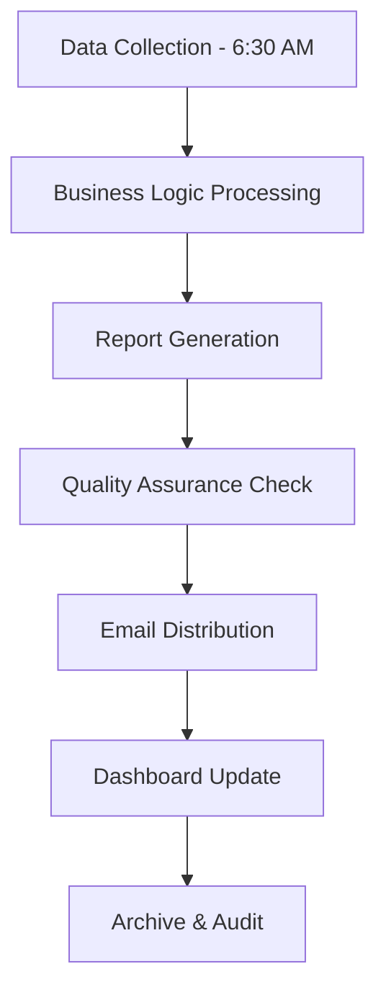
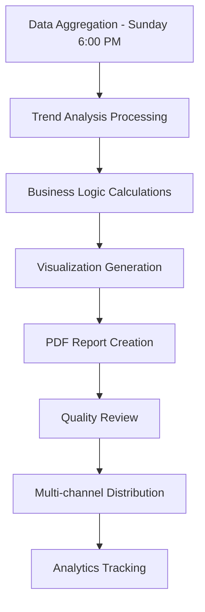

# Weekly Performance Report

```

#### Technical Implementation

**Data Sources:**

- PostHog `revenue_impact_event` (real-time monitoring)

- `executive_business_summary` view (daily snapshots)

- Deliverability API status checks

- Cost tracking aggregation

**Automation Pipeline:**



**Email Template Structure:**



```html
<!-- Executive Summary Header -->
<div class="executive-summary">
  <h1>Daily Executive Briefing - {{date}}</h1>
  <div class="business-health-score">{{healthScore}}/100</div>
</div>

<!-- Critical Alerts -->
<div class="alert-section">
  {{#if criticalAlerts}}
  <h2>🚨 Critical Actions Required</h2>
  {{#each criticalAlerts}}
  <div class="alert-item critical">
    <h3>{{title}}</h3>
    <p>Impact: {{businessImpact}}</p>
    <p>Action: {{recommendedAction}}</p>
    <p>Owner: {{responsibleExecutive}}</p>
  </div>
  {{/each}}
  {{/if}}
</div>

<!-- Revenue Protection -->
<div class="revenue-section">
  <h2>Revenue Protection Status</h2>
  {{revenueProtectionMetrics}}
</div>

<!-- Cost Optimization -->
<div class="cost-section">
  <h2>Optimization Opportunities</h2>
  {{costOptimizationSummary}}
</div>


```



### 2. Weekly Performance Report

**Frequency:** Every Monday at 8:00 AM EST
**Recipients:** VPs, Directors, Business Unit Leaders
**Delivery Method:** Email + PDF + Dashboard
**Reading Time:** 15-20 minutes

#### Content Structure

**Business Performance Scorecard:**

```markdown
Weekly Business Health Score: 87/100 (vs. 84)
├── Revenue Protection: 92/100
├── Cost Optimization: 78/100
├── Operational Efficiency: 89/100
└── Strategic Execution: 85/100


```

**Key Performance Indicators:**

```markdown
Revenue Metrics:
├── Total Emails Sent: 1.2M (vs. 1.1M last week: +9%)
├── Deliverability Rate: 98.2% (Target: >95%)
├── Revenue at Risk: $12,500 (vs. $18,200 last week: -31%)
└── Customer Churn Risk: $45,000 (vs. $52,000 last week: -13%)

Cost Metrics:
├── Infrastructure Costs: $42,500 (vs. $45,200 last week: -6%)
├── Email Service Costs: $18,750 (vs. $19,100 last week: -2%)
├── Total Operational Costs: $61,250 (vs. $64,300 last week: -5%)
└── Cost Efficiency Ratio: 2.1 (Target: >2.0)

Efficiency Metrics:
├── VPS Utilization: 78% (vs. 74% last week: +5%)
├── Email Service Efficiency: 89% (vs. 87% last week: +2%)
├── Process Automation Rate: 67% (vs. 63% last week: +6%)
└── Executive Decision Speed: 32 hours (vs. 38 hours last week: -16%)


```

**Trend Analysis:**

```markdown
7-Day Trend Analysis:
├── Revenue Protection: Improving (92% → 94% → 92%)
├── Cost Optimization: Stable (78% → 79% → 78%)
├── Operational Efficiency: Improving (85% → 87% → 89%)
└── Strategic Execution: Improving (82% → 84% → 85%)


```

**Strategic Initiative Progress:**

```markdown
Active Strategic Initiatives:
├── Email Infrastructure Optimization (80% complete)
│   ├── IP Warmup Strategy: 90% complete
│   ├── Deliverability Enhancement: 75% complete
│   └── Cost Reduction: 85% complete
├── Customer Success Automation (60% complete)
│   ├── Onboarding Automation: 70% complete
│   ├── Support Optimization: 50% complete
│   └── Retention Analytics: 60% complete
└── Data Analytics Enhancement (40% complete)
    ├── Business Intelligence Dashboard: 60% complete
    ├── Predictive Analytics: 30% complete
    └── Reporting Automation: 35% complete


```

#### Technical Implementation

**Report Generation Pipeline:**



**Automated Analytics Calculations:**

```typescript
// services/weekly-performance-analyzer.ts
interface BusinessMetrics {
  revenueProtection: number;
  costOptimization: number;
  operationalEfficiency: number;
  strategicExecution: number;
}

interface TrendAnalysis {
  current: number;
  trend: 'improving' | 'stable' | 'declining';
  velocity: number;
  confidence: number;
}

interface BusinessHealthScore {
  overall: number;
  revenueProtection: number;
  costOptimization: number;
  operationalEfficiency: number;
  strategicExecution: number;
}

interface WeeklyPerformanceAnalyzer {
  calculateBusinessHealthScore(tenantId: string, weekStart: Date, weekEnd: Date): Promise<BusinessHealthScore>;
  generateTrendAnalysis(tenantId: string, currentWeek: Date, previousWeeks?: number): Promise<Record<string, TrendAnalysis>>;
}

class WeeklyPerformanceAnalyzerImpl implements WeeklyPerformanceAnalyzer {
  async calculateBusinessHealthScore(
    tenantId: string,
    weekStart: Date,
    weekEnd: Date
  ): Promise<BusinessHealthScore> {
    const [
      revenueScore,
      costScore,
      efficiencyScore,
      strategicScore
    ] = await Promise.all([
      this.calculateRevenueProtectionScore(tenantId, weekStart, weekEnd),
      this.calculateCostOptimizationScore(tenantId, weekStart, weekEnd),
      this.calculateOperationalEfficiencyScore(tenantId, weekStart, weekEnd),
      this.calculateStrategicExecutionScore(tenantId, weekStart, weekEnd)
    ]);

    // Weighted business health calculation
    const healthScore = (
      revenueScore * 0.3 +
      costScore * 0.25 +
      efficiencyScore * 0.25 +
      strategicScore * 0.2
    );

    const overallScore = Math.max(0, Math.min(100, healthScore));

    return {
      overall: overallScore,
      revenueProtection: revenueScore,
      costOptimization: costScore,
      operationalEfficiency: efficiencyScore,
      strategicExecution: strategicScore
    };
  }

  async generateTrendAnalysis(
    tenantId: string,
    currentWeek: Date,
    previousWeeks: number = 3
  ): Promise<Record<string, TrendAnalysis>> {
    const metrics = ['revenueProtection', 'costOptimization', 'efficiency', 'strategic'];
    const trends: Record<string, TrendAnalysis> = {};

    for (const metric of metrics) {
      const currentValue = await this.getMetricValue(tenantId, metric, currentWeek);
      const previousWeeksList = this.getPreviousWeeks(currentWeek, previousWeeks);
      const previousValues = await Promise.all(
        previousWeeksList.map(week => this.getMetricValue(tenantId, metric, week))
      );

      const allValues = [...previousValues, currentValue];

      trends[metric] = {
        current: currentValue,
        trend: this.calculateTrendDirection(allValues),
        velocity: this.calculateTrendVelocity(allValues),
        confidence: this.calculateTrendConfidence(allValues)
      };
    }

    return trends;
  }

  private async calculateRevenueProtectionScore(tenantId: string, weekStart: Date, weekEnd: Date): Promise<number> {
    // Mock implementation - would calculate based on deliverability metrics
    const deliverabilityRate = await this.getDeliverabilityRate(tenantId, weekStart, weekEnd);
    const bounceRate = await this.getBounceRate(tenantId, weekStart, weekEnd);
    const revenueAtRisk = await this.getRevenueAtRisk(tenantId, weekStart, weekEnd);

    // Calculate score based on multiple factors
    const deliverabilityScore = deliverabilityRate * 100; // Convert to 0-100 scale
    const bounceScore = Math.max(0, 100 - (bounceRate * 10)); // Penalty for bounces
    const riskScore = Math.max(0, 100 - (revenueAtRisk / 100)); // Penalty for revenue at risk

    return (deliverabilityScore + bounceScore + riskScore) / 3;
  }

  private async calculateCostOptimizationScore(tenantId: string, weekStart: Date, weekEnd: Date): Promise<number> {
    // Mock implementation - would calculate based on cost metrics
    const costEfficiency = await this.getCostEfficiency(tenantId, weekStart, weekEnd);
    const optimizationOpportunities = await this.getOptimizationOpportunities(tenantId, weekStart, weekEnd);
    const implementedSavings = await this.getImplementedSavings(tenantId, weekStart, weekEnd);

    return (costEfficiency + optimizationOpportunities + implementedSavings) / 3;
  }

  private async calculateOperationalEfficiencyScore(tenantId: string, weekStart: Date, weekEnd: Date): Promise<number> {
    // Mock implementation - would calculate based on operational metrics
    const processAutomationRate = await this.getProcessAutomationRate(tenantId, weekStart, weekEnd);
    const systemPerformance = await this.getSystemPerformance(tenantId, weekStart, weekEnd);
    const resourceUtilization = await this.getResourceUtilization(tenantId, weekStart, weekEnd);

    return (processAutomationRate + systemPerformance + resourceUtilization) / 3;
  }

  private async calculateStrategicExecutionScore(tenantId: string, weekStart: Date, weekEnd: Date): Promise<number> {
    // Mock implementation - would calculate based on strategic metrics
    const initiativeProgress = await this.getInitiativeProgress(tenantId, weekStart, weekEnd);
    const goalAchievement = await this.getGoalAchievement(tenantId, weekStart, weekEnd);
    const decisionSpeed = await this.getDecisionSpeed(tenantId, weekStart, weekEnd);

    return (initiativeProgress + goalAchievement + decisionSpeed) / 3;
  }

  private async getMetricValue(tenantId: string, metric: string, week: Date): Promise<number> {
    // Mock implementation - would fetch from database
    return Math.random() * 100; // Random value between 0-100 for demonstration
  }

  private getPreviousWeeks(currentWeek: Date, count: number): Date[] {
    const weeks: Date[] = [];
    const current = new Date(currentWeek);

    for (let i = 1; i <= count; i++) {
      const week = new Date(current);
      week.setDate(week.getDate() - (i * 7));
      weeks.push(week);
    }

    return weeks;
  }

  private calculateTrendDirection(values: number[]): 'improving' | 'stable' | 'declining' {
    if (values.length < 2) return 'stable';

    const recent = values.slice(-3); // Last 3 values
    const older = values.slice(0, -3); // Previous values

    if (older.length === 0) return 'stable';

    const recentAvg = recent.reduce((sum, val) => sum + val, 0) / recent.length;
    const olderAvg = older.reduce((sum, val) => sum + val, 0) / older.length;

    const changePercent = ((recentAvg - olderAvg) / olderAvg) * 100;

    if (changePercent > 5) return 'improving';
    if (changePercent < -5) return 'declining';
    return 'stable';
  }

  private calculateTrendVelocity(values: number[]): number {
    if (values.length < 2) return 0;

    const firstHalf = values.slice(0, Math.floor(values.length / 2));
    const secondHalf = values.slice(Math.floor(values.length / 2));

    const firstAvg = firstHalf.reduce((sum, val) => sum + val, 0) / firstHalf.length;
    const secondAvg = secondHalf.reduce((sum, val) => sum + val, 0) / secondHalf.length;

    return secondAvg - firstAvg;
  }

  private calculateTrendConfidence(values: number[]): number {
    if (values.length < 3) return 0.5;

    const mean = values.reduce((sum, val) => sum + val, 0) / values.length;
    const variance = values.reduce((sum, val) => sum + Math.pow(val - mean, 2), 0) / values.length;
    const standardDeviation = Math.sqrt(variance);

    // Higher confidence for lower standard deviation relative to mean
    const coefficientOfVariation = standardDeviation / mean;
    return Math.max(0, Math.min(1, 1 - coefficientOfVariation));
  }

  // Mock data methods (would be replaced with actual database queries)
  private async getDeliverabilityRate(tenantId: string, start: Date, end: Date): Promise<number> {
    return 0.985; // 98.5% deliverability
  }

  private async getBounceRate(tenantId: string, start: Date, end: Date): Promise<number> {
    return 0.012; // 1.2% bounce rate
  }

  private async getRevenueAtRisk(tenantId: string, start: Date, end: Date): Promise<number> {
    return 2500; // $2,500 at risk
  }

  private async getCostEfficiency(tenantId: string, start: Date, end: Date): Promise<number> {
    return 85; // 85% cost efficiency
  }

  private async getOptimizationOpportunities(tenantId: string, start: Date, end: Date): Promise<number> {
    return 78; // 78% optimization score
  }

  private async getImplementedSavings(tenantId: string, start: Date, end: Date): Promise<number> {
    return 82; // 82% savings implementation
  }

  private async getProcessAutomationRate(tenantId: string, start: Date, end: Date): Promise<number> {
    return 67; // 67% automation
  }

  private async getSystemPerformance(tenantId: string, start: Date, end: Date): Promise<number> {
    return 89; // 89% system performance
  }

  private async getResourceUtilization(tenantId: string, start: Date, end: Date): Promise<number> {
    return 78; // 78% resource utilization
  }

  private async getInitiativeProgress(tenantId: string, start: Date, end: Date): Promise<number> {
    return 85; // 85% initiative progress
  }

  private async getGoalAchievement(tenantId: string, start: Date, end: Date): Promise<number> {
    return 92; // 92% goal achievement
  }

  private async getDecisionSpeed(tenantId: string, start: Date, end: Date): Promise<number> {
    return 88; // 88% decision speed
  }
}

// Usage example
async function demonstrateWeeklyAnalysis() {
  const analyzer = new WeeklyPerformanceAnalyzerImpl();

  const tenantId = 'tenant_123';
  const weekStart = new Date('2025-11-18');
  const weekEnd = new Date('2025-11-24');

  const healthScore = await analyzer.calculateBusinessHealthScore(tenantId, weekStart, weekEnd);
  console.log('Business Health Score:', healthScore);

  const trends = await analyzer.generateTrendAnalysis(tenantId, weekEnd);
  console.log('Trend Analysis:', trends);
}


```
