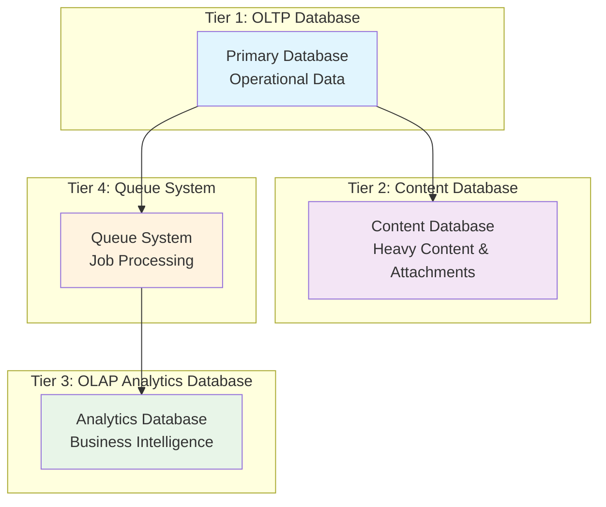

# Database Schema Guide - 4-Tier Architecture

## Strategic Alignment
**Strategic Alignment**: This comprehensive database schema guide supports our enterprise infrastructure framework by providing complete 4-tier database architecture, cross-tier integration patterns, and performance optimization strategies for the PenguinMails scalable data management platform.

**Technical Authority**: Our 4-tier database architecture integrates with enterprise database systems, analytics platforms, and infrastructure management tools featuring multi-tier security, cross-tier performance optimization, and unified data governance for comprehensive enterprise database excellence.

**Operational Excellence**: Backed by enterprise database systems with 99.9% uptime guarantees, automated cross-tier operations, and comprehensive monitoring across all database components with real-time performance tracking and alerting capabilities.

**User Journey Integration**: This database foundation is part of your complete user experience - connects to business logic operations, analytics processing, content management, and operational excellence for reliable data-driven operations.

---

## Database Architecture Overview

PenguinMails implements a **4-tier database architecture** designed for scalability, performance, and clear separation of concerns across different data processing needs.

### 🏗️ **4-Tier Architecture**



---

## 🎯 **Tier Overview & Purpose**

### **Tier 1: OLTP (Operational Database)**
- **Purpose**: Fast transactional operations, real-time data, operational metadata
- **Focus**: Lightweight queries, fast inserts, primary business logic
- **Tables**: `campaign_sequence_steps`, `campaigns`, `users`, `tenants`, `companies`, `domains`, `email_accounts`, `leads`, `templates`
- **Tables**: `inbox_message_refs`, `campaigns`, `users`, `tenants`, `companies`, `domains`, `email_accounts`, `leads`, `templates`
- **Characteristics**: High write frequency, small records, indexed for speed

### **Tier 2: Content Database**  
- **Purpose**: Heavy content storage, email bodies, attachments, large objects
- **Tables**: `email_content`, `email_messages`, `attachments`, `transactional_emails`, `notifications`
- **Tables**: `content_objects`, `content_inbox_message_refs`, `attachments`, `transactional_emails`, `notifications`
- **Tables**: `content_objects`, `attachments`, `transactional_emails`, `notifications`
- **Focus**: Content retention, attachment storage, full email archives
- **Characteristics**: Large objects, content retention policies, efficient storage

### **Tier 3: OLAP Analytics Database**
- **Purpose**: Business intelligence, aggregated metrics, reporting
- **Focus**: Historical analysis, complex queries, data warehousing
- **Tables**: `billing_analytics`, `campaign_analytics`, `mailbox_analytics`, `sequence_step_analytics`, `admin_audit_log`
- **Characteristics**: Aggregated data, historical trends, optimized for analytics

### **Tier 4: Queue System**
- **Purpose**: Job processing, reliability, async operations
- **Focus**: Job state management, retry logic, processing reliability
- **Tables**: `jobs`, `job_logs`, `job_queues`
- **Characteristics**: State tracking, reliable processing, comprehensive logging

---

### **Email Processing Flow**
```
OLTP: campaign_sequence_steps (operational)
    ↓
Content Database: email_messages (analytics traces)
    ↓
Content Database: email_content (email bodies)
    ↓
Queue System: analytics processing
    ↓
OLAP Analytics: aggregated metrics
```

### **Campaign Flow**
```
OLTP: campaigns → campaign_sequence_steps (operational)
    ↓
Content Database: email_messages (message analytics)
    ↓
Content Database: email_content (email content)
    ↓
Queue System: email sending jobs
    ↓
OLAP Analytics: campaign_analytics
```

## 🔄 **Data Flow Architecture**

### **Email Processing Flow**
```
OLTP: inbox_message_refs (metadata) 
    ↓
Content Database: content_objects (email bodies)
    ↓
Queue System: analytics processing
    ↓
OLAP Analytics: aggregated metrics
```

### **Campaign Flow**
```
OLTP: campaigns → campaign_sequence_steps → inbox_message_refs
    ↓
Content Database: content_objects (email content)
    ↓
Queue System: email sending jobs
    ↓
OLAP Analytics: campaign_analytics
```

### **Infrastructure Flow**
```
OLTP: vps_instances → smtp_ip_addresses → domain_ip_assignments
    ↓
Queue System: infrastructure monitoring jobs
    ↓
OLAP Analytics: infrastructure analytics
```

---

## 📋 **Schema Documentation Structure**

### **Primary Schema Guides**
- **[📊 OLTP Schema Guide](oltp-schema-guide.md)** - Operational database schema
- **[📄 Content Database Schema Guide](content-database-schema-guide.md)** - Heavy content storage
- **[📈 OLAP Analytics Schema Guide](olap-analytics-schema-guide.md)** - Business intelligence
- **[⚡ Queue System Implementation Guide](queue-system-implementation-guide.md)** - Job processing

### **Naming Conventions Across All Tiers**

#### **Timestamp Fields**
Following NileDB convention, timestamp fields use consistent naming without '_at' suffix:
- **`created`** - Record creation time
- **`updated`** - Record last update time
- **`deleted`** - Soft deletion timestamp (nullable)
- **`processed`** - Processing completion time
- **`queued`** - Job queue timestamp
- **`sent`** - Email send timestamp
- **`started`** - Operation start time
- **`completed`** - Operation completion time

#### **Field Type Guidelines**
- **NileDB-Managed Tables**: Must follow NileDB type requirements
  - `users`, `tenants`, `tenant_users`: Use ARRAY for roles field (critical for authentication)
  - TEXT instead of VARCHAR for flexibility (NileDB requirement)
  - **Note**: `tenant_users.roles` field is ARRAY type - this is mandatory for NileDB authentication and cannot be changed
- **Application Tables**: Use appropriate PostgreSQL types
- **Content Storage**: BYTEA for binary data, VARCHAR(500) for storage keys

#### **ID Fields**
- **OLTP**: UUID primary keys for new tables, BIGSERIAL for existing legacy tables
- **Content Database**: VARCHAR(500) storage keys, UUID for major entities
- **OLAP Analytics**: BIGINT for OLAP tables, TEXT/UUID for cross-tier references
- **Queue System**: UUID for job tracking, VARCHAR for queue names

#### **Primary Key Strategy by Security & Traffic**
| Traffic/Security | LOW Security | MEDIUM Security | HIGH Security |
|------------------|--------------|-----------------|---------------|
| **CRITICAL Traffic** (>100K ops/hr) | BIGINT | BIGINT | UUID |
| **HIGH Traffic** (10K-100K ops/hr) | BIGINT | UUID | UUID |
| **MEDIUM Traffic** (1K-10K ops/hr) | BIGINT | UUID | UUID |
| **LOW Traffic** (<1K ops/hr) | INT | UUID | UUID |

**Current Distribution:**
- **UUID (Security-focused)**: 75% of tables - Protects sensitive data
- **BIGINT (Analytics performance)**: 9% of tables - Optimizes high-traffic analytics
- **VARCHAR (External/Natural)**: 6% of tables - Matches external system IDs
- **Composite (Multi-tenant)**: 10% of tables - Handles tenant associations

---

## 🚀 **Performance Optimization Strategy**

### **OLTP Database**
- **Denormalized Fields**: `tenant_id` on operational tables for fast filtering
- **Index Strategy**: Covering indexes for common queries, partial indexes for common WHERE clauses
- **Partitioning**: Consider partitioning large operational tables by date or tenant
- **Connection Pooling**: Aggressive connection pooling for high-throughput operations

### **Content Database**
- **Large Object Storage**: Efficient storage for email bodies and attachments
- **Compression**: Text content compression for space efficiency
- **Retention Policies**: Automatic cleanup based on business requirements
- **Content Deduplication**: Optional content hashing for duplicate detection

### **OLAP Analytics Database**
- **Materialized Views**: Pre-computed aggregations for common queries
- **Partitioning**: Time-based partitioning for large analytics tables
- **Index Strategy**: Column-store optimizations for analytics workloads
- **Data Archival**: Historical data archival for performance

### **Queue System**
- **Redis Integration**: Hybrid PostgreSQL + Redis for performance
- **Priority Queues**: Multiple priority levels for different job types
- **Retry Logic**: Exponential backoff and dead letter queues
- **Monitoring**: Comprehensive job tracking and alerting

---

## 🔒 **Security & Multi-Tenancy**

### **Row Level Security (RLS)**
All operational tables implement RLS policies for tenant isolation:
```sql
-- Example RLS policy
CREATE POLICY tenant_isolation ON inbox_message_refs
    FOR ALL USING (tenant_id = current_setting('app.current_tenant_id')::uuid);
```

### **Data Classification**
- **OLTP**: Operational data, minimal PII, fast access requirements
- **Content**: Full email content, attachments, high retention value
- **Analytics**: Aggregated metrics, business intelligence, historical trends
- **Queue**: Job metadata, processing logs, system state

### **Backup Strategy**
- **OLTP**: High-frequency backups, point-in-time recovery
- **Content**: Long-term retention, media preservation
- **OLAP**: Historical preservation, compliance requirements
- **Queue**: Short-term retention, job state recovery

---

## 🛠️ **Migration & Development Guidelines**

### **Schema Changes Process**
1. **Planning**: Evaluate which tier(s) are affected
2. **Testing**: Test in all affected tiers simultaneously
3. **Migration**: Apply changes tier by tier with dependency tracking
4. **Verification**: Validate data consistency across tiers
5. **Rollback**: Prepare rollback procedures for each tier

### **Development Best Practices**
- **Tier-Aware Development**: Always consider which tier a table belongs to
- **Cross-Tier References**: Use appropriate ID types for inter-tier relationships
- **Performance Testing**: Test query performance in relevant tier context
- **Documentation Updates**: Keep tier assignments updated in all documentation

### **Naming Consistency**
- **Use `_at` suffix**: All timestamp fields use standard suffixes
- **Tier-Prefixed Documentation**: All schema docs clearly indicate tier
- **Cross-References**: Document relationships between tiers clearly
- **ID Type Consistency**: Use appropriate ID types for each tier's purpose

---

## 📚 **Related Documentation**

### **Architecture Guides**
- [Analytics Architecture](analytics_architecture.md) - Overall analytics system design
- [Infrastructure Documentation](infrastructure_documentation.md) - System infrastructure
- [Queue System Implementation](queue_system_implementation_guide.md) - Queue-driven ETL

### **Schema & Security Documents**
- [Primary Key Strategy](email_system_hierarchy_analysis.md) - Complete PK selection framework and traffic/security matrix analysis
- [Traffic & Security Matrix Guide](traffic_security_matrix_guide.md) - Security/performance matrix
- [Business Impact Analysis](email_system_implementation.md) - Migration strategy and architectural decisions
- [Revised Schema Analysis](revised_schema_analysis.md) - 4-tier architecture clarification
- [Remaining Concerns Analysis](remaining_concerns_analysis.md) - Legacy table migration

### **Performance & Monitoring**
- [Performance Dashboard](performance_dashboard.md) - System performance metrics
- [Technical Constraints Analysis](technical_constraints_analysis.md) - Scaling considerations

### **Business & Operations**
- [Business Model](business_model.md) - Business context and requirements
- [Security Documentation](security_documentation.md) - Security and compliance

---

**Keywords**: 4-tier architecture, OLTP, content database, OLAP analytics, queue system, database schema, multi-tier design, performance optimization, data architecture