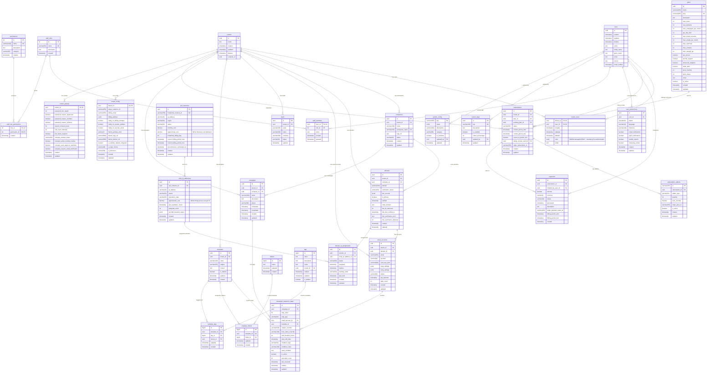

# OLTP ER Diagram (Mermaid)

This diagram reflects the current OLTP schema defined in [`schema-guide`](/docs/implementation-technical/database-infrastructure/oltp-database/schema-guide).

```mermaid
---
config:
  layout: dagre
---
erDiagram
  direction TB

  users {
    uuid id PK
    timestamp created
    timestamp updated
    timestamp deleted
    text name
    text family_name
    text given_name
    text email
    text picture
    timestamp email_verified
  }

  tenants {
    uuid id PK
    text name
    timestamp created
    timestamp updated
    timestamp deleted
    uuid compute_id
  }

  tenant_users {
    uuid tenant_id PK,FK
    uuid user_id PK,FK
    timestamp created
    timestamp updated
    timestamp deleted
    text[] roles "NileDB-managed ARRAY - mandatory for authentication"
    text email
  }

  companies {
    uuid id PK
    uuid tenant_id FK
    varchar(100) name
    varchar(255) workspace_name UK
    text logo_url
    varchar(20) status
    timestamp created
    timestamp updated
  }

  domains {
    uuid id PK
    uuid tenant_id FK
    uuid company_id FK
    varchar(253) domain
    varchar(50) verification_status
    jsonb dns_records
    boolean is_primary
    timestamp verified
    text mailu_domain
    int dns_ttl_observed
    timestamp dns_last_verified_at
    text dns_verification_error
    int dns_verification_attempts
    timestamp created
    timestamp updated
  }

  email_accounts {
    uuid id PK
    uuid tenant_id FK
    uuid domain_id FK
    varchar(255) email
    varchar(50) provider
    varchar(500) vault_key_path
    jsonb imap_settings
    jsonb smtp_settings
    varchar(50) status
    timestamp last_warmed
    int daily_count
    timestamp created
    timestamp updated
  }

  leads {
    uuid id PK
    uuid tenant_id FK
    varchar(255) email
    varchar(200) name
    varchar(200) company
    varchar(20) status
    timestamp updated
  }

  templates {
    uuid id PK
    uuid tenant_id FK
    varchar(100) name
    varchar(255) subject
    text content
    boolean is_started
    timestamp updated
    timestamp created
  }

  folders {
    bigint id PK
    text name
    timestamp updated
    timestamp created
  }

  template_folders {
    bigint id PK
    uuid template_id FK
    bigint folder_id FK
    timestamp updated
    timestamp created
  }

  tags {
    bigint id PK
    text value
    text description
    text name
    uuid tenant_id FK
    timestamp created
    timestamp updated
    boolean is_default
  }

  template_tags {
    bigint id PK
    uuid template_id FK
    bigint tag_id FK
    uuid tenant_id FK
    timestamp updated
    timestamp created
  }

  campaigns {
    uuid id PK
    uuid tenant_id FK
    uuid company_id FK
    varchar(200) name
    text description
    varchar(50) status
    timestamp scheduled
    timestamp completed
    timestamp created
    timestamp updated
  }

  campaign_sequence_steps {
    uuid id PK
    uuid campaign_id FK
    int step_order
    varchar(50) step_type
    uuid email_account_id FK
    uuid template_id FK
    varchar(500) subject_override
    varchar(100) from_name_override
    int wait_duration_hours
    timestamp wait_until_date
    varchar(50) condition_type
    varchar(100) condition_value
    text send_condition
    boolean is_active
    int executed_count
    timestamp last_executed
    timestamp created
    timestamp updated
  }

  plans {
    uuid id PK
    varchar(100) name
    varchar(100) slug UK
    text description
    int max_users
    int max_domains
    int max_campaigns_per_month
    int api_rate_limit
    int max_email_accounts
    int max_emails_per_month
    int max_warmups
    int max_contacts
    int max_storage_gb
    boolean api_access
    boolean priority_support
    boolean advanced_analytics
    boolean white_label
    int price_monthly
    int price_yearly
    text notes
    boolean is_active
    timestamp created
    timestamp updated
  }

  subscriptions {
    uuid id PK
    uuid tenant_id FK
    uuid plan_id FK
    uuid pending_plan_id FK
    varchar(50) status
    timestamp current_period_start
    timestamp current_period_end
    boolean cancel_at_period_end
    uuid billing_contact_user_id FK
    varchar(255) stripe_subscription_id
    timestamp created
    timestamp updated
  }

  subscription_addons {
    varchar(255) id PK
    uuid subscription_id FK
    varchar(50) addon_type
    int quantity
    decimal price_monthly
    varchar(255) stripe_price_id
    boolean is_active
    timestamp created
    timestamp updated
  }

  payments {
    uuid id PK
    uuid subscription_id FK
    uuid initiated_by_user_id FK
    decimal amount
    varchar(3) currency
    varchar(20) status
    timestamp processed
    text description
    varchar(255) stripe_payment_intent_id
    timestamp billing_period_start
    timestamp billing_period_end
    timestamp created
  }

  vps_instances {
    uuid id PK
    varchar(255) hostwinds_instance_id UK
    varchar(45) ip_address
    varchar(50) region
    varchar(50) status
    decimal monthly_cost
    decimal approximate_cost "NEW: Business cost attribution"
    int hostwinds_billing_day
    timestamp current_billing_period_start
    timestamp current_billing_period_end
    timestamp decommission_scheduled_for
    timestamp created
    timestamp updated
  }

  smtp_ip_addresses {
    uuid id PK
    uuid vps_instance_id FK
    varchar(45) ip_address
    varchar(50) status
    varchar(50) reputation_state
    decimal approximate_cost "NEW: Email service cost per IP"
    timestamp last_reputation_check
    int assigned_count
    jsonb provider_blacklist_status
    timestamp created
    timestamp updated
  }

  domain_ip_assignments {
    uuid id PK
    uuid domain_id FK
    uuid smtp_ip_address_id FK
    varchar(50) status
    timestamp assigned
    timestamp expires
    varchar(50) warmup_state
    timestamp last_sent
    timestamp created
    timestamp updated
  }

  staff_members {
    uuid user_id PK,FK
    int role_id FK
    text notes
    timestamp created
    timestamp updated
  }

  staff_roles {
    int id PK
    varchar(50) name UK
    text description
    timestamp created
  }

  staff_role_permissions {
    int role_id PK,FK
    int permission_id PK,FK
    timestamp created
  }

  permissions {
    int id PK
    varchar(100) name UK
    text description
    varchar(50) category
    timestamp created
  }

  system_config {
    varchar(255) key PK
    jsonb value
    varchar(500) description
    varchar(50) category
    boolean is_sensitive
    uuid updated_by FK
    timestamp updated
  }

  feature_flags {
    uuid id PK
    varchar(100) key UK
    text description
    boolean is_enabled
    int rollout_percentage
    uuid updated_by FK
    timestamp updated
  }

  user_preferences {
    uuid id PK
    uuid user_id FK
    varchar(50) theme
    varchar(10) language
    varchar(100) timezone
    boolean email_notifications
    boolean push_notifications
    boolean weekly_reports
    boolean marketing_emails
    timestamp created
    timestamp updated
  }

  tenant_config {
    uuid tenant_id PK,FK
    varchar(255) stripe_customer_id
    varchar(255) billing_email
    jsonb billing_address
    boolean notify_on_billing_changes
    boolean notify_on_system_updates
    boolean notify_on_security_alerts
    varchar(7) theme_primary_color
    varchar(500) theme_logo_url
    varchar(500) theme_favicon_url
    boolean ui_sidebar_default_collapsed
    varchar(20) ui_date_format
    varchar(50) ui_timezone
    timestamp created
    timestamp updated
  }

  tenant_policies {
    uuid tenant_id PK,FK
    int password_min_length
    boolean password_require_uppercase
    boolean password_require_numbers
    boolean password_require_symbols
    int session_timeout_hours
    int max_login_attempts
    boolean two_factor_required
    varchar(50) company_default_status
    boolean company_allow_member_invites
    boolean company_auto_approve_members
    boolean company_require_email_verification
    timestamp created
    timestamp updated
  }

  %% Relationships

  users ||--o{ tenant_users : "belongs to tenants"
  tenants ||--o{ tenant_users : "has users"

  tenants ||--o{ companies : "has workspaces"
  tenants ||--o{ domains : "has domains"
  tenants ||--o{ email_accounts : "has email accounts"
  tenants ||--o{ leads : "has leads"
  tenants ||--o{ templates : "has templates"
  tenants ||--o{ campaigns : "has campaigns"

  companies ||--o{ domains : "owns domains"
  companies ||--o{ campaigns : "runs campaigns"

  domains ||--o{ email_accounts : "has accounts"
  domains ||--o{ domain_ip_assignments : "assigned IPs"

  vps_instances ||--o{ smtp_ip_addresses : "hosts IPs"
  smtp_ip_addresses ||--o{ domain_ip_assignments : "mapped to domains"

  campaigns ||--o{ campaign_sequence_steps : "has steps"
  templates ||--o{ campaign_sequence_steps : "used in steps"
  email_accounts ||--o{ campaign_sequence_steps : "senders"

  plans ||--o{ subscriptions : "plan for"
  tenants ||--o{ subscriptions : "subscribes"
  subscriptions ||--o{ subscription_addons : "has addons"
  subscriptions ||--o{ payments : "paid via"
  users ||--o{ subscriptions : "billing contact"
  users ||--o{ payments : "initiated by"

  users ||--o{ user_preferences : "has preferences"
  tenants ||--o{ tenant_config : "has config"
  tenants ||--o{ tenant_policies : "has policies"

  staff_roles ||--o{ staff_members : "role for staff"
  users ||--o{ staff_members : "can be staff"
  staff_roles ||--o{ staff_role_permissions : "grants"
  permissions ||--o{ staff_role_permissions : "assigned"

  %% Template organization & tagging
  templates ||--o{ template_folders : "assigned to folders"
  folders ||--o{ template_folders : "contain templates"

  templates ||--o{ template_tags : "tagged with"
  tags ||--o{ template_tags : "used for templates"

  users ||--o{ feature_flags : "updated by"
  users ||--o{ system_config : "updated by"


```

---

