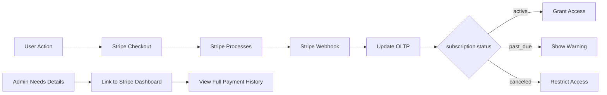

# OLTP Schema - Payment Architecture

## Payment Architecture Philosophy

### Stripe-First Approach

PenguinMails follows a **Stripe-First** approach for all payment operations:

**What Stripe Manages:**

- ✅ Payment processing and secure card storage (PCI compliance)
- ✅ Subscription billing lifecycle (create, update, cancel)
- ✅ Invoice generation and PDF rendering
- ✅ Payment retry logic and dunning management
- ✅ Refund processing and payment history
- ✅ Customer portal for self-service billing

**What PenguinMails OLTP Stores:**

- ✅ Operational references only (`stripe_subscription_id`, `stripe_payment_intent_id`)
- ✅ Minimal status for access control (`status`, `current_period_end`)
- ✅ Linking data (subscription → tenant, subscription → plan)

**What We DON'T Store in OLTP:**

- ❌ Full payment transaction details (amount, currency, method) - Retrieved from Stripe API when needed
- ❌ Invoice PDFs or invoice line items - Served from Stripe
- ❌ Refund history or refund reasons - Managed in Stripe Dashboard
- ❌ Payment method details (card brand, last 4) - Retrieved from Stripe API
- ❌ Detailed retry schedules or dunning state - Stripe handles this

### Three-Tier Payment Data Architecture

## Tier 1: OLTP (This Database)

- Operational subscription references
- Access control and tenant status
- Real-time subscription state

### Tier 2: OLAP Analytics

- Usage aggregation (`billing_analytics`: emails_sent, domains_used)
- Billing period metrics
- Updated via daily/weekly batch jobs (NOT real-time)

### Tier 3: Stripe Dashboard

- Full payment transaction history
- Invoice PDFs and payment methods
- Refund processing and retry controls

### OLTP Constraints

The OLTP payment tables are intentionally **minimal** to:

1. **Single Source of Truth:** Stripe webhooks drive all state changes
2. **Reduce Sync Issues:** Fewer fields = fewer potential inconsistencies
3. **Simplify Operations:** Link to Stripe Dashboard instead of duplicating functionality
4. **Performance:** Small records, fast queries for access control

### Payment Data Flow

**Key Point:** OLTP is for **access control and tenant status**, not payment accounting.
