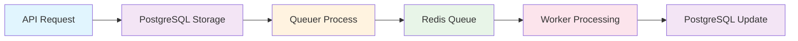

# Queue System Architecture

## Overview

The Queue System implements a hybrid architecture combining PostgreSQL for durable state management with Redis for high-performance job processing. This design ensures both reliability and speed for PenguinMails' asynchronous operations.

## Architecture Principles

### Dual Storage Strategy

### PostgreSQL (Durable Layer)

- Permanent job storage and state tracking
- ACID compliance for data consistency
- Complex queries for job management
- Comprehensive audit trails
- Integration with analytics systems

### Redis (Performance Layer)

- Millisecond-latency job queues
- Real-time job processing
- Priority-based routing
- Horizontal scaling support
- Memory-efficient data structures

### Design Benefits

1. **No Job Loss**: PostgreSQL ensures no jobs are lost during system failures
2. **High Throughput**: Redis provides fast job processing for peak loads
3. **Scalability**: Both systems scale independently
4. **Reliability**: Comprehensive error handling and recovery mechanisms
5. **Observability**: Complete job lifecycle tracking and monitoring

## System Components

### Component Overview

```text
┌─────────────────────────────────────────────────────────────┐
│                    Queue System Architecture                │
├─────────────────────────────────────────────────────────────┤
│                                                             │
│  ┌──────────────┐    ┌──────────────┐    ┌──────────────┐  │
│  │ Next.js API  │    │ Queuer Proc  │    │ Worker Servers│  │
│  │   Producer   │────│   Migrator   │────│   Consumer   │  │
│  └──────────────┘    └──────────────┘    └──────────────┘  │
│         │                   │                   │           │
│         │                   │                   │           │
│  ┌──────────────┐    ┌──────────────┐    ┌──────────────┐  │
│  │ PostgreSQL   │    │   Redis      │    │ Job Processing│  │
│  │Jobs & State  │    │ Fast Queues  │    │   Logic      │  │
│  │  (Durable)   │    │ (Performance)│    │              │  │
│  └──────────────┘    └──────────────┘    └──────────────┘  │
│                                                             │
└─────────────────────────────────────────────────────────────┘
```

### Component Responsibilities

#### API Layer (Producer)

- **Purpose**: Creates new jobs and submits them to the system
- **Storage**: Initially stores jobs in PostgreSQL
- **Priority**: High-priority jobs may bypass Redis migration

```pseudo
function createJob(queueName, payload, priority) {
  jobId = generateUniqueId()
  
  // Store in PostgreSQL (durable)
  job = database.jobs.create({
    id: jobId,
    queue_name: queueName,
    payload: payload,
    priority: priority,
    status: 'queued'
  })
  
  // For high-priority jobs, also add to Redis immediately
  if (priority <= HIGH_PRIORITY_THRESHOLD) {
    redis.lpush(`${queueName}:high`, job)
  }
  
  return job
}
```

#### Queuer Process (Migrator)

- **Purpose**: Migrates jobs from PostgreSQL to Redis for processing
- **Frequency**: Runs continuously, checking every few seconds
- **Strategy**: Priority-based batch migration

```pseudo
function migratorLoop() {
  while (isRunning) {
    try {
      // Find ready jobs from PostgreSQL
      readyJobs = database.jobs.findMany({
        status: 'queued',
        run_at: '<= now()',
        orderBy: ['priority', 'created_at'],
        limit: BATCH_SIZE
      })
      
      for (job in readyJobs) {
        migrateJobToRedis(job)
        updateJobStatus(job.id, 'migrated_to_redis')
      }
      
      sleep(MIGRATION_INTERVAL)
    } catch (error) {
      logError('Migration failed', error)
      sleep(RETRY_DELAY)
    }
  }
}

function migrateJobToRedis(job) {
  queueName = determineQueueName(job.priority, job.queue_name)
  redisPayload = {
    id: job.id,
    queue_name: job.queue_name,
    priority: job.priority,
    payload: job.payload,
    created_at: job.created_at,
    attempt_count: job.attempt_count,
    max_attempts: job.max_attempts
  }
  
  // Add to appropriate priority queue
  redis.lpush(queueName, JSON.stringify(redisPayload))
  
  // Track in Redis hash for real-time status
  redis.hset(`job:${job.id}`, {
    status: 'migrated',
    queued_at: now(),
    attempt_count: job.attempt_count
  })
}
```

#### Worker Servers (Consumers)

- **Purpose**: Process jobs from Redis queues
- **Scaling**: Multiple workers can run concurrently
- **Reliability**: Automatic retry with exponential backoff

```pseudo
function workerLoop(workerId) {
  queues = [
    'queue:email:processing:high',
    'queue:email:processing',
    'queue:email:processing:low',
    // ... other queue names
  ]
  
  while (isRunning) {
    try {
      // Blocking pop with priority ordering
      result = redis.brpop(queues, TIMEOUT)
      
      if (result) {
        [queueName, jobData] = result
        job = JSON.parse(jobData)
        processJob(job, queueName, workerId)
      }
    } catch (error) {
      logError(`Worker ${workerId} error`, error)
      sleep(1)
    }
  }
}

function processJob(job, queueName, workerId) {
  try {
    // Update job status in PostgreSQL
    updateJobStatus(job.id, 'running', {
      started_at: now(),
      worker_id: workerId
    })
    
    // Update Redis tracking
    redis.hset(`job:${job.id}`, {
      status: 'processing',
      worker_id: workerId,
      started_at: now()
    })
    
    // Execute job based on queue type
    executeJobLogic(job.payload, queueName)
    
    // Mark as completed
    updateJobStatus(job.id, 'completed', {
      completed_at: now()
    })
    
    redis.hset(`job:${job.id}`, {
      status: 'completed',
      completed_at: now()
    })
    
  } catch (error) {
    handleJobFailure(job, error)
  }
}
```

## Data Flow

### Job Lifecycle

1. **Creation**: Job created via API, stored in PostgreSQL
2. **Migration**: Queuer process moves job to Redis queue
3. **Processing**: Worker consumes job from Redis
4. **Completion**: Job status updated in both systems



### Priority Routing

Jobs are automatically routed to appropriate priority queues:

```pseudo
function determineQueueName(priority, queueName) {
  if (priority <= 50) return `${queueName}:high`     // Urgent
  if (priority <= 150) return queueName              // Normal
  return `${queueName}:low`                          // Background
}
```

## Scalability Considerations

### Horizontal Scaling

### PostgreSQL Scaling

- Read replicas for query distribution
- Connection pooling for efficiency
- Proper indexing for performance

### Redis Scaling

- Redis Cluster for horizontal distribution
- Memory optimization and eviction policies
- Connection multiplexing

### Worker Scaling

- Stateless worker design
- Container orchestration (Kubernetes)
- Auto-scaling based on queue depth

### Performance Optimization

### Batch Operations

- Migrate jobs in batches to reduce database load
- Process multiple jobs per worker iteration
- Bulk updates for status changes

### Memory Management

- Redis memory limits and eviction policies
- Connection pooling for database connections
- Efficient serialization (JSON vs binary)

### Monitoring Integration

- Real-time queue depth monitoring
- Worker utilization tracking
- Performance metrics collection

## Failure Handling

### System Resilience

### Database Failures

- PostgreSQL read replicas for redundancy
- Automatic failover mechanisms
- Job recovery after database restoration

### Redis Failures

- Redis persistence configuration
- Queue backup and recovery procedures
- Graceful degradation strategies

### Worker Failures

- Automatic job reassignment
- Timeout-based job recovery
- Dead letter queue for failed jobs

### Recovery Procedures

```pseudo
function handleSystemFailure() {
  // 1. Assess failure scope
  failureType = diagnoseFailure()
  
  // 2. Implement recovery based on type
  switch (failureType) {
    case 'redis_down':
      activateRedisFailover()
      pauseNewJobProcessing()
      break
      
    case 'database_down':
      enableReadOnlyMode()
      queueNewJobs()
      break
      
    case 'worker_failure':
      redistributeActiveJobs()
      scaleUpWorkers()
      break
  }
  
  // 3. Monitor recovery
  waitForSystemStability()
  resumeNormalOperations()
}
```

## Integration Points

### External Systems

- **Email Processing**: Integration with sending/receiving systems
- **Analytics**: Job metrics for business intelligence
- **Monitoring**: Health checks and alerting
- **Notifications**: System status communications

### Database Systems

- **OLTP Operations**: Direct job state queries
- **Content Storage**: Email content references
- **Analytics Pipeline**: Job execution metrics
- **Audit Systems**: Compliance and logging requirements

## Conclusion

This hybrid architecture provides the optimal balance of durability and performance for enterprise-grade job processing. The separation of concerns between PostgreSQL (durability) and Redis (performance) ensures system reliability while maintaining high throughput capabilities.

The architecture supports horizontal scaling, comprehensive monitoring, and robust failure handling, making it suitable for mission-critical asynchronous operations.
