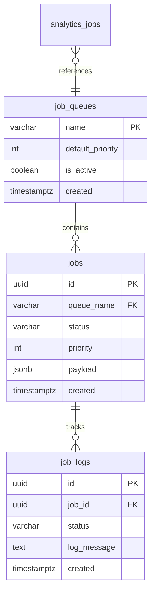

---
title: "Queue Database Schema"
description: "Queue Database Schema - Job Tables and Indexes"
last_modified_date: "2025-11-19"
level: "2"
persona: "Database Architects"
related_docs:

  - "[Main Guide](/docs/implementation-technical/database-infrastructure/queue/main) - Complete overview"

  - "[Architecture](/docs/implementation-technical/database-infrastructure/queue/architecture) - System design principles"

  - "[Entity Relationship Diagram](/docs/implementation-technical/database-infrastructure/queue/mermaid-er) - Visual schema"
---

# Queue Database Schema

## Overview

The PostgreSQL schema provides durable job storage, comprehensive state tracking, and audit capabilities. This design ensures no job is lost while maintaining efficient query performance for job management operations.

## Core Tables

### Job Queues Configuration

**Purpose**: Defines available queue types and their default properties

```pseudo
TABLE job_queues {
  name: VARCHAR(100)           // Primary key, unique queue identifier
  default_priority: INTEGER    // Default priority for jobs in this queue (lower = higher priority)
  is_active: BOOLEAN           // Enable/disable all jobs in this queue
  created: TIMESTAMP           // When queue was created
}

```

**Usage Patterns**:

- Queue discovery for new job types

- Default priority management

- Queue activation/deactivation

**Example Data**:

```pseudo
job_queues data = [
  { name: "email-sending", default_priority: 100, is_active: true },
  { name: "email-processing", default_priority: 75, is_active: true },
  { name: "analytics", default_priority: 150, is_active: true }
]

```

### Jobs (Main Job Table)

**Purpose**: Permanent storage of all jobs with their complete lifecycle state

```pseudo
TABLE jobs {
  id: UUID                     // Unique job identifier
  queue_name: VARCHAR(100)     // References job_queues.name
  status: VARCHAR(50)          // Job lifecycle state
  priority: INTEGER            // Job-specific priority (overrides queue default)
  payload: JSONB               // Job data (minimal, no large blobs)
  attempt_count: INTEGER       // Number of processing attempts made
  max_attempts: INTEGER        // Maximum allowed attempts
  run_at: TIMESTAMP            // Scheduled execution time
  started: TIMESTAMP           // When job processing began
  completed: TIMESTAMP         // When job finished (success/failure)
  failed: TIMESTAMP            // When job was marked as failed
  last_error_message: TEXT     // Most recent error description
  created: TIMESTAMP           // Job creation timestamp
  updated: TIMESTAMP           // Last update timestamp
}

```

**Status Values**:

- `queued`: Job created, waiting for migration

- `migrated_to_redis`: Job moved to Redis for processing

- `running`: Currently being processed by worker

- `completed`: Successfully finished

- `failed`: Failed after max attempts

**Data Patterns**:

```pseudo
job examples = {
  email_sending_job: {
    id: "uuid-123",
    queue_name: "email-sending",
    status: "running",
    priority: 75,
    payload: {
      campaign_id: "uuid-campaign",
      recipient_id: "uuid-recipient",
      email_template: "welcome-email"
    }
  }
}

```

### Job Logs (Audit Trail)

**Purpose**: Detailed execution logging for debugging and compliance

```pseudo
TABLE job_logs {
  id: UUID                     // Unique log entry identifier
  job_id: UUID                 // References jobs.id
  status: VARCHAR(50)          // Log entry status
  log_message: TEXT            // Descriptive message
  attempt_number: INTEGER      // Which attempt this log corresponds to
  started: TIMESTAMP           // When this attempt began
  finished: TIMESTAMP          // When this attempt completed
  duration: INTERVAL           // Total time taken
  created: TIMESTAMP           // Log entry creation time
}

```

**Log Status Values**:

- `attempting`: Worker started processing

- `success`: Job completed successfully

- `retry`: Job failed, retry scheduled

- `failed`: Job failed permanently

### Analytics Jobs Tracking

**Purpose**: Separate tracking for analytics pipeline jobs

```pseudo
TABLE analytics_jobs {
  id: UUID                     // Unique job identifier
  job_type: VARCHAR(100)       // Type of analytics job
  status: VARCHAR(50)          // Job status
  payload: JSONB               // Job-specific data
  priority: INTEGER            // Processing priority
  queued: TIMESTAMP            // When job was queued
  processed: TIMESTAMP         // When job was processed
  error_message: TEXT          // Error details if failed
  created: TIMESTAMP           // Creation timestamp
}

```

## Indexing Strategy

### Performance Indexes

### Job Migration Optimization

```pseudo
-- Queuer process optimization
INDEX idx_jobs_queuer ON jobs(status, run_at, priority, created_at)
WHERE status = 'queued'

-- Queue-specific migration
INDEX idx_jobs_queue_migration ON jobs(queue_name, status, run_at, priority)
WHERE status = 'queued'

```

**Query Patterns Optimized**:

- Find next job to migrate (by priority and creation time)

- Get jobs for specific queue

- Filter by status and timing constraints

### Audit and Analytics

```pseudo
-- Status-based reporting
INDEX idx_jobs_status_timestamps ON jobs(status, updated_at, queue_name)

-- Worker job tracking
INDEX idx_job_logs_worker ON job_logs(job_id, attempt_number, finished_at)

-- Analytics job management
INDEX idx_analytics_jobs_type_status ON analytics_jobs(job_type, status, queued_at)

```

### Index Usage Examples

```pseudo
// Queuer process query
SELECT * FROM jobs
WHERE status = 'queued'
  AND run_at <= NOW()
ORDER BY priority ASC, created_at ASC
LIMIT 100

// Job status tracking
SELECT status, COUNT(*), updated_at
FROM jobs
WHERE queue_name = 'email-sending'
GROUP BY status, updated_at

// Failed job analysis
SELECT * FROM jobs
WHERE status = 'failed'
  AND updated_at >= NOW() - INTERVAL '24 hours'
ORDER BY failed DESC

```

## Data Design Principles

### Job Payload Guidelines

**What to Store**:

- Minimal identifiers (UUIDs, references)

- Small configuration data

- Queue-specific parameters

- Retry metadata

**What NOT to Store**:

- Large email bodies or attachments

- High-PII data

- Binary files or blobs

- Full external API responses

```pseudo
GOOD payload example = {
  campaign_id: "uuid-123",
  recipient_email: "user@example.com",
  template_id: "welcome-001",
  retry_count: 2
}

AVOID payload example = {
  // Don't store large content
  email_body: "100KB+ HTML content...",
  attachments: ["large-file.pdf"],
  // Don't store sensitive data
  api_keys: "secret-key-value"
}

```

### Data Retention Strategy

**Active Jobs**: Retained until completion + audit period
**Failed Jobs**: Retained for analysis and compliance
**Completed Jobs**: Archived after business-defined period
**Job Logs**: Bounded retention with aggregation

```pseudo
retention policy = {
  active_jobs: "Until completion + 30 days",
  failed_jobs: "1 year for analysis",
  completed_jobs: "6 months then archive",
  job_logs: "90 days then summarize"
}

```

## Schema Relationships

### Entity Relationship Overview



### Foreign Key Constraints

**Referential Integrity**:

- `jobs.queue_name` → `job_queues.name`

- `job_logs.job_id` → `jobs.id`

- Cascading deletes for data cleanup

**Constraint Benefits**:

- Prevents orphaned records

- Ensures data consistency

- Simplifies cleanup operations

## Performance Considerations

### Query Optimization

**Common Query Patterns**:

1. **Job Migration**: Priority-ordered queued jobs

2. **Status Reporting**: Jobs by status and timeframe

3. **Worker Tracking**: Active jobs by worker

4. **Failure Analysis**: Failed jobs with error details

**Optimization Strategies**:

- Composite indexes for multi-column queries

- Partial indexes for status-filtered queries

- JSONB indexes for payload queries

- Timestamp indexes for time-based queries

### Scaling Patterns

**Read Scaling**:

- Read replicas for reporting queries

- Connection pooling for efficiency

- Query result caching for frequent lookups

**Write Optimization**:

- Batch inserts for new jobs

- Efficient JSONB storage

- Minimal logging during bulk operations

## Migration Considerations

### Schema Evolution

**Backward Compatibility**:

- New columns with default values

- Non-breaking schema changes

- Data migration scripts for updates

**Version Management**:

- Schema version tracking

- Migration history logging

- Rollback procedures for failed migrations

### Data Migration

**Initial Setup**:

- Create base tables and indexes

- Set up default queue configurations

- Configure user permissions and access

**Ongoing Maintenance**:

- Archive old completed jobs

- Clean up expired job logs

- Optimize indexes based on usage patterns

## Integration Points

### External System References

**Email System Integration**:

- References to email campaigns and templates

- Link to email content storage

- Integration with bounce and feedback systems

**Analytics Pipeline Integration**:

- Job completion metrics for reporting

- Processing time analytics

- Queue performance measurements

**Monitoring System Integration**:

- Real-time job status queries

- Performance metrics collection

- Alert threshold monitoring

## Conclusion

This schema design provides a robust foundation for job processing with:

- **Durability**: No job loss through PostgreSQL storage

- **Performance**: Optimized indexes for common queries

- **Auditability**: Comprehensive logging and tracking

- **Scalability**: Designed for high-volume operations

- **Flexibility**: JSONB payloads for diverse job types

The schema supports both operational needs (job processing) and analytical needs (reporting and optimization) while maintaining data integrity and performance.
