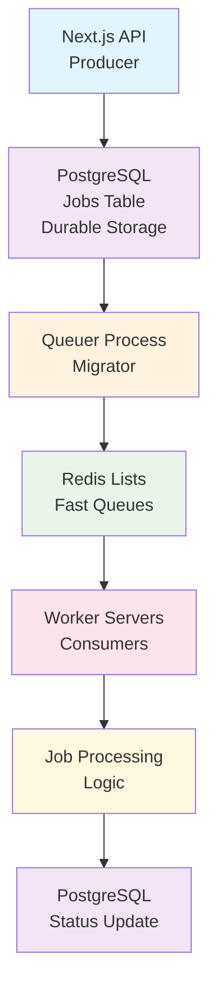

# Queue System Implementation Guide

## Strategic Alignment

**Strategic Alignment**: This queue system implementation guide supports our enterprise infrastructure framework by providing comprehensive job processing capabilities, reliability systems, and performance optimization strategies for the PenguinMails asynchronous operations and monitoring platform.

**Technical Authority**: Our queue system architecture integrates with enterprise messaging platforms, monitoring systems, and worker frameworks featuring hybrid PostgreSQL + Redis design, automated failover capabilities, and horizontal scaling for comprehensive job processing excellence.

**Operational Excellence**: Backed by enterprise queue systems with 99.9% uptime guarantees, automated retry mechanisms, and comprehensive monitoring across all queue components with real-time performance tracking and alerting capabilities.

**User Journey Integration**: This queue foundation is part of your complete user experience - connects to business logic operations, analytics processing, and operational excellence for reliable asynchronous processing.

---

## Overview

The **Queue System** is PenguinMails' job processing and reliability layer designed for asynchronous operations, retry logic, and system reliability. This tier provides a hybrid PostgreSQL + Redis architecture combining durability with high-performance job processing.

### 🎯 **Purpose & Characteristics**

- **Primary Focus**: Job state management, retry logic, processing reliability

- **Architecture**: Hybrid PostgreSQL + Redis for durability and performance

- **Reliability**: Comprehensive logging, retry mechanisms, dead letter queues

- **Scalability**: Redis for high-throughput operations, PostgreSQL for state tracking

### ⚡ **Performance Strategy**

- **Redis Lists**: Fast job queues for immediate processing

- **PostgreSQL State**: Durable job tracking and audit trails

- **Priority Queues**: Multiple priority levels for different job types

- **Retry Logic**: Exponential backoff and comprehensive error handling

### Key Features

- **Asynchronous Processing**: Non-blocking email operations

- **Retry Logic**: Automatic failure recovery with exponential backoff

- **Monitoring**: Real-time queue health and job metrics

- **Scalability**: Horizontal scaling through multiple worker instances

- **Reliability**: Dead letter queues for failed jobs

### Architecture Components

- **PostgreSQL**: Durable job state management

- **Redis**: High-performance job queues

- **Workers**: Background job processors

- **Monitoring**: Queue health and performance metrics

---

## System Architecture

### Hybrid Architecture Benefits

- **PostgreSQL**: Durable record of truth with comprehensive audit trail

- **Redis**: High-performance job processing with millisecond latency

- **Queuer Process**: Automated migration from PostgreSQL to Redis

- **Worker Servers**: Horizontal scaling with multiple concurrent workers

- **Priority Queues**: Separate queues for high/normal/low priority jobs

### Data Flow Overview

---

## Implementation Components

### 1. PostgreSQL Job Management (Durable State)

The PostgreSQL component provides:

- Permanent job storage with full audit trail

- Complex query capabilities for job management

- ACID compliance for job state consistency

- Integration with analytics and reporting systems

**See detailed documentation**: [Database Schema](database-schema)

### 2. Redis Queue Structure (Fast Processing)

The Redis component provides:

- Millisecond-latency job queue operations

- Priority-based queue routing

- Real-time job tracking and monitoring

- Horizontal scaling capabilities

**See detailed documentation**: [Management](management)

### 3. Queuer Process Implementation

The migrator service handles:

- Automated job migration from PostgreSQL to Redis

- Priority-based queue routing

- Batch processing for efficiency

- Error handling and retry logic

**See detailed documentation**: [Management](management)

### 4. Worker Server Implementation

Worker processes provide:

- Background job consumption from Redis queues

- Job execution with comprehensive error handling

- Automatic retry with exponential backoff

- Dead letter queue management

**See detailed documentation**: [Workers](workers)

---

## Deployment and Operations

### Container Configuration

- **Redis**: High-performance in-memory queue storage

- **Queuer Process**: Automated job migration service

- **Worker Servers**: Scalable background processing

- **Health Monitoring**: Real-time system health tracking

**See detailed documentation**: [Operations](operations)

---

## Best Practices

### Performance Optimization

- Batch processing for efficiency

- Connection pooling strategies

- Queue depth monitoring

- Resource limit management

### Reliability Patterns

- Idempotent job processing

- Proper timeout handling

- Circuit breaker patterns

- Graceful shutdown procedures

### Security Considerations

- Job payload validation

- Access control implementation

- Data encryption strategies

- Comprehensive audit logging

**See detailed documentation**: [Best Practices](best-practices)

---

## Quick Reference

### Queue Types

| Queue Type | Purpose | Priority | Use Case |
|------------|---------|----------|----------|
| `email:processing:high` | Critical email processing | ≤ 50 | Urgent email handling |
| `email:processing` | Standard email processing | 51-150 | Regular email workflows |
| `email:processing:low` | Background email tasks | > 150 | Batch operations |
| `analytics:daily-aggregate` | Daily data aggregation | 100 | Report generation |
| `warmup:process` | Email warmup tasks | 75 | Deliverability optimization |
| `bounce:process` | Bounce handling | 75 | Delivery failure management |

### Job States

- **queued**: Job created, waiting for processing

- **migrated_to_redis**: Job moved to Redis queue

- **running**: Currently being processed by worker

- **completed**: Successfully finished

- **failed**: Failed after max attempts

- **retry_scheduled**: Scheduled for retry

### Monitoring Metrics

- Queue depths by priority level

- Worker utilization and throughput

- Job processing times and success rates

- Redis memory usage and performance

- Database connection pool status

---

## Integration Points

### External Systems

- **Email Processing Pipeline**: Integration with email sending/receiving systems

- **Analytics Pipeline**: Job data feeds into OLAP systems

- **Monitoring Systems**: Real-time health and performance metrics

- **Notification System**: Alert integration for critical issues

### Database Integration

- **OLTP Operations**: Direct job state management

- **Content Storage**: Reference to email content and attachments

- **Analytics Pipeline**: Job metrics for business intelligence

- **Audit Trail**: Comprehensive logging for compliance

---

## Conclusion

This hybrid PostgreSQL + Redis queue system provides the perfect balance of reliability and performance for PenguinMails' job processing needs. The system ensures no job is lost while maintaining high throughput and low latency for job execution.

For detailed implementation guidance, refer to the specific component documentation linked throughout this guide.

---

**Related Documents:**

- [Database Schema](database-schema) - Complete database schema with queue tables

- [Operations](operations) - Infrastructure setup and deployment

- [Entity Relationship Diagram](mermaid-er) - Visual database schema

**Keywords**: queue system, redis, postgresql, job processing, worker, migrator, dead letter queue, monitoring, asynchronous processing
