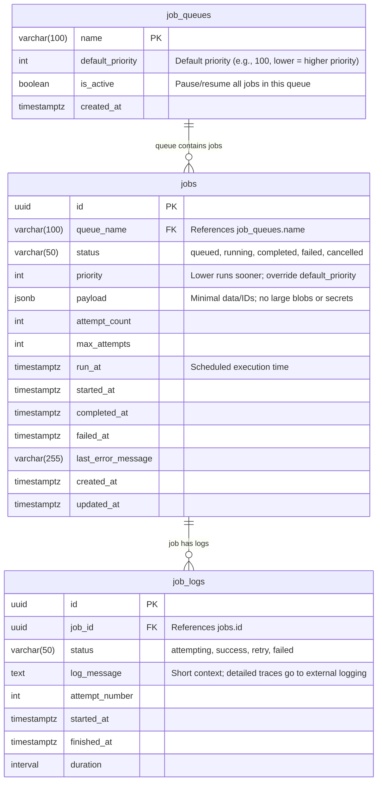

# Queue Database Entity Relationship Diagram

This diagram models the dedicated Queue / Jobs tier, aligned with the 5-tier architecture:

- **OLTP**: core entities.
- **Content DB**: heavy content.
- **OLAP**: aggregates only.
- **Queue**: current tier.
- **Notifications DB**: notifications + curated system events.
- **External logging**: raw traces/telemetry.

## Queue Tier Characteristics

The Queue tier:

- Coordinates work.
- Stores minimal operational state.
- Is **NOT**:
  - An analytics warehouse.
  - A permanent log store.
  - A place for heavy payloads

## Entity Overview

The database schema consists of three main entities:

### Job Queues
The `job_queues` entity defines different queue types with their configuration:
- `name`: Primary key identifying the queue
- `default_priority`: Default priority level (lower numbers = higher priority)
- `is_active`: Boolean flag to pause/resume all jobs in this queue
- `created_at`: Timestamp when the queue was created

### Jobs
The `jobs` entity represents individual work items to be processed:
- `id`: Unique identifier for the job
- `queue_name`: Foreign key referencing the queue this job belongs to
- `status`: Current job state (queued, running, completed, failed, cancelled)
- `priority`: Job-specific priority that overrides the queue default
- `payload`: JSON data containing minimal job information (IDs, small config)
- `attempt_count`: Number of execution attempts made
- `max_attempts`: Maximum allowed attempts before marking as failed
- `run_at`: Scheduled execution time
- `started_at`: When job execution actually began
- `completed_at`: When job finished (successfully or not)
- `failed_at`: When job was marked as failed
- `last_error_message`: Most recent error description
- `created_at` and `updated_at`: Job lifecycle timestamps

### Job Logs
The `job_logs` entity provides optional, bounded logging for debugging:
- `id`: Unique identifier for the log entry
- `job_id`: Foreign key referencing the associated job
- `status`: Log entry status (attempting, success, retry, failed)
- `log_message`: Short contextual message for debugging
- `attempt_number`: Which attempt this log entry corresponds to
- `started_at`: When this job attempt began
- `finished_at`: When this job attempt completed
- `duration`: Total time taken for this attempt

## Relationships

- **job_queues ||--o{ jobs**: One queue can contain many jobs
- **jobs ||--o{ job_logs**: One job can have many log entries

## Design Principles

### Payload Best Practices
The `payload` field should store only what workers need:
- IDs and small configuration data
- References to OLTP/Content/Notifications records
- **DO NOT store**:
  - Full email bodies
  - Attachments or large files
  - High-PII data blobs

### Job Logs Guidelines
The `job_logs` entity is optional and should be:
- Bounded via retention policies
- Used for local debugging purposes
- **NOT** a full observability sink

### External Logging Integration
For comprehensive monitoring, raw traces, stack traces, provider responses, and metrics should belong in the external logging/observability stack (see external-analytics-logging documentation).

### Analytics Restrictions
OLAP systems must **NOT** query this tier directly as a primary analytics source. If analytics are needed, create dedicated aggregates fed from jobs or events.

### Architecture Alignment
This model fits the 5-tier architecture where jobs orchestrate work between OLTP, Content DB, Notifications DB, external services, and OLAP loaders, without overloading any individual tier.

