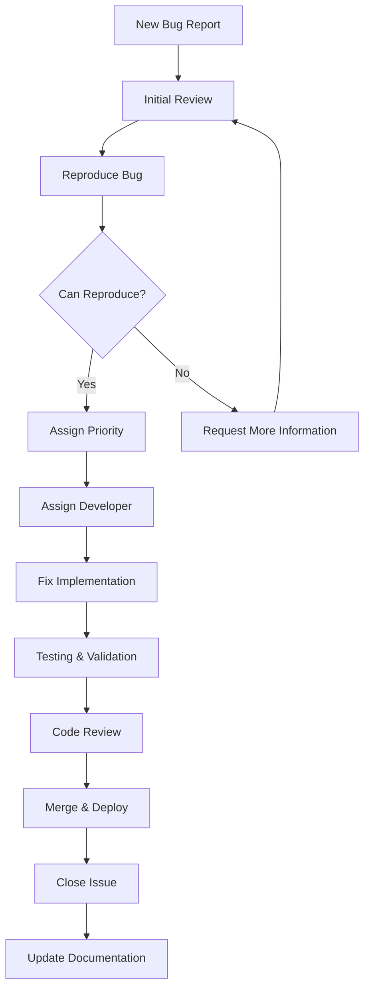

---
title: "Bug Reporting Guidelines & Triage Process"
description: "Bug reporting guidelines, triage processes, and structured bug resolution workflows"
last_modified_date: "2025-11-24"
level: "3"
persona: "Quality Assurance"
---

# Bug Reporting Guidelines & Triage Process

## Bug Report Guidelines

Before reporting a bug, please:

1. **Search existing issues** to avoid duplicates

2. **Check documentation** for known limitations

3. **Verify the bug** on the latest version

4. **Prepare minimal reproduction** case

## Bug Report Template

Use this template when creating bug reports:

```markdown

## Bug Description

A clear and concise description of what the bug is.

## Reproduction Steps

Steps to reproduce the behavior:

1. Go to '...'

2. Click on '....'

3. Scroll down to '....'

4. See error

## Expected Behavior

A clear and concise description of what you expected to happen.

## Actual Behavior

A clear and concise description of what actually happened.

## Environment

- OS: [e.g. macOS Big Sur, Ubuntu 20.04, Windows 11]

- Browser: [e.g. chrome, safari, firefox]

- Version: [e.g. 91.0.4472.124]

- Node.js Version: [e.g. 18.x.x]

- PenguinMails Version: [e.g. 2.1.3]

## Screenshots

If applicable, add screenshots to help explain your problem.

## Error Logs

Paste relevant error messages or stack traces here

## Additional Context

Add any other context about the problem here.

## Priority

- [ ] Critical (system down, data loss)

- [ ] High (major functionality broken)

- [ ] Medium (functionality impaired)

- [ ] Low (minor inconvenience)

```

## Bug Triage Process

### Issue Classification

- **Critical**: System down, security vulnerabilities, data loss

- **High**: Major functionality broken, significant user impact

- **Medium**: Functionality impaired but workaround available

- **Low**: Minor issues, cosmetic problems, feature requests

### Triage Workflow



### Bug Triage Checklist

**Initial Assessment:**

- [ ] Reproducible steps provided

- [ ] Environment details complete

- [ ] Expected vs actual behavior clear

- [ ] Priority level assigned appropriately

- [ ] Related issues linked

**Technical Review:**

- [ ] Bug confirmed reproducible

- [ ] Root cause analysis performed

- [ ] Fix approach defined

- [ ] Testing strategy planned

- [ ] Documentation update required

**Assignment:**

- [ ] Developer assigned based on expertise

- [ ] Estimated effort provided

- [ ] Target milestone/sprint identified

- [ ] Dependencies identified

## Bug Fix Guidelines

### Root Cause Analysis

```typescript
// bug-analysis/root-cause-analyzer.ts
interface BugReport {
  description: string;
  steps: string[];
  environment: BugEnvironment;
  priority: 'critical' | 'high' | 'medium' | 'low';
  additionalContext?: string;
}

interface BugEnvironment {
  os: string;
  browser?: string;
  version: string;
  nodeJsVersion?: string;
  penguinMailsVersion: string;
}

interface BugAnalysis {
  symptoms: string;
  reproductionSteps: string[];
  environment: BugEnvironment;
  hypothesis: string | null;
  testsToCreate: TestSpec[];
  fixStrategy: string | null;
  complexity: 'low' | 'medium' | 'high';
  estimatedEffort: number; // hours
}

interface TestSpec {
  name: string;
  description: string;
  type: 'unit' | 'integration' | 'e2e';
  testCases: string[];
}

interface RootCauseAnalyzer {
  analyzeBugRootCause(bugReport: BugReport): Promise<BugAnalysis>;
  createTestSpecs(analysis: BugAnalysis): TestSpec[];
}

class RootCauseAnalyzerImpl implements RootCauseAnalyzer {
  async analyzeBugRootCause(bugReport: BugReport): Promise<BugAnalysis> {
    const analysis: BugAnalysis = {
      symptoms: bugReport.description,
      reproductionSteps: bugReport.steps,
      environment: bugReport.environment,
      hypothesis: null,
      testsToCreate: [],
      fixStrategy: null,
      complexity: 'medium',
      estimatedEffort: 4
    };

    // 1. Reproduce the issue in isolated environment
    const reproductionResult = await this.reproduceIssue(bugReport);

    // 2. Identify the exact failure point
    const failurePoint = await this.identifyFailurePoint(reproductionResult);

    // 3. Trace the execution flow
    const executionTrace = await this.traceExecutionFlow(failurePoint);

    // 4. Determine the root cause
    analysis.hypothesis = this.determineRootCause(executionTrace);

    // 5. Design minimal fix
    analysis.fixStrategy = this.designFixStrategy(analysis.hypothesis);

    // Set complexity and effort based on analysis
    this.assessComplexity(analysis, bugReport);

    // Create test specifications
    analysis.testsToCreate = this.createTestSpecs(analysis);

    return analysis;
  }

  private async reproduceIssue(bugReport: BugReport): Promise<ReproductionResult> {
    // Mock implementation - would set up test environment and reproduce
    return {
      reproduced: true,
      reproductionSteps: bugReport.steps,
      failurePoint: 'email_service.send_campaign',
      errorMessage: 'ValidationError: Recipients list cannot be empty'
    };
  }

  private async identifyFailurePoint(result: ReproductionResult): Promise<FailurePoint> {
    // Mock implementation - would analyze stack traces, logs, etc.
    return {
      location: result.failurePoint,
      errorType: 'ValidationError',
      lineNumber: 185,
      functionName: 'sendCampaign'
    };
  }

  private async traceExecutionFlow(failurePoint: FailurePoint): Promise<ExecutionTrace> {
    // Mock implementation - would trace code execution
    return {
      entryPoint: 'createCampaign',
      callStack: ['validateInput', 'prepareCampaign', 'sendCampaign'],
      variables: {
        recipients: [],
        campaignData: { subject: 'Test', content: 'Content' }
      },
      state: 'VALIDATION_FAILED'
    };
  }

  private determineRootCause(trace: ExecutionTrace): string {
    if (trace.state === 'VALIDATION_FAILED') {
      return 'Missing input validation for empty recipients array';
    }
    return 'Unknown root cause - requires further investigation';
  }

  private designFixStrategy(hypothesis: string): string {
    switch (hypothesis) {
      case 'Missing input validation for empty recipients array':
        return 'Add input validation to check recipients array length and content';
      default:
        return 'Requires detailed investigation';
    }
  }

  private assessComplexity(analysis: BugAnalysis, bugReport: BugReport): void {
    if (bugReport.priority === 'critical') {
      analysis.complexity = 'high';
      analysis.estimatedEffort = 8;
    } else if (bugReport.priority === 'high') {
      analysis.complexity = 'medium';
      analysis.estimatedEffort = 6;
    } else {
      analysis.complexity = 'low';
      analysis.estimatedEffort = 2;
    }
  }

  createTestSpecs(analysis: BugAnalysis): TestSpec[] {
    const testSpecs: TestSpec[] = [];

    // Unit test for input validation
    testSpecs.push({
      name: 'EmailService Input Validation',
      description: 'Test that EmailService properly validates input parameters',
      type: 'unit',
      testCases: [
        'Empty recipients list should raise ValidationError',
        'None recipients should raise ValidationError',
        'Invalid recipient format should raise ValidationError'
      ]
    });

    // Integration test for campaign creation
    testSpecs.push({
      name: 'Campaign Creation Integration',
      description: 'Test end-to-end campaign creation flow',
      type: 'integration',
      testCases: [
        'Create campaign with valid recipients',
        'Create campaign with empty recipients',
        'Create campaign with invalid recipients'
      ]
    });

    return testSpecs;
  }
}

// Supporting interfaces
interface ReproductionResult {
  reproduced: boolean;
  reproductionSteps: string[];
  failurePoint: string;
  errorMessage: string;
}

interface FailurePoint {
  location: string;
  errorType: string;
  lineNumber: number;
  functionName: string;
}

interface ExecutionTrace {
  entryPoint: string;
  callStack: string[];
  variables: Record<string, unknown>;
  state: string;
}

// Usage example
async function analyzeBug(bugReport: BugReport): Promise<BugAnalysis> {
  const analyzer = new RootCauseAnalyzerImpl();
  return await analyzer.analyzeBugRootCause(bugReport);
}

```

### Test-First Bug Fixing

```typescript
// tests/unit/test-email-delivery-bug.ts
import { describe, it, expect, beforeEach } from 'vitest';
import { EmailService } from '../../app/services/email-service';
import { ValidationError } from '../../app/errors/validation-error';
import { CampaignData } from '../../app/types/campaign';

describe('EmailDeliveryBug', () => {
  let emailService: EmailService;

  beforeEach(() => {
    emailService = new EmailService();
  });

  it('should raise ValidationError for empty recipients list', async () => {
    // Bug: Empty recipients list should raise ValidationError
    const campaignData: CampaignData = {
      subject: 'Test Campaign',
      content: 'Test Content',
      recipients: [] // Empty list
    };

    await expect(emailService.sendCampaign(campaignData)).rejects.toThrow(ValidationError);
  });

  it('should raise ValidationError for none recipients', async () => {
    // Bug: None recipients should raise ValidationError
    const campaignData: CampaignData = {
      subject: 'Test Campaign',
      content: 'Test Content',
      recipients: null as unknown as EmailRecipient[] // Explicitly testing null case
    };

    await expect(emailService.sendCampaign(campaignData)).rejects.toThrow(ValidationError);
  });

  it('should raise ValidationError for invalid recipients format', async () => {
    // Bug: Invalid recipients format should raise ValidationError
    const campaignData: CampaignData = {
      subject: 'Test Campaign',
      content: 'Test Content',
      recipients: ['invalid-email'] as unknown as EmailRecipient[]
    };

    await expect(emailService.sendCampaign(campaignData)).rejects.toThrow(ValidationError);
  });

  it('should successfully send campaign with valid recipients', async () => {
    // Happy path test
    const campaignData: CampaignData = {
      subject: 'Test Campaign',
      content: 'Test Content',
      recipients: [
        { email: 'test@example.com', name: 'Test User' }
      ]
    };

    const result = await emailService.sendCampaign(campaignData);
    expect(result.success).toBe(true);
    expect(result.campaignId).toBeDefined();
  });

  it('should handle validation errors with specific messages', async () => {
    const campaignData: CampaignData = {
      subject: 'Test Campaign',
      content: 'Test Content',
      recipients: []
    };

    try {
      await emailService.sendCampaign(campaignData);
      fail('Should have thrown ValidationError');
    } catch (error) {
      expect(error).toBeInstanceOf(ValidationError);
      const validationError = error as ValidationError;
      expect(validationError.message.toLowerCase()).toContain('recipients');
      expect(validationError.message.toLowerCase()).toContain('empty');
    }
  });
});

// Supporting types
interface EmailRecipient {
  email: string;
  name?: string;
}

interface EmailRecipient {
  email: string;
  name?: string;
}

interface EmailRecipient {
  email: string;
  name?: string;
}

```

### Bug Fix Implementation

```typescript
// app/services/email-service.ts
import { ValidationError } from '../errors/validation-error';

interface EmailService {
  sendCampaign(campaignData: CampaignData): Promise<CampaignResult>;
}

interface CampaignData {
  subject: string;
  content: string;
  recipients: EmailRecipient[];
}

interface EmailRecipient {
  email: string;
  name?: string;
}

interface CampaignResult {
  success: boolean;
  campaignId?: string;
  error?: string;
  sentCount: number;
  failedCount: number;
}

class EmailServiceImpl implements EmailService {
  async sendCampaign(campaignData: CampaignData): Promise<CampaignResult> {
    try {
      // Validation: Check recipients
      this.validateRecipients(campaignData.recipients);

      // Process campaign
      return await this.processCampaign(campaignData);
    } catch (error) {
      return {
        success: false,
        error: error instanceof Error ? error.message : 'Unknown error',
        sentCount: 0,
        failedCount: campaignData.recipients.length
      };
    }
  }

  private validateRecipients(recipients: EmailRecipient[]): void {
    if (!recipients) {
      throw new ValidationError('Recipients list cannot be empty');
    }

    if (!Array.isArray(recipients)) {
      throw new ValidationError('Recipients must be an array');
    }

    if (recipients.length === 0) {
      throw new ValidationError('Recipients list cannot be empty');
    }

    // Additional validation
    recipients.forEach((recipient, index) => {
      if (!recipient || typeof recipient !== 'object') {
        throw new ValidationError(`Recipient at index ${index} must be an object`);
      }

      if (!recipient.email || typeof recipient.email !== 'string') {
        throw new ValidationError(`Recipient at index ${index} must have a valid email address`);
      }

      // Email format validation
      if (!this.isValidEmail(recipient.email)) {
        throw new ValidationError(`Recipient at index ${index} has invalid email format: ${recipient.email}`);
      }
    });
  }

  private isValidEmail(email: string): boolean {
    const emailRegex = /^[^\s@]+@[^\s@]+\.[^\s@]+$/;
    return emailRegex.test(email);
  }

  private async processCampaign(campaignData: CampaignData): Promise<CampaignResult> {
    // Mock implementation - would actually send emails
    return {
      success: true,
      campaignId: `campaign_${Date.now()}`,
      sentCount: campaignData.recipients.length,
      failedCount: 0
    };
  }
}

// Usage example
const emailService = new EmailServiceImpl();

async function demonstrateBugFix() {
  try {
    const campaignData: CampaignData = {
      subject: 'Test Campaign',
      content: 'Test Content',
      recipients: [
        { email: 'user1@example.com', name: 'User 1' },
        { email: 'user2@example.com', name: 'User 2' }
      ]
    };

    const result = await emailService.sendCampaign(campaignData);
    console.log('Campaign result:', result);
  } catch (error) {
    console.error('Campaign failed:', error);
  }
}

```

## Common Bug Patterns

### Email Delivery Issues

**Problem**: Emails not being sent to certain recipients

```typescript
// services/bounce-handler.ts
interface BounceData {
  email: string;
  status: 'bounced' | 'delivered' | 'failed';
  type?: 'hard' | 'soft' | 'unknown';
  reason?: string;
  timestamp: string;
}

interface BounceHandler {
  handleEmailBounce(bounceData: BounceData): Promise<void>;
}

class BounceHandlerImpl implements BounceHandler {
  async handleEmailBounce(bounceData: BounceData): Promise<void> {
    if (bounceData.status === 'bounced') {
      await this.processBounce(bounceData);
    }
  }

  private async processBounce(bounceData: BounceData): Promise<void> {
    const bounceType = bounceData.type || 'hard';

    switch (bounceType) {
      case 'hard':
        // Hard bounce - permanent failure
        await this.permanentlyBounceEmail(bounceData.email, bounceData.reason);
        break;
      case 'soft':
        // Soft bounce - temporary failure, retry later
        await this.scheduleRetry(bounceData.email, bounceData.reason);
        break;
      default:
        // Unknown bounce type - manual review
        await this.flagForReview(bounceData.email, bounceData.reason);
        break;
    }
  }

  private async permanentlyBounceEmail(email: string, reason?: string): Promise<void> {
    console.log(`Permanently bouncing email ${email} - Reason: ${reason || 'No reason provided'}`);

    // Update database to mark as permanently failed
    await this.updateEmailStatus(email, 'permanently_bounced', reason);

    // Add to suppression list
    await this.addToSuppressionList(email, reason || 'Permanent bounce');
  }

  private async scheduleRetry(email: string, reason?: string): Promise<void> {
    console.log(`Scheduling retry for email ${email} - Reason: ${reason || 'Temporary failure'}`);

    // Schedule retry in 1 hour
    const retryTime = new Date(Date.now() + 60 * 60 * 1000);
    await this.scheduleEmailRetry(email, retryTime, reason);
  }

  private async flagForReview(email: string, reason?: string): Promise<void> {
    console.log(`Flagging email ${email} for manual review - Reason: ${reason || 'Unknown bounce type'}`);

    // Create review task
    await this.createReviewTask({
      email,
      reason: reason || 'Unknown bounce type',
      priority: 'medium',
      type: 'bounce_review'
    });
  }

  private async updateEmailStatus(email: string, status: string, reason?: string): Promise<void> {
    // Mock implementation - would update database
    console.log(`Updating email status: ${email} -> ${status} (${reason})`);
  }

  private async addToSuppressionList(email: string, reason: string): Promise<void> {
    // Mock implementation - would add to suppression list
    console.log(`Adding ${email} to suppression list: ${reason}`);
  }

  private async scheduleEmailRetry(email: string, retryTime: Date, reason?: string): Promise<void> {
    // Mock implementation - would schedule retry task
    console.log(`Scheduling retry for ${email} at ${retryTime.toISOString()}`);
  }

  private async createReviewTask(taskData: {
    email: string;
    reason: string;
    priority: 'low' | 'medium' | 'high';
    type: string;
  }): Promise<void> {
    // Mock implementation - would create review task
    console.log(`Creating review task for ${taskData.email}: ${taskData.reason}`);
  }
}

// Usage example
const bounceHandler = new BounceHandlerImpl();

// Example bounce scenarios
const bounceScenarios = [
  {
    email: 'user1@example.com',
    status: 'bounced' as const,
    type: 'hard' as const,
    reason: 'User does not exist',
    timestamp: new Date().toISOString()
  },
  {
    email: 'user2@example.com',
    status: 'bounced' as const,
    type: 'soft' as const,
    reason: 'Mailbox full',
    timestamp: new Date().toISOString()
  },
  {
    email: 'user3@example.com',
    status: 'bounced' as const,
    type: undefined,
    reason: 'Unknown error',
    timestamp: new Date().toISOString()
  }
];

async function demonstrateBounceHandling() {
  for (const bounceData of bounceScenarios) {
    await bounceHandler.handleEmailBounce(bounceData);
  }
}

```

**Problem**: Campaign tracking not working

```typescript
// services/email-tracking-service.ts
import { DatabaseError } from '../errors/database-error';

interface EmailTrackingData {
  campaignId: string;
  recipientEmail: string;
  openedAt: Date;
  userAgent?: string;
  ipAddress?: string;
}

interface TrackingResult {
  success: boolean;
  message: string;
  isDuplicate?: boolean;
}

interface EmailTrackingService {
  trackEmailOpen(data: EmailTrackingData): Promise<TrackingResult>;
  trackEmailClick(data: EmailClickData): Promise<TrackingResult>;
  getOpenStats(campaignId: string): Promise<OpenStats>;
}

interface EmailClickData {
  campaignId: string;
  recipientEmail: string;
  clickedAt: Date;
  url: string;
}

interface OpenStats {
  totalOpens: number;
  uniqueOpens: number;
  duplicateOpens: number;
  openRate: number;
}

class EmailTrackingServiceImpl implements EmailTrackingService {
  async trackEmailOpen(data: EmailTrackingData): Promise<TrackingResult> {
    try {
      // Validate input data
      this.validateTrackingData(data);

      // Attempt to insert tracking record
      await this.insertOpenRecord(data);

      return {
        success: true,
        message: 'Email open tracked successfully'
      };
    } catch (error) {
      return this.handleTrackingError(error, data);
    }
  }

  async trackEmailClick(data: EmailClickData): Promise<TrackingResult> {
    try {
      // Validate input data
      this.validateClickData(data);

      // Attempt to insert click record
      await this.insertClickRecord(data);

      return {
        success: true,
        message: 'Email click tracked successfully'
      };
    } catch (error) {
      return this.handleTrackingError(error, data);
    }
  }

  async getOpenStats(campaignId: string): Promise<OpenStats> {
    try {
      const stats = await this.calculateOpenStats(campaignId);
      return stats;
    } catch (error) {
      throw new DatabaseError(`Failed to get open stats for campaign ${campaignId}`);
    }
  }

  private validateTrackingData(data: EmailTrackingData): void {
    if (!data.campaignId) {
      throw new Error('Campaign ID is required');
    }
    if (!data.recipientEmail) {
      throw new Error('Recipient email is required');
    }
    if (!data.openedAt) {
      throw new Error('Opened timestamp is required');
    }
  }

  private validateClickData(data: EmailClickData): void {
    this.validateTrackingData({
      campaignId: data.campaignId,
      recipientEmail: data.recipientEmail,
      openedAt: data.clickedAt
    });
    if (!data.url) {
      throw new Error('URL is required for click tracking');
    }
  }

  private async insertOpenRecord(data: EmailTrackingData): Promise<void> {
    // Mock implementation - would insert into database
    console.log('Inserting open record:', data);

    // Simulate potential duplicate
    if (data.recipientEmail.includes('duplicate')) {
      throw new Error('Duplicate tracking attempt');
    }
  }

  private async insertClickRecord(data: EmailClickData): Promise<void> {
    // Mock implementation - would insert click record
    console.log('Inserting click record:', data);
  }

  private async calculateOpenStats(campaignId: string): Promise<OpenStats> {
    // Mock implementation - would calculate from database
    return {
      totalOpens: 150,
      uniqueOpens: 120,
      duplicateOpens: 30,
      openRate: 0.12
    };
  }

  private async handleTrackingError(error: unknown, data: EmailTrackingData): Promise<TrackingResult> {
    const errorMessage = error instanceof Error ? error.message : 'Unknown error';

    if (errorMessage.includes('Duplicate tracking attempt')) {
      // Handle duplicate tracking gracefully
      console.info(`Duplicate tracking attempt for ${data.campaignId}:${data.recipientEmail}`);

      return {
        success: true,
        message: 'Email open already tracked',
        isDuplicate: true
      };
    } else if (errorMessage.includes('constraint') || errorMessage.includes('unique')) {
      // Database constraint violation
      console.info(`Constraint violation for ${data.campaignId}:${data.recipientEmail}`);

      return {
        success: true,
        message: 'Email interaction already tracked',
        isDuplicate: true
      };
    } else {
      // General error
      console.error(`Failed to track email interaction: ${errorMessage}`);

      // Could send to monitoring system here
      await this.sendToMonitoringSystem({
        campaignId: data.campaignId,
        recipientEmail: data.recipientEmail,
        error: errorMessage,
        timestamp: new Date().toISOString()
      });

      return {
        success: false,
        message: 'Failed to track email interaction'
      };
    }
  }

  private async sendToMonitoringSystem(monitoringData: {
    campaignId: string;
    recipientEmail: string;
    error: string;
    timestamp: string;
  }): Promise<void> {
    // Mock implementation - would send to monitoring system
    console.log('Sending to monitoring system:', monitoringData);
  }
}

// Usage example
const trackingService = new EmailTrackingServiceImpl();

async function demonstrateEmailTracking() {
  // Test successful tracking
  const openData: EmailTrackingData = {
    campaignId: 'campaign_123',
    recipientEmail: 'user@example.com',
    openedAt: new Date(),
    userAgent: 'Mozilla/5.0...',
    ipAddress: '192.168.1.1'
  };

  const result1 = await trackingService.trackEmailOpen(openData);
  console.log('Tracking result 1:', result1);

  // Test duplicate handling
  const duplicateData: EmailTrackingData = {
    ...openData,
    recipientEmail: 'duplicate@example.com'
  };

  const result2 = await trackingService.trackEmailOpen(duplicateData);
  console.log('Tracking result 2:', result2);
}

```

### API Issues

**Problem**: Inconsistent error responses

```typescript
// api/campaigns-controller.ts
import { Request, Response } from 'express';
import { ValidationError } from '../errors/validation-error';
import { CampaignService } from '../services/campaign-service';
import { logger } from '../utils/logger';

interface CreateCampaignRequest {
  subject: string;
  content: string;
  recipients: EmailRecipient[];
}

interface ApiResponse<T> {
  success: boolean;
  data?: T;
  errors?: ValidationErrorMessage[];
  error?: string;
  message?: string;
}

interface ValidationErrorMessage {
  field: string;
  message: string;
  code: string;
}

interface EmailRecipient {
  email: string;
  name?: string;
}

class CampaignsController {
  private campaignService: CampaignService;

  constructor(campaignService: CampaignService) {
    this.campaignService = campaignService;
  }

  async createCampaign(req: Request, res: Response): Promise<void> {
    try {
      // Validate input
      const requestData = this.validateCreateCampaignRequest(req.body);

      // Process campaign
      const result = await this.campaignService.createCampaign(requestData);

      // Consistent success response
      const response: ApiResponse<CampaignResult> = {
        success: true,
        data: {
          campaignId: result.campaignId,
          status: result.status,
          recipientCount: result.recipientCount
        }
      };

      res.status(201).json(response);
    } catch (error) {
      this.handleError(error, res);
    }
  }

  async getCampaign(req: Request, res: Response): Promise<void> {
    try {
      const { id } = req.params;

      if (!id) {
        const response: ApiResponse<never> = {
          success: false,
          errors: [{
            field: 'id',
            message: 'Campaign ID is required',
            code: 'REQUIRED_FIELD'
          }]
        };
        res.status(400).json(response);
        return;
      }

      const campaign = await this.campaignService.getCampaign(id);

      if (!campaign) {
        const response: ApiResponse<never> = {
          success: false,
          error: 'Campaign not found'
        };
        res.status(404).json(response);
        return;
      }

      const response: ApiResponse<Campaign> = {
        success: true,
        data: campaign
      };

      res.json(response);
    } catch (error) {
      this.handleError(error, res);
    }
  }

  private validateCreateCampaignRequest(body: unknown): CreateCampaignRequest {
    if (!body || typeof body !== 'object') {
      throw new ValidationError('Request body is required');
    }

    const data = body as CreateCampaignRequest;
    const errors: ValidationErrorMessage[] = [];

    if (!data.subject || typeof data.subject !== 'string') {
      errors.push({
        field: 'subject',
        message: 'Subject is required and must be a string',
        code: 'INVALID_SUBJECT'
      });
    }

    if (!data.content || typeof data.content !== 'string') {
      errors.push({
        field: 'content',
        message: 'Content is required and must be a string',
        code: 'INVALID_CONTENT'
      });
    }

    if (!Array.isArray(data.recipients) || data.recipients.length === 0) {
      errors.push({
        field: 'recipients',
        message: 'At least one recipient is required',
        code: 'INVALID_RECIPIENTS'
      });
    } else {
      data.recipients.forEach((recipient, index) => {
        if (!recipient.email || typeof recipient.email !== 'string') {
          errors.push({
            field: `recipients[${index}].email`,
            message: 'Valid email address is required',
            code: 'INVALID_EMAIL'
          });
        }
      });
    }

    if (errors.length > 0) {
      throw new ValidationError('Validation failed', errors);
    }

    return data;
  }

  private handleError(error: unknown, res: Response): void {
    if (error instanceof ValidationError) {
      // Validation errors with detailed field information
      const response: ApiResponse<never> = {
        success: false,
        errors: error.errors
      };

      res.status(400).json(response);
    } else if (error instanceof Error) {
      // Log unexpected errors
      logger.error('Unexpected error in campaigns controller', {
        error: error.message,
        stack: error.stack
      });

      // Consistent error response format
      const response: ApiResponse<never> = {
        success: false,
        error: 'Internal server error'
      };

      res.status(500).json(response);
    } else {
      // Fallback for unknown error types
      const response: ApiResponse<never> = {
        success: false,
        error: 'An unexpected error occurred'
      };

      res.status(500).json(response);
    }
  }
}

// Supporting interfaces and types
interface CampaignResult {
  campaignId: string;
  status: 'pending' | 'processing' | 'completed' | 'failed';
  recipientCount: number;
}

interface Campaign {
  id: string;
  subject: string;
  content: string;
  status: string;
  recipientCount: number;
  createdAt: string;
  updatedAt: string;
}

interface CampaignService {
  createCampaign(data: CreateCampaignRequest): Promise<CampaignResult>;
  getCampaign(id: string): Promise<Campaign | null>;
}

// Usage example
const campaignService = new CampaignService(); // Mock implementation
const controller = new CampaignsController(campaignService);

// Example Express route setup
// app.post('/api/v1/campaigns', (req, res) => controller.createCampaign(req, res));
// app.get('/api/v1/campaigns/:id', (req, res) => controller.getCampaign(req, res));

```

### Database Issues

**Problem**: N+1 query problem

```typescript
// services/campaign-query-service.ts
import { Database, Table } from '../database/connection';

interface Campaign {
  id: string;
  userId: string;
  subject: string;
  content: string;
  recipients?: Recipient[];
  createdAt: Date;
  updatedAt: Date;
}

interface Recipient {
  id: string;
  campaignId: string;
  email: string;
  name?: string;
  status: 'pending' | 'sent' | 'failed';
}

interface CampaignQueryService {
  getCampaignsWithRecipients(userId: string): Promise<Campaign[]>;
  getCampaignWithRecipients(campaignId: string): Promise<Campaign | null>;
  getCampaignsWithRecipientStats(userId: string): Promise<CampaignStats[]>;
}

interface CampaignStats {
  id: string;
  subject: string;
  totalRecipients: number;
  sentCount: number;
  failedCount: number;
  pendingCount: number;
}

class CampaignQueryServiceImpl implements CampaignQueryService {
  constructor(private db: Database) {}

  async getCampaignsWithRecipients(userId: string): Promise<Campaign[]> {
    // ❌ Bad: N+1 query problem - DO NOT USE
    // const campaigns = await this.db.campaigns.where('userId', '=', userId).findMany();
    // for (const campaign of campaigns) {
    //   campaign.recipients = await this.db.recipients.where('campaignId', '=', campaign.id).findMany();
    // }
    // return campaigns;

    // ✅ Good: Eager loading with single query
    const query = this.db.campaigns
      .where('userId', '=', userId)
      .join('recipients', 'campaignId', 'id')
      .select(`
        campaigns.*,
        recipients.id as recipient_id,
        recipients.email as recipient_email,
        recipients.name as recipient_name,
        recipients.status as recipient_status
      `);

    const results = await query.findMany();

    // Group results by campaign
    const campaignMap = new Map<string, Campaign>();

    for (const row of results) {
      const campaignId = row.id;

      if (!campaignMap.has(campaignId)) {
        campaignMap.set(campaignId, {
          id: row.id,
          userId: row.userId,
          subject: row.subject,
          content: row.content,
          recipients: [],
          createdAt: row.createdAt,
          updatedAt: row.updatedAt
        });
      }

      const campaign = campaignMap.get(campaignId)!;

      // Add recipient if exists
      if (row.recipient_id) {
        campaign.recipients!.push({
          id: row.recipient_id,
          campaignId,
          email: row.recipient_email,
          name: row.recipient_name,
          status: row.recipient_status
        });
      }
    }

    return Array.from(campaignMap.values());
  }

  async getCampaignWithRecipients(campaignId: string): Promise<Campaign | null> {
    const query = this.db.campaigns
      .where('id', '=', campaignId)
      .join('recipients', 'campaignId', 'id')
      .select(`
        campaigns.*,
        recipients.id as recipient_id,
        recipients.email as recipient_email,
        recipients.name as recipient_name,
        recipients.status as recipient_status
      `);

    const results = await query.findMany();

    if (results.length === 0) {
      return null;
    }

    const campaignData = results[0];
    const recipients: Recipient[] = [];

    for (const row of results) {
      if (row.recipient_id) {
        recipients.push({
          id: row.recipient_id,
          campaignId,
          email: row.recipient_email,
          name: row.recipient_name,
          status: row.recipient_status
        });
      }
    }

    return {
      id: campaignData.id,
      userId: campaignData.userId,
      subject: campaignData.subject,
      content: campaignData.content,
      recipients,
      createdAt: campaignData.createdAt,
      updatedAt: campaignData.updatedAt
    };
  }

  async getCampaignsWithRecipientStats(userId: string): Promise<CampaignStats[]> {
    // ✅ Good: Aggregate with single query using GROUP BY
    const query = this.db.campaigns
      .where('userId', '=', userId)
      .leftJoin('recipients', 'campaignId', 'id')
      .select(`
        campaigns.id,
        campaigns.subject,
        COUNT(recipients.id) as total_recipients,
        COUNT(CASE WHEN recipients.status = 'sent' THEN 1 END) as sent_count,
        COUNT(CASE WHEN recipients.status = 'failed' THEN 1 END) as failed_count,
        COUNT(CASE WHEN recipients.status = 'pending' THEN 1 END) as pending_count
      `)
      .groupBy('campaigns.id', 'campaigns.subject');

    const results = await query.findMany();

    return results.map(row => ({
      id: row.id,
      subject: row.subject,
      totalRecipients: Number(row.total_recipients) || 0,
      sentCount: Number(row.sent_count) || 0,
      failedCount: Number(row.failed_count) || 0,
      pendingCount: Number(row.pending_count) || 0
    }));
  }

  // ❌ Bad: Example of N+1 query (for educational purposes)
  async badGetCampaignsWithRecipients(userId: string): Promise<Campaign[]> {
    // This would cause N+1 problem - don't use this!
    const campaigns = await this.db.campaigns.where('userId', '=', userId).findMany();

    for (const campaign of campaigns) {
      // Each iteration triggers a separate database query
      campaign.recipients = await this.db.recipients
        .where('campaignId', '=', campaign.id)
        .findMany();
    }

    return campaigns;
  }
}

// Usage example
const queryService = new CampaignQueryServiceImpl(database); // Assume database is initialized

async function demonstrateQueryOptimization() {
  const userId = 'user_123';

  // Good: Single query with eager loading
  const campaigns = await queryService.getCampaignsWithRecipients(userId);
  console.log(`Loaded ${campaigns.length} campaigns`);

  // Good: Campaign with statistics
  const stats = await queryService.getCampaignsWithRecipientStats(userId);
  console.log('Campaign statistics:', stats);

  // Good: Individual campaign with recipients
  const firstCampaign = campaigns[0];
  if (firstCampaign) {
    const campaignWithRecipients = await queryService.getCampaignWithRecipients(firstCampaign.id);
    console.log(`Campaign ${campaignWithRecipients?.id} has ${campaignWithRecipients?.recipients?.length} recipients`);
  }
}

```

## Performance Bug Detection

### Memory Leaks

```typescript
// utils/memory-profiler.ts
import * as process from 'process';
import * as v8 from 'v8';

interface MemorySnapshot {
  heapUsed: number;
  heapTotal: number;
  external: number;
  arrayBuffers: number;
}

interface MemoryAnalysis {
  functionName: string;
  memoryBefore: number;
  memoryAfter: number;
  memoryDiff: number;
  timestamp: Date;
  warning?: string;
}

interface MemoryProfiler {
  profileFunction<T>(func: (...args: unknown[]) => T, ...args: unknown[]): T;
  profileAsyncFunction<T>(func: (...args: unknown[]) => Promise<T>, ...args: unknown[]): Promise<T>;
  getMemorySnapshot(): MemorySnapshot;
  getHeapStatistics(): v8.HeapInfo;
}

class MemoryProfilerImpl implements MemoryProfiler {
  private readonly WARNING_THRESHOLD = 50; // MB
  private readonly CRITICAL_THRESHOLD = 100; // MB
  private analyses: MemoryAnalysis[] = [];

  profileFunction<T>(func: (...args: unknown[]) => T, ...args: unknown[]): T {
    const memoryBefore = this.getMemoryUsage();
    const functionName = func.name || 'anonymous';

    try {
      const result = func(...args);

      const memoryAfter = this.getMemoryUsage();
      const memoryDiff = memoryAfter.heapUsed - memoryBefore.heapUsed;

      this.recordAnalysis({
        functionName,
        memoryBefore: memoryBefore.heapUsed,
        memoryAfter: memoryAfter.heapUsed,
        memoryDiff,
        timestamp: new Date(),
        warning: this.getMemoryWarning(memoryDiff)
      });

      return result;
    } catch (error) {
      this.recordAnalysis({
        functionName,
        memoryBefore: memoryBefore.heapUsed,
        memoryAfter: this.getMemoryUsage().heapUsed,
        memoryDiff: 0,
        timestamp: new Date(),
        warning: `Function failed with error: ${error}`
      });
      throw error;
    }
  }

  async profileAsyncFunction<T>(func: (...args: unknown[]) => Promise<T>, ...args: unknown[]): Promise<T> {
    const memoryBefore = this.getMemoryUsage();
    const functionName = func.name || 'anonymous';

    try {
      const result = await func(...args);

      const memoryAfter = this.getMemoryUsage();
      const memoryDiff = memoryAfter.heapUsed - memoryBefore.heapUsed;

      this.recordAnalysis({
        functionName,
        memoryBefore: memoryBefore.heapUsed,
        memoryAfter: memoryAfter.heapUsed,
        memoryDiff,
        timestamp: new Date(),
        warning: this.getMemoryWarning(memoryDiff)
      });

      return result;
    } catch (error) {
      this.recordAnalysis({
        functionName,
        memoryBefore: memoryBefore.heapUsed,
        memoryAfter: this.getMemoryUsage().heapUsed,
        memoryDiff: 0,
        timestamp: new Date(),
        warning: `Async function failed with error: ${error}`
      });
      throw error;
    }
  }

  getMemorySnapshot(): MemorySnapshot {
    const usage = process.memoryUsage();
    return {
      heapUsed: usage.heapUsed / (1024 * 1024), // Convert to MB
      heapTotal: usage.heapTotal / (1024 * 1024),
      external: usage.external / (1024 * 1024),
      arrayBuffers: usage.arrayBuffers / (1024 * 1024)
    };
  }

  getHeapStatistics(): v8.HeapInfo {
    return v8.getHeapStatistics();
  }

  getAnalyses(): MemoryAnalysis[] {
    return [...this.analyses];
  }

  clearAnalyses(): void {
    this.analyses = [];
  }

  private getMemoryUsage(): MemorySnapshot {
    return this.getMemorySnapshot();
  }

  private getMemoryWarning(memoryDiff: number): string | undefined {
    const diffMB = memoryDiff / (1024 * 1024); // Convert to MB

    if (diffMB >= this.CRITICAL_THRESHOLD) {
      return `Critical memory usage increase: ${diffMB.toFixed(2)}MB`;
    } else if (diffMB >= this.WARNING_THRESHOLD) {
      return `High memory usage increase: ${diffMB.toFixed(2)}MB`;
    }

    return undefined;
  }

  private recordAnalysis(analysis: MemoryAnalysis): void {
    this.analyses.push(analysis);

    if (analysis.warning) {
      console.warn(`[Memory Profiler] ${analysis.warning} in ${analysis.functionName}`);
    }
  }
}

// Decorator function
function monitorMemoryUsage(target: unknown, propertyKey: string, descriptor: PropertyDescriptor): PropertyDescriptor {
  const originalMethod = descriptor.value;
  const profiler = new MemoryProfilerImpl();

  if (typeof originalMethod === 'function') {
    descriptor.value = function (...args: unknown[]) {
      return profiler.profileFunction(originalMethod, ...args);
    };
  }

  return descriptor;
}

// Higher-order function for monitoring
function createMemoryMonitor(threshold: number = 50) {
  return function <T extends (...args: unknown[]) => unknown>(func: T): T {
    const profiler = new MemoryProfilerImpl();
    return ((...args: unknown[]) => {
      return profiler.profileFunction(func, ...args);
    }) as T;
  };
}

// Usage examples
class CampaignProcessor {
  @monitorMemoryUsage
  processLargeCampaign(campaignData: unknown[]): void {
    // Process large amounts of data
    for (const item of campaignData) {
      // Simulate processing
      const processed = JSON.stringify(item);
      console.log(`Processing item: ${processed.substring(0, 50)}...`);
    }
  }

  @createMemoryMonitor(25) // Lower threshold for testing
  async processEmailBatch(recipients: EmailRecipient[]): Promise<void> {
    // Simulate processing emails in batch
    const chunks = this.chunkArray(recipients, 100);

    for (const chunk of chunks) {
      // Process chunk
      await this.processChunk(chunk);

      // Force garbage collection if available
      if (global.gc) {
        global.gc();
      }
    }
  }

  private chunkArray<T>(array: T[], size: number): T[][] {
    const chunks: T[][] = [];
    for (let i = 0; i < array.length; i += size) {
      chunks.push(array.slice(i, i + size));
    }
    return chunks;
  }

  private async processChunk(chunk: EmailRecipient[]): Promise<void> {
    // Mock processing
    console.log(`Processing chunk of ${chunk.length} recipients`);
    await new Promise(resolve => setTimeout(resolve, 10));
  }
}

// Memory leak detection utility
class MemoryLeakDetector {
  private profiler = new MemoryProfilerImpl();
  private baselineMemory: number | null = null;

  initializeBaseline(): void {
    // Force garbage collection if available
    if (global.gc) {
      global.gc();
    }

    this.baselineMemory = this.profiler.getMemorySnapshot().heapUsed;
    console.log(`Memory baseline established: ${(this.baselineMemory / (1024 * 1024)).toFixed(2)}MB`);
  }

  checkForLeaks(): void {
    if (!this.baselineMemory) {
      throw new Error('Baseline not established. Call initializeBaseline() first.');
    }

    const currentMemory = this.profiler.getMemorySnapshot().heapUsed;
    const memoryDiff = currentMemory - this.baselineMemory;

    console.log(`Current memory: ${(currentMemory / (1024 * 1024)).toFixed(2)}MB`);
    console.log(`Memory change: ${(memoryDiff / (1024 * 1024)).toFixed(2)}MB`);

    if (memoryDiff > 10 * 1024 * 1024) { // 10MB increase
      console.warn(`Potential memory leak detected: ${(memoryDiff / (1024 * 1024)).toFixed(2)}MB increase`);
    }
  }
}

// Supporting interface
interface EmailRecipient {
  email: string;
  name?: string;
}

// Usage example
async function demonstrateMemoryMonitoring() {
  const processor = new CampaignProcessor();
  const detector = new MemoryLeakDetector();

  detector.initializeBaseline();

  // Test large campaign processing
  const largeCampaign = Array.from({ length: 10000 }, (_, i) => ({
    id: i,
    subject: `Email ${i}`,
    content: `Content for email ${i}`
  }));

  processor.processLargeCampaign(largeCampaign);
  detector.checkForLeaks();

  // Test async processing
  const recipients = Array.from({ length: 1000 }, (_, i) => ({
    email: `user${i}@example.com`,
    name: `User ${i}`
  }));

  await processor.processEmailBatch(recipients);
  detector.checkForLeaks();

  // Print analysis summary
  const analyses = processor.profiler.getAnalyses();
  console.log('\nMemory Analysis Summary:');
  analyses.forEach(analysis => {
    console.log(`Function: ${analysis.functionName}`);
    console.log(`Memory change: ${(analysis.memoryDiff / (1024 * 1024)).toFixed(2)}MB`);
    if (analysis.warning) {
      console.log(`Warning: ${analysis.warning}`);
    }
  });
}

```

### Database Performance

```sql
-- Identify slow queries
SELECT query, mean_time, calls, total_time
FROM pg_stat_statements
WHERE mean_time > 100  -- Queries taking more than 100ms on average
ORDER BY mean_time DESC
LIMIT 10;

-- Check for missing indexes
SELECT schemaname, tablename, attname, n_distinct, correlation
FROM pg_stats
WHERE tablename IN (SELECT tablename FROM pg_tables WHERE schemaname = 'public')
  AND n_distinct > 100  -- Columns with high cardinality
  AND attname NOT IN (
    SELECT indexname FROM pg_indexes
    WHERE indexname LIKE '%' || attname || '%'
  );

```

## Security Bug Patterns

### Input Validation

```typescript
// validation/campaign-validator.ts
import { z } from 'zod';

// Comprehensive validation using Zod schema
const emailRegex = /^[^\s@]+@[^\s@]+\.[^\s@]+$/;
const htmlTagRegex = /<[^>]*>/g;

const RecipientSchema = z.object({
  email: z.string()
    .email('Invalid email format')
    .min(1, 'Email is required')
    .max(254, 'Email too long'),
  name: z.string()
    .max(100, 'Name too long')
    .optional()
    .transform(val => val?.trim())
}).strict();

const CampaignCreateRequestSchema = z.object({
  name: z.string()
    .min(1, 'Name cannot be empty')
    .max(100, 'Name too long')
    .trim()
    .refine(val => !htmlTagRegex.test(val), 'Name contains invalid HTML tags'),
  content: z.string()
    .min(1, 'Content cannot be empty')
    .max(50000, 'Content too long')
    .trim(),
  recipients: z.array(RecipientSchema)
    .min(1, 'At least one recipient required')
    .max(10000, 'Too many recipients'),
  scheduledAt: z.string()
    .datetime('Invalid date format')
    .optional(),
  tags: z.array(z.string().max(50, 'Tag too long'))
    .max(10, 'Too many tags')
    .optional()
}).strict();

interface ValidationResult {
  success: boolean;
  data?: CampaignCreateRequest;
  errors?: ValidationError[];
}

interface ValidationError {
  field: string;
  message: string;
  code: string;
}

interface CampaignCreateRequest {
  name: string;
  content: string;
  recipients: EmailRecipient[];
  scheduledAt?: string;
  tags?: string[];
}

interface EmailRecipient {
  email: string;
  name?: string;
}

interface CampaignValidator {
  validateCreateRequest(data: unknown): ValidationResult;
  sanitizeInput(data: string): string;
  validateEmail(email: string): boolean;
}

class CampaignValidatorImpl implements CampaignValidator {
  validateCreateRequest(data: unknown): ValidationResult {
    try {
      const validatedData = CampaignCreateRequestSchema.parse(data);

      return {
        success: true,
        data: validatedData
      };
    } catch (error) {
      if (error instanceof z.ZodError) {
        const errors: ValidationError[] = error.errors.map(err => ({
          field: err.path.join('.'),
          message: err.message,
          code: this.mapErrorCode(err.code)
        }));

        return {
          success: false,
          errors
        };
      }

      return {
        success: false,
        errors: [{
          field: 'general',
          message: 'Validation failed',
          code: 'VALIDATION_ERROR'
        }]
      };
    }
  }

  sanitizeInput(input: string): string {
    // Remove HTML tags to prevent XSS
    let sanitized = input.replace(htmlTagRegex, '');

    // Trim whitespace
    sanitized = sanitized.trim();

    // Remove null bytes and control characters
    sanitized = sanitized.replace(/[\x00-\x08\x0B\x0C\x0E-\x1F\x7F]/g, '');

    return sanitized;
  }

  validateEmail(email: string): boolean {
    return emailRegex.test(email) && email.length <= 254;
  }

  validateHtmlContent(html: string): ValidationResult {
    try {
      // Basic HTML validation - in production, use a proper HTML sanitizer
      if (html.includes('<script')) {
        return {
          success: false,
          errors: [{
            field: 'content',
            message: 'Script tags not allowed',
            code: 'INVALID_HTML'
          }]
        };
      }

      if (html.includes('javascript:')) {
        return {
          success: false,
          errors: [{
            field: 'content',
            message: 'JavaScript in URLs not allowed',
            code: 'INVALID_HTML'
          }]
        };
      }

      return { success: true };
    } catch (error) {
      return {
        success: false,
        errors: [{
          field: 'content',
          message: 'HTML validation failed',
          code: 'VALIDATION_ERROR'
        }]
      };
    }
  }

  private mapErrorCode(code: z.ZodIssueCode): string {
    switch (code) {
      case 'invalid_string':
        return 'INVALID_FORMAT';
      case 'too_small':
        return 'TOO_SHORT';
      case 'too_big':
        return 'TOO_LONG';
      case 'invalid_email':
        return 'INVALID_EMAIL';
      case 'invalid_datetime':
        return 'INVALID_DATE';
      case 'unrecognized_keys':
        return 'UNKNOWN_FIELD';
      default:
        return 'VALIDATION_ERROR';
    }
  }
}

// Usage examples with different validation approaches

// Manual validation (for complex custom logic)
class ManualCampaignValidator {
  validateCreateRequest(data: unknown): ValidationResult {
    const errors: ValidationError[] = [];

    if (!data || typeof data !== 'object') {
      return {
        success: false,
        errors: [{
          field: 'general',
          message: 'Invalid request data',
          code: 'INVALID_DATA'
        }]
      };
    }

    const campaignData = data as CampaignCreateRequest;

    // Validate name
    if (!campaignData.name || campaignData.name.trim().length === 0) {
      errors.push({
        field: 'name',
        message: 'Name cannot be empty',
        code: 'REQUIRED_FIELD'
      });
    } else if (campaignData.name.length > 100) {
      errors.push({
        field: 'name',
        message: 'Name too long (max 100 characters)',
        code: 'TOO_LONG'
      });
    }

    // Prevent XSS in name
    if (campaignData.name && /<[^>]*>/.test(campaignData.name)) {
      errors.push({
        field: 'name',
        message: 'Name contains invalid HTML tags',
        code: 'INVALID_INPUT'
      });
    }

    // Validate content
    if (!campaignData.content || campaignData.content.trim().length === 0) {
      errors.push({
        field: 'content',
        message: 'Content cannot be empty',
        code: 'REQUIRED_FIELD'
      });
    } else if (campaignData.content.length > 50000) {
      errors.push({
        field: 'content',
        message: 'Content too long (max 50,000 characters)',
        code: 'TOO_LONG'
      });
    }

    // Validate recipients
    if (!Array.isArray(campaignData.recipients)) {
      errors.push({
        field: 'recipients',
        message: 'Recipients must be an array',
        code: 'INVALID_TYPE'
      });
    } else if (campaignData.recipients.length === 0) {
      errors.push({
        field: 'recipients',
        message: 'At least one recipient required',
        code: 'REQUIRED_FIELD'
      });
    } else if (campaignData.recipients.length > 10000) {
      errors.push({
        field: 'recipients',
        message: 'Too many recipients (max 10,000)',
        code: 'TOO_MANY'
      });
    } else {
      // Validate each recipient
      campaignData.recipients.forEach((recipient, index) => {
        const fieldPrefix = `recipients[${index}]`;

        if (!recipient.email || typeof recipient.email !== 'string') {
          errors.push({
            field: `${fieldPrefix}.email`,
            message: 'Valid email address is required',
            code: 'INVALID_EMAIL'
          });
        } else if (!emailRegex.test(recipient.email)) {
          errors.push({
            field: `${fieldPrefix}.email`,
            message: 'Invalid email format',
            code: 'INVALID_EMAIL'
          });
        }

        if (recipient.name && typeof recipient.name !== 'string') {
          errors.push({
            field: `${fieldPrefix}.name`,
            message: 'Name must be a string',
            code: 'INVALID_TYPE'
          });
        } else if (recipient.name && recipient.name.length > 100) {
          errors.push({
            field: `${fieldPrefix}.name`,
            message: 'Name too long (max 100 characters)',
            code: 'TOO_LONG'
          });
        }
      });
    }

    if (errors.length > 0) {
      return { success: false, errors };
    }

    return { success: true, data: campaignData };
  }
}

// Express middleware for request validation
function validateCampaignRequest(req: unknown, res: unknown, next: Function): void {
  const validator = new CampaignValidatorImpl();
  const result = validator.validateCreateRequest((req as any).body);

  if (!result.success) {
    res.status(400).json({
      success: false,
      errors: result.errors,
      message: 'Validation failed'
    });
    return;
  }

  // Replace request body with validated and sanitized data
  (req as any).validatedData = result.data;
  next();
}

// Usage example
async function demonstrateValidation() {
  const validator = new CampaignValidatorImpl();

  // Test valid data
  const validData = {
    name: 'Monthly Newsletter',
    content: '<p>Welcome to our monthly newsletter!</p>',
    recipients: [
      { email: 'user@example.com', name: 'John Doe' },
      { email: 'user2@example.com', name: 'Jane Smith' }
    ]
  };

  const result1 = validator.validateCreateRequest(validData);
  console.log('Valid data result:', result1);

  // Test invalid data
  const invalidData = {
    name: '', // Empty name
    content: 'Valid content',
    recipients: [] // Empty recipients
  };

  const result2 = validator.validateCreateRequest(invalidData);
  console.log('Invalid data result:', result2);

  // Test HTML content validation
  const invalidHtml = {
    name: 'Test',
    content: '<script>alert("xss")</script>Content',
    recipients: [{ email: 'test@example.com' }]
  };

  const result3 = validator.validateHtmlContent(invalidHtml.content);
  console.log('HTML validation result:', result3);
}

```

## Bug Verification Checklist

**Before marking as fixed:**

- [ ] Bug reproduced in original environment

- [ ] Fix applied successfully

- [ ] Fix doesn't break existing functionality

- [ ] Edge cases handled

- [ ] Tests added to prevent regression

- [ ] Documentation updated if needed

- [ ] Security implications considered

- [ ] Performance impact assessed

- [ ] User communication prepared if needed

**Regression Testing:**

- [ ] All related functionality still works

- [ ] No new bugs introduced

- [ ] Performance maintained

- [ ] Security measures intact

- [ ] User experience preserved

## Bug Reporting Best Practices

### Good Bug Reports

1. **Clear Title**: Summarize the issue in one line

2. **Steps to Reproduce**: Provide exact steps

3. **Expected vs Actual**: Clear distinction

4. **Environment Details**: Complete system information

5. **Screenshots**: Visual evidence when helpful

6. **Error Logs**: Include relevant log entries

7. **Minimal Case**: Reduce to simplest reproduction

### Information to Include

- **Application State**: What was happening when bug occurred

- **User Actions**: Exact sequence of actions taken

- **Data**: Any specific data that triggered the bug

- **Network**: Any network-related issues

- **Browser/Client**: Client-specific details

- **Frequency**: How often does this occur

### Information to Avoid

- **Vague descriptions**: "It doesn't work"

- **Multiple issues**: One bug report per issue

- **Duplicate reports**: Check existing issues first

- **Personal information**: Never include passwords, tokens, etc.

- **Irrelevant details**: Focus on the bug, not your day

For testing requirements, see [`testing-requirements.md`](/docs/implementation-technical/development-guidelines/testing-requirements).
For the contribution process, see [`code-contribution.md`](/docs/implementation-technical/development-guidelines/code-contribution).
