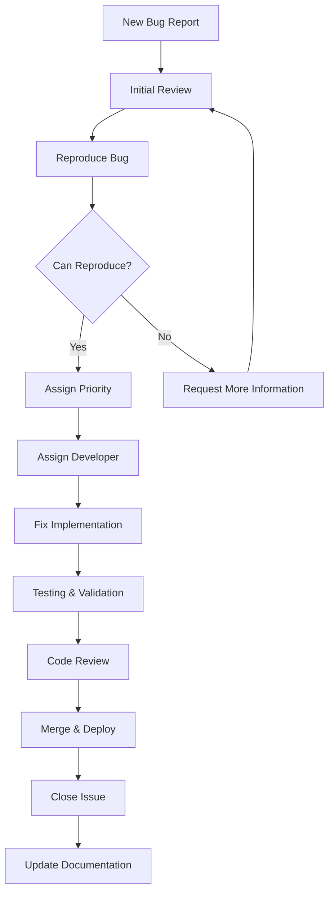

# Bug Reporting Guidelines & Triage Process

## Bug Report Guidelines

Before reporting a bug, please:

1. **Search existing issues** to avoid duplicates
2. **Check documentation** for known limitations
3. **Verify the bug** on the latest version
4. **Prepare minimal reproduction** case

## Bug Report Template

Use this template when creating bug reports:

```markdown
## Bug Description
A clear and concise description of what the bug is.

## Reproduction Steps
Steps to reproduce the behavior:
1. Go to '...'
2. Click on '....'
3. Scroll down to '....'
4. See error

## Expected Behavior
A clear and concise description of what you expected to happen.

## Actual Behavior
A clear and concise description of what actually happened.

## Environment
- OS: [e.g. macOS Big Sur, Ubuntu 20.04, Windows 11]
- Browser: [e.g. chrome, safari, firefox]
- Version: [e.g. 91.0.4472.124]
- Node.js Version: [e.g. 18.x.x]
- PenguinMails Version: [e.g. 2.1.3]

## Screenshots
If applicable, add screenshots to help explain your problem.

## Error Logs
Paste relevant error messages or stack traces here

## Additional Context
Add any other context about the problem here.

## Priority
- [ ] Critical (system down, data loss)
- [ ] High (major functionality broken)
- [ ] Medium (functionality impaired)
- [ ] Low (minor inconvenience)
```

## Bug Triage Process

### Issue Classification

- **Critical**: System down, security vulnerabilities, data loss
- **High**: Major functionality broken, significant user impact
- **Medium**: Functionality impaired but workaround available
- **Low**: Minor issues, cosmetic problems, feature requests

### Triage Workflow



### Bug Triage Checklist

**Initial Assessment:**
- [ ] Reproducible steps provided
- [ ] Environment details complete
- [ ] Expected vs actual behavior clear
- [ ] Priority level assigned appropriately
- [ ] Related issues linked

**Technical Review:**
- [ ] Bug confirmed reproducible
- [ ] Root cause analysis performed
- [ ] Fix approach defined
- [ ] Testing strategy planned
- [ ] Documentation update required

**Assignment:**
- [ ] Developer assigned based on expertise
- [ ] Estimated effort provided
- [ ] Target milestone/sprint identified
- [ ] Dependencies identified

## Bug Fix Guidelines

### Root Cause Analysis

```python
def analyze_bug_root_cause(bug_report):
    """Systematic approach to identify bug root cause."""
    analysis = {
        'symptoms': bug_report['description'],
        'reproduction_steps': bug_report['steps'],
        'environment': bug_report['environment'],
        'hypothesis': None,
        'tests_to_create': [],
        'fix_strategy': None
    }

    # 1. Reproduce the issue in isolated environment
    # 2. Identify the exact failure point
    # 3. Trace the execution flow
    # 4. Determine the root cause
    # 5. Design minimal fix

    return analysis
```

### Test-First Bug Fixing

```python
# tests/unit/test_bug_fix_example.py
import pytest
from app.services.email_service import EmailService

class TestEmailDeliveryBug:
    """Test case reproducing the reported bug."""

    def setup_method(self):
        self.email_service = EmailService()

    def test_empty_recipients_list_raises_validation_error(self):
        """Bug: Empty recipients list should raise ValidationError."""
        with pytest.raises(ValidationError) as exc_info:
            self.email_service.send_campaign({
                'subject': 'Test Campaign',
                'content': 'Test Content',
                'recipients': []  # Empty list
            })

        assert 'recipients' in str(exc_info.value).lower()
        assert 'cannot be empty' in str(exc_info.value).lower()

    def test_none_recipients_raises_validation_error(self):
        """Bug: None recipients should raise ValidationError."""
        with pytest.raises(ValidationError) as exc_info:
            self.email_service.send_campaign({
                'subject': 'Test Campaign',
                'content': 'Test Content',
                'recipients': None
            })

        assert 'recipients' in str(exc_info.value).lower()
```

### Bug Fix Implementation

```python
# app/services/email_service.py
class EmailService:
    def send_campaign(self, campaign_data):
        """Send email campaign with proper validation."""
        # Validation: Check recipients
        recipients = campaign_data.get('recipients')
        if not recipients:
            raise ValidationError("Recipients list cannot be empty")

        if not isinstance(recipients, list):
            raise ValidationError("Recipients must be a list")

        if len(recipients) == 0:
            raise ValidationError("Recipients list cannot be empty")

        # Additional validation
        for recipient in recipients:
            if not isinstance(recipient, dict) or 'email' not in recipient:
                raise ValidationError("Each recipient must have an email address")

        # Process campaign
        return self._process_campaign(campaign_data, recipients)
```

## Common Bug Patterns

### Email Delivery Issues

**Problem**: Emails not being sent to certain recipients
```python
# Bug: Not handling bounce types correctly
def handle_email_bounce(self, bounce_data):
    # ❌ Bad: Treating all bounces the same
    if bounce_data['status'] == 'bounced':
        self.mark_as_failed(bounce_data['email'])

# ✅ Good: Handle different bounce types appropriately
def handle_email_bounce(self, bounce_data):
    bounce_type = bounce_data.get('type', 'hard')
    
    if bounce_type == 'hard':
        # Hard bounce - permanent failure
        self.permanently_bounce_email(bounce_data['email'])
    elif bounce_type == 'soft':
        # Soft bounce - temporary failure, retry later
        self.schedule_retry(bounce_data['email'])
    else:
        # Unknown bounce type - manual review
        self.flag_for_review(bounce_data['email'])
```

**Problem**: Campaign tracking not working
```python
# Bug: Missing error handling in tracking
def track_email_open(self, campaign_id, recipient_email):
    # ❌ Bad: No error handling
    self.db.campaign_opens.insert(
        campaign_id=campaign_id,
        recipient_email=recipient_email,
        opened_at=datetime.utcnow()
    )

# ✅ Good: Proper error handling and logging
def track_email_open(self, campaign_id, recipient_email):
    try:
        self.db.campaign_opens.insert(
            campaign_id=campaign_id,
            recipient_email=recipient_email,
            opened_at=datetime.utcnow()
        )
    except IntegrityError:
        # Handle duplicate tracking gracefully
        logger.info(f"Duplicate tracking attempt for {campaign_id}:{recipient_email}")
    except Exception as e:
        logger.error(f"Failed to track email open: {e}")
        # Could send to monitoring system
```

### API Issues

**Problem**: Inconsistent error responses
```python
# Bug: Inconsistent error formats
@app.route('/api/v1/campaigns', methods=['POST'])
def create_campaign():
    try:
        # ... processing ...
    except ValidationError as e:
        # ❌ Bad: Inconsistent error format
        return {'error': str(e)}, 400
    except Exception as e:
        # ❌ Bad: Different format
        return {'success': False, 'message': 'Internal error'}, 500

# ✅ Good: Consistent error response format
@app.route('/api/v1/campaigns', methods=['POST'])
def create_campaign():
    try:
        # ... processing ...
    except ValidationError as e:
        return {'success': False, 'errors': e.errors}, 400
    except Exception as e:
        logger.exception("Unexpected error in create_campaign")
        return {'success': False, 'error': 'Internal server error'}, 500
```

### Database Issues

**Problem**: N+1 query problem
```python
# Bug: N+1 queries
def get_campaigns_with_recipients(self, user_id):
    campaigns = self.db.campaigns.filter(user_id=user_id).all()
    # ❌ Bad: Each campaign triggers a separate query for recipients
    for campaign in campaigns:
        campaign.recipients = self.db.recipients.filter(
            campaign_id=campaign.id
        ).all()
    return campaigns

# ✅ Good: Eager loading
def get_campaigns_with_recipients(self, user_id):
    return self.db.campaigns.filter(user_id=user_id)\
        .options(selectinload('recipients')).all()
```

## Performance Bug Detection

### Memory Leaks

```python
# tools/memory_profiler.py
import psutil
import time
import gc

def monitor_memory_usage(func):
    """Decorator to monitor memory usage of functions."""
    def wrapper(*args, **kwargs):
        process = psutil.Process()
        memory_before = process.memory_info().rss / 1024 / 1024  # MB
        
        result = func(*args, **kwargs)
        
        memory_after = process.memory_info().rss / 1024 / 1024  # MB
        memory_diff = memory_after - memory_before
        
        if memory_diff > 100:  # More than 100MB increase
            logger.warning(f"High memory usage in {func.__name__}: {memory_diff:.2f}MB")
        
        return result
    return wrapper

@monitor_memory_usage
def process_large_campaign(campaign_data):
    # Process large amounts of data
    pass
```

### Database Performance

```sql
-- Identify slow queries
SELECT query, mean_time, calls, total_time
FROM pg_stat_statements
WHERE mean_time > 100  -- Queries taking more than 100ms on average
ORDER BY mean_time DESC
LIMIT 10;

-- Check for missing indexes
SELECT schemaname, tablename, attname, n_distinct, correlation
FROM pg_stats
WHERE tablename IN (SELECT tablename FROM pg_tables WHERE schemaname = 'public')
  AND n_distinct > 100  -- Columns with high cardinality
  AND attname NOT IN (
    SELECT indexname FROM pg_indexes 
    WHERE indexname LIKE '%' || attname || '%'
  );
```

## Security Bug Patterns

### Input Validation

```python
# Bug: Missing input validation
def create_campaign(name, content, recipients):
    # ❌ Bad: No validation
    return Campaign.objects.create(
        name=name,
        content=content,
        recipients=recipients
    )

# ✅ Good: Comprehensive validation
from pydantic import BaseModel, validator

class CampaignCreateRequest(BaseModel):
    name: str
    content: str
    recipients: list

    @validator('name')
    def validate_name(cls, v):
        if not v.strip():
            raise ValueError("Name cannot be empty")
        if len(v) > 100:
            raise ValueError("Name too long")
        # Prevent XSS
        if '<' in v or '>' in v:
            raise ValueError("Invalid characters")
        return v.strip()

    @validator('recipients')
    def validate_recipients(cls, v):
        if not isinstance(v, list):
            raise ValueError("Recipients must be a list")
        if len(v) == 0:
            raise ValueError("At least one recipient required")
        if len(v) > 10000:
            raise ValueError("Too many recipients")
        return v
```

## Bug Verification Checklist

**Before marking as fixed:**
- [ ] Bug reproduced in original environment
- [ ] Fix applied successfully
- [ ] Fix doesn't break existing functionality
- [ ] Edge cases handled
- [ ] Tests added to prevent regression
- [ ] Documentation updated if needed
- [ ] Security implications considered
- [ ] Performance impact assessed
- [ ] User communication prepared if needed

**Regression Testing:**
- [ ] All related functionality still works
- [ ] No new bugs introduced
- [ ] Performance maintained
- [ ] Security measures intact
- [ ] User experience preserved

## Bug Reporting Best Practices

### Good Bug Reports

1. **Clear Title**: Summarize the issue in one line
2. **Steps to Reproduce**: Provide exact steps
3. **Expected vs Actual**: Clear distinction
4. **Environment Details**: Complete system information
5. **Screenshots**: Visual evidence when helpful
6. **Error Logs**: Include relevant log entries
7. **Minimal Case**: Reduce to simplest reproduction

### Information to Include

- **Application State**: What was happening when bug occurred
- **User Actions**: Exact sequence of actions taken
- **Data**: Any specific data that triggered the bug
- **Network**: Any network-related issues
- **Browser/Client**: Client-specific details
- **Frequency**: How often does this occur

### Information to Avoid

- **Vague descriptions**: "It doesn't work"
- **Multiple issues**: One bug report per issue
- **Duplicate reports**: Check existing issues first
- **Personal information**: Never include passwords, tokens, etc.
- **Irrelevant details**: Focus on the bug, not your day

For testing requirements, see [`testing-requirements.md`](testing-requirements).
For the contribution process, see [`code-contribution.md`](code-contribution).