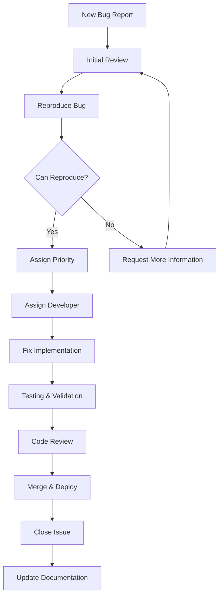

# Bug Reporting Guidelines & Triage Process

Comprehensive documentation for bug reporting, triage, and resolution workflows.

## Documentation Structure

This guide is organized into specialized sections for efficient navigation:

### Core Process

- [Bug Fix Guidelines](/docs/implementation-technical/development-guidelines/bug-reporting/bug-fix-guidelines) - Root cause analysis and test-first bug fixing

### Bug Pattern Recognition

- [Email Delivery Bugs](/docs/implementation-technical/development-guidelines/bug-reporting/email-delivery-bugs) - Common email delivery issues and solutions
- [API Bugs](/docs/implementation-technical/development-guidelines/bug-reporting/api-bugs) - API-related bug patterns and fixes
- [Database Bugs](/docs/implementation-technical/development-guidelines/bug-reporting/database-bugs) - Database performance and consistency issues

### Specialized Areas

- [Performance Bugs](/docs/implementation-technical/development-guidelines/bug-reporting/performance-bugs) - Memory leaks and performance optimization
- [Security Bugs](/docs/implementation-technical/development-guidelines/bug-reporting/security-bugs) - Security vulnerabilities and input validation
- [Bug Verification](/docs/implementation-technical/development-guidelines/bug-reporting/bug-verification) - Testing checklists and best practices

## Bug Report Guidelines

Before reporting a bug, please:

1. **Search existing issues** to avoid duplicates

2. **Check documentation** for known limitations

3. **Verify the bug** on the latest version

4. **Prepare minimal reproduction** case

## Bug Report Template

Use this template when creating bug reports:

```markdown

## Bug Description

A clear and concise description of what the bug is.

## Reproduction Steps

Steps to reproduce the behavior:

1. Go to '...'

2. Click on '....'

3. Scroll down to '....'

4. See error

## Expected Behavior

A clear and concise description of what you expected to happen.

## Actual Behavior

A clear and concise description of what actually happened.

## Environment

- OS: [e.g. macOS Big Sur, Ubuntu 20.04, Windows 11]

- Browser: [e.g. chrome, safari, firefox]

- Version: [e.g. 91.0.4472.124]

- Node.js Version: [e.g. 18.x.x]

- PenguinMails Version: [e.g. 2.1.3]

## Screenshots

If applicable, add screenshots to help explain your problem.

## Error Logs

Paste relevant error messages or stack traces here

## Additional Context

Add any other context about the problem here.

## Priority

- [ ] Critical (system down, data loss)

- [ ] High (major functionality broken)

- [ ] Medium (functionality impaired)

- [ ] Low (minor inconvenience)

```

## Bug Triage Process

### Issue Classification

- **Critical**: System down, security vulnerabilities, data loss

- **High**: Major functionality broken, significant user impact

- **Medium**: Functionality impaired but workaround available

- **Low**: Minor issues, cosmetic problems, feature requests

### Triage Workflow



### Bug Triage Checklist

**Initial Assessment:**

- [ ] Reproducible steps provided

- [ ] Environment details complete

- [ ] Expected vs actual behavior clear

- [ ] Priority level assigned appropriately

- [ ] Related issues linked

**Technical Review:**

- [ ] Bug confirmed reproducible

- [ ] Root cause analysis performed

- [ ] Fix approach defined

- [ ] Testing strategy planned

- [ ] Documentation update required

**Assignment:**

- [ ] Developer assigned based on expertise

- [ ] Estimated effort provided

- [ ] Target milestone/sprint identified

- [ ] Dependencies identified
